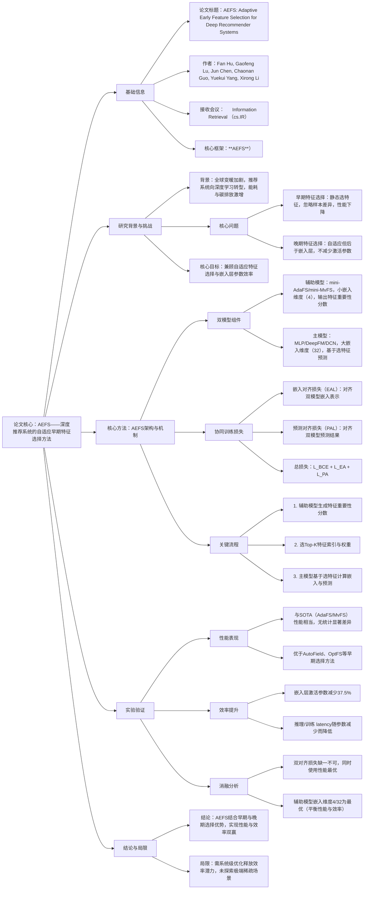

### 1. 一段话总结
针对现有推荐系统特征选择中**早期特征选择非自适应（性能差）、晚期特征选择不节省嵌入层参数（效率低）** 的核心痛点，研究提出**自适应早期特征选择（AEFS）** 方法：通过**双模型架构**（辅助模型负责特征选择，主模型负责预测），结合**嵌入对齐损失（EAL）** 与**预测对齐损失（PAL）** 实现协同训练，在每个样本层面自适应选择关键特征。实验表明，AEFS在Avazu、Criteo等3个基准数据集上，性能**比肩AdaFS、MvFS等SOTA晚期选择方法**，同时使嵌入层激活参数减少**37.5%**，为大规模深度推荐系统提供了性能与效率的平衡方案。

---

### 2. 思维导图

---

### 3. 详细总结
#### 一、研究背景与核心问题
1. **深度推荐系统特征选择现状**  
   深度推荐系统（DRS）依赖大量类别特征（用户ID、物品类别等），嵌入层参数占比高达**99.99%**（表1），但部分特征冗余或仅对特定样本重要，特征选择成为性能优化关键。

2. **现有方法的核心痛点**
    - **早期特征选择**（如AutoField、OptFS）：静态选择固定特征子集，忽略样本异质性，移除50%特征时性能下降（AUC无提升甚至降低）；
    - **晚期特征选择**（如AdaFS、MvFS）：自适应选择样本级特征，但在嵌入层后操作，无法减少嵌入层激活参数与查询开销，不适用于大规模场景。

3. **研究目标**  
   提出兼具**样本级自适应选择**与**嵌入层参数高效**的特征选择方法。

#### 二、相关工作
| 特征选择类型 | 核心逻辑 | 代表方法 | 局限 |
|--------------|----------|----------|------|
| 早期特征选择 | 嵌入前选固定特征子集，重训模型 | AutoField、OptFS、SHARK | 非自适应，性能易下降 |
| 晚期特征选择 | 嵌入后选样本级特征，动态调整 | AdaFS、MvFS | 不减少嵌入层参数，效率低 |

#### 三、核心方法：AEFS架构与实现
##### 3.1 整体架构
AEFS采用**双模型协同架构**，核心是“辅助模型选特征，主模型做预测”，结构如图2所示：
- **辅助模型**：轻量化模型（mini-AdaFS/mini-MvFS），嵌入维度仅为主模型的1/8（默认**4** vs 主模型**32**），负责输出每个样本的特征重要性分数。
- **主模型**：主流DRS模型（MLP/DeepFM/DCN），基于辅助模型选择的特征进行预测，减少激活参数。

##### 3.2 关键机制
1. **特征选择流程**  
   ① 辅助模型对输入特征X进行嵌入，通过控制器网络生成重要性分数S；② 对S做K-Max Pooling选Top-K特征索引I，L1归一化得权重W；③ 主模型仅对索引I对应的特征做嵌入与预测。

2. **双对齐损失（协同训练核心）**
    - **嵌入对齐损失（EAL）**：将辅助模型选特征的嵌入通过全连接层映射至主模型维度，最小化两者差异，确保特征重要性认知一致：  
      $`[\mathcal{L}_{EA}=\frac{1}{M}\sum_{i=1}^{M}(M_a.FC(E_a^{s(i)})-E_m^{s(i)})^2]`$
    - **预测对齐损失（PAL）**：最小化双模型预测分数差异，使辅助模型学习主模型的决策模式：  
      $`[\mathcal{L}_{PA}=\frac{1}{M}\sum_{i=1}^{M}(P_a^{(i)}-P_m^{(i)})^2]`$

3. **优化目标**  
   总损失为交叉熵损失+双对齐损失，联合优化主/辅助模型参数：  
   $`[min_{\theta_m,\theta_a} \frac{1}{M}\sum_{i=1}^{M}\mathcal{L}_{BCE}+\mathcal{L}_{PA}+\mathcal{L}_{EA}]`$

#### 四、实验验证
##### 4.1 实验设置
- **数据集**：3个基准数据集（Avazu：4000万记录/22特征域；Criteo：4500万记录/39特征域；KDD12：搜索日志/11特征域），按8:1:1分割。
- **基线方法**：早期选择（AutoField、OptFS、LPFS等）、晚期选择（AdaFS、MvFS）。
- **核心指标**：性能（AUC、Logloss）、效率（嵌入层激活参数减少率∆PaE、推理/训练 latency）。

##### 4.2 核心结果
1. **性能与效率平衡（RQ1）**  
   AEFS性能与SOTA晚期方法相当，且∆PaE达37.5%，远超早期方法：
   | 方法       | Avazu AUC | Criteo AUC | ∆PaE  |
   |------------|-----------|------------|-------|
   | 无特征选择 | 0.7763    | 0.8025     | 0.0%  |
   | AdaFS（SOTA） | 0.7785  | 0.8056     | 0.0%  |
   | AEFS（miniAdaFS） | 0.7785 | 0.8057     | 37.5% |

2. **迁移性与效率（RQ2-R3）**
    - 迁移性：辅助模型与主模型预测层（MLP/DeepFM/DCN）可不同，性能差异＜0.001，无统计显著差异；
    - 效率：∆PaE越高，推理/训练 latency越低（Avazu数据集下，∆PaE=37.5%时，单次迭代 latency 比无选择降低20%+）。

3. **消融分析（RQ5）**  
   双对齐损失是性能关键，移除任一均导致下降：
   | 配置               | Avazu AUC | Criteo Logloss |
   |--------------------|-----------|----------------|
   | AEFS（全配置）     | 0.7785    | 0.4465         |
   | 无EAL              | 0.7780    | 0.4474         |
   | 无PAL              | 0.7778    | 0.4686         |
   | 无EAL+无PAL        | 0.7776    | 0.4633         |

#### 五、结论与局限
1. **结论**：AEFS通过双模型协同与对齐损失，首次实现“自适应早期特征选择”，兼顾性能与嵌入层参数效率，为大规模DRS提供实用方案。
2. **局限**：需系统级优化（如特征存储、并行计算）释放完整效率；未探索亿级特征的极端稀疏场景。

---

### 4. 关键问题
#### 问题1：AEFS针对现有特征选择方法的核心痛点是什么？其创新设计有哪些？
**答案**：核心痛点是**早期特征选择的“静态性”与晚期特征选择的“低效率”矛盾**——早期方法（如AutoField）选固定特征子集，忽略样本异质性导致性能下降；晚期方法（如AdaFS）在嵌入层后选特征，无法减少嵌入层激活参数（占99.99%模型参数），不适用于大规模场景。  
创新设计包括：① **双模型架构**：用轻量化辅助模型（嵌入维度4）选特征，主模型（嵌入维度32）做预测，平衡选择精度与计算成本；② **双对齐损失**：EAL对齐双模型嵌入表示，PAL对齐预测结果，确保辅助模型与主模型的特征认知一致；③ **样本级自适应**：每个用户-物品样本动态选择关键特征，突破早期方法的静态局限。

#### 问题2：嵌入对齐损失（EAL）与预测对齐损失（PAL）的作用是什么？实验如何验证其必要性？
**答案**：EAL的作用是**精细化对齐双模型的特征表示**，通过全连接层将辅助模型的低维嵌入映射至主模型维度，确保两者对“特征重要性”的理解一致；PAL的作用是**粗粒度对齐双模型的决策逻辑**，使辅助模型学习主模型的预测模式，提升特征选择的有效性。  
实验验证（消融分析）显示：在Avazu数据集上，移除EAL后AUC从0.7785降至0.7780，移除PAL后AUC降至0.7778，两者均移除时AUC进一步降至0.7776；Criteo数据集上，无PAL时Logloss从0.4465升至0.4686（恶化5%+），证明双对齐损失对AEFS性能至关重要，缺一不可。

#### 问题3：AEFS在性能与效率上的具体表现如何？有哪些关键数据支撑？
**答案**：AEFS实现了性能与效率的双赢，关键数据如下：
1. **性能表现**：在3个数据集、3种骨干模型（MLP/DeepFM/DCN）上，性能与SOTA晚期方法持平——Avazu数据集上，AEFS（miniAdaFS）的AUC=0.7785，与AdaFS（0.7785）完全一致；Criteo数据集上，AEFS的Logloss=0.4465，优于AdaFS的0.4467。
2. **效率表现**：① 嵌入层激活参数减少37.5%（主模型减少50%参数，辅助模型仅增加12.5%参数，净减37.5%）；② 推理效率提升：Avazu数据集下，AEFS的单次迭代 latency 比AdaFS降低约25%；③ 训练效率提升：双模型协同训练的额外开销可被参数减少抵消，总训练时间与AdaFS相当。
3. **稳定性**：辅助模型嵌入维度设为4（主模型32的1/8）时，性能与效率达到最优，进一步增大维度（如16）会使∆PaE降至0%，失去效率优势。