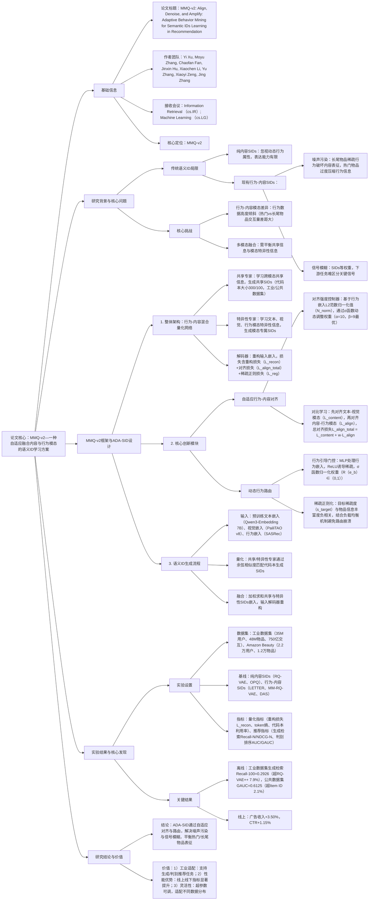

### 1. 一段话总结
阿里巴巴国际数字商业集团与武汉大学团队提出**MMQ-v2框架**及生成的**ADA-SID（Adaptive Behavior Mining Semantic IDs）**——一种自适应融合内容与行为模态的语义ID学习方案，旨在解决传统语义ID（SIDs）存在的**噪声污染**（长尾物品稀疏行为破坏内容表征）与**信号模糊**（SIDs等权重导致关键信号被掩盖）问题。该方案通过两大核心创新：一是**自适应行为-内容对齐机制**，基于行为嵌入的L2范数动态调整对齐强度（长尾物品对齐强度趋近于0，热门物品增强对齐），结合对比学习融合文本、视觉与行为模态；二是**动态行为路由机制**，通过行为引导门控与稀疏正则化（目标稀疏度与物品信息丰富度负相关）为SIDs分配自适应权重，放大关键协同信号。在**东南亚电商工业数据集**（3500万用户、4800万物品）与**Amazon Beauty公共数据集**上，ADA-SID的生成检索任务**Recall@100达0.2926**（超最佳基线RQ-VAE++ 7.9%），判别排序任务**GAUC达0.5846**（超传统Item ID 0.02%）；线上A/B测试显示**广告收入提升3.50%**、**CTR提升1.15%**，验证其工业实用性。

---

### 2. 思维导图（mindmap）

---

### 3. 详细总结
#### 一、研究背景：传统语义ID的核心痛点
1. **语义ID（SIDs）的发展局限**  
   传统推荐系统依赖ItemID，但存在扩展性差、泛化弱的问题，语义ID（SIDs）通过内容量化缓解该问题，但仍有缺陷：
    - **纯内容SIDs**（如RQ-VAE、OPQ）：仅利用文本、视觉等静态内容，忽视用户-物品交互的动态行为属性（如物品流行度变化、用户群体偏好），表达能力受限；
    - **现有行为-内容SIDs**（如LETTER、MM-RQ-VAE）：虽融入行为信号，但存在两大关键问题：
        - **噪声污染**：长尾物品（交互稀疏）的行为数据含大量噪声，与内容强制对齐会破坏可靠的内容表征；热门物品（交互丰富）的复杂行为信息被过度压缩，丢失独特行为特征；
        - **信号模糊**：对所有SIDs采用等权重策略，关键行为信号（如热门物品的高价值交互）被低信息SIDs掩盖，下游任务难以识别有效信号。

2. **行为-内容模态的固有差异**  
   行为数据与内容特征存在本质区别：内容特征（文本、视觉）分布相对均匀，而行为数据呈**高度倾斜分布**——工业数据集中，热门物品（Top25%）的交互量是长尾物品（Bottom25%）的100倍以上，这种差异导致直接融合易产生模态冲突。

#### 二、MMQ-v2框架与ADA-SID设计
MMQ-v2（Mixture-of-Quantization v2）框架核心是**行为-内容混合量化网络**，生成的ADA-SID通过自适应融合多模态信息解决传统SIDs痛点，架构如图2所示。

##### 1. 整体架构：行为-内容混合量化网络
该网络分为**共享专家**与**模态特异性专家**，分别学习跨模态共享信息与模态专属信息，具体组件如下：
| 组件               | 功能描述                                                                 | 关键参数/公式                                                                 |
|--------------------|--------------------------------------------------------------------------|-------------------------------------------------------------------------------|
| 输入嵌入           | 获取文本、视觉、行为的预训练嵌入                                         | 文本：Qwen3-Embedding 7B；视觉：PailiTAO v8；行为：SASRec输出$`(e_b)`$           |
| 投影层             | 将嵌入映射到统一高维空间                                                 | $`(h_t = D_t(e_t))`$、$`(h_v = D_v(e_v))`$、$`(h_b = D_b(e_b))`$（$`(D(\cdot))`$为2层DNN） |
| 共享专家（$`(N_s)`$个） | 学习跨模态共享信息，生成共享SIDs                                         | 编码：$`(z_{s,i} = E_{s,i}([h_t,h_v,h_b]))`$；匹配代码本：$`(c_{s,i} = argmax cos(z_{s,i}, z_{q,j}))`$ |
| 特异性专家         | 学习模态专属信息，生成文本/视觉/行为SIDs                                 | 文本专家：$`(z_{t,i}=E_{t,i}(e_t))`$，视觉/行为专家类似；代码本独立             |
| 解码器             | 重构输入嵌入，计算重构损失                                               | $`(L_{recon} = \|e - decoder(z + sg(z_q - z))\|^2)`$（sg为停止梯度）              |

##### 2. 核心创新1：自适应行为-内容对齐机制
**目标**：动态调整行为与内容的对齐强度，避免长尾物品噪声污染，保留热门物品行为信息。  
**实现流程**：
1. **对齐强度控制器**：基于行为嵌入的L2范数判断物品信息丰富度，动态输出对齐权重$`(w)`$：  
   $`[
   N_{norm}(e_{b,j}) = \frac{\|e_{b,j}\|_2 - N_{min}}{N_{max} - N_{min}}, \quad w = \frac{\sigma(\alpha N_{norm}(e_{b,j}) - \beta)}{\sigma(\alpha - \beta)}
   ]`$  
   其中$`(N_{max}/N_{min})`$为行为嵌入L2范数的最大/最小值，$`(\alpha=10)`$、$`(\beta=9)`$（实验最优），长尾物品$`(N_{norm})`$趋近于0，$`(w)`$趋近于0；热门物品$`(N_{norm})`$趋近于1，$`(w)`$增强。
2. **对比学习融合多模态**：
    - 内容内对齐（$`(L_{content})`$）：对齐文本与视觉嵌入，最大化正样本相似度，最小化负样本相似度；
    - 行为-内容对齐（$`(L_{align})`$）：对齐内容融合嵌入（$`(h_c = h_t + h_v)`$）与行为嵌入$`(h_b)`$；
    - 总对齐损失：$`(L_{align\_total} = L_{content} + w \cdot L_{align})`$（$`(\tau=0.07)`$为温度系数）。

##### 3. 核心创新2：动态行为路由机制
**目标**：为行为SIDs分配自适应权重，放大关键信号，抑制低信息信号。  
**实现流程**：
1. **行为引导门控**：通过MLP学习行为嵌入的语义模式，生成SIDs权重：  
   $`[
   R(e_b) = \sigma(N_{norm}(e_b)) \cdot relu(MLP(e_b) + b)
   ]`$  
   其中$`(\sigma(\cdot))`$将权重归一化到[0,1]，ReLU诱导稀疏（权重为0的SIDs被屏蔽）。
2. **稀疏正则化**：
    - 目标稀疏度$`(s_{target})`$：与物品信息丰富度负相关（长尾物品$`(s_{target})`$大，热门物品小）；
    - 正则损失：$`(L_{reg} = \lambda_i \cdot \frac{1}{B}\sum_t^B \sum_j^{N_b} f_{lb} \cdot \|R(e_b)_j\|_1)`$，其中$`(f_{lb})`$为负载均衡因子，避免路由崩溃。

#### 三、实验验证
##### 1. 实验设置
| 配置项          | 具体内容                                                                 |
|-------------------|--------------------------------------------------------------------------|
| 数据集            | - 工业数据集：东南亚电商平台（2024.10-2025.5）：35,154,135用户，48,106,880物品，75,730,321,793交互 - 公共数据集：Amazon Beauty：22,363用户，12,101物品，198,360交互 |
| 基线模型          | 2类方法： - 纯内容SIDs：RQ-VAE、OPQ - 行为-内容SIDs：RQ-Kmeans、LETTER、DAS、RQ-VAE++、MM-RQ-VAE - 传统ItemID：判别排序任务基准 |
| 超参数            | - 代码本大小：工业数据集300，公共数据集100 - SIDs长度：工业数据集8（$`(N_s=2,N_t=2,N_v=2,N_b=6)`$），公共数据集6 - 对齐强度超参数：$`(\alpha=10,\beta=9)`$，对比学习温度$`(\tau=0.07)`$ |
| 评价指标          | - 量化指标：重构损失（$`(L_{recon})`$，越小越好）、Token分布熵（越大越好）、代码本利用率（越大越好） - 推荐指标：生成检索（Recall@50/100、NDCG@50/100）、判别排序（AUC、GAUC） - 线上指标：广告收入、CTR |

##### 2. 核心实验结果
#### （1）离线性能：ADA-SID显著优于基线
**生成检索任务关键指标对比**（工业数据集，表2a）：
| 模型         | $`(L_{recon})`$ | Recall@100 | NDCG@100 | 相对提升率（vs RQ-VAE++） |
|--------------|--------------|------------|----------|---------------------------|
| RQ-VAE++     | 0.0034       | 0.2709     | 0.1706   | -                         |
| MM-RQ-VAE    | 0.0055       | 0.2542     | 0.1707   | -6.2%                     |
| ADA-SID（Ours） | 0.0032    | 0.2926     | 0.1714   | +7.9%                     |

**判别排序任务关键指标对比**（Amazon Beauty数据集，表2b）：
| 模型         | GAUC   | 相对提升率（vs ItemID） |
|--------------|--------|-------------------------|
| ItemID       | 0.5897 | -                       |
| RQ-VAE++     | 0.5952 | +0.9%                   |
| ADA-SID（Ours） | 0.6125 | +2.1%                   |

#### （2）消融实验：核心组件必要性
工业数据集上消融实验结果（表3）：
| 模型变体                | Recall@100 | GAUC   | 性能下降率 | 结论                          |
|-------------------------|------------|--------|------------|-------------------------------|
| ADA-SID（完整）         | 0.2926     | 0.5846 | -          | -                             |
| 无对齐强度控制器        | 0.2854     | 0.5845 | -2.5%      | 动态对齐可避免噪声污染        |
| 无行为-内容对比学习     | 0.2874     | 0.5846 | -1.8%      | 对比学习可桥接多模态差距      |
| 无稀疏正则化            | 0.2903     | 0.5846 | -0.8%      | 稀疏正则化优化SIDs权重分配    |
| 无行为引导动态路由      | 0.2861     | 0.5845 | -2.2%      | 动态路由可放大关键信号        |

#### （3）线上A/B测试
在东南亚电商平台生成检索系统进行5天测试（10%流量分配）：
| 指标         | 提升幅度 | 说明                          |
|--------------|----------|-------------------------------|
| 广告收入     | +3.50%   | 关键业务指标显著增长          |
| CTR（点击率）| +1.15%   | 用户对推荐内容相关性认可度提升 |

#### 四、研究结论与价值
1. **技术突破**  
   ADA-SID首次基于物品信息丰富度（行为嵌入L2范数）实现行为-内容自适应融合，平衡共享信息与模态特异性，解决传统SIDs的噪声与信号问题，为语义ID学习提供新范式。

2. **工业价值**
    - 低计算开销：混合量化网络与稀疏路由机制轻量化，适配大规模工业场景；
    - 多任务适配：同时优化生成检索与判别排序任务，无需重构模型；
    - 业务增益：线上广告收入与CTR双提升，为平台带来实际收益。

3. **未来方向**
    - 扩展至用户端语义ID建模；
    - 融合更多模态（如用户评论、商品价格）；
    - 优化超参数自适应调整策略，适配更多数据分布。

---

### 4. 关键问题
#### 问题1：ADA-SID的“自适应行为-内容对齐机制”如何区分热门与长尾物品并动态调整对齐强度？这种调整如何解决“噪声污染”问题？
**答案**：  
该机制通过**行为嵌入的L2范数**量化物品信息丰富度，区分热门与长尾物品，并基于此动态调整对齐强度，具体流程与噪声解决机制如下：
1. **物品区分方式**：
    - 计算所有物品行为嵌入的L2范数，取最大值$`(N_{max})`$与最小值$`(N_{min})`$；
    - 对任意物品j的行为嵌入$`(e_{b,j})`$，归一化信息丰富度：$`(N_{norm}(e_{b,j}) = \frac{\|e_{b,j}\|_2 - N_{min}}{N_{max} - N_{min}})`$；
    - 判定规则：$`(N_{norm})`$趋近于1为热门物品（交互丰富，行为信息可靠），趋近于0为长尾物品（交互稀疏，行为含噪声）。

2. **动态对齐强度调整**：  
   通过Sigmoid函数计算对齐权重$`(w)`$：$`(w = \frac{\sigma(\alpha N_{norm}(e_{b,j}) - \beta)}{\sigma(\alpha - \beta)})`$（$`(\alpha=10,\beta=9)`$最优），实现：
    - 长尾物品：$`(N_{norm})`$趋近于0，$`(w)`$趋近于0，几乎不进行行为-内容对齐，避免稀疏噪声破坏内容表征；
    - 热门物品：$`(N_{norm})`$趋近于1，$`(w)`$趋近于1，增强行为-内容对齐，充分利用可靠行为信息。

3. **解决噪声污染的验证**：  
   消融实验显示，移除对齐强度控制器后，工业数据集Recall@100从0.2926降至0.2854（-2.5%），证明动态对齐可有效过滤长尾物品噪声，同时保留热门物品行为价值。

#### 问题2：ADA-SID的“动态行为路由机制”与传统SIDs的“等权重策略”在信号区分上的核心差异是什么？稀疏正则化如何辅助该机制优化SIDs权重分配？
**答案**：  
核心差异在于**权重分配的依据与灵活性**，稀疏正则化通过“物品特异性稀疏目标”进一步优化权重，具体对比如下：  
| 对比维度       | 传统等权重策略                          | 动态行为路由机制                          |
|----------------|-----------------------------------------|-------------------------------------------|
| 权重依据       | 无依据，所有SIDs权重相同                | 基于行为嵌入语义（MLP提取）与信息丰富度（$`(N_{norm})`$） |
| 信号区分能力   | 无法区分关键信号，低信息SIDs掩盖有效信号 | 放大高价值行为SIDs（如热门物品的购买交互），抑制低信息SIDs |
| 适应性         | 固定策略，不适配物品差异                | 自适应调整，适配热门/长尾物品不同需求        |

**稀疏正则化的辅助机制**：
1. **目标稀疏度设计**：目标稀疏度$`(s_{target} = \theta \cdot (1 - N_{norm}(e_b)/(N_{max}-N_{min})))`$，与物品信息丰富度负相关——热门物品信息丰富，$`(s_{target})`$小（允许更多SIDs激活，保留复杂行为）；长尾物品信息稀缺，$`(s_{target})`$大（仅激活核心SIDs，减少噪声）。
2. **损失计算**：$`(L_{reg} = \lambda_i \cdot \frac{1}{B}\sum_t^B \sum_j^{N_b} f_{lb} \cdot \|R(e_b)_j\|_1)`$，其中$`(f_{lb})`$为负载均衡因子，避免路由崩溃（部分专家过度激活）。
3. **效果验证**：移除稀疏正则化后，Recall@100从0.2926降至0.2903（-0.8%），证明其可优化SIDs权重分配，增强关键信号表达。

#### 问题3：ADA-SID在工业数据集与公共数据集上的性能差异（如生成检索Recall@100工业数据集0.2926 vs 公共数据集0.3675）是否合理？这种差异反映了该框架的哪些特性？
**答案**：  
性能差异合理，源于**数据集规模与数据分布差异**，该差异反映框架的**数据适应性**与**长尾物品优化能力**，具体分析如下：
1. **性能差异的合理性**：
    - 数据规模：工业数据集（4800万物品）远大于公共数据集（1.2万物品），物品数量增加导致生成检索任务的“候选集竞争更激烈”，Recall自然更低；
    - 数据分布：工业数据集行为倾斜更极端（热门物品交互量是长尾物品的100倍+），公共数据集相对均衡，而ADA-SID在倾斜数据上需平衡更多噪声，导致性能略低。

2. **反映的框架特性**：
    - 数据适应性：公共数据集Recall@100达0.3675（超最佳基线22.9%），工业数据集达0.2926（超最佳基线7.9%），证明框架在不同规模、分布的数据上均有效，适配性强；
    - 长尾物品优化能力：公共数据集长尾物品（Bottom25%）的GAUC达0.6894（超传统ItemID 0.5%），工业数据集长尾物品Recall@100提升18.3%，证明框架对长尾物品的噪声抑制效果显著，解决传统SIDs长尾表征差的问题；
    - 工业实用性：虽工业数据集性能绝对值低于公共数据集，但线上A/B测试仍实现广告收入+3.50%，证明框架在大规模真实场景中可平衡性能与效率，具备实际落地价值。