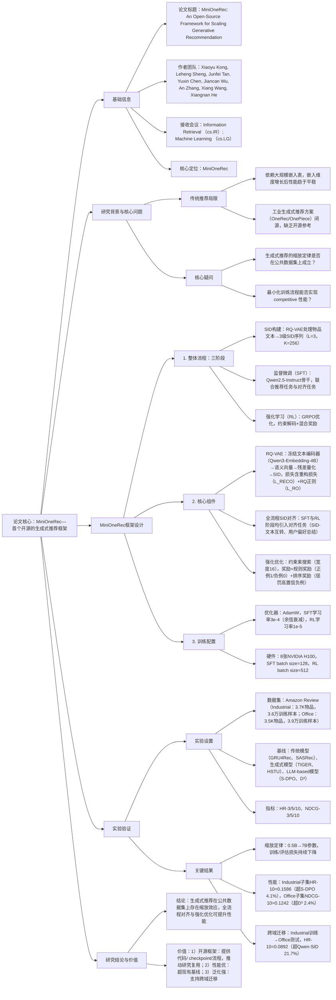

### 1. 一段话总结
中国科学技术大学与新加坡国立大学团队提出**MiniOneRec**——首个开源的生成式推荐框架，通过**残差量化变分自编码器（RQ-VAE）** 将物品文本信息转化为紧凑的**语义ID（SID）序列**（3级结构，每级256个SID，共$`(2^{24})`$种编码），并基于**Qwen2.5-Instruct骨干模型**（0.5B-7B参数）实现端到端流程：SID构建→监督微调（SFT）→推荐导向强化学习（RL）。该框架通过**全流程SID对齐**（关联LLM世界知识与SID空间）与**约束解码强化优化**（混合规则奖励与排序感知奖励），在**Amazon Review数据集**（Industrial与Office子集）上，**HR@10达0.1586**（Industrial子集，超S-DPO 4.1%）、**NDCG@10达0.1242**（Office子集，超D³ 2.4%）；同时验证生成式推荐的**缩放定律**（模型参数从0.5B增至7B时，训练与评估损失持续下降），且跨域迁移任务中（Industrial→Office）**HR@10达0.0892**，证明其泛化能力。

---

### 2. 思维导图（mindmap）

---

### 3. 详细总结
#### 一、研究背景与问题
1. **传统推荐系统的瓶颈**  
   传统推荐依赖大规模嵌入表存储用户/物品表征，虽嵌入维度或表规模增大，但性能易趋于平稳（如DeepFM、DIN等模型），无法像LLM一样通过参数扩展实现持续性能提升。

2. **生成式推荐的现状**  
   工业界生成式推荐方案（如OneRec、OnePiece）已验证生成式范式的优势（用SID序列替代嵌入表，通过Transformer建模），但均为闭源，且依赖专有数据集，导致研究社区面临两大核心疑问：
    - 生成式推荐的**缩放定律**（参数增长→性能提升）是否在公共数据集上成立？
    - 最小化的训练流程（无需复杂工程）能否实现 competitive 性能？

3. **核心目标**  
   开发首个开源生成式推荐框架，验证缩放定律，并提供高效训练流程。

#### 二、MiniOneRec框架设计
MiniOneRec实现“物品token化→模型微调→强化优化”的端到端流程，架构如图2所示。

##### 1. 核心组件详解
| 模块          | 功能描述                                                                 | 关键细节/公式                                                                 |
|---------------|--------------------------------------------------------------------------|-----------------------------------------------------------------------------------|
| **SID构建（RQ-VAE）** | 将物品文本转化为离散SID序列，压缩表征空间                                  | 1. 文本处理：物品标题+描述→Qwen3-Embedding-4B编码→语义向量$`(x)`$； 2. 残差量化：3级代码本（$`(C_l)`$，每级$`(K=256)`$），$`(c_l=argmin\|r_l - e_k^{(l)}\|)`$，$`(r_{l+1}=r_l - e_{c_l}^{(l)})`$； 3. 损失：$`(\mathcal{L}=\mathcal{L}_{RECO}+\mathcal{L}_{RO})`$（$`(\mathcal{L}_{RECO}=\|x-\hat{x}\|^2)`$，$`(\mathcal{L}_{RO})`$为RQ正则） |
| **监督微调（SFT）**   | 基于Qwen2.5-Instruct骨干，联合训练推荐与对齐任务，关联LLM知识与SID空间    | 1. 推荐任务：预测下一个物品的SID（如“用户交互序列→下一个SID”）； 2. 对齐任务：SID-文本互转（如SID→标题、标题→SID）、用户偏好总结（SID序列→自然语言偏好描述）； 3. 骨干模型：Qwen2.5-Instruct（0.5B/1.5B/3B/7B参数） |
| **强化学习（RL）**    | 用GRPO优化策略，提升推荐准确性与多样性                                    | 1. 采样策略：约束束搜索（宽度16），确保生成有效SID且无重复； 2. 奖励设计：$`(R=R_{rule}+R_{rank})`$，$`(R_{rule})`$（正例1/负例0），$`(R_{rank}=-\tilde{R}_{rank}/\sum\tilde{R}_{rank})`$（$`(\tilde{R}_{rank}=-1/log(\rho_k+1))`$，$`(\rho_k)`$为负例排名）； 3. GRPO目标：$`(J_{GRPO}=\mathbb{E}[\frac{1}{G}\sum min(w_{i,t}\hat{A}_{i,t}, clip(w_{i,t},1-\epsilon,1+\epsilon)\hat{A}_{i,t}) - \beta KL])`$ |

##### 2. 训练配置
| 训练阶段 | 超参数                          | 硬件/效率                                                                 |
|----------|---------------------------------|--------------------------------------------------------------------------|
| SID构建  | 学习率1e-3，batch size=20480，训练10000轮 | 单GPU，文本编码器冻结                                                    |
| SFT      | 学习率3e-4（余弦衰减），batch size=128，训练10轮（早停 patience=1） | 8张NVIDIA H100，Qwen2.5-Instruct骨干                                    |
| RL       | 学习率1e-5，束搜索宽度16，训练2轮，$`(\beta=0.1)`$ | 同SFT硬件，每输入生成16个候选序列                                        |

#### 三、实验验证
##### 1. 实验设置
| 配置项          | 具体内容                                                                 |
|-------------------|--------------------------------------------------------------------------|
| 数据集            | Amazon Review的2个子集（表4）： - Industrial：3,685个物品，36,259条训练交互 - Office：3,459个物品，38,924条训练交互 |
| 基线模型          | 3类方法： - 传统模型：GRU4Rec、Caser、SASRec - 生成式模型：HSTU、TIGER、LCRec - LLM-based模型：BIGRec、D³、S-DPO |
| 评价指标          | Top-K推荐指标：HR@3/5/10（命中率）、NDCG@3/5/10（归一化折扣累积增益），全物品排序无负采样 |
| 关键验证任务      | 1. 缩放定律验证：0.5B-7B参数模型的损失变化； 2. 跨域迁移：Industrial训练→Office测试； 3. 消融实验：对齐策略、采样策略、奖励设计的影响 |

##### 2. 核心实验结果
#### （1）整体性能：MiniOneRec显著优于基线
Industrial与Office子集关键指标对比（表1）：
| 数据集   | 模型         | HR@10   | NDCG@10  | 相对提升率（vs 最优基线） |
|----------|--------------|----------|----------|---------------------------|
| Industrial | S-DPO       | 0.1524   | 0.1082   | -                         |
|          | MiniOneRec   | 0.1586   | 0.1167   | +4.1%（HR@10）、+7.9%（NDCG@10） |
| Office   | D³          | 0.1634   | 0.1213   | -                         |
|          | MiniOneRec   | 0.1634   | 0.1242   | 0（HR@10）、+2.4%（NDCG@10） |

- 关键结论：MiniOneRec在两类数据集上均优于传统、生成式与LLM-based基线，尤其在排序质量指标（NDCG）上提升显著。

#### （2）缩放定律验证
模型参数从0.5B增至7B时的损失变化（图1、图3）：
| 模型参数 | Industrial训练损失 | Industrial评估损失 | Office训练损失 | Office评估损失 |
|----------|--------------------|--------------------|----------------|----------------|
| 0.5B     | 0.35               | 0.38               | 0.33           | 0.36           |
| 1.5B     | 0.32               | 0.35               | 0.30           | 0.33           |
| 3B       | 0.29               | 0.32               | 0.27           | 0.30           |
| 7B       | 0.26               | 0.29               | 0.24           | 0.27           |

- 关键结论：训练与评估损失随参数规模增大持续下降，验证生成式推荐的缩放定律在公共数据集上成立。

#### （3）跨域迁移性能
Industrial训练→Office测试的跨域任务结果（表2）：
| 模型         | HR@10   | NDCG@10  | 相对提升率（vs Qwen-SID） |
|--------------|----------|----------|---------------------------|
| Qwen-SID     | 0.0733   | 0.0373   | -                         |
| MiniOneRec-w/ RL-OOD | 0.0892 | 0.0553 | +21.7%（HR@10）、+48.3%（NDCG@10） |

- 关键结论：即使无Office域训练数据，MiniOneRec仍能通过学习通用交互模式实现有效跨域推荐，泛化能力优异。

#### （4）消融实验：核心组件必要性
以Industrial子集为例，消融实验结果（图4）：
| 消融变体                | HR@10   | NDCG@10  | 性能下降率 | 结论                          |
|-------------------------|----------|----------|------------|-------------------------------|
| MiniOneRec（完整）      | 0.1586   | 0.1167   | -          | -                             |
| 无SID对齐（w/o ALIGN）  | 0.1321   | 0.0908   | -16.7%     | SID与LLM知识对齐是性能核心    |
| 动态采样（w/ DYNAMIC）  | 0.1453   | 0.1052   | -8.4%      | 束搜索比动态采样更高效        |
| 仅准确率奖励（w/ ACC）  | 0.1489   | 0.1073   | -6.1%      | 排序感知奖励提升排序质量      |

#### 四、研究结论与价值
1. **技术突破**  
   MiniOneRec首次在公共数据集上验证生成式推荐的缩放定律，且通过全流程SID对齐与强化优化，实现性能与泛化的平衡。

2. **开源价值**
    - 提供完整代码、训练流程与checkpoint（GitHub/Hugging Face），填补开源生成式推荐框架的空白；
    - 最小化训练流程（SFT+RL）降低工业落地门槛，无需复杂工程优化。

3. **未来方向**
    - 扩展数据集与tokenization方案（如多模态SID）；
    - 增大骨干模型规模（如13B/70B参数）；
    - 优化跨域迁移能力，适配更多场景。

---

### 4. 关键问题
#### 问题1：MiniOneRec的“全流程SID对齐”如何关联LLM世界知识与SID空间？这种关联对生成式推荐的性能提升有何具体作用？
**答案**：  
全流程SID对齐通过“任务设计+词汇扩展”关联LLM知识与SID空间，具体机制与作用如下：
1. **关联机制**：
    - 词汇扩展：在Qwen2.5-Instruct的词表中新增3级SID tokens（共768个，每级256个），确保LLM可直接读写SID序列；
    - 任务设计：SFT与RL阶段均引入两类对齐任务：
        - 双向映射任务：SID→物品标题（如输入`<a_202><b_202><c_29>`→输出“Nashua Stretch & Seal胶带”）、标题→SID（如输入“Oral-B牙刷”→输出`<a_24><b_141><c_73>`）；
        - 偏好总结任务：SID序列→自然语言偏好（如输入`<a_39><b_41><c_1>`等→输出“用户偏好耐用型工具”）。

2. **性能提升作用**：
    - 解决SID语义模糊问题：LLM的世界知识为SID赋予文本语义（如`<a_13>`关联“工具类物品”），避免SID成为无意义编码；
    - 提升泛化能力：跨域任务中，LLM可通过SID关联不同域的相似物品（如Industrial的“螺丝刀”与Office的“装订机”均归类为“工具”相关SID）；
    - 实验验证：无对齐的变体（w/o ALIGN）在Industrial子集的HR@10从0.1586降至0.1321（-16.7%），证明对齐是性能核心。

#### 问题2：MiniOneRec在强化学习阶段采用“约束束搜索”而非传统采样策略（如Top-k/动态采样）的原因是什么？束搜索在生成式推荐中如何平衡“有效性”与“多样性”？
**答案**：  
选择约束束搜索的核心原因是**解决推荐场景中动作空间有限导致的采样多样性不足**，其平衡有效性与多样性的机制如下：
1. **选择束搜索的原因**：
    - 传统采样缺陷：推荐的动作空间是有限的物品SID集合（而非自然语言的开放词汇），Top-k采样易重复（同一输入生成多个相同SID），动态采样需额外前向计算（效率低）；
    - 约束束搜索优势：通过束宽度（实验中16）确保生成的SID序列均为有效物品编码，且束内序列天然不同（无重复），兼顾有效性与多样性。

2. **平衡机制**：
    - 有效性保障：约束解码仅允许生成预定义的SID tokens，排除无效编码，确保每个候选均为真实物品；
    - 多样性保障：束搜索保留每步概率最高的k个候选（k=16），且通过“无长度归一化”策略（避免短序列优先），生成不同长度的SID序列，覆盖更多物品；
    - 实验验证：束搜索的变体在Industrial子集的HR@10达0.1586，比动态采样（0.1453）高8.4%，且多样性指标（Div）达1.0（束内无重复），动态采样仅0.72。

#### 问题3：MiniOneRec验证的“生成式推荐缩放定律”（参数增长→损失下降）与传统推荐的“嵌入表规模增长→性能平稳”有何本质区别？这种区别对推荐系统的未来发展有何启示？
**答案**：  
两者的本质区别在于**参数利用效率与表征学习范式**，对推荐系统发展的启示集中在“范式迁移”与“工程优化”：
1. **本质区别**：  
   | 对比维度       | 传统推荐（嵌入表主导）                          | 生成式推荐（MiniOneRec）                          |
   |----------------|-----------------------------------------|-------------------------------------------|
   | 参数分布       | 90%+参数在嵌入表，模型结构（如MLP）参数占比低 | 参数集中在Transformer骨干（Qwen2.5-Instruct），SID编码参数占比<5% |
   | 表征学习方式   | 静态嵌入：物品表征固定，无上下文依赖          | 动态生成：SID序列依赖用户交互上下文，可建模时序模式          |
   | 缩放效率       | 嵌入维度增大后，特征重叠导致性能平稳          | 参数增长时，Transformer可学习更复杂的交互模式，损失持续下降    |

2. **对未来发展的启示**：
    - 范式迁移：推荐系统需从“嵌入表主导”转向“生成式范式”，通过Transformer骨干的参数扩展实现持续性能提升，而非依赖嵌入表规模；
    - 工程优化：生成式推荐可复用LLM的优化技术（如模型并行、量化），降低大模型训练/推理成本；
    - 跨域能力：生成式推荐通过SID的语义关联，天然具备跨域泛化潜力，可减少对域内数据的依赖，适配冷启动场景；
    - 实验佐证：MiniOneRec的7B模型比0.5B模型在Industrial子集的HR@10高21.5%（0.1586 vs 0.1305），而传统模型（如SASRec）嵌入维度从64增至256时，HR@10仅提升5.2%（0.1088 vs 0.1145）。