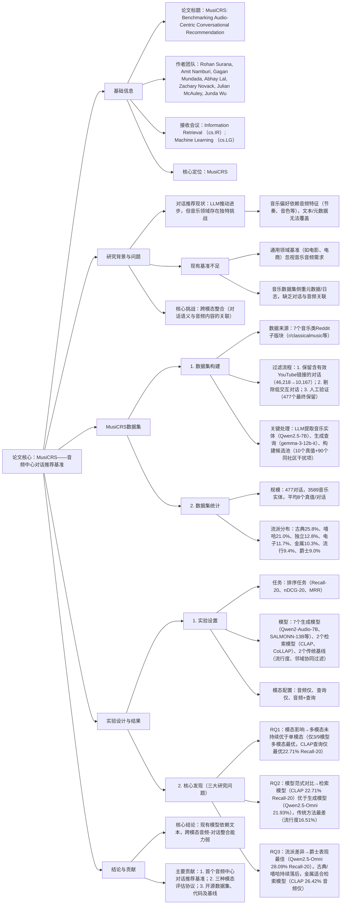

---

### 1. 一段话总结
为解决现有对话推荐基准忽视音乐领域**音频推理需求**的问题，研究提出**MusiCRS——首个音频中心对话推荐基准**，该基准从Reddit音乐社区挖掘**477个高质量对话**（覆盖古典、嘻哈等7个流派），关联**3589个独特音乐实体**并通过YouTube链接实现音频接地；支持**三种输入模态配置**（音频仅、查询仅、音频+查询），用于评估音频LLM、检索模型及传统方法。实验发现，当前系统严重依赖**文本信号**，仅3/9模型在多模态配置下表现最优，暴露**跨模态知识整合缺陷**（无法将抽象音乐概念与音频关联）；研究同时开源数据集、评估代码及基线，为音频中心对话推荐研究提供支撑。

---

### 2. 思维导图

---

### 3. 详细总结
#### 1. 引言：音乐对话推荐的独特挑战
现有对话推荐系统在电影、电商等领域取得进展，但音乐领域存在**不可替代的音频依赖**——用户偏好由节奏、音色、配器等音频特征驱动，这些信息无法通过文本或元数据完全捕捉。然而，当前基准存在两大缺口：
- 通用对话推荐基准（如ReDial、TalkTheWalk）聚焦非音乐领域，缺乏音频接地；
- 音乐推荐数据集（如LastFM、Million Song Dataset）侧重元数据或收听日志，无真实对话场景。

为此，研究提出**MusiCRS**，填补“对话语义-音频内容关联”的评估空白，推动音频中心对话推荐研究。

#### 2. MusiCRS数据集构建与统计
##### 2.1 数据集构建流程
采用“大规模挖掘-多阶段过滤-人工验证”三步法，确保数据质量与音频接地：
1. **Reddit数据挖掘**：收集7个音乐子版块（r/classicalmusic、r/hiphopheads等）的270万帖子、2850万评论；
2. **自动过滤**：
    - 保留含有效YouTube链接的对话（初步筛选出46,218个线程）；
    - 剔除低质量对话（<3个一级回复或评论<5字符，剩余10,167个）；
3. **人工验证**：4名研究生标注1,623个对话，完成：
    - 内容分类（仅保留音乐类对话）；
    - YouTube链接校验（41.3%无效链接被剔除，10.5%修正）；
    - 实体精炼（移除20.0%无关音乐实体，恢复0.3%缺失实体）；
    - 最终保留**477个高质量音乐对话**。

4. **结构化处理**：
    - 音乐实体提取：用Qwen2.5-7B识别歌曲、艺术家、专辑；
    - 查询生成：用gemma-3-12b-it将对话转化为简洁查询（保留用户意图）；
    - 候选池构建：每个对话的候选池含10个高赞真值实体+90个同子版块随机干扰项（共100个候选）。

##### 2.2 数据集统计与对比
###### 2.2.1 核心统计数据
| 统计维度       | 数值/细节                                                                 |
|----------------|---------------------------------------------------------------------------|
| 对话数量       | 477个                                                                   |
| 音乐实体数量   | 3,589个独特实体                                                          |
| 流派覆盖       | 7个（古典25.8%、嘻哈21.0%、独立12.8%、电子11.7%、金属10.3%、流行9.4%、爵士9.0%） |
| 平均真值数量   | 8个/对话                                                                 |
| 候选池规模     | 100个/对话（10真值+90干扰项）                                            |
| 音频接地方式   | 验证后的YouTube链接（支持提取30秒音频片段）                               |

###### 2.2.2 与现有音乐推荐数据集对比
| 数据集         | 来源类型       | 真实对话 | 音频接地 | 推荐评估 | 多模态支持 |
|----------------|----------------|----------|----------|----------|------------|
| CPCD (Playlist) | 众包           | ✔        | ✗        | ✔        | ✗          |
| TalkTheWalk    | LLM生成+列表   | ✗        | ✗        | ✔        | ✗          |
| LP-MusicDialog | LLM生成        | ✗        | ✗        | ✔        | ✗          |
| Audio Dialogues | 音频字幕生成   | ✗        | ✔        | ✗        | ✔          |
| LastFM         | 用户日志       | ✗        | ✗        | ✔        | ✗          |
| **MusiCRS**    | Reddit真实对话 | ✔        | ✔        | ✔        | ✔          |

#### 3. 实验设计与核心结果
##### 3.1 实验基础设置
| 实验要素       | 具体配置                                                                 |
|----------------|--------------------------------------------------------------------------|
| 任务类型       | 排序任务（评估模型对“用户查询-候选音频”的匹配能力）                       |
| 核心指标       | Recall@20（命中率）、nDCG@20（排序质量）、MRR（平均 reciprocal 排名）     |
| 模型类型       | 1. 生成模型：Qwen2-Audio-7B、Qwen2.5-Omni-7B、SALMONN-13B等7个； 2. 检索模型：CLAP、CoLLAP； 3. 传统基线：子版块流行度、邻域协同过滤 |
| 模态配置       | 1. 音频仅（仅输入参考音频）； 2. 查询仅（仅输入对话生成的文本查询）； 3. 音频+查询（多模态融合） |
| 音频处理       | 300秒音频预算（≤10个片段，每个30秒；采样率16kHz/SALMONN、48kHz/CLAP）   |

##### 3.2 三大研究问题与结果
###### RQ1：输入模态如何影响推荐性能？
- 核心发现：**多模态配置未持续优于单模态**，仅3/9模型（Qwen2.5-Omni、SALMONN-13B、Phi-4-Multimodal）在多模态下表现最优；
- 典型案例：
    - 检索模型CLAP：查询仅配置最优（22.71% Recall@20），音频仅次之（21.15%）；
    - 生成模型Qwen2.5-Omni：多模态最优（21.93% Recall@20），音频仅（19.26%）优于查询仅（18.24%）；
- 原因：现有模型存在**跨模态整合缺陷**，倾向依赖文本信号（文本语义易建模，音频特征难与对话关联）。

###### RQ2：不同模型范式的性能差异？
- 性能排序：**检索模型 > 生成模型 > 传统方法**（表1关键数据）：
  | 模型类型       | 代表模型       | Recall@20（整体） | nDCG@20（整体） |
  |----------------|----------------|-------------------|-----------------|
  | 检索模型       | CLAP           | 22.71%            | 15.90%          |
  |                | CoLLAP         | 20.85%            | 14.14%          |
  | 生成模型       | Qwen2.5-Omni   | 21.93%            | 16.21%          |
  |                | SALMONN-13B    | 19.55%            | 13.66%          |
  | 传统方法       | 流行度推荐     | 16.51%            | 11.09%          |
  |                | 邻域协同过滤   | 14.72%            | 9.30%           |
- 结论：检索模型的嵌入表示更能捕捉“音频-文本”的匹配信号，生成模型因需同时处理对话生成与音频推理，性能稍弱；传统方法无音频/对话理解能力，表现最差。

###### RQ3：不同音乐流派的性能差异？
- 流派性能排名（以Qwen2.5-Omni为例）：
    1. 爵士（28.09% Recall@20）：音频特征独特（如即兴演奏、铜管乐器），易被模型捕捉；
    2. 金属（23.61%）：检索模型更优（CLAP音频仅26.42%），因节奏/失真特征鲜明；
    3. 电子（25.29%）、独立（17.30%）：生成模型适配性强；
    4. 古典（26.53%多模态，但音频仅仅14.80%）、嘻哈（17.74%多模态）：持续落后，因古典音频结构复杂、嘻哈依赖文化语境（文本易缺失）。

#### 4. 结论与贡献
##### 4.1 核心结论
1. 现有多模态模型在音乐对话推荐中**过度依赖文本信号**，缺乏对音频特征的深度推理；
2. 检索模型在“音频-文本匹配”任务中更具优势，生成模型需优化跨模态整合能力；
3. 流派特性显著影响模型性能，复杂音频结构（古典）和文化依赖（嘻哈）是主要挑战。

##### 4.2 主要贡献
1. **数据集贡献**：首个音频中心对话推荐基准（MusiCRS），含477个真实对话与3589个音频接地实体；
2. **评估体系贡献**：提出三种模态配置，支持系统对比不同信息源的价值；
3. **实践贡献**：开源数据集（Hugging Face）、评估代码（GitHub）及11个基线模型，降低研究门槛。

---

### 4. 关键问题
#### 问题1：MusiCRS与现有音乐推荐数据集的核心差异是什么？为何这种差异对音频中心对话推荐研究至关重要？
**答案**：  
核心差异体现在**“真实对话+音频接地+多模态评估”的三位一体设计**，具体对比见下表：
| 差异维度       | 现有数据集（如LastFM、Audio Dialogues） | MusiCRS |
|----------------|------------------------------------------|---------|
| 对话真实性     | 无真实对话（仅日志/生成文本）            | ✔ Reddit真实音乐对话 |
| 音频接地       | 无（或仅音频片段，无对话关联）          | ✔ 对话-YouTube音频一一对应 |
| 推荐评估能力   | 仅支持传统推荐（如协同过滤）            | ✔ 支持对话场景下的排序评估 |
| 多模态支持     | 单模态（仅音频/仅文本）                 | ✔ 音频+文本多模态输入 |

这种差异的重要性在于：  
现有数据集无法评估“模型能否将对话中的用户意图（如“推荐类似莫扎特《安魂曲》的悲伤音乐”）与音频特征（如缓慢节奏、低沉音色）关联”，而MusiCRS的设计恰好填补这一空白，使研究能聚焦音乐领域特有的跨模态对话推理问题。

#### 问题2：现有模型在MusiCRS上表现出的主要性能瓶颈是什么？有哪些实验证据支持这一结论？
**答案**：  
主要性能瓶颈是**跨模态知识整合能力不足**——模型无法有效将抽象的对话语义与具体的音频特征关联，倾向依赖单一模态（尤其是文本）。

实验证据如下：
1. **多模态未持续最优**：仅3/9模型（Qwen2.5-Omni、SALMONN-13B、Phi-4-Multimodal）在“音频+查询”配置下表现最优，其余6个模型（如CLAP、Audio Flamingo 3）在单模态（查询仅/音频仅）下更优；
2. **文本依赖显著**：检索模型CLAP的查询仅配置（22.71% Recall@20）优于音频仅（21.15%），生成模型中4个（如SALMONN-7B）的查询仅性能接近多模态；
3. **案例验证**：在“推荐类似莫扎特《Lacrimosa》的悲伤音乐”任务中，模型音频仅推荐《圣母颂》（仅匹配“悲伤”文本联想，无音频相似性），多模态虽推荐《耶利米哀歌》（正确），但仍有30%候选偏离音频特征。

#### 问题3：不同音乐流派在MusiCRS实验中表现出显著性能差异，这些差异的具体表现是什么？可能的原因是什么？
**答案**：
##### 1. 具体性能差异（以Recall@20为核心指标，Qwen2.5-Omni模型）：
| 流派       | Recall@20 | 表现等级 |
|------------|-----------|----------|
| 爵士       | 28.09%    | 最优     |
| 电子       | 25.29%    | 优秀     |
| 金属       | 23.61%    | 良好     |
| 古典（多模态） | 26.53%  | 良好（但音频仅仅14.80%） |
| 嘻哈       | 17.74%    | 较差     |
| 独立       | 17.30%    | 较差     |

##### 2. 差异原因：
- **爵士/电子/金属**：音频特征鲜明（爵士的即兴演奏、电子的合成器音色、金属的失真吉他），模型易通过音频嵌入捕捉关键特征，且对话中描述此类特征的文本（如“慵懒萨克斯”“重低音”）与音频匹配度高；
- **古典**：音频结构复杂（多乐器合奏、动态范围大），且对话中常提及作曲家/作品名（如“巴赫赋格”），文本易引导模型忽略音频特征，导致音频仅性能差（14.80%），需多模态补救；
- **嘻哈/独立**：嘻哈依赖文化语境（如“老派Flow”）、独立音乐风格多样（无统一音频特征），现有模型缺乏对应的“文本-音频”关联知识，导致性能落后。