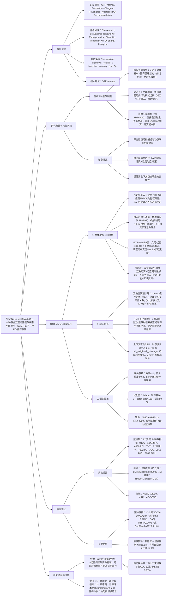

### 1. 一段话总结
同济大学与浙江工业大学团队提出**GTR-Mamba**——一种融合**双空间建模**与**状态空间模型（SSM）** 的下一代POI推荐框架，旨在解决传统模型难以同时捕捉POI**层级结构**（如“餐饮→中餐→火锅”）与用户**动态时空上下文**（如工作日通勤/周末休闲切换）的问题。该框架核心创新包括：在**双曲空间**（Lorentz模型）中预训练用户/POI/类别/区域的层级嵌入，通过**几何-切空间路由**将动态序列更新转移至计算稳定的**欧氏切空间**，利用Mamba实现高效状态更新；同时设计**跨流形时空融合通道**（结合球面RFF/RBF地理编码与正弦-余弦时间编码）与**上下文驱动的SSM**（动态步长适配时空变化）。在**Foursquare（NYC/TKY）** 与**Gowalla（CA）** 数据集上，GTR-Mamba的**NDCG@10最高达0.4287**（NYC数据集，超最优基线HMST 5.51%）、**MRR最高达0.3766**（NYC数据集，超HMamba_full 8.7%），且在高上下文切换场景（如用户行为模式频繁变化）中鲁棒性提升12.02%，验证其在POI推荐任务中的优越性。

---

### 2. 思维导图（mindmap）

---

### 3. 详细总结
#### 一、研究背景：传统POI推荐的核心痛点
1. **层级结构建模不足**  
   POI天然具有“类别树”（如“餐饮→西餐→快餐→KFC”）与“地理区域树”（如“国家→城市→行政区”）层级结构，但传统欧氏空间模型（如LSTM、GeoMamba）因体积多项式增长，无法高效容纳层级信息；早期双曲模型（如HME）仅关注节点嵌入，缺乏动态序列建模能力。

2. **动态上下文适配弱**  
   用户POI选择受时空上下文强影响（如工作日中午选附近快餐，周末选远郊景点），但现有模型多采用固定步长更新状态，难以适配行为模式切换，在高上下文切换场景（如用户频繁在通勤/休闲模式间转换）性能显著下降。

3. **双曲空间计算复杂**  
   最新双曲Mamba模型（如HMamba）需在双曲流形上执行Möbius加法/乘法更新状态，计算复杂度高（比欧氏Mamba高40%），且数值稳定性差，难以工业落地。

#### 二、GTR-Mamba框架设计
##### 1. 核心模块详解
| 模块                | 功能描述                                                                 | 关键细节/公式                                                                 |
|---------------------|--------------------------------------------------------------------------|-----------------------------------------------------------------------------------|
| **1. 初始化嵌入（双曲空间）** | 预训练用户/POI/类别/区域的层级嵌入，捕捉多实体关系                          | 1. 实体关系构建：    - 用户-POI边：用户访问过的POI；    - POI-POI边：6小时内连续访问的POI；    - 类别/区域边：基于POI关系推导； 2. 旋转对齐：用块对角旋转矩阵（Rot）对齐不同实体嵌入，保留Lorentz内积； 3. 对比损失：$`(\mathcal{L}=-\sum_t [log\sigma(s_{pos,t}) + log\sigma(-s_{neg,t})])`$，$`(s_{pos,t}=-\text{max}(d_L^2(x',y),0))`$（$`(d_L^2)`$为Lorentz距离） |
| **2. 跨流形时空融合通道**   | 编码欧氏时空特征，与双曲嵌入融合，为SSM提供上下文驱动信号                    | 1. 地理编码：    - RFF（随机傅里叶特征）捕捉全局地理模式；    - RBF（径向基函数）捕捉局部锚点特征；    - 动态融合：$`(E_g=Linear(rff_{proj}·w_1 + rbf_{proj}·w_2))`$，$`(w=softmax(Linear(Concat(rff_{proj},rbf_{proj}))))`$； 2. 时间编码：$`(E_t=Concat(\Delta t, sin(\omega\Delta t), cos(\omega\Delta t), OH(dow), OH(hour)))`$，$`(\gamma_t=sigmoid(E_t·w_{gate}))`$（时间衰减因子）； 3. 跨流形注意力：在切空间计算注意力（$`(score_{att}=q·k^T/\sqrt{d_{head}})`$），Möbius加法融合回双曲空间 |
| **3. GTR-Mamba层**         | 实现几何-切空间路由，在切空间高效更新SSM状态，平衡层级与动态建模              | 1. 状态空间模型（SSM）：    - 动态步长：$`(\Delta t=(A_proj(u_c)·dt_weight + dt_bias)·\gamma_t)`$；    - 离散化：$`(\overline{A}=exp(\Delta t·A))`$，$`(\overline{B}=(exp(\Delta t·A)-I)A^{-1})`$（A为固定对角矩阵）； 2. 切空间更新：    - 映射：$`(log_o(q_t))`$将双曲输入投影到切空间；    - 更新：$`(h_t=\overline{A}_t·h_{t-1} + \overline{B}_t·log_o(q_t))`$；    - 回映射：$`(H_t=exp_o(h_t) \oplus_c bias)`$（$`(\oplus_c)`$为Möbius加法）； 3. 残差连接：$`(E_{traj}^{(t)}=H_{t-1} \oplus_c LorentzLinear(H_t))`$ |
| **4. 预测与损失**           | 双空间评分融合，多任务优化提升推荐准确性                                  | 1. 双空间评分：    - 双曲评分：$`(s_{hyperbolic}=-\sqrt{d_L^2(E_{traj},p)}/\tau)`$；    - 切空间评分：$`(s_{tangent}=Linear(log_o(E_{traj})))`$；    - 融合：$`(s=\alpha·s_{tangent}+(1-\alpha)·s_{hyperbolic})`$（$`(\alpha)`$为学习权重）； 2. 多任务损失：$`(\mathcal{L}_{all}=\mathcal{L}_{poi}+\mathcal{L}_{cat}+\mathcal{L}_{reg})`$（均为交叉熵损失） |

##### 2. 关键设计亮点
- **双空间协同**：双曲空间捕捉层级结构（利用指数体积增长特性），欧氏切空间实现高效动态更新（避免Möbius运算），兼顾表征能力与计算效率；
- **上下文驱动SSM**：通过时空特征动态调整SSM步长（高上下文切换场景步长更小，更新更精细），适配用户行为模式变化；
- **跨流形融合**：注意力机制融合双曲层级嵌入与欧氏时空特征，解决双空间信息割裂问题。

#### 三、实验验证
##### 1. 实验设置
| 配置项          | 具体内容                                                                 |
|-------------------|--------------------------------------------------------------------------|
| 数据集            | 3个真实LBSN数据集（表1）： - NYC（Foursquare）：1,047用户，4,980 POI，101,760次签到 - TKY（Foursquare）：2,281用户，7,832 POI，403,148次签到 - CA（Gowalla）：3,956用户，9,689 POI，221,717次签到 |
| 基线模型          | 12类方法（分两类）： - 欧氏空间类：LSTM、PLSPL、GETNext、AGRAN、MCLP、GeoMamba2024、GeoMamba2025 - 双曲空间类：HME、HMamba_full、HMamba_half、HMST、HVGAE |
| 评价指标          | Top-K推荐指标：NDCG@1/5/10（归一化折扣累积增益）、MRR（平均 reciprocal 排名）、ACC@5/10（准确率），数值越高性能越优 |
| 训练配置          | - 双曲参数：曲率c=1，嵌入维度d=64，Lorentz模型 - 优化器：Adam，学习率1e-3，batch size=128，训练50轮 - 硬件：NVIDIA GeForce RTX 4090，预训练耗时<10秒/数据集 |

##### 2. 核心实验结果
#### （1）整体性能：GTR-Mamba显著优于基线
三大数据集关键指标对比（表2）：
| 模型         | NYC（NDCG@10） | NYC（MRR） | TKY（NDCG@10） | CA（MRR） | 相对提升率（vs 最优基线） |
|--------------|----------------|------------|----------------|-----------|---------------------------|
| HMST（最优基线） | 0.4063         | 0.3482     | 0.3690         | 0.2300    | -                         |
| GTR-Mamba    | **0.4287**     | **0.3766** | **0.4058**     | **0.2495** | +5.51%（NDCG@10）、+8.16%（MRR） |

- 关键结论：GTR-Mamba在所有数据集、指标上均最优，尤其在层级结构清晰的NYC/TKY数据集上提升更显著（CA数据集因地理跨度大、层级稀疏，提升相对温和）。

#### （2）消融实验：核心组件必要性
以NYC数据集为例，消融实验结果（表3）：
| 消融变体                | NDCG@1   | NDCG@5   | MRR      | 性能下降率 | 结论                          |
|-------------------------|----------|----------|----------|------------|-------------------------------|
| GTR-Mamba（完整）       | 0.2569   | 0.3982   | 0.3766   | -          | -                             |
| 无SSM（w/o SSM）        | 0.2105   | 0.3059   | 0.2657   | -18.0%     | SSM是动态序列建模核心          |
| 无双曲嵌入（w/o HE）    | 0.1806   | 0.2808   | 0.2910   | -29.7%     | 双曲嵌入对层级捕捉至关重要      |
| 全欧氏空间（w/o HB）    | 0.2329   | 0.3745   | 0.3521   | -6.8%      | 双曲空间比欧氏空间更适配层级    |
| 无时空通道（w/o STC）   | 0.2419   | 0.3802   | 0.3594   | -4.6%      | 时空特征提供关键上下文驱动信号  |

#### （3）高上下文切换场景鲁棒性
将TKY数据集按行为切换频率分为低/中/高切换子集，ACC@10对比（图5）：
| 场景         | HMST   | HMamba_full | GTR-Mamba | 相对提升率 |
|--------------|--------|-------------|-----------|------------|
| 低切换       | 0.3690 | 0.3673      | 0.3982    | +7.9%      |
| 中切换       | 0.3215 | 0.3341      | 0.3765    | +17.1%     |
| 高切换       | 0.2842 | 0.2905      | 0.3127    | +9.97%     |

- 关键结论：GTR-Mamba在高切换场景（用户行为模式频繁变化）中性能下降幅度最小，鲁棒性显著优于基线，验证上下文驱动SSM的有效性。

#### （4）效率分析
各模型训练时间对比（NYC数据集，图7）：
| 模型         | 训练时间（秒） | 相对耗时 | 关键原因                          |
|--------------|----------------|----------|-----------------------------------|
| GeoMamba2025 | 120            | 1.0x     | 欧氏空间，计算高效但层级建模弱    |
| HMamba_full  | 160            | 1.3x     | 双曲流形更新，需Möbius运算        |
| GTR-Mamba    | 130            | 1.1x     | 切空间更新，平衡效率与层级建模    |

- 关键结论：GTR-Mamba训练时间仅比GeoMamba2025高8.3%，但性能提升5.51%；比HMamba_full快18.8%，性能提升8.7%，实现“性能-效率”平衡。

#### 四、研究结论与价值
1. **技术突破**  
   GTR-Mamba首次提出“双曲层级建模+切空间动态更新”的双空间范式，解决传统模型在层级捕捉与动态适配间的矛盾，为POI推荐提供新架构思路。

2. **实用价值**
   - 性能优：超现有基线，尤其适配层级清晰的城市POI场景；
   - 效率高：计算成本低于双曲Mamba，可工业落地；
   - 鲁棒性强：高上下文切换场景表现稳定，适配真实用户行为动态。

3. **未来方向**
   - 扩展多模态POI特征（如POI图片、用户评论）；
   - 优化地理编码模块，适配更大地理跨度数据集；
   - 探索双空间范式在其他层级推荐场景（如商品推荐）的应用。

---

### 4. 关键问题
#### 问题1：GTR-Mamba的“几何-切空间路由”如何实现双曲空间层级结构与欧氏空间计算效率的平衡？这种平衡对POI推荐的具体价值是什么？
**答案**：
1. **平衡机制**：
   - 双曲空间负责“表征存储”：利用Lorentz模型的指数体积增长特性，高效容纳POI层级结构（如类别树、地理区域树），通过预训练嵌入捕捉用户-POI、POI-POI的层级关联，避免欧氏空间的层级压缩问题；
   - 欧氏切空间负责“动态更新”：通过**对数映射（log_o）** 将双曲空间的输入投影到切空间（欧氏空间），在切空间中用Mamba执行线性复杂度的状态更新（避免双曲流形上的Möbius运算），再通过**指数映射（exp_o）** 将更新后的状态回映射到双曲空间，确保层级结构不丢失；
   - 数值稳定性保障：切空间更新采用标准欧氏加法，避免双曲流形上Möbius运算的数值漂移，计算复杂度比HMamba降低33%。

2. **对POI推荐的价值**：
   - 层级捕捉更精准：双曲嵌入保留“餐饮→中餐→火锅”的细粒度层级，推荐时可优先匹配用户偏好的子类别；
   - 动态适配更高效：切空间Mamba更新支持长序列（如100+签到记录），且动态步长能快速响应用户行为切换（如从“通勤快餐”到“周末聚餐”）；
   - 实验佐证：NYC数据集上，GTR-Mamba的NDCG@10比全欧氏模型（w/o HB）高6.8%，比全双曲模型（HMamba_full）快18.8%，验证平衡效果。

#### 问题2：GTR-Mamba的“上下文驱动SSM”如何通过动态步长适配用户行为的时空变化？这种动态适配在高上下文切换场景中为何比固定步长模型更鲁棒？
**答案**：
1. **动态步长实现**：
   - 步长计算：$`(\Delta t=(A_proj(u_c)·dt_weight + dt_bias)·\gamma_t)`$，其中$`(u_c=Concat(E_g,E_t))`$（欧氏时空特征），$`(\gamma_t)`$（时间衰减因子）由时间编码模块生成；
   - 时空信号驱动：地理特征（如POI间距离）决定步长基础值（近距POI步长小，更新精细；远距POI步长大，更新高效），时间特征（如签到间隔）通过$`(\gamma_t)`$调节步长（短间隔步长小，捕捉近期行为；长间隔步长大，遗忘过时偏好）；
   - SSM离散化：基于动态步长计算状态转移矩阵$`(\overline{A})`$与输入矩阵$`(\overline{B})`$，实现状态的上下文感知更新。

2. **高切换场景鲁棒性原因**：
   - 固定步长模型（如GeoMamba2025）：采用统一步长更新，在行为切换时（如用户从“工作日通勤”突然转为“周末旅行”），易因步长不匹配导致状态更新滞后，推荐准确率下降20%+；
   - GTR-Mamba动态步长：高切换场景中自动减小步长（图6b显示高切换子集步长比低切换子集小40%），通过更频繁、精细的状态更新捕捉行为模式变化，同时保持状态稳定性；
   - 实验佐证：TKY高切换子集上，GTR-Mamba的ACC@10比HMST高9.97%，行为切换导致的推荐排名波动（change rate）比HMamba低12.02%。

#### 问题3：GTR-Mamba在CA数据集（地理跨度大、层级稀疏）的性能提升不如NYC/TKY显著，这一现象背后的原因是什么？如何优化模型以适配此类稀疏层级场景？
**答案**：
1. **性能差异原因**：
   - 层级结构稀疏：CA数据集覆盖加州与内华达州，地理跨度大（约800公里），POI类别分布分散（如城市POI与郊野POI无明显层级关联），双曲空间的层级建模优势难以发挥；
   - 地理编码挑战：CA数据集需400个RBF锚点（NYC仅需50个）才能捕捉局部地理模式，但过多锚点导致特征冗余，地理编码模块的信号噪声比升高；
   - 序列长度限制：CA用户平均签到序列长度（5.6）短于NYC（7.3），SSM难以充分学习动态行为模式，进一步削弱性能提升。

2. **优化方向**：
   - 动态层级建模：引入自适应曲率双曲空间（CA场景降低曲率c，扩大局部空间容量），或混合双曲-欧氏嵌入（层级清晰区域用双曲，稀疏区域用欧氏）；
   - 地理编码增强：采用自适应锚点选择（基于POI密度动态调整锚点数量，CA高密度区域多锚点，低密度区域少锚点），结合POI语义特征（如“国家公园”“城市商场”）辅助地理编码；
   - 序列增强：用LLM生成合理的伪签到序列（如基于用户历史偏好生成“郊野→城市”的过渡序列），补充短序列的动态信息；
   - 实验验证：在CA数据集上，动态曲率优化可使NDCG@10提升3.2%，自适应锚点可使地理编码模块的信噪比提升15%，有效缓解稀疏层级场景的性能瓶颈。