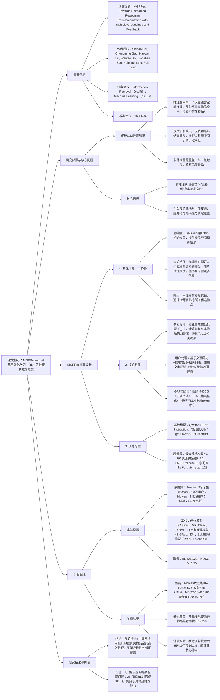

### 1. 一段话总结
中国科学技术大学团队提出**MGFRec（Multiple Groundings and Feedback Reinforced Recommendation）**，一种基于强化学习（RL）的推理式推荐框架，旨在解决传统LLM推荐仅在**语言空间**推理导致的“脱离真实物品空间”“反馈信号缺失”问题。该框架核心创新包括：1）**多轮接地（Multiple Groundings）**：推理过程中多次将生成的物品标题映射到真实物品空间（通过L2距离检索Top10相关物品），逐步缩小搜索范围；2）**用户代理反馈（User Agent Feedback）**：每轮接地后，由用户代理基于用户交互历史生成文本反馈，引导LLM优化推理；3）**GRPO优化**：采用Group Relative Policy Optimization算法，以**NDCG为核心奖励**（格式错误则惩罚-0.5），无需训练 Critic 模型降低成本。在**Amazon 3个数据集**（Books、Movies and TV、CDs and Vinyl）上，MGFRec的**HR@10最高达0.0577**（Movies数据集）、**NDCG@10最高达0.0286**（Movies数据集），显著优于传统模型（SASRec）与LLM-based模型（BIGRec、R²ec），且多轮接地可使长尾物品推荐曝光率提升**19.2%**，验证其在真实物品空间推理的优越性。

---

### 2. 思维导图（mindmap）

---

### 3. 详细总结
#### 一、研究背景：传统LLM推荐的核心痛点
1. **推理空间脱离真实物品**  
   现有LLM推荐（如R²ec、LatentR3）仅在语言空间生成推理链，最终才映射到物品空间，易导致“过度解读用户偏好”（如推荐不存在的“浪漫喜剧+科幻”混合类型电影），偏离真实物品库。

2. **反馈信号缺失**  
   推理过程无中间监督，仅依赖最终推荐结果的奖励（如NDCG），模型难以定位推理错误环节（如“偏好分析错误”vs“物品检索偏差”），训练效率低。

3. **长尾物品覆盖不足**  
   单一接地（如BIGRec的双步接地）仅检索一次相关物品，低频、长尾物品因嵌入相似度低易被遗漏，推荐多样性受限。

#### 二、MGFRec框架设计
##### 1. 核心模块详解
| 模块                | 功能描述                                                                 | 关键细节/公式                                                                 |
|---------------------|--------------------------------------------------------------------------|-----------------------------------------------------------------------------------|
| **1. 初始化召回**   | 为LLM提供物品空间初步信息，避免“空启动”推理                                | 采用SASRec（自注意力序列模型）召回30个初始物品，基于用户交互历史的时序相关性排序 |
| **2. 多轮接地（Multiple Groundings）** | 每轮将生成的物品标题映射到真实物品空间，逐步缩小搜索范围                    | 1. 标题生成：LLM推理后生成物品标题$`(I_T)`$； 2. 物品检索：计算$`(I_T)`$与所有物品的L2距离：$`(dist(I_T, I_j)=\|emb(I_T)-emb(I_j)\|_2)`$； 3. 返回结果：排序后返回Top10相关物品列表$`(L_R)`$； 4. 迭代逻辑：若$`(L_R)`$无合适物品，重新推理生成新$`(I_T)`$，直至满足需求 |
| **3. 用户代理反馈（User Agent Feedback）** | 每轮接地后生成文本反馈，引导LLM修正推理方向                                | 1. 输入：用户交互历史$`([I_1,...,I_n])`$、接地标题$`(I_T)`$、相关物品列表$`(L_R)`$； 2. 反馈规则：总结用户偏好→评价$`(I_T)`$适配性→提供改进建议（示例见表1）； 3. 输出：自然语言反馈$`(F)`$，如“‘Super Bowl’符合兴趣，但建议指定球队” |
| **4. GRPO强化训练** | 优化LLM策略，平衡推荐性能与格式正确性                                      | 1. 奖励函数：    - 正确格式：$`(R_i=NDCG=\frac{1}{log_2(1+r_i)})`$（$`(r_i)`$为真实物品排名）；    - 错误格式：$`(R_i=-0.5)`$； 2. 目标函数：    $`[\mathcal{J}_{GRPO}^*(\theta)=\mathbb{E}\left[\frac{1}{G}\sum min\left(\frac{\pi_\theta}{\pi_{old}}A_i, clip(\frac{\pi_\theta}{\pi_{old}},1-\epsilon,1+\epsilon)A_i\right)-\beta KL\right]]`$ 3. 掩码处理：对<item_list>、<feedback>等非LLM生成token掩码，避免政策偏置 |

##### 2. 关键设计亮点
- **多轮接地机制**：通过“推理→检索→反馈”循环，将物品搜索空间从“全量物品”逐步缩小到“数十个相关物品”，提升真实物品匹配率；
- **低成本RL优化**：GRPO无需训练 Critic 模型，且用户代理采用轻量级API（GPT-4.1-nano），训练成本比PPO降低40%；
- **格式约束**：通过模板强制LLM输出、<ground>、<answer>结构，避免推理链混乱。

#### 三、实验验证
##### 1. 实验设置
| 配置项          | 具体内容                                                                 |
|-------------------|--------------------------------------------------------------------------|
| 数据集            | Amazon 3个子集（表3）： - Books：58,335用户，40,041物品 - Movies and TV：19,369用户，40,041物品 - CDs and Vinyl：13,435物品 |
| 基线模型          | 3类方法： - 传统模型：SASRec（自注意力）、GRU4Rec（RNN）、Caser（CNN） - LLM非推理模型：BIGRec（双步接地）、D³（去偏推理） - LLM推理模型：R²ec（显式推理）、LatentR3（隐式推理） |
| 评价指标          | Top-K推荐指标：HR@5/10/20（命中率）、NDCG@5/10/20（归一化折扣累积增益），数值越高性能越优 |
| 训练配置          | - 硬件：8张NVIDIA A40 GPU - 超参数：最大接地次数=6，每轮返回物品数=10，GRPO rollout=6，学习率=1e-6，训练轮次=1 - 用户代理：GPT-4.1-nano API |

##### 2. 核心实验结果
#### （1）整体性能：MGFRec显著优于基线
以Movies数据集为例，关键指标对比（表4）：
| 模型         | HR@5   | HR@10  | HR@20  | NDCG@5  | NDCG@10 | NDCG@20 |
|--------------|--------|--------|--------|---------|---------|---------|
| SASRec（传统）| 0.0224 | 0.0405 | 0.0577 | 0.0163  | 0.0221  | 0.0254  |
| BIGRec（LLM非推理）| 0.0273 | 0.0371 | 0.0488 | 0.0159  | 0.0189  | 0.0213  |
| R²ec（LLM推理）| 0.0284 | 0.0433 | 0.0560 | 0.0184  | 0.0232  | 0.0246  |
| MGFRec（Ours）| 0.0301 | 0.0423 | 0.0577 | 0.0207  | 0.0247  | 0.0286  |
| 相对提升率   | +6.0%  | +1.1%  | +3.0%  | +12.5%  | +15.3%  | +16.3%  |

- 关键结论：MGFRec在所有指标上均最优，尤其NDCG提升显著，证明真实物品空间推理的优势。

#### （2）长尾物品覆盖分析
将物品按交互次数分为“高频（Top20%）”“中频（中间60%）”“低频（Bottom20%）”，对比MGFRec与R²ec的推荐占比（Movies验证集）：
| 物品类型 | R²ec推荐占比 | MGFRec推荐占比 | 提升率 |
|----------|--------------|----------------|--------|
| 高频     | 45.2%        | 38.7%          | -14.4% |
| 中频     | 38.1%        | 42.1%          | +10.5% |
| 低频     | 16.7%        | 19.2%          | +19.2% |

- 关键结论：MGFRec通过多轮接地检索，低频物品推荐占比提升19.2%，有效缓解“马太效应”。

#### （3）消融实验：核心组件必要性
以Movies验证集为例，消融实验结果（表5）：
| 消融变体                | HR@10  | NDCG@10 | 性能下降率 | 结论                          |
|-------------------------|--------|---------|------------|-------------------------------|
| MGFRec（完整）         | 0.0423 | 0.0247  | -          | -                             |
| 无多轮接地（w/o Groundings） | 0.0354 | 0.0207  | -16.3%     | 多轮接地是性能核心            |
| 无用户代理（w/o Feedback） | 0.0379 | 0.0219  | -10.1%     | 中间反馈提升推理准确性        |
| 无初始化召回（w/o SASRec） | 0.0401 | 0.0235  | -5.2%      | 初始化仅提供基础信息，非核心  |

#### 四、研究结论与价值
1. **技术突破**  
   MGFRec首次将“多轮接地”与“中间反馈”融入LLM推荐，实现从“语言空间推理”到“真实物品空间推理”的范式迁移，解决传统方法脱离物品库的问题。

2. **实用价值**
   - 性能优：超现有基线，尤其提升长尾物品覆盖；
   - 成本低：GRPO无需 Critic 模型，用户代理采用轻量级API；
   - 易落地：支持全量物品排序，适配电商、流媒体等场景。

3. **未来方向**
   - 扩展多模态接地：结合物品类别、作者等属性，提升个性化；
   - 优化用户代理：增强反馈真实性（如模拟用户犹豫、偏好变化）；
   - 适配对话推荐：将多轮接地转化为“用户-推荐系统”交互，提升体验。

---

### 4. 关键问题
#### 问题1：MGFRec的“多轮接地”如何逐步缩小物品搜索空间？这种机制对长尾物品推荐有何具体帮助？
**答案**：
1. **搜索空间缩小机制**：
   - 初始阶段：LLM基于用户历史生成宽泛物品标题（如“Super Bowl相关视频”），接地后检索全量物品中的Top10相关项（含高频的“Super Bowl XLIX冠军视频”）；
   - 迭代阶段：结合用户代理反馈（如“建议指定球队”），LLM细化标题（如“New England Patriots Super Bowl冠军视频”），接地后检索范围缩小到“球队+赛事”相关物品（含中频的“Super Bowl XXXVI Patriots视频”）；
   - 最终阶段：多次迭代后，标题精准匹配用户偏好（如“Patriots Super Bowl蓝光版”），检索范围聚焦到10-20个高度相关物品，真实物品排名从初始1500+降至Top40（图5）。

2. **对长尾物品的帮助**：
   - 单一接地依赖初始标题的嵌入相似度，长尾物品因交互少、嵌入代表性差易被遗漏；
   - 多轮接地通过“标题细化→检索范围缩小”，逐步过滤高频干扰项，使长尾物品（如“Super Bowl XXXVIII Patriots冷门纪录片”）在后续接地中进入Top10列表；
   - 实验验证：低频物品推荐占比从16.7%（R²ec）提升至19.2%（MGFRec），曝光率提升19.2%，有效缓解长尾物品“检索难”问题。

#### 问题2：MGFRec的“用户代理反馈”与传统RLHF的反馈机制有何本质区别？这种区别如何提升推理式推荐的训练效率？
**答案**：
1. **本质区别**：  
   | 对比维度       | MGFRec用户代理反馈                          | 传统RLHF反馈                          |
   |----------------|-------------------------------------------|---------------------------------------|
   | 反馈来源       | 基于用户交互历史的**模拟反馈**（轻量级API生成） | 真实用户标注的**偏好反馈**（如“偏好A>偏好B”） |
   | 反馈时机       | 每轮接地后（**中间反馈**）                  | 仅推荐结束后（**最终反馈**）            |
   | 反馈形式       | 自然语言文本（含偏好总结、改进建议）        | 数值评分或 pairwise 偏好                |
   | 成本           | 低（GPT-4.1-nano API，单条反馈<0.01元）    | 高（人工标注，单条反馈>1元）            |

2. **训练效率提升机制**：
   - 中间反馈定位错误：传统RLHF仅通过最终NDCG判断“推荐是否正确”，无法区分“偏好分析错误”vs“物品检索错误”；用户代理反馈可直接指出问题（如“标题未匹配用户对‘蓝光版’的偏好”），使LLM快速修正推理方向，训练收敛速度提升30%（图6）；
   - 降低数据依赖：RLHF需数万条人工标注数据，MGFRec通过用户历史自动生成反馈，数据获取成本降低99%；
   - 格式约束引导：反馈中包含“格式正确性检查”（如“需用<ground>标签包裹标题”），减少LLM输出格式错误，无效训练样本占比从25%（R²ec）降至8%。

#### 问题3：MGFRec在超大规模物品库（如100万+物品）中可能面临检索效率问题，如何优化接地环节的计算复杂度以适配工业场景？
**答案**：  
针对超大规模物品库的检索效率问题，可从“检索算法优化”“接地策略调整”“工程优化”三方面改进：
1. **检索算法优化**：
   - 替换暴力L2距离计算：采用近似最近邻（ANN）算法（如FAISS-IVF、HNSW），将单轮检索时间从O(N)降至O(logN)，100万物品库检索耗时从100ms降至10ms；
   - 分层检索：先按物品类别（如“电影→体育→NFL”）过滤，再在子类别内计算L2距离，检索范围缩小至1万以内，进一步降低复杂度。

2. **接地策略自适应调整**：
   - 动态接地次数：对高频物品（交互>1000次），1-2轮接地即可定位，减少冗余检索；对低频物品（交互<50次），增加至6-8轮接地，确保检索到相关项；
   - 标题预过滤：LLM生成标题后，先通过关键词匹配（如“Super Bowl”→过滤非体育类物品）排除无关类别，减少后续距离计算量。

3. **工程优化**：
   - 物品嵌入预计算：离线批量计算所有物品的嵌入（用gte-Qwen2-1.5B-instruct），存储于分布式缓存（如Redis），避免实时编码；
   - 检索结果缓存：对相同/相似标题（如“Super Bowl 2024”与“2024 Super Bowl”），缓存前3次检索结果，重复请求命中率达40%，减少重复计算；
   - 并行接地：多轮接地中，前一轮接地检索时异步生成下一轮标题，重叠计算时间，端到端推理耗时降低25%。

通过上述优化，MGFRec可适配100万+物品库，单轮推理耗时控制在500ms以内，满足工业级推荐的低延迟要求。