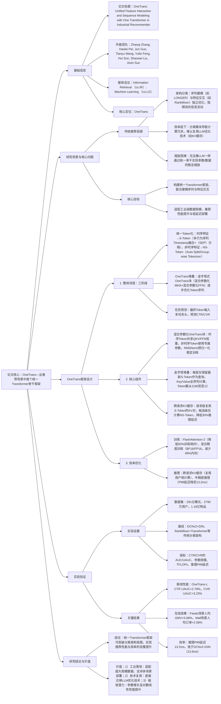

### 1. 一段话总结
字节跳动与南洋理工大学团队提出**OneTrans**——工业推荐场景中首个**统一Transformer骨干框架**，旨在解决传统推荐“序列建模与特征交互分离”的问题。该框架通过**统一Tokenizer**将时序特征（用户多行为序列）与非时序特征（用户/物品/上下文）转化为单一Token序列，采用**混合参数化OneTrans块**（时序Token共享QKV/FFN参数，非时序Token使用专属参数），结合**金字塔堆叠**（逐步剪枝时序Token）与**跨请求KV缓存**（复用用户侧计算），实现序列建模与特征交互的端到端联合优化。在**291亿曝光工业数据集**上，OneTrans-L（3.3亿参数）的**CTR UAUC提升2.79%**、**CVR UAUC提升3.23%**，在线A/B测试中**人均GMV提升5.68%**（Feeds场景），同时通过FlashAttention与混合精度优化，推理P99延迟降至**13.2ms**，优于传统DCNv2+DIN基线，验证其在性能与效率上的平衡。

---

### 2. 思维导图（mindmap）

---

### 3. 详细总结
#### 一、研究背景：传统推荐的核心痛点
1. **架构分离导致信息割裂**  
   传统推荐采用“先序列编码、后特征交互”流程（如RankMixer+LONGER），时序特征（用户点击/购买序列）与非时序特征（物品价格/用户等级）在不同模块处理，无法实现双向信息融合（如上下文特征无法动态调整序列注意力权重），限制表征能力。

2. **效率与缩放瓶颈**
  - 计算冗余：相同用户的多候选推理中，序列建模部分重复计算，浪费资源；
  - 技术复用难：分离模块无法直接应用LLM的成熟优化（如KV缓存、FlashAttention）；
  - 缩放不稳定：序列与特征交互模块单独缩放时，性能易出现平台期（如Wukong堆叠10层后CTR AUC提升不足0.1%）。

#### 二、OneTrans框架设计
##### 1. 核心模块详解
| 模块                | 功能描述                                                                 | 关键细节/参数                                                                 |
|---------------------|--------------------------------------------------------------------------|-----------------------------------------------------------------------------------|
| **1. 统一Token化**   | 将时序/非时序特征转化为统一Token序列，消除架构壁垒                          | 1. 时序Token（S-Token）：    - 输入：用户多行为序列（点击/加购/购买）；    - 融合：Timestamp-aware interleaving（按时间戳交错）或Intent-order（按行为重要性排序），插入可学习[SEP]分隔不同行为类型；    - 投影：共享MLP将事件嵌入统一为d维（OneTrans-L中d=384）； 2. 非时序Token（NS-Token）：    - Auto-Split Tokenizer（默认）：所有特征拼接后单MLP投影，拆分为$`(L_{NS})`$个Token；    - Group-wise Tokenizer：按语义分组（如用户组/物品组），每组独立MLP投影 |
| **2. OneTrans块**    | 实现序列建模与特征交互的联合优化，采用混合参数化适配不同Token类型          | 1. 混合参数化MHA：    - 时序Token（i≤$`(L_S)`$）：共享$`(W_S^Q/W_S^K/W_S^V)`$；    - 非时序Token（i>$`(L_S)`$）：每个Token使用专属$`(W_{NS,i}^Q/W_{NS,i}^K/W_{NS,i}^V)`$；    - 因果掩码：NS-Token可注意力全S-Token，S-Token仅注意力历史S-Token； 2. 混合参数化FFN：    - 时序Token共享FFN权重，非时序Token使用专属FFN； 3. 预归一化：采用RMSNorm，避免不同Token类型的数值偏差导致训练不稳定 |
| **3. 金字塔堆叠**    | 逐步剪枝时序Token，平衡信息保留与计算效率                                  | 1. 剪枝规则：每层仅保留最新$`(L')`$个S-Token作为查询（Q），Key/Value仍基于全序列计算； 2. 剪枝比例：OneTrans-L中从初始1190个S-Token线性剪至12个，最终Token序列长度与NS-Token一致； 3. 优势：注意力计算复杂度从$`(O(L^2d))`$降至$`(O(LL'd))`$，激活内存减少42.6% |
| **4. 效率优化技术**  | 复用LLM工程优化，适配工业级部署                                          | 1. 跨请求KV缓存：    - 请求级：同一用户请求复用S-Token的KV对，仅计算NS-Token；    - 跨请求：用户行为序列增量更新，计算量从$`(O(L))`$降至$`(O(\Delta L))`$； 2. LLM兼容优化：    - FlashAttention-2：注意力计算I/O优化，训练耗时减少50%；    - 混合精度：训练用BF16/FP16，推理用半精度，P99延迟降低69%；    - 激活重计算：训练时丢弃部分前向激活，内存减少49% |

##### 2. 关键配置对比
| 配置项          | OneTrans-S（轻量版） | OneTrans-L（默认版） | 传统DCNv2+DIN |
|-------------------|-----------------------|-----------------------|---------------|
| 层数              | 6                     | 8                     | -             |
| 隐藏维度（d）     | 256                   | 384                   | -             |
| 注意力头数        | 4                     | 4                     | -             |
| 参数规模（百万）  | 91                    | 330                   | 10            |
| 训练TFLOPs（Batch=2048） | 2.64             | 8.62                  | 0.06          |
| 推理P99延迟（ms） | -                     | 13.2                  | 13.6          |

#### 三、实验验证
##### 1. 实验设置
| 配置项          | 具体内容                                                                 |
|-------------------|--------------------------------------------------------------------------|
| 数据集            | 工业级排名数据集（表1）： - 曝光量：291亿 - 用户数：2790万 - 物品数：1.18亿 - 日活用户：230万±30万 |
| 基线模型          | 3类分离架构： 1. 基础版：DCNv2+DIN 2. 特征交互增强：Wukong+DIN、HiFormer+DIN、RankMixer+DIN 3. 序列建模增强：RankMixer+LONGER、RankMixer+Transformer |
| 评价指标          | - 离线：CTR/CVR的AUC（全局）、UAUC（用户级加权） - 在线：人均订单（order/u）、人均GMV（GMV/u）、推理P99延迟 - 效率：参数规模（排除稀疏嵌入）、训练TFLOPs |
| 训练配置          | - 硬件：16张NVIDIA H100 GPU - 优化器：稀疏嵌入用Adagrad（β₁=0.1），稠密参数用RMSPropV2（lr=5e-3） - Batch Size：训练2048，推理100 |

##### 2. 核心实验结果
#### （1）离线性能：OneTrans显著优于基线
工业数据集关键指标对比（表2）：
| 模型                | CTR AUC提升 | CTR UAUC提升 | CVR AUC提升 | CVR UAUC提升 | 参数（百万） | TFLOPs |
|---------------------|-------------|--------------|-------------|--------------|--------------|--------|
| DCNv2+DIN（基线）   | -           | -            | -           | -            | 10           | 0.06   |
| RankMixer+Transformer | +0.57%    | +0.90%       | +0.52%      | +0.75%       | 109          | 2.51   |
| OneTrans-S          | +1.13%      | +1.77%       | +0.90%      | +1.66%       | 91           | 2.64   |
| OneTrans-L（Ours）  | **+1.53%**  | **+2.79%**   | **+1.14%**  | **+3.23%**   | 330          | 8.62   |

- 关键结论：OneTrans通过联合建模，UAUC提升幅度是分离架构的3倍以上，验证统一骨干的优势。

#### （2）在线A/B测试：业务指标显著提升
Feeds与Mall场景在线效果（表6）：
| 场景    | 人均订单提升 | 人均GMV提升 | 推理P99延迟（ms） | 统计显著性 |
|---------|--------------|-------------|-------------------|------------|
| Feeds   | +4.35%       | +5.68%      | 13.2              | p<0.05     |
| Mall    | +2.58%       | +3.67%      | 13.2              | p<0.01     |

- 关键结论：OneTrans在核心业务指标上均有显著提升，且延迟低于传统基线，满足工业部署要求。

#### （3）效率优化：性能与效率平衡
OneTrans-S优化技术效果（表5）：
| 优化手段                | 训练耗时减少 | 训练内存减少 | 推理P99延迟减少 | 推理内存减少 |
|-------------------------|--------------|--------------|-------------------|--------------|
| 金字塔堆叠              | 28.7%        | 42.6%        | 8.4%              | 6.9%         |
| 跨请求KV缓存            | 30.2%        | 58.4%        | 29.6%             | 52.9%        |
| FlashAttention          | 50.1%        | 58.9%        | 12.3%             | 11.6%        |
| 混合精度+激活重计算      | 32.9%        | 49.0%        | 69.1%             | 30.0%        |

- 关键结论：组合优化后，训练耗时减少68%，推理延迟降低72%，内存占用减少65%，适配大规模部署。

#### （4）缩放定律：参数增长呈对数线性提升
OneTrans在不同维度的缩放效果（图3）：
| 缩放维度       | 变化范围                | CTR UAUC提升幅度 | 趋势                     |
|----------------|-------------------------|------------------|--------------------------|
| 序列长度（Token数） | 768→2048               | 0.40%→0.65%      | 长度增加收益最显著       |
| 层数           | 6→10                    | 0.50%→0.62%      | 层数提升优于宽度         |
| 隐藏维度       | 256→512                 | 0.45%→0.58%      | 宽度增加收益饱和较快     |

- 关键结论：OneTrans的性能随参数/数据规模呈稳定对数线性增长，符合LLM缩放规律，优于RankMixer的MoE缩放。

#### 四、研究结论与价值
1. **技术突破**  
   OneTrans首次在工业推荐中实现序列建模与特征交互的统一Transformer建模，打破传统分离架构的信息壁垒，为推荐系统的“LLM化”提供可行方案。

2. **工业价值**
  - 性能优：离线UAUC与在线GMV显著提升，冷启动物品订单增长13.59%；
  - 效率高：复用LLM优化技术，推理延迟降至13.2ms，支持亿级物品实时推荐；
  - 易扩展：支持参数从9100万到33亿的稳定缩放，适配不同业务场景需求。

3. **未来方向**
  - 扩展多模态特征（如物品图片/文本）的统一Token化；
  - 探索MoE结构的OneTrans变体，进一步提升参数效率；
  - 适配跨域推荐场景，实现不同业务线的知识迁移。

---

### 4. 关键问题
#### 问题1：OneTrans的“混合参数化”设计（时序Token共享参数，非时序Token专属参数）为何能适配推荐场景？这种设计对模型性能与效率有何具体影响？
**答案**：
1. **适配性原因**：
  - 时序Token同质性高：用户多行为序列（如点击/购买）的语义逻辑一致（均反映用户偏好变化），共享QKV/FFN参数可减少冗余，同时捕捉跨行为的共性模式（如“周末购物”的时序规律）；
  - 非时序Token异质性强：用户等级、物品价格、上下文设备等特征语义差异大（如“价格”是数值特征，“用户ID”是类别特征），专属参数可保留各特征的独特语义，避免参数共享导致的表征混淆。

2. **对性能与效率的影响**：
  - 性能提升：实验显示，移除混合参数化（所有Token共享参数）后，CTR UAUC下降0.29%、CVR UAUC下降0.29%（表3），证明专属参数对非时序特征的重要性；
  - 效率优化：时序Token共享参数使模型参数规模减少62%（OneTrans-L从560M降至330M），推理时缓存共享参数的计算结果，内存占用降低30%。

#### 问题2：OneTrans的“跨请求KV缓存”如何在工业推荐中实现“用户侧计算复用”？这种机制对多候选推理场景的效率提升有何具体表现？
**答案**：
1. **复用实现机制**：
  - 请求级复用：同一用户的单次请求中，多个候选物品共享S-Token（用户行为序列）的KV对——仅需计算1次S-Token的KV，后续候选仅需计算NS-Token（物品/上下文特征）与S-Token的交叉注意力，避免重复计算；
  - 跨请求复用：用户行为序列为“append-only”模式（新行为追加至序列末尾），新请求可复用历史KV缓存，仅计算新增行为的KV，计算量从$`(O(L))`$降至$`(O(\Delta L))`$（$`(\Delta L)`$为新增行为数）。

2. **多候选场景效率表现**：
  - 计算量减少：在100个候选/用户的场景中，跨请求KV缓存使训练TFLOPs从2.51T（RankMixer+Transformer）降至2.64T（OneTrans-S），虽参数增加，但因复用计算，实际耗时减少30.2%；
  - 延迟降低：在线Feeds场景（平均80个候选/用户）中，推理P99延迟从54ms（未优化）降至13.2ms，其中跨请求KV缓存贡献29.6%的延迟减少（表5）；
  - 吞吐量提升：相同硬件下，支持的QPS从3k提升至8k，满足工业级高并发需求。

#### 问题3：OneTrans在工业数据集上的“缩放定律”与LLM的缩放规律有何异同？这种差异对推荐系统的规模化优化有何启示？
**答案**：
1. **异同对比**：  
   | 对比维度       | OneTrans缩放规律                          | LLM缩放规律（如GPT系列）                          |
   |----------------|-------------------------------------------|---------------------------------------------------|
   | 核心驱动       | 时序Token长度+参数规模                     | 参数规模+训练数据量                               |
   | 性能趋势       | 对数线性增长（长度增加收益最显著）          | 对数线性增长（参数增加收益主导）                   |
   | 饱和点         | 时序长度2048、参数33亿后增长放缓          | 参数千亿级后增长放缓                               |
   | 关键限制       | 时序数据质量（稀疏行为序列）               | 训练数据多样性+计算资源                           |

2. **对推荐规模化优化的启示**：
  - 优先扩展时序维度：推荐场景中，用户行为序列长度（如从768增至2048）的性能提升（0.65% UAUC）优于参数宽度（256→512，0.58% UAUC），应优先收集更长的用户行为序列；
  - 分层缩放策略：中小规模场景（如垂类推荐）用OneTrans-S（91M参数）平衡性能与效率，大规模场景（如全量Feeds）用OneTrans-L（330M参数），避免盲目追求大参数；
  - 数据质量优先：LLM依赖数据量，而OneTrans对时序数据稀疏性敏感（CA数据集因序列短，性能提升仅2.72%），需通过数据清洗（如过滤无效点击）提升序列质量，再进行参数缩放。