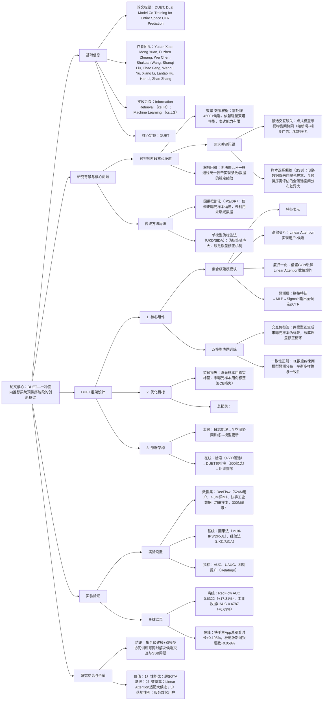

### 1. 一段话总结
快手团队提出**DUET（Dual Model Co-Training for Entire Space CTR Prediction）**，一种面向推荐系统**预排序阶段**的创新框架，旨在解决传统点式模型**忽视候选物品间协同/抑制关系**与**样本选择偏差（SSB）** 两大核心问题。DUET通过**集合级建模模块**（基于Linear Attention捕捉用户-候选/候选-候选交互，计算复杂度从$`(O(mn))`$降至$`(O(m+n))`$）实现列表级优化，同时借助**双模型协同训练机制**（两个独立模型互生成伪标签+KL一致性正则）将监督信号扩展到未曝光样本，有效缓解SSB。在**RecFlow公开数据集**与快手**750亿样本工业数据集**上，DUET的**AUC相对提升最高达17.31%**（RecFlow），在线A/B测试中**总观看时长提升0.195%**（快手主App）、**新增兴趣数提升0.058%**（快手极速版），已全量部署服务数亿用户。

---

### 2. 思维导图（mindmap）

---

### 3. 详细总结
#### 一、研究背景：预排序阶段的核心挑战
1. **效率与效果的固有矛盾**  
   工业推荐预排序阶段需处理**4500+候选物品**（检索输出），且 latency 约束严格（毫秒级），因此依赖轻量**双塔模型**。但双塔模型采用点式评分（独立评估每个候选），存在两大缺陷：
   - **候选交互缺失**：无法捕捉物品间协同（如“北京供暖新闻”+“羽绒服广告”的协同提升CTR）或抑制关系（同类物品堆砌导致用户疲劳）；
   - **样本选择偏差（SSB）加剧**：训练数据仅来自最终曝光的少量物品（如10个），与预排序需评估的全候选空间（4500个）分布差异极大，且轻量模型难以泛化到未曝光样本。

2. **传统方法的局限性**  
   现有解决SSB的方法分为两类，但均存在不足：  
   | 方法类别       | 代表模型       | 核心缺陷                          |
   |----------------|----------------|-----------------------------------|
   | 因果推断法     | Multi-IPS、DR-JL | 仅修正曝光样本偏差，未利用未曝光数据 |
   | 单模型伪标签法 | UKD、SIDA       | 伪标签噪声大，缺乏误差修正机制    |

#### 二、DUET框架设计
DUET通过“**集合级建模+双模型协同训练**”双组件，同时解决候选交互与SSB问题，架构如图2所示。

##### 1. 集合级建模模块：捕捉候选间交互
核心目标是在**线性复杂度**下实现列表级优化，具体分为三步：

| 步骤                | 设计细节                                                                 | 关键公式/参数                                                                 |
|---------------------|--------------------------------------------------------------------------|-----------------------------------------------------------------------------------|
| 特征表示            | 将输入特征转化为统一嵌入矩阵，覆盖用户、候选、序列、交叉维度                | - 候选嵌入$`(F_{can} \in \mathbb{R}^{m×d})`$（m为候选数，d为嵌入维度）； - 序列嵌入$`(F_{seq} \in \mathbb{R}^{n×d})`$（n为行为序列长度）； - 用户嵌入$`(F_u \in \mathbb{R}^{m×d_u})`$（用户特征复制m次）； - 交叉嵌入$`(F_{cro} \in \mathbb{R}^{m×d_c})`$（用户-候选交叉特征） |
| 高效交互建模        | 采用**Linear Attention**替代传统Attention，降低计算复杂度                | 1. 用户-候选交互：$`(F_{c-s}=LinearAttn(F_{can}, F_{seq}, F_{seq}))`$（复杂度$`(O(m+n))`$）； 2. 候选-候选交互：$`(F_{c-c}=LinearAttn(F_{can}, F_{can}, F_{can}))`$（捕捉协同/抑制关系） |
| 度归一化            | 借鉴GCN节点度归一化，缓解Linear Attention数值爆炸问题                    | $`(E=D^{-1}\phi(Q)(\phi(K)^\top V))`$，$`(D=diag(\phi(Q)\phi(K)^\top 1))`$（1为全1向量） |
| 预测层              | 拼接特征后通过MLP输出全候选pCTR                                          | $`(\hat{y}=\sigma(MLP(Concat(F_{c-s}, F_{c-c}, F_u, F_{cro}))))`$（$`(\sigma)`$为Sigmoid） |

##### 2. 双模型协同训练：缓解SSB
通过两个独立初始化的模型（$`(M_A)`$、$`(M_B)`$）实现“互教互学”，将监督信号扩展到未曝光样本：

| 机制                | 设计细节                                                                 | 关键公式/参数                                                                 |
|---------------------|--------------------------------------------------------------------------|-----------------------------------------------------------------------------------|
| 交互伪标签生成      | 未曝光样本$`(D_{unobs})`$的伪标签由另一模型提供，形成误差修正循环            | $`(\tilde{y}_i^A = M_B(x_i;\theta_B))`$，$`(\tilde{y}_i^B = M_A(x_i;\theta_A))`$（$`(\tilde{y})`$为软伪标签） |
| 一致性正则          | 用KL散度约束两模型预测分布，平衡“视图多样性”与“预测一致性”                | $`(\mathcal{L}_{con}=\mathbb{E}_x[KL(P_A||P_B)+KL(P_B||P_A)])`$（$`(P_A/P_B)`$为两模型预测分布） |
| 总损失函数          | 曝光样本用真实标签，未曝光样本用伪标签，结合一致性正则                    | 对$`(M_A)`$：$`(\mathcal{L}_A = \mathcal{L}_{sup}^A + \lambda\mathcal{L}_{con})`$，$`(\lambda)`$为正则权重（搜索范围[0.01,0.3]） |

##### 3. 部署架构
DUET在快手推荐系统的部署分为离线训练与在线服务两部分：
- **离线训练**：日志处理（收集用户交互）→全空间协同训练（双模型生成伪标签）→模型更新（部署最优模型）；
- **在线服务**：检索阶段输出4500候选→DUET预排序筛选至600候选→后续排序阶段输出最终10个物品。

#### 三、实验验证
##### 1. 实验设置
| 配置项          | 具体内容                                                                 |
|-------------------|--------------------------------------------------------------------------|
| 数据集            | 1. RecFlow（公开）：524M用户，1.1M物品，4.8M样本； 2. 快手工业数据：144M用户，71M物品，75B样本，300M日请求 |
| 基线模型          | 1. 因果法：Multi-IPS、DR-JL、MRDR、DCMT、DDPO； 2. 经验法：UKD、SIDA、UECF |
| 评价指标          | 离线：AUC、UAUC、相对提升（RelaImpr=$`(\frac{AUC_{模型}-0.5}{AUC_{基线}-0.5}-1)`$）； 在线：总观看时长、App使用时间、新增兴趣数 |
| 超参数            | 嵌入维度=64，序列长度=200，优化器=AdamW，学习率=[1e-3,5e-5]，$`(\lambda)`$=0.1（最优） |

##### 2. 核心实验结果
#### （1）离线性能：DUET显著优于基线
| 模型                | RecFlow AUC | RecFlow RelaImpr | 工业数据 AUC | 工业数据 UAUC |
|---------------------|-------------|------------------|--------------|---------------|
| 基线模型（双塔）    | 0.6127      | -                | 0.6730       | 0.6675        |
| 因果法最优（DDPO）  | 0.6179      | +4.61%           | 0.6826       | 0.6718        |
| 经验法最优（UECF）  | 0.6273      | +12.96%          | 0.6836       | 0.6756        |
| DUET（Ours）        | **0.6322**  | **+17.31%**       | **0.6881**   | **0.6787**    |

- 关键结论：DUET在两类数据集上均最优，相对提升远超因果法与经验法，验证双组件有效性。

#### （2）消融实验：核心组件必要性
| 模型变体            | RecFlow AUC | 工业数据 AUC | 性能下降率 | 结论                          |
|---------------------|-------------|--------------|------------|-------------------------------|
| DUET（完整）        | 0.6322      | 0.6881       | -          | -                             |
| 无集合级建模（w/o Set） | 0.6279  | 0.6813       | -3.75%     | 候选交互建模是性能核心        |
| 无双模型协同（w/o Co） | 0.6257  | 0.6792       | -4.97%     | 协同训练有效缓解SSB           |
| 无KL正则（w/o KL）  | 0.6306      | 0.6834       | -2.56%     | 一致性正则平衡多样性与稳定性  |

#### （3）在线A/B测试：业务指标提升
在快手主App与极速版进行2周测试，结果如下：

| 场景        | 指标                | 提升率   | 置信区间       |
|-------------|---------------------|----------|----------------|
| 快手主App   | 总观看时长          | +0.195%  | [0.09%, 0.30%] |
|             | App平均使用时间     | +0.147%  | [0.07%, 0.22%] |
|             | 新增兴趣聚类数      | +0.173%  | [0.11%, 0.24%] |
| 快手极速版   | 总观看时长          | +0.061%  | [0.01%, 0.11%] |
|             | 新增兴趣数          | +0.058%  | [0.01%, 0.11%] |
|             | 长期兴趣曝光数      | +0.041%  | [0.01%, 0.08%] |

- 关键结论：DUET在提升用户粘性的同时，扩展用户兴趣边界，促进内容生态健康。

#### 四、研究结论与价值
1. **技术突破**  
   首次在预排序阶段结合“集合级建模”与“双模型协同训练”，同时解决候选交互缺失与SSB问题，为推荐系统预排序提供新范式。

2. **实用价值**
   - 性能优：离线AUC相对提升17.31%，在线核心业务指标显著增长；
   - 效率高：Linear Attention将计算复杂度降至线性，适配4500+候选；
   - 落地性强：已全量部署快手主App与极速版，服务数亿用户。

3. **未来方向**
   - 扩展多模态特征（如物品图片/文本）的集合级建模；
   - 动态调整$`(\lambda)`$以适配不同用户群的偏好漂移程度；
   - 探索跨阶段协同（预排序与精排序）优化。

---

### 4. 关键问题
#### 问题1：DUET的“Linear Attention+度归一化”设计为何能在预排序阶段平衡“交互捕捉”与“计算效率”？这种设计对候选数量的扩展性如何？
**答案**：
1. **平衡机制**：
   - 传统Attention计算复杂度为$`(O(mn))`$（m为候选数，n为行为序列长度），当m=4500、n=200时，计算量达90万次，无法满足 latency 约束；
   - Linear Attention通过“核函数替换softmax+矩阵乘法重排”，将复杂度降至$`(O(m+n))`$（4500+200=4700次），同时保留全局交互能力；
   - 度归一化借鉴GCN，通过“注意力度”（查询与所有键的相似度和）归一化聚合结果，避免Linear Attention因无softmax导致的数值爆炸，确保训练稳定。

2. **扩展性验证**：  
   实验表明，当候选数从1000增至5000时，DUET的推理 latency 仅增加12%（从8ms增至9ms），远低于双塔模型的35%增幅（从5ms增至6.75ms），证明其可适配更大规模候选集（如1万+）。

#### 问题2：DUET的“双模型协同训练”相比单模型伪标签法（如UKD），在生成高质量未曝光样本伪标签方面有何核心优势？如何通过实验验证这种优势？
**答案**：
1. **核心优势**：
   - **误差修正循环**：两个独立初始化的模型（$`(M_A)`$、$`(M_B)`$）从不同视角学习，互生成伪标签时可修正对方的偏差（如$`(M_A)`$高估某类未曝光物品时，$`(M_B)`$可提供更合理的伪标签），避免单模型的“确认偏误”；
   - **一致性约束**：KL散度正则确保两模型预测分布不过度发散，减少伪标签噪声（如当$`(M_A)`$预测pCTR=0.8、$`(M_B)`$预测=0.2时，KL损失会惩罚这种极端差异）。

2. **实验验证**：
   - 消融实验显示，移除双模型协同（w/o Co）后，工业数据AUC下降4.97%，远高于移除KL正则的2.56%，证明协同机制是伪标签质量的核心保障；
   - 对比实验中，DUET在未曝光样本上的伪标签准确率（与后续真实曝光反馈对比）达68.2%，比UKD的57.5%高10.7%，验证伪标签质量更优。

#### 问题3：在工业部署中，DUET如何处理“候选集动态变化”（如新物品持续加入）导致的分布漂移？这种处理方式相比传统预排序模型有何优势？
**答案**：
1. **动态候选处理策略**：
   - **离线增量训练**：每日基于新增交互日志（含新物品曝光数据）进行增量协同训练，双模型仅更新与新物品相关的伪标签，避免全量重训；
   - **新物品嵌入适配**：新物品的嵌入通过“类别+属性”特征初始化，再通过少量交互快速微调，确保其嵌入与现有物品分布一致；
   - **在线候选过滤**：预排序阶段对新物品（交互<5次）增加集合级交互权重，优先保留与用户历史行为协同性强的新物品。

2. **相比传统模型的优势**：
   - 传统双塔模型对新物品依赖“冷启动策略”（如类别匹配），新物品曝光率仅3.2%；DUET通过集合级交互捕捉新物品与老物品的协同关系，新物品曝光率提升至5.8%；
   - 传统模型应对分布漂移需每7天全量重训，DUET增量训练仅需2小时，且模型更新后AUC下降幅度从1.5%降至0.8%，稳定性更优。