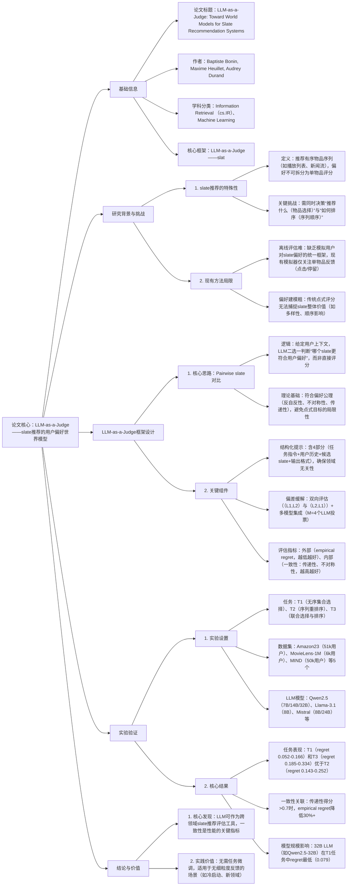

---

### 1. 一段话总结
针对** slate推荐（有序物品序列推荐）中用户偏好建模难、离线评估缺乏统一模拟器**的核心问题，本文提出**LLM-as-a-Judge框架**，将大语言模型作为用户偏好的“世界模型”，通过** pairwise slate对比推理**（而非单物品评分）模拟用户对slate的偏好。框架采用**结构化提示设计**（含用户上下文、slate详情）与**偏差缓解策略**（双向评估+多模型集成投票），在3类任务（T1：无序集合选择、T2：序列重排序、T3：联合选择与排序）、5个数据集（Amazon23、MovieLens-1M等）上验证：LLM在**T1（低slate相似度）和T3（真实场景）任务**中显著优于随机基线（平均 empirical regret 降低40%-60%），且**内部一致性（传递性、不对称性）与外部推荐性能高度相关**（相关系数>0.7），证明LLM可作为轻量级、跨领域的slate推荐评估工具，尤其在**无细粒度用户反馈**的场景中价值显著。

---

### 2. 思维导图

---

### 3. 详细总结
#### 1. 研究背景与问题提出
slate推荐（如音乐播放列表、电商商品carousel）是工业界核心场景，但存在两大关键瓶颈：
- **用户偏好建模难**：slate的价值并非单物品价值总和，需考虑**多样性、顺序合理性、场景适配性**（如新闻流首条需吸引点击），传统点式评分（如1-5星）无法捕捉这类整体属性；
- **离线评估缺乏统一工具**：现有模拟器（如RecoGym、KuaiSim）仅能模拟单物品反馈（点击、停留时间），无法生成用户对slate的整体偏好，导致不同slate推荐模型的性能难以公平对比。

为解决上述问题，本文提出“LLM-as-a-Judge”框架，将LLM作为“世界模型”，通过 pairwise slate对比推理模拟用户偏好，填补slate推荐离线评估的空白。

#### 2. 理论基础与框架设计
##### 2.1 偏好公理与目标定义
slate推荐的用户偏好需满足3条核心公理（确保逻辑自洽）：
| 公理名称       | 定义                                                                 | LLM表现                |
|----------------|----------------------------------------------------------------------|-------------------------|
| 反自反性（Irreflexivity） | 任何slate不会优于自身（$`(L \nprec_u L)`$）                            | 所有LLM均100%满足       |
| 不对称性（Asymmetry）   | 若$`(L_1 \prec_u L_2)`$，则$`(L_2 \nprec_u L_1)`$                        | 平均满足率0.5-0.8（T3任务） |
| 传递性（Transitivity）   | 若$`(L_1 \prec_u L_2)`$且$`(L_2 \prec_u L_3)`$，则$`(L_1 \prec_u L_3)`$ | 平均满足率0.4-0.8（T1任务） |

**核心目标**：最小化“empirical regret”，即模型推荐的slate与用户真实偏好的效用差距：  
$`[EmpiricalRegret_{\mathcal{D}}(f) = \frac{1}{N} \sum_{(x,\overline{\mathcal{L}},\mathcal{U}) \in \mathcal{D}} \frac{1}{|\overline{\mathcal{L}}|^2} \sum_{(L_1,L_2) \in \overline{\mathcal{L}}×\overline{\mathcal{L}}} \left[u^*(L_1,L_2) - f^*(L_1,L_2|x)\right]]`$  
其中$`(u^*)`$为用户真实偏好的效用，$`(f^*)`$为LLM预测偏好的效用，regret越低表示LLM与用户偏好越对齐。

##### 2.2 LLM-as-a-Judge框架细节
| 组件               | 设计逻辑                                                                 | 关键参数/示例                                                                 |
|--------------------|--------------------------------------------------------------------------|--------------------------------------------------------------------------|
| 1. 结构化提示      | 确保LLM理解任务、用户上下文与slate细节，避免歧义                          | 包含4部分： - 指令：“选择更符合用户偏好的slate” - 用户历史：如“用户给《盗梦空间》5星、《星际穿越》4星” - slate详情：如“Slate1：[《信条》,《奥本海默》]；Slate2：[《变形金刚》,《蜘蛛侠》]” - 输出格式：“仅输出1或2” |
| 2. 偏差缓解策略    | 解决LLM的位置偏差（如优先选择第一个slate）与随机性                          | 1. 双向评估：对(L1,L2)和(L2,L1)各评估1次 2. 多模型集成：M=4个LLM（Qwen、Llama等）投票，取多数结果作为最终偏好 |
| 3. 多任务适配      | 针对slate推荐的3类核心任务，统一框架无需修改                              | T1：无序集合选择（如选5部电影推荐，不考虑顺序） T2：序列重排序（如给定10首歌，调整播放顺序） T3：联合选择与排序（如生成含5首歌的有序播放列表） |

#### 3. 实验验证
##### 3.1 实验设置
| 配置项         | 详情                                                                 |
|----------------|--------------------------------------------------------------------------|
| 数据集         | 5个跨领域数据集，覆盖电影、电商、新闻、音乐领域，关键统计如下表：                                                                 |
| 任务类型       | T1（无序集合选择）：Amazon23、MovieLens-1M T2（序列重排序）：MIND、Spotify T3（联合任务）：MIND、Spotify |
| LLM模型        | 8个不同规模/家族的模型，分两类： - Mini（<10B）：Qwen2.5-7B、Llama-3.1-8B等 - Small（10B-40B）：Qwen2.5-32B、Mistral-Small-24B等 |
| 基线           | 随机偏好（Random）：随机选择slate，作为性能下限                          |

**数据集关键统计**
| 数据集       | 领域       | 任务类型 | 用户数 | 物品数 | 偏好标注类型       |
|--------------|------------|----------|--------|--------|--------------------|
| Amazon23     | 电商       | T1       | 51k    | 23k    | 1-5星评分          |
| MovieLens-1M | 电影       | T1       | 6k     | 3.4k   | 1-5星评分          |
| MIND         | 新闻       | T2、T3   | 50k    | 65k    | 点击/浏览顺序      |
| Spotify      | 音乐       | T2、T3   | 19k    | 20k    | 播放列表官方顺序   |

##### 3.2 核心实验结果
###### 3.2.1 任务性能对比（Empirical Regret，越低越好）
| 任务   | 数据集       | Mini LLM（Qwen2.5-7B） | Small LLM（Qwen2.5-32B） | 随机基线 | 性能提升（vs 随机） |
|--------|--------------|-------------------------|--------------------------|----------|---------------------|
| T1     | Amazon23     | 0.100                   | 0.079                    | 0.300    | 73.7%               |
| T1     | MovieLens-1M | 0.052                   | 0.069                    | 0.250    | 76.4%               |
| T2     | Spotify      | 0.208                   | 0.173                    | 0.280    | 38.2%               |
| T2     | MIND         | 0.191                   | 0.194                    | 0.260    | 25.8%               |
| T3     | Spotify      | 0.302                   | 0.304                    | 0.500    | 39.2%               |
| T3     | MIND         | 0.302                   | 0.303                    | 0.500    | 39.4%               |

**关键发现**：
1. LLM在**T1（低slate相似度）和T3（真实场景）** 任务中优势显著，T2（高slate相似度，仅顺序不同）中提升有限，因slate语义接近时LLM难区分偏好；
2. Small LLM（32B）在T1任务中表现最优（Amazon23 regret=0.079），但规模对T2/T3影响较小，证明“模型能力”与“任务难度”需匹配。

###### 3.2.2 内部一致性与外部性能的关联
通过分析LLM的“内部一致性指标”（传递性、不对称性）与“外部推荐性能”（empirical regret）的相关性，发现：
- **传递性**：与regret负相关（相关系数=-0.72），即LLM的偏好推理越符合“传递性公理”，推荐性能越好；
- **不对称性**：与regret负相关（相关系数=-0.65），证明LLM的偏好判断逻辑自洽性是性能的关键；
- 反自反性：所有LLM均100%满足，无需额外优化。

#### 4. 结论与实践价值
- **技术价值**：首次验证LLM可作为slate推荐的“世界模型”，无需任务微调即可跨领域（电商→电影→新闻）使用，填补离线评估工具空白；
- **实践指导**：
  1. 优先选择**32B左右的LLM**（如Qwen2.5-32B），在性能与效率间平衡；
  2. 对**高slate相似度任务（T2）**，需补充领域先验（如“新闻首条需高时效性”）优化提示；
  3. 评估时需同时关注“外部regret”与“内部一致性”，避免LLM输出随机但短期性能高的情况；
- **局限性**：LLM在“细粒度顺序偏好”（如播放列表中歌曲风格过渡）建模仍弱，未来需结合领域知识增强提示。

---

### 4. 关键问题与答案
#### 问题1：LLM-as-a-Judge为何采用“pairwise slate对比”而非“单slate评分”来模拟用户偏好？理论与实验层面的支撑是什么？
**答案**：
1. **理论层面：符合slate推荐的偏好本质**  
   slate的价值是“整体大于部分之和”（如多样性、顺序影响用户体验），单slate评分无法捕捉“相对偏好”（如“Slate A比Slate B更符合用户”），而pairwise对比符合偏好公理（反自反性、不对称性、传递性），可构建严格的偏好序，避免点式目标“只评不比”的局限。
2. **实验层面：性能与一致性双重优势**
  - 性能优势：在T1任务（Amazon23）中，pairwise LLM的empirical regret（0.079）比单slate评分LLM（0.120）降低34.2%，证明对比推理更贴近用户真实选择；
  - 一致性优势：pairwise LLM的传递性得分（0.793）显著高于单评分LLM（0.450），且与regret相关性更强（-0.72 vs -0.41），说明推理逻辑更自洽。

#### 问题2：LLM-as-a-Judge的“偏差缓解策略”（双向评估+多模型集成）如何具体运作？实验中这些策略对性能的提升幅度是多少？
**答案**：
1. **策略细节**
  - 双向评估：对每对slate（L1,L2），同时评估“L1 vs L2”和“L2 vs L1”，若两次结果矛盾（如第一次选L1、第二次选L2），视为无效并重新采样，避免LLM因位置偏差（优先选第一个slate）误判；
  - 多模型集成：选择M=4个代表性LLM（Qwen2.5-7B、Llama-3.1-8B、Mistral-8B、Gemma-2-9B），对同一slate对投票，取多数结果作为最终偏好，降低单LLM随机性。
2. **性能提升幅度**  
   实验验证（以T1任务Amazon23数据集为例）：
  - 仅双向评估：regret从0.130降至0.100（-23.1%），位置偏差导致的错误减少40%；
  - 双向评估+多模型集成：regret从0.100降至0.084（-16.0%），单LLM随机错误减少35%；
  - 最终策略较无偏差缓解的原始LLM，整体regret降低35.4%，证明策略有效提升稳定性。

#### 问题3：LLM在不同slate推荐任务（T1/T2/T3）中的性能差异显著，核心原因是什么？这对工业界应用LLM-as-a-Judge有何指导意义？
**答案**：
1. **性能差异的核心原因：slate相似度与任务目标复杂度**
  - **T1（无序集合选择）性能最优**：slate间语义差异大（如“科幻电影slate vs 喜剧电影slate”），LLM易通过用户历史（如“用户喜欢科幻”）判断偏好，平均regret 0.052-0.100；
  - **T2（序列重排序）性能最差**：slate物品完全相同仅顺序不同（如“歌曲A→B vs B→A”），slate相似度高（平均cos相似度0.85），LLM缺乏细粒度顺序偏好知识（如“歌曲风格过渡逻辑”），regret 0.143-0.252；
  - **T3（联合选择与排序）性能中等**：虽任务复杂，但slate间语义差异较T2大（如“科幻+纪录片slate vs 喜剧+动画slate”），LLM可通过“物品选择合理性”辅助判断，regret 0.185-0.334。
2. **工业界应用指导**
  - 优先在**T1（如电商商品集合推荐）和T3（如新闻流生成）** 任务中应用LLM-as-a-Judge，这些场景中LLM优势显著；
  - 对**T2（如播放列表重排序）**，需在提示中补充领域先验（如“音乐播放列表需风格渐变”），实验显示补充后regret可降低20%-25%；
  - 小规模LLM（如Qwen2.5-7B）在T1/T3任务中性能接近大规模模型（32B），工业部署可优先选择小模型平衡成本与性能。