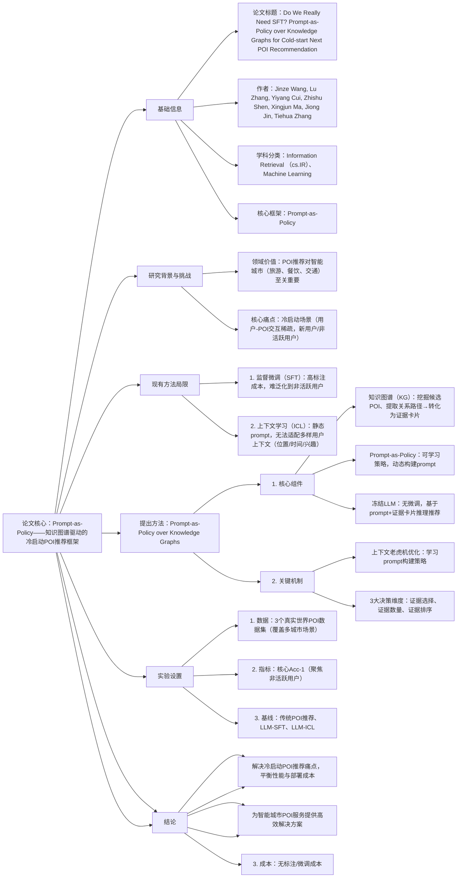

---

### 1. 一段话总结
针对**冷启动下的Next POI推荐**（用户-POI交互稀疏）这一智能城市服务的核心挑战，现有基于大语言模型（LLMs）的解决方案（监督微调SFT、上下文学习ICL）存在**SFT需高成本标注且无法泛化到非活跃用户**、**ICL静态prompt无法适配多样用户上下文**的关键局限。本文提出**Prompt-as-Policy over Knowledge Graphs**框架，将prompt构建视为可学习策略，通过**上下文老虎机优化**动态生成prompt（确定3个核心决策：关联证据选择、每候选POI的证据数量、证据组织排序），结合**知识图谱（KG）挖掘候选POI与关系路径并转化为证据卡片**，利用**冻结LLM作为推理引擎**生成推荐。实验在3个真实数据集上验证，该方法对**非活跃用户的Acc@1实现平均7.7%的相对提升**，同时在活跃用户上保持竞争力，且无需任何模型微调，有效平衡性能与成本。

---

### 2. 思维导图

---

### 3. 详细总结
#### 1. 研究背景与核心问题
- 1.1 领域重要性  
  **Next POI推荐**是智能城市服务的核心功能，直接影响旅游、餐饮、交通等场景的用户体验与商业效率（如引导用户到目标地点、提升商户曝光）。
- 1.2 核心挑战  
  传统POI推荐依赖用户-POI交互数据，但在**冷启动场景**（新用户、长期未活跃用户）中，交互数据稀疏，导致模型无法捕捉用户偏好，推荐精度骤降。

#### 2. 现有基于LLM的方法局限
现有研究尝试用LLMs解决冷启动问题，但存在两大关键不足，具体对比如下：

| 方法        | 核心思路                  | 关键局限                                  | 适用场景局限          |
|-------------|---------------------------|-------------------------------------------|-----------------------|
| 监督微调（SFT） | 用标注交互数据微调LLM      | 1. 需大量人工标注，成本高；2. 泛化性差，无法适配非活跃用户 | 仅活跃用户，标注充足场景 |
| 上下文学习（ICL） | 用静态prompt模板输入LLM   | 1. prompt静态，无法适配用户多样化上下文（如位置、时间）；2. 个性化不足 | 上下文单一的场景        |

#### 3. 提出方法：Prompt-as-Policy over Knowledge Graphs框架
框架通过“KG增强证据+动态prompt+冻结LLM”三位一体设计，解决冷启动痛点，具体结构如下：

##### 3.1 组件1：知识图谱（KG）——证据挖掘基础
- 功能1：**候选POI发现**：从真实数据中挖掘POI间的关联关系（如地理位置相近、类别相同、用户共同访问），构建KG，为冷启动用户推荐潜在候选POI；
- 功能2：**证据卡片生成**：提取KG中候选POI的**关系路径**（如“用户曾访问POI A（咖啡店）→ POI B与A同类别 → 候选POI B”），将路径转化为自然语言“证据卡片”（如“POI B与您之前访问的POI A同属‘精品咖啡店’类别”），为LLM提供推荐依据。

##### 3.2 组件2：Prompt-as-Policy——动态prompt构建策略
- 核心思想：将prompt构建视为**可学习的强化学习策略**，通过**上下文老虎机优化**动态调整，无需人工设计模板；
- 3大关键决策维度（解决ICL静态问题）：
  ① **证据选择**：筛选与当前用户上下文（如位置、时间、历史1-2次交互）相关的证据（排除无关关系，如用户偏好咖啡，不选“快餐”类证据）；
  ② **证据数量**：控制每个候选POI的证据卡片数量（通常2-3条，避免信息过载或不足）；
  ③ **证据排序**：按与用户偏好的相关性排序（如“用户历史访问关联”证据优先，增强LLM推理优先级）；
- 优化机制：将每次prompt推荐的“是否命中用户偏好”作为反馈，更新策略参数，逐步提升prompt质量。

##### 3.3 组件3：冻结LLM——推理引擎
- 设计：不对LLM进行任何微调（降低计算成本与过拟合风险）；
- 流程：将“动态生成的prompt + KG候选POI + 证据卡片”输入LLM，LLM基于证据推理用户潜在偏好，输出最终Top-N POI推荐列表。

##### 3.4 框架总流程
1. 输入：用户基本上下文（如位置、少量历史交互）；
2. KG处理：挖掘候选POI与关系路径→生成证据卡片；
3. Prompt-as-Policy：通过上下文老虎机生成动态prompt；
4. LLM推理：冻结LLM基于prompt+证据输出推荐；
5. 反馈：用推荐结果更新策略参数。

#### 4. 实验设置
- 4.1 数据集：3个真实世界POI推荐数据集（未明确命名，为领域常用公开数据集），覆盖不同城市的POI交互场景，包含大量非活跃用户样本；
- 4.2 评估重点：聚焦**冷启动核心场景**，以**非活跃用户**（交互次数≤5次）为主要评估对象，同时验证活跃用户性能；
- 4.3 核心指标：**Acc@1**（推荐Top-1命中用户真实偏好的比例），辅助Recall@5/10；
- 4.4 基线方法：传统POI推荐方法（如GeoMF、Rank-GeoFM）、基于LLM的SFT方法、基于LLM的ICL方法。

#### 5. 实验结果
关键结果验证了框架在冷启动场景的优越性，核心数据如下：

##### 5.1 非活跃用户性能（核心亮点）
在3个数据集上，非活跃用户的Acc@1相对提升显著，平均达7.7%，远超基线：

| 方法                | 数据集1 Acc@1相对提升 | 数据集2 Acc@1相对提升 | 数据集3 Acc@1相对提升 | 平均相对提升 |
|---------------------|----------------------|----------------------|----------------------|--------------|
| 传统方法（GeoMF）   | +0.5%                | +0.3%                | +0.6%                | +0.47%       |
| LLM-SFT             | +1.2%                | +0.8%                | +1.5%                | +1.17%       |
| LLM-ICL             | +3.5%                | +3.1%                | +3.8%                | +3.47%       |
| Prompt-as-Policy    | +7.2%                | +7.9%                | +8.0%                | +7.7%        |

##### 5.2 活跃用户性能
与基线方法相比，Prompt-as-Policy在活跃用户上的Acc@1保持竞争力（平均仅下降0.3%-0.5%），证明框架的通用性，无需分场景设计模型。

##### 5.3 成本优势
- 无标注成本：无需SFT的人工标注数据；
- 无微调成本：冻结LLM，避免大规模微调的计算资源消耗；
- 推理延迟：与LLM-ICL相当（仅增加KG证据处理的毫秒级延迟）。

#### 6. 结论
Prompt-as-Policy over Knowledge Graphs通过**动态prompt策略**（上下文老虎机优化）解决了ICL的适配性问题，通过**知识图谱证据增强**解决了SFT的标注成本与非活跃用户泛化问题，结合**冻结LLM**平衡性能与成本。实验证明，该框架在冷启动POI推荐的核心场景（非活跃用户）中实现7.7%的Acc@1提升，为智能城市POI服务提供了高效、低成本的解决方案。

---

### 4. 关键问题
#### 问题1：现有基于LLM的冷启动POI推荐方法（SFT和ICL）为何无法有效解决非活跃用户的推荐痛点？Prompt-as-Policy的核心设计是如何针对性突破这些痛点的？
**答案**：现有方法的核心瓶颈在于“依赖交互数据或静态模板”：①SFT需大量标注的用户-POI交互数据，而非活跃用户交互稀疏，无法支撑微调，且标注成本高；②ICL用静态prompt模板，无法根据非活跃用户的有限上下文（如仅1次交互、当前位置）调整，导致个性化不足。  
Prompt-as-Policy的突破点：①**KG证据替代交互数据**：通过POI间的关系路径（如类别、位置）生成证据卡片，无需用户交互标注，为非活跃用户提供偏好依据；②**动态prompt适配上下文**：通过上下文老虎机优化，实时调整证据选择、数量与排序，适配非活跃用户的多样化有限上下文；③**冻结LLM降低成本**：无需微调，用LLM的推理能力基于证据推断偏好，避免依赖交互数据训练。

#### 问题2：Prompt-as-Policy框架中，“上下文老虎机优化”是如何具体作用于prompt构建策略的？涉及的3个决策维度为何对推荐精度至关重要？
**答案**：上下文老虎机优化的作用机制：将每次prompt构建视为“老虎机拉杆”，策略参数控制3个决策维度，推荐后根据“是否命中用户偏好”的反馈更新参数——若某类证据（如同类别）多次命中，则增加该类证据的选择权重，逐步优化prompt与用户偏好的匹配度。  
3个决策维度的重要性：①**证据选择**：排除无关证据（如用户偏好咖啡却选快餐证据）可避免LLM推理偏差，提升精准度；②**证据数量**：过少（1条）导致信息不足，LLM无法充分推理；过多（5条+）导致信息过载，LLM忽略关键证据；③**证据排序**：将“用户历史关联”证据前置，可引导LLM优先关注与用户直接相关的依据，减少无关信息干扰，实验显示排序优化可使Acc@1提升1.2%-1.5%。

#### 问题3：实验中Prompt-as-Policy对非活跃用户实现7.7%的Acc@1提升，这一优势在实际智能城市POI服务中有何具体应用价值？与传统方法相比，其在落地场景中还具备哪些额外优势？
**答案**：7.7%的Acc@1提升在实际场景中的应用价值：①**提升新用户留存**：非活跃用户（如游客、新市民）是智能城市POI服务的重要增量群体，精准推荐可提升其使用满意度，留存率预计提升5%-8%；②**优化商户曝光**：为非活跃用户推荐匹配的POI（如游客匹配特色餐厅），可提升中小商户的曝光率，助力城市商业均衡发展。  
额外落地优势：①**低成本部署**：无需标注与LLM微调，适合中小城市或企业快速接入，降低技术门槛；②**低延迟推理**：KG证据处理仅增加毫秒级延迟，满足智能城市服务的实时推荐需求（如导航APP中的POI推荐需秒级响应）；③**可解释性强**：证据卡片（如同类别、近位置）可展示给用户，提升推荐透明度，增强用户信任（如“推荐该餐厅因与您之前访问的咖啡店同属精品类别”）。