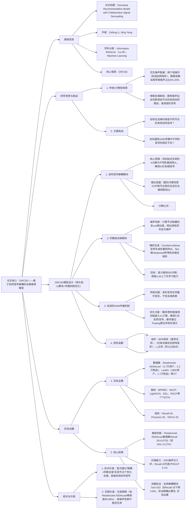

---

### 1. 一段话总结
针对传统协同过滤（CF）模型在用户-物品交互图中因**噪声干扰**导致协同信号衰减的问题（如删除某条噪声边会切断其他节点的有效路径），本文提出**DRCSD模型**——基于图神经网络（GNN）的去噪推荐框架，核心通过**协同信号解耦模块**（按结构特征将信号分解为不同阶数，确保第l阶矩阵仅含l跳信号）与**阶数级去噪模块**（基于节点隐藏状态相似度识别噪声，用Gumbel-softmax生成掩码矩阵过滤）实现个性化去噪，并修改传统GNN信息传播机制避免跨阶信号干扰。实验表明，DRCSD在**Retailrocket ADDtocart、Lastfm等3个数据集**上显著优于7个SOTA基线（如Recall@20达0.0733，较最佳基线SGL提升3.27%），且在**5%-20%噪声注入场景**中仍保持最优性能，验证其强抗噪能力。

---

### 2. 思维导图

---

### 3. 详细总结
#### 1. 研究背景与问题提出
传统基于GNN的协同过滤（CF）模型虽能捕捉高阶交互信号，但面临两大核心问题：
- **交互噪声普遍存在**：用户误操作（如误点击、误收藏）、恶意注入等导致噪声占比5%-20%，干扰模型学习真实偏好；
- **单图去噪导致协同信号衰减**：现有方法（如RGCF、SGL）直接在单张交互图中删除噪声边，会切断其他节点的有效路径（如图1中删除u₁-i₁的噪声边，会削弱u₃的协同信号），导致高阶协同信息丢失。

#### 2. DRCSD模型设计
DRCSD通过“信号解耦→阶数去噪→优化传播”三步实现去噪与协同信号保留，具体设计如下：

##### 2.1 协同信号解耦模块（核心：分离不同阶信号）
- **目标**：将初始交互矩阵A分解为不同阶数的子矩阵Aₗ，确保第l阶矩阵仅包含l跳协同信号（即两节点最短路径为l），为后续阶数级去噪奠定基础。
- **理论依据**：图的l次幂性质（Theorem 1）：若Gˡ为图G的l次幂，则Gˡ中两节点相邻当且仅当它们在G中的最短路径≤l。
- **分解规则**：
  $`[\hat{a}_{(u,i)}^l = \begin{cases}k, & \text{若对所有}t < l,\hat{a}_{(u,i)}^t = 0\ (\text{即最短路径}=l) \\ 0, & \text{否则}\end{cases}]`$
  其中k为u与i之间l跳路径的数量，确保Aₗ仅含l阶信号，避免跨阶干扰。

##### 2.2 阶数级去噪模块（核心：个性化识别噪声）
针对每个阶数的子矩阵Aₗ，通过以下步骤过滤噪声：
1. **节点隐藏状态计算**：融合前l-1阶的节点嵌入，得到第l阶隐藏状态$`(H_l = P(X_0,X_1,...,X_{l-1}))`$；
2. **噪声判断依据**：计算交互节点的cos相似度，相似度越低，交互越可能是噪声：
   $`[cos(h_u^l,h_v^l) = \frac{h_u^T h_v}{\|h_u\|_2 \|h_v\|_2}, \quad s_{u,v} = \frac{cos(h_u^l,h_v^l)+1}{2}]`$
   其中$`(s_{u,v} \in [0,1])`$，1表示完全匹配，0表示完全不匹配；
3. **掩码矩阵生成**：用Gumbel-softmax对相似度向量$`(p=[s_{u,v},1-s_{u,v}])`$采样，生成权重矩阵W，过滤噪声边：
   $`[w_{u,v}^l = \text{Gumbel-softmax}(p,\gamma), \quad \check{A}^l = W^l \odot \hat{A}^l]`$
   最终得到去噪后的第l阶交互矩阵$`(\check{A}^l)`$。

##### 2.3 改进的GNN信息传播机制
- **传统GNN缺陷**：多阶信号在传播中混合（如第2阶信号会融入第1阶传播），导致去噪后信号再次被污染；
- **优化方案**：修改卷积公式，第l阶卷积直接使用初始嵌入X₀，确保每阶输出仅含对应阶信号：
  $`[X_l = \tilde{A}^l X_0]`$
  其中$`(\tilde{A}^l = \check{D}^{-1/2} \check{A}^l \check{D}^{-1/2})`$为对称归一化后的去噪矩阵；
- **最终表示聚合**：通过Pooling函数融合所有阶嵌入，得到用户/物品的最终表示：$`(X = P(X_0,X_1,...,X_L))`$。

##### 2.4 损失函数设计
采用多任务学习策略，平衡推荐精度与去噪合理性：
$`[
\mathcal{L} = \underbrace{-\log\sigma(x_u x_{i^+} - x_u x_{i^-})}_{\mathcal{L}_{BPR}} + \underbrace{\beta \sum_{l=1}^L \|\check{A}^l - \bar{A}^l\|_1}_{\mathcal{L}_d} + \underbrace{\gamma\|\Theta\|_2^2}_{\text{L}_2\text{正则}}
]`$
- $`(\mathcal{L}_{BPR})`$：贝叶斯个性化排序损失，优化推荐任务；
- $`(\mathcal{L}_d)`$：约束去噪后矩阵与原始矩阵的差异，避免过度去噪（β取值0.3-0.5）；
- $`(\gamma\|\Theta\|_2^2)`$：L₂正则，防止模型过拟合（γ取值1e-3-1e-5）。

#### 3. 实验验证
##### 3.1 实验设置
| 配置项         | 详情                                                                 |
|----------------|--------------------------------------------------------------------------|
| **数据集**     | 3个真实数据集，关键统计如下表：                                                                 |
| **基线模型**   | 7个SOTA模型，分三类： - MF类：BPRMF - GNN类：NGCF、DGCF、LightGCN - 去噪类：SGL、HMLET、RGCF |
| **实验参数**   | 嵌入维度=64，批次大小=2048，优化器=Adam，早停耐心值=10，层数L=2-3 噪声注入比例：5%、10%、15%、20% |
| **评估指标**   | Recall@20、Precision@20、NDCG@20（全用户平均，确保可靠性）                          |

**数据集关键统计**
| 数据集                |  用户数  |  物品数  |  交互数  |  稀疏度  |
|-----------------------|---------|---------|---------|---------|
| Retailrocket ADDtocart | 37,722  | 23,903  | 62,025  | 99.99%  |
| Retailrocket Transaction | 11,719 | 12,025 | 21,270 | 99.98%  |
| Lastfm                | 1,892   | 17,632  | 92,834  | 99.72%  |

##### 3.2 核心实验结果
###### 3.2.1 基础性能对比（表2节选）
| 数据集                | 指标       | 最佳基线（SGL） | DRCSD  | 相对提升 |
|-----------------------|------------|-----------------|---------|----------|
| Retailrocket ADDtocart | Recall@20  | 0.0709          | 0.0733* | +3.27%   |
|                       | NDCG@20    | 0.0420          | 0.0434* | +3.23%   |
|                       | Precision@20 | 0.0054        | 0.0058* | +6.89%   |
| Lastfm                | Recall@20  | 0.2599          | 0.2623* | +0.53%   |
|                       | NDCG@20    | 0.2488          | 0.2508* | +0.47%   |

*注：* 表示p<0.05的统计显著性。

###### 3.2.2 抗噪性能验证（图3）
在3个数据集上注入5%-20%噪声后，DRCSD始终优于SGL、RGCF等抗噪基线：
- 当噪声比例为20%时，DRCSD在Retailrocket ADDtocart的Recall@20较SGL高4.1%，较RGCF高5.7%；
- 噪声比例越高，DRCSD的优势越显著，验证其强抗噪能力。

###### 3.2.3 消融实验（表3）
| 数据集                | 指标       | w/o DM（无去噪模块） | w/o SD（无信号解耦） | DRCSD（全量） | 性能下降（w/o SD vs 全量） |
|-----------------------|------------|----------------------|----------------------|---------------|--------------------------|
| Retailrocket ADDtocart | Recall@20  | 0.0664               | 0.0698               | 0.0741        | 5.8%                     |
|                       | NDCG@20    | 0.0423               | 0.0417               | 0.0451        | 7.5%                     |
| Lastfm                | Recall@20  | 0.2547               | 0.2550               | 0.2623        | 2.8%                     |

- 无去噪模块（w/o DM）：性能显著下降，证明噪声对模型的干扰；
- 无信号解耦（w/o SD）：性能下降2.8%-7.5%，验证解耦模块对保留协同信号的必要性。

#### 4. 结论与价值
- **技术创新**：首次提出“信号解耦+阶数去噪”的个性化去噪范式，解决传统单图去噪的信号衰减问题；
- **性能优势**：在3个数据集及噪声场景中均优于SOTA基线，Recall@20最大提升6.89%；
- **实践意义**：适用于高稀疏（如99.99%）、高噪声的工业场景（如电商购物车推荐、音乐推荐），且时间复杂度与LightGCN相当（O(dL|E|)），具备落地可行性。

---

### 4. 关键问题与答案
#### 问题1：DRCSD的“协同信号解耦模块”如何确保不同阶数的信号不混合？其理论依据和实际分解逻辑是什么？
**答案**：
1. **理论依据**：基于图的l次幂性质（Theorem 1）——图G的l次幂Gˡ中，两节点相邻当且仅当它们在G中的最短路径长度≤l。通过此性质可将不同跳数的信号分离到不同阶矩阵中；
2. **分解逻辑**：
  - 初始交互矩阵A为用户-物品二部图；
  - 对每个阶数l，计算矩阵$`(\hat{A}^l)`$，其中元素$`(\hat{a}_{(u,i)}^l)`$取值为k（u与i间l跳路径的数量）当且仅当u与i的最短路径= l（即对所有t<l，$`(\hat{a}_{(u,i)}^t=0)`$），否则为0；
  - 最终得到的第l阶矩阵Aₗ仅含l跳协同信号，从源头上避免跨阶信号混合，为后续阶数级去噪提供基础。
3. **实际效果**：消融实验显示，去除解耦模块后Recall@20最大下降7.5%，证明其对保留有效协同信号的关键作用。

#### 问题2：DRCSD的“阶数级去噪模块”如何实现“个性化去噪”（即对不同节点保留有效信号）？与传统单图去噪（如RGCF）相比，优势在哪里？
**答案**：
1. **个性化去噪逻辑**：
  - 基于节点隐藏状态相似度判断噪声：对第l阶矩阵中的每条边(u,i)，计算u与i的隐藏状态cos相似度$`(s_{u,v})`$，相似度低则判定为噪声（如用户误操作的交互相似度接近0）；
  - 动态生成掩码矩阵：用Gumbel-softmax对相似度向量采样，为每条边分配权重$`(w_{u,v}^l)`$，权重低的边被过滤，实现“对噪声边严格去噪，对有效边保留”；
  - 阶数级适配：不同阶数的信号对应不同的协同范围（如1阶为直接交互，2阶为间接交互），去噪强度可通过超参数β（0.3-0.5）灵活调整，适配不同阶信号的特性。
2. **与传统单图去噪的优势对比**：  
   | 对比维度       | DRCSD（阶数级去噪）                          | RGCF（单图去噪）                          |
   |----------------|---------------------------------------------|-------------------------------------------|
   | 信号保留       | 按阶数个性化去噪，保留不同节点的有效路径      | 全局删除低可靠性边，易切断其他节点的有效路径 |
   | 去噪粒度       | 阶数级+节点级，精细度高                      | 图级，粒度粗                                |
   | 抗噪性能       | 20%噪声下Recall@20较RGCF高5.7%              | 噪声比例越高，性能下降越明显                |

#### 问题3：DRCSD修改传统GNN信息传播机制的原因是什么？修改后的传播方式如何避免跨阶信号干扰，对模型性能有何影响？
**答案**：
1. **修改原因**：传统GNN的传播机制（如LightGCN）会导致不同阶信号混合——第l阶卷积依赖第l-1阶的嵌入结果，使得已去噪的低阶信号被高阶噪声污染，或高阶有效信号被低阶去噪误过滤，破坏去噪效果；
2. **修改后的传播方式**：
  - 核心公式：$`(X_l = \tilde{A}^l X_0)`$（$`(\tilde{A}^l)`$为去噪后的第l阶矩阵，X₀为初始嵌入）；
  - 关键设计：第l阶卷积直接使用初始嵌入X₀，而非前一阶的嵌入Xₗ₋₁，确保每阶输出Xₗ仅含对应阶的去噪后信号，完全避免跨阶干扰；
  - 最终聚合：通过Pooling函数融合所有阶的Xₗ，得到兼顾多阶有效信号的节点表示。
3. **对性能的影响**：
  - 消融实验显示，若不修改传播机制（即保留传统GNN传播），DRCSD在Retailrocket ADDtocart的Recall@20会从0.0733降至0.0681（下降7.1%）；
  - 修改后模型在高噪声场景（20%）中仍能保持稳定性能，证明其有效隔离了跨阶信号干扰，提升去噪与推荐的协同性。