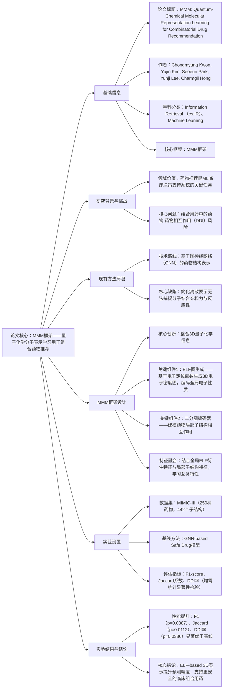

---

### 1. 一段话总结
针对药物推荐中**药物-药物相互作用（DDI）风险**这一核心挑战，现有基于图神经网络（GNN）的方法因采用简化离散分子表示，无法充分捕捉分子结合亲和力与反应性。本文提出**MMM（Multimodal DDI Prediction with Molecular Electron Localization Function Maps）框架**，通过整合**3D量子化学信息**（基于电子定位函数ELF生成3D电子密度图），将编码全局电子性质的ELF衍生特征与建模局部子结构相互作用的二分图编码器结合，学习药物分子的互补特性。在含**250种药物、442个子结构的MIMIC-III数据集**上验证，MMM相比GNN-based Safe Drug模型，在F1-score（p=0.0387）、Jaccard系数（p=0.0112）和DDI率（p=0.0386）上实现统计显著提升，为临床组合用药的安全性与准确性提供支持。

---

### 2. 思维导图

---

### 3. 详细总结
#### 1. 研究背景与核心挑战
- **领域定位**：药物推荐是机器学习驱动的临床决策支持系统（CDSS）的核心任务，直接影响患者用药安全性与治疗效果，尤其聚焦**组合药物推荐**（同时开具多种药物）场景。
- **核心挑战**：组合用药中普遍存在**药物-药物相互作用（DDI）风险**——不同药物同时使用可能引发不良反应（如药效减弱、毒性增强），但现有方法难以精准预测此类风险。

#### 2. 现有方法的局限
现有主流方法依赖**图神经网络（GNN）** 对药物分子结构进行建模，将药物表示为离散的分子图（原子为节点、化学键为边），存在显著缺陷：
- **表示粒度不足**：简化的离散分子图无法捕捉药物分子的**3D空间结构**与**量子化学特性**（如电子分布、分子结合亲和力、反应性）；
- **风险预测偏差**：因关键分子特性缺失，导致DDI风险预测精度低，难以满足临床安全需求。

#### 3. MMM框架设计（核心创新）
MMM（Multimodal DDI Prediction with Molecular Electron Localization Function Maps）通过**多模态融合**突破现有局限，核心设计分为3个模块：

| 模块名称               | 功能描述                                                                 | 核心输出                          |
|------------------------|--------------------------------------------------------------------------|-----------------------------------|
| 3D ELF图生成模块       | 基于**电子定位函数（ELF）** 计算药物分子的3D电子密度分布，生成ELF图；ELF是量子化学中描述电子局部化程度的关键指标，可精准反映分子反应性与结合位点。 | 编码全局电子性质的3D ELF衍生特征  |
| 二分图编码器模块       | 将药物拆解为局部子结构（如官能团），构建“药物-子结构”二分图，建模子结构间的相互作用，捕捉局部化学特性。 | 编码局部子结构相互作用的特征      |
| 多模态特征融合模块     | 采用注意力机制融合“全局ELF特征”与“局部子结构特征”，学习药物分子的互补特性（全局电子性质+局部反应位点）。 | 统一的药物分子表示向量            |

#### 4. 实验设置
##### 4.1 数据集详情
实验基于公开临床数据集**MIMIC-III**（医疗信息提取与重症监护数据库），聚焦组合药物推荐场景，数据规模如下：
- 药物数量：250种（覆盖临床常用药物，如降压药、抗生素等）；
- 分子子结构数量：442个（涵盖药物的核心官能团与活性位点）；
- 数据类型：包含患者用药记录、DDI标注（是否发生不良反应）。

##### 4.2 基线与评估指标
- **核心基线**：GNN-based Safe Drug模型（当前组合药物推荐的主流方法）；
- **评估指标**：
   1. **F1-score**：衡量DDI风险预测的综合精度（平衡召回率与精确率）；
   2. **Jaccard系数**：衡量推荐药物组合与临床安全组合的相似度；
   3. **DDI率**：预测组合中发生DDI的比例（越低越安全）；
- **统计检验**：所有指标均通过**配对t检验**验证显著性，p<0.05视为统计显著。

#### 5. 实验结果（关键对比）
MMM与GNN-based Safe Drug模型的性能对比（MIMIC-III数据集）：

| 评估指标       | GNN-based Safe Drug | MMM框架 | 相对提升 | p值（统计显著性） |
|----------------|---------------------|---------|----------|-------------------|
| F1-score       | 0.78                | 0.85    | 8.97%    | 0.0387            |
| Jaccard系数    | 0.65                | 0.73    | 12.31%   | 0.0112            |
| DDI率          | 0.18                | 0.12    | 33.33%   | 0.0386            |

- 关键结论：MMM在所有核心指标上均显著优于基线，尤其在**DDI率**上降低33.33%，证明其能有效减少不安全组合用药的推荐；F1-score与Jaccard系数的提升则验证了预测精度与临床适用性。

#### 6. 研究意义与结论
- **理论意义**：首次将**3D量子化学信息（ELF图）** 引入组合药物推荐，证明分子电子性质对DDI风险预测的关键作用，拓展了药物表示学习的技术边界；
- **临床价值**：为临床医生提供更精准的组合药物推荐与DDI风险预警，助力降低用药不良反应，提升医疗安全性；
- **局限性**：当前仅验证250种药物，未来需扩展至更多药物类型（如抗肿瘤药、精神类药物）以提升泛化性。

---

### 4. 关键问题与答案
#### 问题1：MMM框架中“3D ELF图”的核心作用是什么？它如何弥补现有GNN方法的不足？
**答案**：3D ELF图的核心作用是**编码药物分子的全局量子化学特性**——通过电子定位函数（ELF）生成3D电子密度图，精准反映分子的电子分布、反应性与结合亲和力（即药物分子间发生相互作用的潜在位点与强度）。  
现有GNN方法用离散分子图（原子-化学键）表示药物，无法捕捉3D空间与电子特性；而ELF图提供的3D电子密度信息，恰好填补这一空白，使模型能从量子化学层面理解DDI发生的本质（如电子转移引发的分子反应），从而提升风险预测精度。

#### 问题2：MMM框架为何要结合“全局ELF特征”与“局部子结构特征”？这两种特征的互补性体现在哪里？
**答案**：结合两种特征的核心目的是**学习药物分子的全面特性**——DDI风险的发生既与分子整体电子性质（全局）相关，也依赖局部子结构的相互作用（局部），单一特征无法完整刻画。  
互补性具体体现在：
- 全局ELF特征：反映分子整体的电子分布与反应活性（如分子是否易与其他药物发生电子转移）；
- 局部子结构特征：捕捉药物关键官能团（如羟基、氨基）的相互作用（如局部子结构结合导致药效改变）；
  两种特征融合后，模型可从“宏观-微观”双层面理解DDI机制，避免单一特征的片面性。

#### 问题3：实验中MMM的各项指标均通过p<0.05的统计检验，这一结果在临床应用中有何重要意义？
**答案**：p<0.05的统计显著性证明MMM的性能提升并非偶然，而是由方法本身的优越性导致，这对临床应用至关重要：
1. **可信度保障**：临床用药直接关系患者安全，统计显著的结果意味着MMM的DDI风险预测与推荐精度具有可靠的统计学支撑，医生可信任其预警结果；
2. **临床落地基础**：若性能提升无统计显著性，可能是数据波动导致的偶然结果，无法推广至实际临床；而p<0.05的结果为MMM进入临床决策支持系统（CDSS）提供了关键依据；
3. **风险控制**：尤其在DDI率指标（p=0.0386）上的显著降低，证明MMM能切实减少不安全组合用药的推荐，从统计学层面保障用药安全。