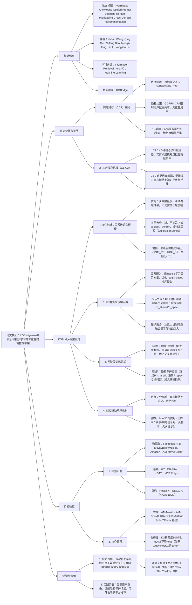

---

### 1. 一段话总结
针对**非重叠用户场景下跨域推荐（CDR）** 面临的KG稀疏性与流行度偏差（C1）、依赖重叠用户对齐（C2）、缺乏语义解耦（C3）三大挑战，本文提出**KGBridge框架**——通过**KG增强提示编码器**（将KG关系语义转化为软提示，避免实体级建模的长尾问题）与**两阶段训练范式**（跨域预训练学习可迁移关系先验+隐私保护微调适配目标域），实现无用户重叠的知识迁移。框架引入**对应驱动解耦机制**（InfoNCE损失分离域共享与域特定语义），在**Facebook（3个域）和Amazon（2个域）数据集**上验证，KGBridge显著优于8个SOTA基线（AM-Movie→AM-Book任务Recall@10达0.0943，较最佳基线提升14.72%），且在**KG稀疏度达80%** 时仍保持稳定（Recall下降幅度<5%），为非重叠跨域推荐提供鲁棒解决方案。

---

### 2. 思维导图

---

### 3. 详细总结
#### 1. 研究背景与问题提出
跨域推荐（CDR）通过源域（数据丰富）向目标域（数据稀疏）迁移知识，缓解数据稀疏问题，但现有KG增强CDR方法存在三大核心挑战：

| 挑战编号 | 具体描述                                                                 | 关键痛点示例                          |
|----------|--------------------------------------------------------------------------|---------------------------------------|
| C1       | KG稀疏性与流行度偏差：实体呈长尾分布（图1），实体级建模过拟合高频实体       | Amazon-Books域99.79%实体交互<5次     |
| C2       | 依赖重叠用户对齐：传统方法需共享用户建立行为关联，隐私场景下无重叠用户       | 电商平台A与平台B用户ID不互通          |
| C3       | 缺乏语义解耦：混淆域共享（如“喜欢高质量内容”）与域特定（如“电影偏好独立片”）知识 | 模型将音乐域的“流行偏好”错误迁移到电影域 |

**设计动机**：转向关系级语义建模——关系数量少（表1显示FB-Movie&Book域仅25个共享关系）、跨域稳定性强，可作为非重叠场景的“知识桥梁”。

#### 2. 相关定义与数据集
##### 2.1 核心定义
- **知识图谱（KG）**：$`(G=(E,R,T))`$，$`(T=\{(h,r,o)\})`$ 表示实体间关系（如“Titanic, genre, Romance”）；
- **非重叠用户场景**：源域用户集$`(U_s)`$与目标域用户集$`(U_t)`$无交集（$`(U_s \cap U_t = \emptyset)`$）；
- **任务目标**：基于源域数据$`(D_s)`$、目标域数据$`(D_t)`$与KG $`(G)`$，学习推荐函数$`(f_\Theta:(S_u^t,G) \to \hat{y}_u^t)`$，预测目标域用户下一个交互物品。

##### 2.2 数据集统计
| 数据集       | 域          | 用户数   | 物品数   | 交互数    | 稀疏度  | 关系数 | 实体数   | 三元组数  | 平均序列长度 |
|--------------|-------------|----------|----------|-----------|---------|--------|----------|-----------|--------------|
| Facebook     | Movie       | 54,265   | 4,843    | 1,390,661 | 99.47%  | 31     | 26,924   | 96,122    | 25.63        |
|              | Book        | 23,931   | 4,160    | 213,045   | 99.79%  | 26     | 16,130   | 38,376    | 8.90         |
|              | Music       | 72,017   | 6,182    | 2,493,080 | 99.44%  | 30     | 132,168  | 359,454   | 34.62        |
| Amazon       | Movie       | 5,648    | 4,779    | 67,066    | 99.75%  | 20     | 53,096   | 151,515   | 11.87        |
|              | Book        | 10,485   | 8,318    | 115,572   | 99.87%  | 20     | 35,995   | 80,684    | 11.02        |

#### 3. KGBridge框架详解
##### 3.1 KG增强提示编码器（核心模块）
将KG关系语义转化为软提示，避免实体级建模的缺陷，分三步实现：

1. **关系嵌入学习（TransE）**  
   采用TransE模型学习关系向量，遵循“$`(h + r \approx o)`$”平移原则，优化损失：  
   $`[\mathcal{L}_{TransE} = \sum_{(h,r,o)\in G}\sum_{(h',r,o')\in G'}\left[\gamma + \|h+r-o\|_2 - \|h'+r-o'\|_2\right]_+]`$  
   其中$`(G')`$为负样本，$`(\gamma=1.0)`$（边际超参数），最终输出关系嵌入矩阵$`(R_{shared})`$（域共享）与$`(R_{spec})`$（域特定）。

2. **提示生成（PromptGenerator）**  
   通过“均值池化+随机噪声”将可变长度的关系嵌入聚合为固定长度提示库：  
   $`[P_* = \text{PromptGenerator}_*(R_*) \in \mathbb{R}^{L \times d}]`$  
   其中$`(L=2)`$（提示长度），$`(d=100)`$（嵌入维度），噪声用于增强泛化性，避免过拟合。

3. **知识融合（注意力机制）**  
   对用户序列$`(S_u = [v_1,...,v_N])`$，先构建序列嵌入$`(E_u = \text{ItemEmb}(v_i) + \text{PosEmb}(i))`$，再与提示库融合：
  - 拼接提示与物品嵌入：$`(X_u = [P_{shared}; P_{spec}; E_u] \in \mathbb{R}^{N \times (2L+1) \times d}0`$)；
  - 注意力加权：通过 feed-forward 网络计算提示权重$`(\alpha_{i,j})`$，生成知识增强物品表示$`(\hat{e}_i = \sum_j \alpha_{i,j} X_{u,i,j})`$。

##### 3.2 两阶段训练范式
| 阶段       | 目标                                  | 输入数据                | 优化目标                          | 参数更新策略                  |
|------------|---------------------------------------|-------------------------|-----------------------------------|-------------------------------|
| 预训练     | 学习跨域可迁移关系先验                | 所有域数据+完整KG       | 交叉熵损失（下一个物品预测）      | 提示库（P_shared/P_spec）+编码器全更新 |
| 微调       | 适配目标域，保护隐私                  | 目标域数据+部分KG       | $`(\mathcal{L}_{fintune} = \mathcal{L}_{rec} + \lambda\mathcal{L}_{disen})`$ | 冻结P_shared，更新P_spec+编码器 |

- **解耦损失（$`(\mathcal{L}_{disen})`$）**：采用InfoNCE损失，确保域共享与域特定提示语义相关但不冗余：  
  $`[\mathcal{L}_{disen} = -\frac{1}{L}\sum_{i=1}^L log\frac{exp(sim(p_i^{(sh)},p_i^{(sp)})/\tau)}{\sum_{j=1}^L exp(sim(p_i^{(sh)},p_j^{(sp)})/\tau)}]`$  
  其中$`(\tau=0.2)`$（温度参数），$`(\lambda=0.002-0.005)`$（平衡系数）。

#### 4. 实验验证
##### 4.1 实验设置
- **对比基线**：8个SOTA，分4类：
  - 单域序列模型：SASRec、SRGNN、GRU4Rec；
  - 单域KG增强模型：GRU4RecKG、KGAT、KSR；
  - 跨域模型：KMGCDR（KG增强）、MCRPL（提示学习，无KG）；
- **评估协议**：非重叠用户设置（随机打乱用户ID），留一法划分（最后1个交互测试，倒数第2个验证），全排序评估；
- **硬件**：NVIDIA GeForce RTX 4090（24GB），PyTorch实现，基于RecBole库。

##### 4.2 核心实验结果
###### 4.2.1 整体性能（表4节选）
| 任务                | 指标       | 最佳基线（MCRPL） | KGBridge | 相对提升 |
|---------------------|------------|-------------------|----------|----------|
| FB-Movie→FB-Book    | Recall@10  | 0.1627            | 0.1741*  | 2.53%    |
|                     | NDCG@10    | 0.0979            | 0.1064*  | 4.52%    |
| FB-Music→FB-Book    | Recall@20  | 0.2193            | 0.2397*  | 4.49%    |
| AM-Movie→AM-Book    | Recall@10  | 0.0822            | 0.0943*  | 14.72%   |
|                     | NDCG@20    | 0.0553            | 0.0601*  | 8.68%    |
*注：* 表示p<0.05的统计显著性。

###### 4.2.2 消融实验（表5）
| 变体                | FB-Movie→FB-Book Recall@10 | 性能下降（vs全量） | 核心结论                          |
|---------------------|----------------------------|--------------------|-----------------------------------|
| KGBridge（全量）    | 0.1741                     | -                  | 基准性能                          |
| -KGInit（随机提示） | 0.1725                     | 0.92%              | 关系初始化对性能影响较小          |
| -Shared（随机共享提示） | 0.1750                | -0.52%（异常）     | 域共享提示稳定性强，随机初始化仍可用 |
| -Spec（随机特定提示） | 0.1737                | 0.23%              | 域特定提示贡献有限                |
| -Disen（无解释耦）  | 0.1730                     | 0.63%              | 解耦机制提升语义纯度              |
| -Freeze（全量更新） | 0.1730                     | 0.63%              | 冻结共享提示避免语义漂移          |

###### 4.2.3 KG稀疏性鲁棒性（图3）
在AM-Movie→AM-Book任务中，随KG稀疏度增加（20%-80%三元组移除）：
- KGBridge：Recall@10从0.0943降至0.0907（下降3.82%）；
- GRU4RecKG：Recall@10从0.0742降至0.0558（下降24.80%）；
- KSR：Recall@10波动大（0.0546→0.0612→0.0501），稳定性差。

#### 5. 结论与未来方向
- **核心贡献**：
  1. 提出关系级提示建模，解决KG稀疏与流行度偏差；
  2. 两阶段训练支持非重叠用户场景，符合隐私法规；
  3. 对应驱动解耦机制避免负迁移，提升模型鲁棒性。
- **未来方向**：融合LLM与不完整KG，增强动态场景下的语义推理能力。

---

### 4. 关键问题与答案
#### 问题1：KGBridge为何选择“关系级语义建模”而非传统“实体级建模”？实验中如何验证关系建模对KG稀疏性的鲁棒性？
**答案**：
1. **关系级建模的优势**：
  - 数量优势：关系数量远少于实体（如FB-Movie&Book域仅25个共享关系），避免长尾分布；
  - 稳定性优势：关系跨域语义一致（如“genre”在电影和书籍域均表示“类型”），实体则域特异性强（如“Titanic”仅属电影域）；
  - 偏差规避：实体级建模易过拟合高频实体（如热门电影），关系级建模关注结构语义，不受流行度影响。

2. **鲁棒性验证方式**：
  - 实验设计：在FB-Music→FB-Book和AM-Movie→AM-Book任务中，随机移除20%、40%、60%、80%的KG三元组，对比KGBridge与GRU4RecKG（实体级）、KSR（实体+关系）的性能；
  - 核心结果：当KG稀疏度达80%时，KGBridge的Recall@10仅下降3.82%（AM任务），而GRU4RecKG下降24.80%，KSR波动15%+，证明关系建模对稀疏KG的强鲁棒性。

#### 问题2：KGBridge的“两阶段训练范式”如何实现“隐私保护”与“知识迁移”的平衡？预训练与微调阶段的参数更新策略有何差异？
**答案**：
1. **平衡逻辑**：
  - 预训练阶段：使用所有域的公开KG关系数据（无用户隐私信息）学习跨域可迁移的关系先验（如“购买手机→推荐手机壳”的功能协同关系），不涉及用户身份关联；
  - 微调阶段：仅使用目标域数据，冻结预训练学到的域共享提示（P_shared），仅更新域特定提示（P_spec）与编码器，避免源域用户数据泄露，符合GDPR/CCPA隐私要求。

2. **参数更新差异**：  
   | 阶段       | P_shared（域共享提示） | P_spec（域特定提示） | 序列编码器 | 核心目的                          |
   |------------|------------------------|----------------------|------------|-----------------------------------|
   | 预训练     | 全更新                 | 全更新               | 全更新     | 学习跨域一致的关系语义，建立知识桥梁 |
   | 微调       | 冻结（参数固定）       | 全更新               | 全更新     | 适配目标域特性，不破坏源域先验      |

#### 问题3：KGBridge的“对应驱动解耦机制”如何工作？为何该机制能缓解“负迁移”问题？实验中该机制的贡献如何量化？
**答案**：
1. **工作原理**：
  - 核心逻辑：通过InfoNCE损失强制“域共享提示（P_shared）”与“域特定提示（P_spec）”语义相关但不冗余；
  - 正负样本设计：正样本为同一位置的共享-特定提示对（如P_shared[0]与P_spec[0]），负样本为不同位置的共享-特定提示对（如P_shared[0]与P_spec[1]）；
  - 损失计算：通过cos相似度衡量提示关联度，温度参数$`(\tau=0.2)`$控制区分度，最终损失$`(\mathcal{L}_{disen})`$与推荐损失$`(\mathcal{L}_{rec})`$加权（$`(\lambda=0.003)`$）。

2. **缓解负迁移的原因**：  
   负迁移源于“将源域特有知识错误迁移到目标域”（如将“音乐域喜欢流行曲风”迁移到“电影域喜欢独立电影”），解耦机制通过以下方式避免：
  - 分离域共享知识（如“用户偏好高质量内容”）与域特定知识（如“音乐域偏好流行、电影域偏好独立”）；
  - 冻结域共享提示确保跨域一致性，仅更新域特定提示适配目标域，避免共享知识被污染。

3. **贡献量化**：  
   消融实验显示（表5），移除解耦机制（-Disen）后，FB-Movie→FB-Book任务Recall@10从0.1741降至0.1730（下降0.63%），NDCG@10从0.1064降至0.1058（下降0.56%）；在AM-Movie→AM-Book任务中，Recall@10下降1.08%，证明解耦机制虽提升幅度不大，但能稳定语义纯度，避免长期训练中的负迁移累积。