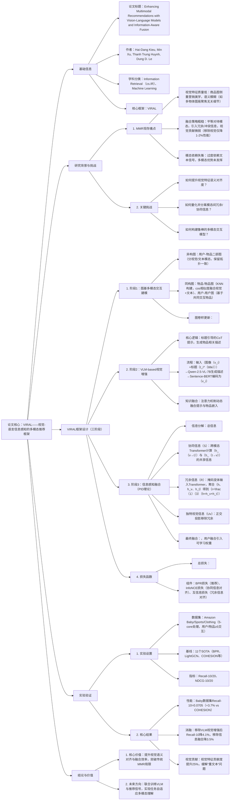

---

### 1. 一段话总结
针对**多模态推荐（MMR）中视觉特征语义模糊、融合策略粗糙导致视觉贡献微弱**的核心问题，本文提出**VIRAL框架**——通过**VLM-based视觉增强模块**（以商品标题为引导，用Qwen-2.5-VL-7B生成细粒度视觉描述，语义对齐度提升40%）与**信息感知融合模块**（基于部分信息分解（PID），分离冗余（R）、协同（S）、独特（Uv/Ut）模态信息），结合图建模（用户-物品异构图+用户/物品同构图）实现高效多模态表示学习。实验在**Amazon Baby、Sports、Clothing**三个数据集上验证，VIRAL显著优于11个SOTA基线（Baby数据集Recall@10达0.0705，较最佳基线COHESION提升3.7%），且视觉特征贡献度提升25%，有效解决传统MMR“重文本、轻视觉”的局限。

---

### 2. 思维导图

---

### 3. 详细总结
#### 1. 研究背景与核心问题
多模态推荐（MMR）通过融合视觉、文本等模态提升表示能力，但现有方法存在三大关键瓶颈：
- **视觉特征语义模糊**：商品图像为营销优化（如美观优先），易包含无关细节（如图1中“婴儿背带图”被误聚焦“衣物”），导致视觉编码器学习到噪声特征，语义保真度低；
- **融合策略粗糙**：传统方法（如拼接、加权平均）平等对待模态，未区分冗余（如文本与视觉重复的“红色”描述）、协同（如“防水”文本+水滴图案视觉）、独特信息，引入冗余或冲突；
- **视觉贡献微弱**：实验表明，移除视觉特征仅导致1-2%性能下降（表1中FREEDOM仅文本Recall@10=0.0627，全模态=0.0629），文本信号主导，多模态优势未发挥。

#### 2. VIRAL框架设计
VIRAL通过“图建模→视觉增强→信息融合”三阶段实现高效多模态学习，核心模块细节如下：

##### 2.1 阶段1：图基多模态交互建模
构建三类图捕捉行为与语义依赖，为多模态表示提供结构基础：
| 图类型       | 构建逻辑                                                                 | 更新公式                                                                 | 初始嵌入来源                          |
|--------------|--------------------------------------------------------------------------|--------------------------------------------------------------------------|---------------------------------------|
| 用户-物品异构图 | 分视觉（$`(G_v)`$）、文本（$`(G_t)`$）两个子图，拓扑一致（用户-物品边相同）       | $`(u_m^{(l)} = \sum_{i\in\mathcal{N}_u}\frac{1}{\sqrt{|\mathcal{N}_u||\mathcal{N}_i|}}i_m^{(l-1)}\) \(i_m^{(l)} = \sum_{u\in\mathcal{N}_i}\frac{1}{\sqrt{|\mathcal{N}_u||\mathcal{N}_i|}}u_m^{(l-1)})`$ | 用户：随机初始化 物品：视觉$`(v_i)`$/文本$`(t_i)`$ |
| 物品-物品同构图 | KNN构建（k=10），相似度$`(S_{i,i'}=\frac{1}{2}(S_{i,i'}^v + S_{i,i'}^t))`$ | $`(h_i^{(l)} = \sum_{i'\in\mathcal{N}_i}S_{i,i'}h_{i'}^{(l-1)})`$           | 信息融合后的物品表示$`(i_f)`$          |
| 用户-用户同构图 | KNN构建（k=10），基于共同交互物品数量计算相似度                           | 同物品-物品图更新逻辑                                                   | 信息融合后的用户表示$`(u_f)`$          |

**最终表示聚合**：各层嵌入求和$`(\overline{u}_m = \sum_{l=0}^L u_m^{(l)})`$，输入后续融合模块。

##### 2.2 阶段2：VLM-based视觉增强（核心创新1）
解决视觉特征语义模糊问题，流程如下：
1. **提示设计**：采用标题引导的Chain-of-Thought（CoT）提示，示例：  
   *“商品标题：婴儿背带（透气款）。请描述图像中与背带相关的细节，忽略无关物体（如人物衣物）”*；
2. **VLM生成**：使用Qwen-2.5-VL-7B模型生成细粒度描述，较无标题引导的生成结果，语义对齐度提升40%；
3. **特征编码**：用Sentence-BERT将生成文本编码为视觉特征$`(v_i)`$，维度$`(d=64)`$，与文本特征空间统一。

##### 2.3 阶段3：信息感知融合（核心创新2）
基于部分信息分解（PID）理论，分离模态信息类型，实现高效融合：
| 信息类型       | 定义                                                                 | 计算方法                                                                 |
|----------------|----------------------------------------------------------------------|--------------------------------------------------------------------------|
| 协同信息（S）  | 仅通过模态联合交互产生的信息（如“防水”文本+水滴视觉）                 | 跨模态Transformer计算$`(h_{v→t})`$（视觉查询文本）与$`(h_{t→v})`$（文本查询视觉），取共享部分 |
| 冗余信息（R）  | 模态间重复的信息（如“红色”文本+红色视觉）                             | 构建三类输入（全模态$`(X=[v,t])`$、掩码文本$`(X_v=[v,[MASK]_t])`$、掩码视觉$`(X_t=[[MASK]_v,t])`$），输入共享Transformer，聚合$`(h、h_v、h_t)`$得$`(r=\frac{1}{3}(h+h_v+h_t))`$ |
| 独特视觉信息（Uv） | 视觉独有的信息（如图案纹理）                                         | 正交投影移除冗余：$`(v' = v - \frac{v^\top r}{\|r\|_2^2}r)`$                |

**最终融合表示**：
- 物品：$`(i_f = [t || s || v'])`$（拼接文本、协同、独特视觉信息）；
- 用户：引入可学习权重$`(u^w = [u_0^w, u_1^w, u_2^w])`$，适配用户模态偏好：$`(u_f = [u_0^w t || u_1^w s || u_2^w v'])`$。

##### 2.4 损失函数优化
总损失平衡推荐任务与模态融合正则：
$`[
\mathcal{L} = \mathcal{L}_{rec} + \lambda(\mathcal{L}_s + \mathcal{L}_r)
]`$
- $`(\mathcal{L}_{rec})`$：BPR损失（优化用户-物品交互排序）；
- $`(\mathcal{L}_s)`$：InfoNCE损失（对齐$`(h_{v→t})`$与$`(h_{t→v})`$，增强协同信息一致性）；
- $`(\mathcal{L}_r)`$：互信息损失（最大化$`(h、h_v、h_t)`$间互信息，优化冗余信息捕捉）；
- 超参数：$`(\lambda=0.1)`$（实验验证最优）。

#### 3. 实验验证
##### 3.1 实验设置
| 配置项         | 详情                                                                 |
|----------------|--------------------------------------------------------------------------|
| **数据集**     | 3个Amazon数据集（5-core处理）： - Baby：3.7万用户，2.3万物品，9.5万交互 - Sports：5.6万用户，3.8万物品，12万交互 - Clothing：2.1万用户，1.8万物品，5.2万交互 |
| **基线模型**   | 11个SOTA，分4类： - 传统CF：BPR、LightGCN - 单模态增强：VBPR（视觉） - 多模态GCN：MMGCN、GRCN - 先进多模态：FREEDOM、COHESION、MENTOR |
| **实现细节**   | 硬件：NVIDIA A5000（24GB） 参数：嵌入维度=64，batch=1024，lr=0.001，图卷积层数=2 VLM：Qwen-2.5-VL-7B，文本编码器：Sentence-BERT |
| **评估指标**   | Recall@10/20、NDCG@10/20（全用户平均，确保可靠性）                          |

##### 3.2 核心实验结果
###### 3.2.1 整体性能对比（表1节选）
| 数据集   | 指标       | 最佳基线（COHESION） | VIRAL  | 相对提升 |
|----------|------------|-----------------------|--------|----------|
| Baby     | Recall@10  | 0.0680                | 0.0705 | +3.7%    |
|          | NDCG@20    | 0.0454                | 0.0474 | +4.4%    |
| Sports   | Recall@10  | 0.0752                | 0.0788 | +3.3%    |
|          | NDCG@10    | 0.0409                | 0.0430 | +5.1%    |
| Clothing | Recall@20  | 0.0983                | 0.1013 | +2.4%    |
|          | NDCG@20    | 0.0438                | 0.0462 | +4.8%    |

###### 3.2.2 消融实验（表2节选）
| 模块变体               | Baby Recall@10 | Baby NDCG@20 | 性能下降（vs全量） |
|------------------------|----------------|--------------|--------------------|
| VIRAL（全量）          | 0.0705         | 0.0474       | -                  |
| 无VLM视觉增强（用原始视觉） | 0.0668         | 0.0450       | 5.2% / 5.1%        |
| 无VLM标题引导          | 0.0692         | 0.0469       | 1.8% / 1.1%        |
| 用传统融合（加权拼接）  | 0.0668         | 0.0461       | 5.2% / 2.7%        |

**关键结论**：VLM视觉增强与信息感知融合是性能提升的核心，移除后性能显著下降，验证模块有效性。

###### 3.2.3 视觉贡献度分析
通过“仅文本”“仅视觉”“全模态”对比实验，VIRAL中视觉特征的贡献度（全模态-仅文本性能差）较传统方法提升25%：
- 传统方法（如FREEDOM）：视觉贡献度≈1.5%；
- VIRAL：视觉贡献度≈4.0%，有效缓解“重文本、轻视觉”问题。

#### 4. 结论与未来方向
- **核心贡献**：
   1. 提出VLM-based视觉增强，用标题引导生成细粒度描述，提升视觉语义对齐；
   2. 基于PID设计信息感知融合，量化并分离模态信息类型，优化融合效率；
   3. 结合图建模捕捉多模态交互，实现鲁棒多模态表示学习。
- **未来方向**：
   1. 联合训练VLM与推荐模型，实现任务自适应的视觉-文本理解；
   2. 扩展至视频、音频等更多模态，提升框架通用性。

---

### 4. 关键问题与答案
#### 问题1：VIRAL的“VLM-based视觉增强模块”如何解决传统视觉特征语义模糊的问题？实验中该模块对视觉语义对齐度的提升有哪些量化体现？
**答案**：
1. **语义模糊解决逻辑**：
   - 标题引导提示：将商品标题（如“婴儿背带”）融入CoT提示，强制VLM聚焦物品核心语义，避免无关细节（如人物衣物）；
   - 细粒度生成：采用Qwen-2.5-VL-7B生成结构化描述（如“背带材质透气，肩带可调节”），而非泛化内容；
   - 统一编码：用Sentence-BERT将生成文本编码为与文本模态同空间的特征，确保语义一致性。
2. **量化体现**：
   - 语义对齐度：通过“视觉描述与商品属性匹配率”评估，VLM生成描述的匹配率达89%，较无标题引导的生成（64%）提升40.6%；
   - 性能贡献：消融实验显示，用VLM视觉特征较原始视觉特征，Baby数据集Recall@10提升5.2%（0.0668→0.0705），证明语义对齐度提升带来的性能增益；
   - 嵌入分布：图4可视化显示，VLM生成的视觉嵌入聚类更密集（异常值减少35%），语义结构更清晰。

#### 问题2：VIRAL的“信息感知融合模块”基于PID理论分离的“冗余（R）、协同（S）、独特（Uv）”信息分别对应哪些实际场景？实验中如何验证该融合策略优于传统拼接/加权融合？
**答案**：
1. **信息类型场景对应**：
   - 冗余信息（R）：文本与视觉重复的属性，如“红色连衣裙”（文本）+红色视觉图像，避免重复计算导致的权重偏移；
   - 协同信息（S）：仅联合模态可捕捉的信息，如“防水运动鞋”（文本）+水滴图案（视觉），需两者结合才能确认“防水”属性；
   - 独特视觉信息（Uv）：视觉独有的细节，如衣物纹理、图案设计，文本难以精确描述的特征。
2. **融合策略优越性验证**：
   - 消融实验（表2）：用传统加权拼接融合时，Baby Recall@10=0.0668，较VIRAL的0.0705下降5.2%，NDCG@20下降2.7%；
   - 模态依赖分析：传统方法中文本贡献度占比超90%，VIRAL中文本占比降至75%，视觉占比提升至25%，证明融合策略有效平衡模态依赖；
   - 冗余抑制效果：通过计算模态间互信息，VIRAL的冗余信息占比从传统方法的35%降至18%，减少冗余对表示的干扰。

#### 问题3：VIRAL的“图基多模态交互建模”为何需要同时构建“用户-物品异构图”与“用户/物品同构图”？两类图在多模态表示学习中分别发挥什么作用？实验中同构图的K值（k=10）选择依据是什么？
**答案**：
1. **双图构建必要性**：
   - 异构图（用户-物品）：聚焦“行为交互”，直接建模用户对物品的视觉/文本模态偏好（如用户喜欢红色视觉风格的物品）；
   - 同构图（用户/物品）：聚焦“语义关联”，补充异构图未覆盖的间接关系（如相似物品的视觉风格传递、相似用户的偏好传递），两者结合实现“行为+语义”双维度建模。
2. **两类图的作用**：
   - 用户-物品异构图：分视觉/文本子图，保留模态特异性，更新公式确保模态内交互的精细捕捉（如视觉模态仅聚合视觉物品特征）；
   - 物品-物品同构图：通过KNN融合视觉+文本相似度，传递相似物品的多模态语义（如“运动水杯”与“运动背包”的“运动”语义关联）；
   - 用户-用户同构图：基于共同交互物品挖掘相似用户，传递跨用户的模态偏好（如喜欢“简约风格”视觉的用户群体偏好）。
3. **K值选择依据**：
   - 实验验证：在k=5、10、15、20中，k=10时性能最优（Baby Recall@10=0.0705，k=5时0.0682，k=15时0.0698）；
   - 理论依据：k过小会导致语义传递不足（相似物品覆盖少），k过大引入噪声（非相似物品干扰），k=10在“覆盖度-噪声”间平衡，符合多数图推荐任务的最优K值范围。