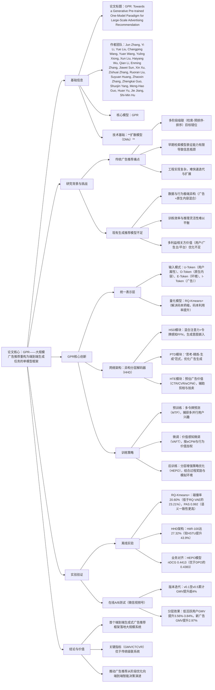

### 1. 一段话总结
腾讯与清华大学联合提出**GPR（Generative Pre-trained Recommender）**——首个将大规模广告推荐重构为端到端生成任务的单模型框架，旨在解决传统多阶段级联系统（检索-预排序-排序）的**目标错位**与**误差传播**问题。GPR通过三大核心创新实现突破：一是设计**统一输入模式与令牌化方法**（U/O/E/I-Token），结合RQ-Kmeans+量化模型将广告与原生内容映射到共享语义空间；二是提出**异构分层解码器（HHD）**，解耦用户意图建模与广告生成，平衡训练效率与推理灵活性；三是构建**多阶段联合训练策略**（MTP预训练、VAFT价值对齐微调、HEPO强化学习），统一兴趣建模、价值对齐与策略优化。该模型已在**腾讯微信视频号广告系统**全量部署，关键业务指标显著提升，如**GMV（商品交易总额）** 和**CTCVR（点击到转化的转化率）** 均优于高度优化的传统级联系统。

---

### 2. 思维导图

---

### 3. 详细总结
#### 一、研究背景：传统广告推荐的痛点与生成模型的局限
传统在线广告推荐系统普遍采用“**检索-预排序-排序**”的多阶段级联架构，但存在三大核心问题：
1. **目标错位**：检索阶段侧重覆盖优化，排序阶段聚焦业务指标（如CTR/CVR），无法实现全局最优；
2. **信息瓶颈**：早期检索模型表征能力有限，易提前过滤高价值候选广告，限制后续排序模型的深度特征交互；
3. **工程复杂**：跨阶段一致性维护成本高，阻碍算法快速迭代与系统扩展。

近年生成式推荐模型（如HSTU、OneRec）虽推动范式转型，但在工业场景中仍面临挑战：
- **数据异构**：广告与原生内容（短视频、资讯）混合，用户行为（点击/转化/浏览）复杂且噪声大，语义对齐难度高；
- **效率-灵活性权衡**：纯解码器架构（如HSTU）训练高效但推理灵活度低，编码器-解码器架构（如OneRec）推理灵活但训练成本高；
- **价值优化不足**：现有模型多优化单一目标（如CTR），难以平衡用户体验、广告主ROI与平台收入的多利益相关方价值。

#### 二、GPR框架的三大核心创新
GPR（Generative Pre-trained Recommender）通过统一表示、架构设计与训练策略的系统性创新，构建端到端生成式广告推荐框架。

##### 1. 统一表示：解决异构数据建模问题
- **统一输入模式**：将用户全旅程抽象为4类令牌（Token），覆盖用户、内容、环境与交互：
   - U-Token：用户属性与偏好（如年龄、性别）；
   - O-Token：原生内容（如短视频、文章）；
   - E-Token：广告请求上下文（如设备、位置）；
   - I-Token：用户交互过的广告 item。
- **RQ-Kmeans+量化模型**：针对传统量化方法（RQ-VAE、RQ-Kmeans）的“码本坍缩”问题，提出改进方案：
   1. 用RQ-Kmeans生成高质量初始码本，解决随机初始化导致的“死向量”问题；
   2. 引入编码器残差连接，加速训练收敛并稳定 latent 空间对齐；
   3. 实验验证（如表1）：RQ-Kmeans+在碰撞率、码本利用率与语义一致性上均优于基线。

**表1：不同量化模型性能对比**
| 模型          | 碰撞率（%）↓ | 一级码本使用率（%）↑ | PAS（语义一致性）↑ |
|---------------|--------------|-----------------------|--------------------|
| RQ-VAE        | 23.21        | 92.13                 | 0.985              |
| RQ-Kmeans     | 21.40        | 100                   | 0.986              |
| RQ-Kmeans+（本文） | 20.60        | 99.36                 | 0.992              |

##### 2. 架构设计：异构分层解码器（HHD）平衡效率与灵活度
HHD是解码器-only架构，由三大模块组成，解耦用户意图理解与广告生成：
- **异构序列解码器（HSD）**：处理超长异构用户序列，生成高质量意图嵌入：
   - 混合注意力（Hybrid Attention）：对U/O/E-Token采用双向注意力，充分利用上下文信息；
   - 令牌感知FFN/LN：为不同令牌类型分配独立网络，捕获语义多样性；
   - 混合递归（MoR）：在不增加参数的前提下提升模型推理深度。
- **渐进式令牌解码器（PTD）**：按“**思考-精炼-生成**”范式生成广告语义ID：
   - 思考令牌（Thinking Tokens）：蒸馏意图嵌入中的关键信息，过滤冗余；
   - 精炼模块（Refining Module）：基于扩散模型迭代去噪，优化推理结果；
   - 生成阶段：结合思考令牌与精炼令牌，输出广告的多层语义码。
- **分层令牌评估器（HTE）**：预估广告业务价值（CTR/CVR/eCPM），输出`final_value`（综合价值指标），既用于推理时的候选剪枝，也作为强化学习的价值函数。

##### 3. 训练策略：多阶段联合优化实现价值对齐
GPR采用三阶段训练流程，统一兴趣建模、价值对齐与策略优化：
1. **预训练：多令牌预测（MTP）**
   - 目标：捕获用户多并行兴趣，避免单一兴趣轨迹的局限性；
   - 方法：扩展解码器为4个并行头，每个头独立预测一条完整的广告语义码路径；
   - 损失：按头权重（初始1/4）聚合各头、各级别的对数似然，公式为：  
     $`[L_{MTP}=-\sum_{j=1}^{4} \sum_{t=1}^{T} \sum_{\ell=1}^{L} \omega_{j}^{H} \cdot log P_{j}\left(I_{j,t,\ell} | S, C, I_{j,t,1:\ell-1}\right)]`$

2. **微调：价值感知微调（VAFT）**
   - 目标：将模型优化方向与业务价值对齐，优先高eCPM广告；
   - 方法：引入$`ω_{j,t}^{V}`$权重，结合行为价值（转化>点击>曝光）与归一化eCPM；
   - 损失：在MTP损失基础上，叠加头权重与价值权重的乘积，公式为：  
     $`[L_{eCPM-MTP}=-\sum_{j=1}^{4} \sum_{t=1}^{T} \sum_{\ell=1}^{L}\left(\omega _{j}^{H} \omega _{j,t}^{V}\right) log P_{j}\left(I_{j,t,\ell} | S, C, I_{j,t,1:\ell-1}\right)]`$

3. **后训练：分层增强策略优化（HEPO）**
   - 目标：突破历史日志的覆盖限制，探索高价值未曝光广告；
   - 关键设计：
      - 模拟环境：基于生产快照构建，包含检索索引、特征 pipeline 与业务规则，生成40个候选广告；
      - 过程奖励：为每级语义码计算偏好信号（$`Δ_{\ell}`$），避免终端奖励的信用分配问题；
      - 优势估计：粗粒度级用GAE（广义优势估计），细粒度级用候选集内z-score归一化。

#### 三、实验验证：离线性能与在线业务提升
##### 1. 离线实验：核心模块有效性验证
- **RQ-Kmeans+量化效果**：如“表1”所示，碰撞率最低（20.60%），PAS最高（0.992），说明语义码的一致性与利用率最优；
- **HHD架构性能**：如表2所示，完整GPR模型HitR@100达27.32%，较基线HSTU（18.98%）提升43.9%，证明架构对用户行为建模的有效性；
- **业务对齐效果**：如表3所示，HEPO模型在nDCG（0.4413）、OPR（0.5509）与`final_value`（平均0.2630，最大0.7619）上均优于DPO等基线，验证价值优化能力。

**表2：HHD架构消融实验结果（HitR@100）**
| 模型/模块                | HitR@100（%） | 较HSTU提升（%） |
|--------------------------|---------------|-----------------|
| HSTU（基线）             | 18.98         | –               |
| OneRec（编码器-解码器）  | 19.85         | +4.6            |
| HSD+混合注意力           | 20.56         | +8.3            |
| HSD+令牌感知FFN          | 21.98         | +15.8           |
| PTD+思考令牌             | 21.75         | +14.6           |
| GPR（全模块）            | 27.32         | +43.9           |

**表3：业务对齐模型性能对比**
| 模型                | nDCG  | OPR   | 平均final_value | 最大final_value |
|---------------------|-------|-------|-----------------|-----------------|
| MTP（基线）         | 0.3868| 0.5292| 0.2412          | 0.6201          |
| MTP+VAFT            | 0.3925| 0.5348| –               | –               |
| MTP+DPO             | 0.4383| 0.5463| 0.2442          | 0.6659          |
| MTP+HEPO（本文）    | 0.4413| 0.5509| 0.2630          | 0.7619          |

##### 2. 在线A/B测试：微信视频号广告系统落地效果
GPR在腾讯微信视频号广告系统分5个版本迭代部署，关键业务指标（GMV、CTCVR）持续提升：
- **版本迭代效果**：如表4所示，v0.1（初始版本）GMV提升2.11%，v0.1至v0.5累计GMV提升超4%，且成本增幅（0.12%-3.29%）远低于GMV增幅；
- **分层效果**：如表5所示，低活跃用户（UG1/UG2）GMV提升3.56%-3.84%，新广告（≤3天）GMV提升2.97%（高于老广告的1.65%），证明模型对冷启动与低活跃用户的适配性。

**表4：GPR版本迭代在线效果（GMV）**
| 版本          | GMV提升（%） | 成本提升（%） | 核心新增模块          |
|---------------|--------------|--------------|-----------------------|
| v0.1          | +2.11        | +3.29        | HSD+NTP+DPO           |
| v0.2          | +0.70        | +0.36        | +HEPO（无ARR）        |
| v0.3          | +0.63        | +0.21        | +MTP+思考令牌         |
| v0.4          | +0.71        | +0.12        | +PTD                  |
| v0.5          | +0.58        | +0.23        | +HEPO（含ARR）        |

**表5：v0.1版本分层效果（部分指标）**
| 分层维度       | 分组          | GMV提升（%） | CTR提升（%） | CTCVR提升（%） |
|----------------|---------------|--------------|--------------|----------------|
| 用户活跃度     | UG1（低活跃） | +3.56        | +2.51        | +3.72          |
|                | UG2（低活跃） | +3.84        | +2.06        | +3.80          |
|                | UG5（高活跃） | +3.68        | +0.05        | +0.50          |
| 广告生命周期   | 新广告（≤3天）| +2.97        | +2.25        | +4.02          |
|                | 老广告（>3天）| +1.65        | +1.42        | +2.78          |

#### 四、研究结论与价值
1. **技术突破**：GPR是首个在大规模广告系统中落地的端到端生成式推荐框架，打破传统多阶段级联范式；
2. **业务价值**：在线测试证明，GPR在GMV、CTCVR等核心指标上显著优于高度优化的传统系统，且对低活跃用户与新广告的适配性更强；
3. **行业意义**：推动广告推荐从“阶段式优化”向“端到端智能决策”演进，为数字经济生态的价值最大化提供新范式。

---

### 4. 关键问题
#### 问题1：GPR提出的RQ-Kmeans+量化模型，相比传统量化方法（如RQ-VAE、RQ-Kmeans）解决了什么核心问题？具体性能提升体现在哪些指标上？
**答案**：RQ-Kmeans+主要解决传统量化方法的“**码本坍缩**”问题（部分码本向量因随机初始化极少被激活，成为“死向量”，导致语义空间利用率低）。具体性能提升体现在三个关键指标：
1. **碰撞率**：RQ-Kmeans+的碰撞率为20.60%，较RQ-VAE（23.21%）降低11.2%，较RQ-Kmeans（21.40%）降低3.7%，说明更少不同item被映射到同一语义码；
2. **一级码本使用率（CUR_L1）**：RQ-Kmeans+达99.36%，接近RQ-Kmeans的100%，远高于RQ-VAE的92.13%，证明码本利用率高，无大量“死向量”；
3. **路径平均相似度（PAS）**：RQ-Kmeans+的PAS为0.992，高于RQ-VAE（0.985）与RQ-Kmeans（0.986），说明同一语义码下的item语义一致性更强，量化质量更高。

#### 问题2：GPR的多阶段联合训练策略（MTP预训练→VAFT微调→HEPO后训练）各阶段的核心目标是什么？如何实现从“兴趣建模”到“业务价值优化”的递进？
**答案**：三阶段训练策略的核心目标与递进逻辑如下：
1. **MTP预训练阶段**：核心目标是**捕获用户多并行兴趣**，解决传统单轨迹建模无法覆盖多意图的问题；实现方式：扩展解码器为4个并行头，每个头独立预测一条广告语义码路径，按头权重聚合损失，避免单一兴趣轨迹的局限性；
2. **VAFT微调阶段**：核心目标是**实现兴趣与业务价值的对齐**，避免模型优化方向与广告业务目标（eCPM、转化）错位；实现方式：引入价值权重$`ω_{j,t}^{V}`$，按“转化>点击>曝光”的行为价值层级与归一化eCPM加权MTP损失，让模型优先学习高价值广告的生成；
3. **HEPO后训练阶段**：核心目标是**突破历史日志覆盖限制，探索高价值未曝光广告**，实现全局最优；实现方式：构建生产级模拟环境生成候选广告，设计“过程奖励”（每级语义码的用户偏好信号）解决终端奖励的信用分配问题，结合强化学习优化策略，最终实现从“兴趣建模”（拟合历史）到“价值优化”（探索未来高价值）的递进。

#### 问题3：GPR在微信视频号广告系统的在线A/B测试中，针对不同用户群体（如低活跃/高活跃用户）与广告类型（新广告/老广告）的效果差异如何？这种差异对广告系统的实际运营有什么指导意义？
**答案**：GPR的在线效果在不同用户群体与广告类型中存在显著差异，具体差异与运营指导意义如下：
1. **用户群体差异**：
   - 低活跃用户（UG1/UG2）：GMV提升3.56%-3.84%，CTCVR提升3.72%-3.80%，效果优于高活跃用户（UG5：GMV提升3.68%，CTCVR提升0.50%）；
   - 原因：低活跃用户的历史行为稀疏，传统级联系统易过滤高匹配广告，而GPR的生成式建模与多兴趣捕获能力更强，能更精准匹配其潜在需求。
2. **广告类型差异**：
   - 新广告（≤3天）：GMV提升2.97%，CTCVR提升4.02%，效果优于老广告（>3天：GMV提升1.65%，CTCVR提升2.78%）；
   - 原因：新广告缺乏历史交互数据，传统系统的检索与排序阶段易低估其价值，而GPR的端到端生成与价值预估（HTE模块）能更公平地评估新广告的潜力，缓解冷启动问题。

**运营指导意义**：
- 对用户运营：可针对低活跃用户加大GPR模型的应用权重，通过更精准的广告推荐激活沉默用户，提升用户生命周期价值；
- 对广告运营：可利用GPR对新广告的友好性，优化新广告的初始曝光策略，缩短冷启动周期，提升广告主的投放意愿与ROI，进而增加平台广告库存的利用率。