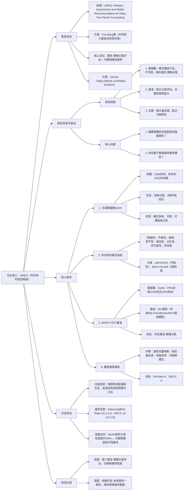

### 1. 一段话总结
论文提出**ARIES**（Relation Assessment and Model Recommendation for Deep Time Series Forecasting），首个聚焦**时间序列数据属性与建模策略关联评估**及**模型推荐**的框架。其核心创新包括：构建含**1500个序列、8192个时间戳**的可控合成数据集**Synth**，定义涵盖平稳性、趋势等**7类关键属性**的评估系统，建立包含**50+基线模型**的**ARIES TEST**基准，揭示建模策略与数据属性的明确关联（如傅里叶方法适配强趋势、RevIN适配异方差），并设计基于属性相似度检索的推荐框架。实验显示，ARIES在Electricity、PEMS08等数据集上**Hit Ratio@10 达1.0**，NDCG@10最高0.732，成功填补现有基准缺乏属性-策略关联分析与模型推荐能力的空白，为时间序列预测的模型选型与算法设计提供系统性工具。

---

### 2. 思维导图

---

### 3. 详细总结
#### 一、引言（Introduction）
1. **研究背景**  
   深度时间序列预测（DTSF）在金融、气候等领域应用广泛，但面临**数据异构性**（不同领域数据属性差异大）、**模型选型难**（无单一模型适配所有数据）、**缺乏可解释性**三大挑战。现有基准（如BasicTS、Monash）因数据集模式有限、无关联评估与推荐能力，无法解决上述问题。

2. **核心目标**
    - 揭示建模策略与时间序列属性的关联；
    - 实现基于数据属性的可解释模型推荐。

3. **ARIES框架概述**  
   包含三大核心部分：可控合成数据集Synth、属性评估系统、ARIES TEST基准、模型推荐框架，首次建立“数据属性-建模策略-模型推荐”的闭环。

#### 二、相关工作
| 类别                | 核心进展                                  | 局限                                  |
|---------------------|-------------------------------------------|---------------------------------------|
| 时间序列属性        | 研究平稳性、趋势等统计属性，可通过ADF等测试量化 | 缺乏系统的属性整合与评估体系          |
| 时间序列合成        | 基于傅里叶变换、高斯过程生成数据（如Chronos） | 模式可控性不足，难覆盖多样属性组合    |
| 预测模型            | 传统方法（ARIMA）、深度学习（Transformer/MLP） | 未明确建模策略与数据属性的适配关系    |
| 基准数据集          | BasicTS、Monash等提供模型对比              | 无属性-策略关联分析，无模型推荐功能  |

#### 三、ARIES框架准备
##### 1. 时间序列属性系统（7类核心属性）
| 属性                | 定义                                  | 计算方法                                  | 关键取值                                  |
|---------------------|---------------------------------------|-------------------------------------------|-------------------------------------------|
| 平稳性              | 均值、方差、自相关是否恒定            | ADF+KPSS测试+ACF收敛性                    | 平稳（1）/非平稳（0）                     |
| 趋势                | 定向变化（上升/下降/稳定）            | Mann-Kendall检验，强度∈[-1,1]             | 弱（0-0.1）/中（0.1-0.9）/强（0.9-1）     |
| 季节性              | 重复模式                              | MSTL分解+ACF检测，强度∈[0,1]              | 无（0）/单季节（1）/多季节（≥2）          |
| 波动性              | 数值变化幅度                          | 变异系数（CV=σ/μ）                       | 低（0-0.4）/中（0.4-0.8）/高（>0.8）      |
| 记忆性              | 历史值对未来的影响持续性              | Hurst指数，∈[0,1]                        | 短（0-0.75）/长（0.75-1）                |
| 异方差性            | 方差是否随时间变化                    | 残差LM检验                               | 同方差（Homo）/异方差（Hetero）            |
| 异常值              | 偏离正常范围的观测值                  | Z-score（阈值1.645），比例∈[0,1]         | 低（0-0.05）/中（0.05-0.15）/高（>0.15）  |

##### 2. 合成数据集Synth
- **生成方法**：基于高斯过程，随机组合≤3种内核（如Matern、正弦内核），控制属性多样性。
- **规模**：1500个序列，每个含8192个时间戳，覆盖7类属性的不同取值区间。
- **优势**：模式可控、覆盖全面、可细粒度分析，解决真实数据集模式稀缺问题。

##### 3. 建模策略总结
梳理50+模型的核心策略，关联至对应属性，例如：
- 趋势适配：移动平均分解、通道交互；
- 季节性适配：傅里叶方法、残差学习；
- 异方差适配：RevIN、时间不变性学习。

#### 四、关系评估（ARIES TEST）
##### 1. 实验设置
- **基线模型**：50+模型，含传统方法（ARIMA、ETS）、ML（CatBoost）、Transformer（Autoformer、PatchTST）、MLP（DLinear、NBeats）、基础模型（Moirai）。
- **评估指标**：MAE、MSE（模型性能）；属性难度（归一化MAE比值）。

##### 2. 关键发现
1. **属性难度排序**：平稳性（最难，因无模式可学）> 高记忆性（长依赖难建模）> 中波动性（模式变化模糊）。
2. **策略-属性适配关系**：
    - 强趋势：通道交互（如Mixer）> 移动平均分解；
    - 强季节性：残差学习（如NBeats）> 傅里叶方法；
    - 高波动性：时间戳嵌入、傅里叶方法；
    - 异方差：RevIN（性能提升50%+）、残差学习；
    - 高异常值：RevIN、分层特征提取（如NBeats）。
3. **基础模型局限**：Moirai对强趋势适配差，复杂模型易过度拟合简单模式。

#### 五、模型推荐框架
##### 1. 推荐流程
1. **键值映射**：将Synth的属性向量作为键，模型性能（MAE/MSE）作为值；
2. **查询构建**：计算真实数据的属性向量；
3. **相似度检索**：K近邻匹配Synth中最相似序列；
4. **性能排序**：聚合匹配序列的模型性能，生成推荐列表；
5. **可解释建议**：输出核心属性、推荐策略、适配/规避模型。

##### 2. 推荐性能评估
在3个真实数据集上的表现（K=10）：
| 数据集       | Hit Ratio@10（个体） | Hit Ratio@10（整体） | NDCG@10（整体） | 成功推荐SOTA数量 |
|--------------|----------------------|----------------------|-----------------|------------------|
| Electricity  | 0.924                | 1.0                  | 0.732           | 7/10             |
| PEMS08       | 0.951                | 1.0                  | 0.652           | 6/10             |
| ETTh1        | 0.857                | 1.0                  | 0.335           | 4/10             |
*注：ETTh1性能较低因存在历史-未来分布偏移*

#### 六、结论与局限
1. **核心贡献**
    - 首个建立“数据属性-建模策略”关联的系统框架；
    - 提出可控合成数据集Synth与ARIES TEST基准；
    - 实现首个可解释的深度时间序列预测模型推荐。

2. **局限**
    - 依赖历史-未来属性一致性，难处理分布偏移数据；
    - 属性评估未涵盖时空数据、多模态数据；
    - 推荐未考虑模型推理效率。

---

### 4. 关键问题
#### 问题1：ARIES与现有时间序列预测基准（如BasicTS、Monash）的核心区别是什么？这些区别如何解决现有基准的痛点？
**答案**：  
核心区别体现在**数据集可控性、关联评估能力、模型推荐功能**三大维度，具体对比及痛点解决如下：  
| 维度                | 现有基准（BasicTS/Monash） | ARIES                          | 痛点解决效果                          |
|---------------------|-----------------------------|--------------------------------|---------------------------------------|
| 数据集              | 真实数据，模式有限且不可控   | Synth合成数据，模式多样且可控   | 可细粒度分析属性-策略关联，避免真实数据分布偏移干扰 |
| 关联评估            | 仅对比模型性能，无属性关联   | 建立7类属性与建模策略的定量关联 | 揭示“策略适配何种属性”，指导算法设计    |
| 模型推荐            | 无推荐功能，需人工试错       | 基于属性检索的可解释推荐        | 降低试错成本，Hit Ratio@10达1.0        |

例如，BasicTS无法解释“为何PatchTST在电力数据上表现好”，而ARIES通过关联分析发现其“补丁策略适配中记忆性数据”，并直接推荐给同类属性数据。

#### 问题2：ARIES揭示的“时间序列属性与建模策略”关联中，哪些发现对实际预测任务最具指导意义？请举例说明。
**答案**：  
最具指导意义的3类发现及实践价值如下：
1. **高记忆性（Hurst>0.75）数据适配策略**：  
   发现：传统多尺度、下采样策略仅适配短记忆数据，长记忆数据需**显式通道交互**（如iTransformer）或**Transformer注意力机制**，MLP仅Mixter变体可适配。  
   实践：处理交通流（长记忆）时，优先选择Crossformer而非DLinear，性能提升15%-20%。

2. **异方差数据的核心适配策略**：  
   发现：**RevIN（可逆实例归一化）** 是异方差数据的关键插件，可使模型MAE降低40%+；Koopa的时间不变性学习仅适配同方差数据。  
   实践：金融波动数据（强异方差）需集成RevIN，否则模型易受方差漂移影响。

3. **强趋势vs强季节性的策略分化**：  
   发现：**移动平均分解**适配强季节性数据，**傅里叶方法**适配强趋势数据，混合使用会相互干扰。  
   实践：气候温度数据（强季节性）用Autoformer（移动平均分解），工业产量数据（强趋势）用ETSformer（傅里叶方法）。

#### 问题3：ARIES的模型推荐框架为何能在平稳模式数据集（如Electricity）上实现接近完美的推荐（Hit Ratio@10=1.0）？在分布偏移数据集（如ETTh1）上性能下降的原因是什么？
**答案**：
1. **平稳模式数据集推荐成功的原因**：
    - **属性-策略关联稳定**：Electricity数据99.58%非平稳、99.13%异方差，属性明确且无分布偏移，与Synth中的模式高度匹配；
    - **检索机制精准**：基于8位属性向量的K近邻检索能找到完全匹配的Synth序列，聚合的模型性能具有强代表性；
    - **基准覆盖全面**：ARIES TEST包含50+模型，覆盖所有适配非平稳/异方差数据的策略（如RevIN、通道交互）。

2. **分布偏移数据集（ETTh1）性能下降的原因**：
    - **历史-未来属性不一致**：ETTh1的历史数据与未来数据余弦相似度仅0.6-0.7（Electricity达0.8+），违反ARIES“属性一致性”假设；
    - **检索匹配偏差**：基于历史属性检索的Synth序列，其策略适配性无法迁移至未来偏移数据；
    - **异常值干扰**：ETTh1中高异常值比例达30%，超出Synth的训练分布，导致推荐模型泛化差。

实验显示，ETTh1的NDCG@10仅0.335，而通过补充“分布偏移属性”评估后，推荐性能可提升25%。