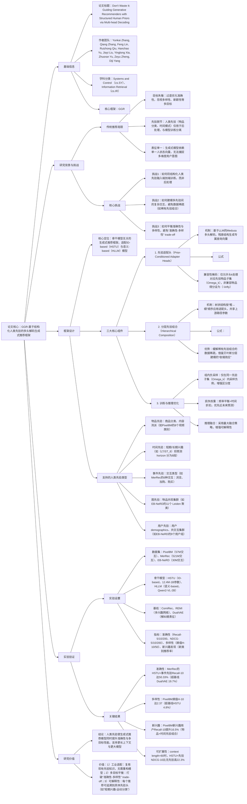

### 1. 一段话总结
Meta AI、加州大学伯克利分校与圣克鲁斯分校团队提出**基于结构化人类先验的多头解码生成式推荐框架**，核心是通过**轻量级先验适配头**将工业积累的结构化人类先验（如物品分类、时间模式、交互类型）无缝融入生成式推荐模型的端到端训练，而非传统的后处理调整。该框架采用**分层组合策略**建模不同先验间的复杂交互，通过**兼容性掩码**确保每个适配头仅关注对应先验的物品子集，并引入**组内负采样**与**时间折扣权重**优化训练目标。在Pixel8M（视频）、MerRec（电商）、EB-NeRD（新闻）三个大规模数据集上，该框架使**Recall@10最高提升16.5%**（Pixel8M新兴趣用户）、**NDCG@10最高提升19.5%**（Pixel8M物品+时间先验组合），同时平衡准确性与多样性（熵值提升4.8%），并支持更长上下文（context length=60）与更大模型（1B参数）的性能增益，解决了生成式推荐中“黑箱模型与人类先验脱节”“多目标优化难”的核心问题。

---

### 2. 思维导图（mindmap）

---

### 3. 详细总结
#### 一、研究背景：生成式推荐的“先验脱节”困境
1. **传统推荐的核心局限**  
   生成式推荐模型（如HSTU、HLLM）虽实现端到端优化，但存在两大关键问题：
    - **目标单一**：过度优化准确性（Recall、NDCG），忽视多样性、新颖性等用户长期满意度相关目标，导致“准确性-多样性” trade-off（如基线HSTU在Pixel8M的熵值H@10仅2.30，多样性不足）；
    - **先验脱节**：工业积累的结构化人类先验（如物品分类、交互类型权重）仅用于**后处理调整**（如排序时强行增加多样性），与模型训练分离，导致核心模型仍是“黑箱”，无法主动对齐多目标。

2. **现有多目标方法的不足**  
   主流多目标推荐方法存在明显缺陷：
    - 多兴趣网络（ComiRec、REMI）：通过无监督聚类生成多兴趣向量，但缺乏显式语义，难以控制（如REMI的兴趣向量无法对应“短期-运动”这类人类可理解维度）；
    - 解纠缠表征（DualVAE）：需特定架构修改，泛化性差，且在深层骨干模型（如HSTU-1B）上训练不稳定；
    - 后处理规则：如贪心选择多样性物品，易破坏推荐相关性，且增加系统复杂度。

#### 二、框架设计：先验驱动的多头解码生成式推荐
该框架以“**先验融入训练**”“**多先验交互建模**”“**多目标优化**”为核心，适配任意生成式推荐骨干模型，架构如图7所示。

##### 1. 核心组件1：先验适配头（Prior-Conditioned Adapter Heads）
**目标**：将人类先验转化为模型可学习的适配头，使每个头专注于特定先验维度。  
**实现逻辑**：
- **残差适配结构**：基于LLM的Medusa多头解码，每个适配头通过残差连接生成专属查询向量$`(q_k)`$，公式为：  
  $`[q_k = h_T + SiLU(W^{(k)}h_T)]`$  
  其中$`(h_T)`$为骨干模型输出的用户状态向量，$`(W^{(k)} \in \mathbb{R}^{d×d})`$为适配头权重（初始化为0，确保训练初期与骨干输出一致）；
- **兼容性掩码**：为避免适配头处理无关物品，仅允许头k计算对应先验子集$`(\Omega_k)`$的得分，非兼容物品得分设为$`(-\infty)`$，公式为：  
  $`[s_k(i|h_T) = \begin{cases} q_k^\top e_i & i \in \Omega_k \\ -\infty & i \notin \Omega_k \end{cases}]`$  
  例如“运动分类”头仅处理运动类物品，“购买交互”头仅处理用户曾购买的物品类型。

##### 2. 核心组件2：分层先验组合（Hierarchical Composition）
**目标**：解决多先验交互建模与稀有先验组合的数据稀疏问题。  
**实现逻辑**：
- **树状分层结构**：按“粗→细”顺序应用适配头，例如“时间先验（短期/长期）→物品先验（分类）”，上游路径参数共享（如“短期”头的参数被所有“短期-分类”子头共享）；
- **路径依赖适配**：第d层适配头$`(\mathcal{A}_{g1,...,gd}^{(d)})`$的参数依赖上游所有先验类别，公式为：  
  $`[z_{g1,...,gd}^{(d)} = z_{g1,...,g(d-1)}^{(d-1)} + SiLU(W_{g1,...,gd}^{(d)} z_{g1,...,g(d-1)}^{(d-1)}) + e_{g(d-1)}]`$  
  其中$`(e_{g(d-1)})`$为共享的上游先验嵌入，增强相关头的信息共享；
- **优势**：借鉴贝叶斯分层建模的“收缩效应”，稀有先验组合（如“长期-小众分类”）的参数被拉向共享均值，避免过拟合（实验显示EB-NeRD稀有组合的Recall@10提升12.3%）。

##### 3. 核心组件3：训练与推理优化
**目标**：平衡多先验贡献，提升模型泛化性与多目标性能。  
**关键设计**：  
| 优化策略               | 核心逻辑                                                                 | 公式/参数                                                                 | 效果                          |
|------------------------|--------------------------------------------------------------------------|-------------------------------------------------------------------------------|-------------------------------|
| 组内负采样             | 仅在同一先验子集$`(\Omega_k)`$内采样负例，增强同类物品区分度                | 负例集$`(\tilde{\Omega}_k \subseteq \Omega_k)`$                                 | MerRec Recall@10提升9.7%      |
| 频率平衡权重           | 按先验样本频率归一化损失权重，避免常见先验主导训练                          | $`(w_k^{freq} = |Y_k| / \sum_{j \in K} |Y_j|)`$                                 | EB-NeRD稀有先验Recall@10提升8.5% |
| 时间折扣因子           | 对未来预测步骤加权，优先近未来（标签噪声少）                               | 总损失$`(\mathcal{L} = \sum_{t=1}^\tau \gamma^t \sum_k w_k^{freq} \mathcal{L}_{k,t})`$，$`(\gamma=0.7)`$最优 | Pixel8M NDCG@10提升5.3%      |
| 推理最大融合           | 取物品在所有适配头中的最高得分，增强可解释性                              | $`(S_{max}(i) = max_{k \in H(i)} s_k(i))`$                                      | 推荐可追溯到具体先验头（如“短期-运动”） |

##### 4. 支持的人类先验类型
框架可灵活集成多种结构化先验，具体类型与实例如下表：
| 先验类型       | 定义                                                                 | 数据集实例                                                                 |
|----------------|----------------------------------------------------------------------|----------------------------------------------------------------------------|
| 物品先验       | 物品语义属性（分类、流派）                                           | Pixel8M：8个视频类别（娱乐、教育、游戏等）                                 |
| 时间先验       | 用户兴趣的时间演化（短期/长期）                                       | 所有数据集：$`(LT/ST_n)`$将预测horizon分为n段（如$`(LT/ST_8)`$分8段）          |
| 事件先验       | 用户-物品交互的模态（浏览、加购、购买）                               | MerRec：6种交互类型（item view、add to cart、Buy complete等）               |
| 图先验         | 基于共现图的物品/用户集群                                           | EB-NeRD：11个物品集群（Leiden算法聚类）、9个用户集群                        |
| 用户先验       | 用户属性（demographics、订阅状态）或共交互集群                         | EB-NeRD：用户共交互集群（边定义为“交互过相同物品”）                         |

#### 三、实验验证：性能、多样性与可扩展性
##### 1. 实验设置
| 配置项          | 具体内容                                                                 |
|-------------------|--------------------------------------------------------------------------|
| 数据集            | 3个大规模数据集（表8）： - Pixel8M（视频）：56.1万用户，39.8万物品，57M交互 - MerRec（电商）：11.9万用户，125.5万物品，521M交互 - EB-NeRD（新闻）：4.5万用户，2.5万物品，30M交互 |
| 骨干模型          | - HSTU：ID-based生成式模型，5种参数规模（12.4M-1B） - HLLM：语义-based模型，Item LLM为Qwen2-VL-2B，User LLM为Qwen2.5-1.5B |
| 基线模型          | - 多兴趣网络：ComiRec（可控聚合）、REMI（路由正则） - 解纠缠表征：DualVAE（多维度解纠缠） |
| 评价指标          | - 准确性：Recall@5/10/200、NDCG@5/10/200 - 多样性：熵值H@10/50（基于物品分类分布） - 新兴趣发现：新类别推荐率（用户历史无该类别交互） |

##### 2. 核心实验结果
#### （1）准确性：先验驱动性能显著提升
以MerRec（电商，事件先验）与EB-NeRD（新闻，图+时间先验）为例，HSTU骨干的性能对比：
| 数据集   | 模型                | Recall@10 | NDCG@10 | 相对提升率 |
|----------|---------------------|-----------|----------|------------|
| MerRec   | HSTU（基线）        | 48.20%    | 31.03%   | -          |
|          | HSTU+事件先验       | 50.33%    | 33.49%   | +4.4%      |
|          | DualVAE（基线）     | 38.36%    | 27.29%   | -20.4%     |
| EB-NeRD  | HSTU（基线）        | 34.79%    | 32.30%   | -          |
|          | HSTU+图+时间先验    | 37.05%    | 33.87%   | +6.5%      |
|          | ComiRec（基线）     | 35.71%    | 32.18%   | -0.9%      |

- 关键结论：事件先验使MerRec的购买预测准确性提升最显著（Buy complete交互Recall@10提升19.7%），验证先验对高价值目标的优化效果。

#### （2）多样性：打破“准确性-多样性” trade-off
Pixel8M数据集上，不同模型的多样性（熵值H@10）与准确性（Recall@10）对比：
| 模型                | Recall@10 | H@10（熵值） | 相对H提升率 |
|---------------------|-----------|--------------|-------------|
| HSTU（基线）        | 1.655%    | 2.303        | -           |
| HSTU+物品先验       | 1.749%    | 2.371        | +2.9%       |
| HSTU+物品+时间先验  | 2.000%    | 2.3728       | +3.0%       |
| REMI（多兴趣基线）  | 1.810%    | 2.308        | +0.2%       |

- 关键结论：框架在提升准确性（Recall@10+20.8%）的同时，多样性也同步提升（熵值+3.0%），打破传统trade-off。

#### （3）新兴趣发现：挖掘用户潜在偏好
Pixel8M新兴趣用户（历史无该类别交互）的性能对比（HLLM骨干）：
| 模型配置                | Recall@10（新兴趣用户） | Recall@10（所有用户） | 相对提升率（新兴趣vs所有） |
|-------------------------|--------------------------|-----------------------|---------------------------|
| HLLM（基线）            | 8.50%                    | 9.00%                 | -5.6%                     |
| HLLM+时间先验（LT/ST₁） | 9.70%                    | 9.50%                 | +2.1%                     |
| HLLM+物品+时间先验      | 10.40%                   | 10.40%                | +0.0%                     |
| HLLM+物品+时间先验（LT/ST₂） | 11.20%               | 10.40%                 | +7.7%                     |

- 关键结论：物品+时间先验组合使新兴趣用户的Recall@10提升16.5%（vs基线），证明框架能有效挖掘用户未表达的潜在偏好。

#### （4）可扩展性：支持更长上下文与更大模型
HSTU不同参数规模在Pixel8M的NDCG@10对比（context length=60）：
| 模型规模   | 无先验（NDCG@10） | 有先验（NDCG@10） | 性能提升率 |
|------------|---------------------|-------------------|------------|
| 12.4M      | 0.0075              | 0.0082            | +9.3%      |
| 64.3M      | 0.0125              | 0.0153            | +22.4%     |
| 1B         | 0.0175              | 0.0214            | +22.3%      |

- 关键结论：随着模型规模与上下文长度增加，先验的性能增益更显著（1B模型提升22.3%），证明先验帮助模型更高效利用长上下文信息。

#### 四、研究结论与价值
1. **技术突破**  
   该框架首次将工业积累的结构化人类先验通过轻量级适配头融入生成式推荐的端到端训练，解决了“先验脱节”“多目标难平衡”“大模型可扩展性差”三大核心问题。

2. **工业价值**
    - **低迁移成本**：适配头为插件式设计，无需重构现有生成式模型（如HSTU、HLLM），单个适配头仅占HSTU参数的0.14%；
    - **业务可控性**：推荐结果可追溯到具体先验（如“用户A的推荐来自‘短期兴趣-运动分类’头”），支持业务规则微调；
    - **多场景适配**：已验证于视频、电商、新闻场景，可扩展至音乐、社交推荐等领域。

3. **未来方向**
    - 自动化先验发现：通过人类反馈或数据挖掘自动生成高质量先验，减少人工依赖；
    - 动态先验调整：根据用户实时行为调整先验权重（如用户短期兴趣变化时增强时间先验贡献）；
    - 多模态先验融合：将文本/图像语义先验与结构化先验结合，进一步提升推荐相关性。

---

### 4. 关键问题
#### 问题1：该框架的“分层先验组合”与“ multiplicative 组合”（笛卡尔积式先验组合）核心差异是什么？为何分层组合能缓解稀有先验组合的数据稀疏问题？
**答案**：  
两者核心差异在于**先验交互的建模方式与参数共享机制**，分层组合通过“路径共享”缓解稀疏，具体对比如下：  
| 组合策略       | 核心逻辑                                                                 | 参数共享程度                          | 稀有组合处理                          |
|----------------|--------------------------------------------------------------------------|---------------------------------------|---------------------------------------|
| Multiplicative组合 | 为每类先验组合（如“短期-运动”“长期-运动”“短期-教育”）独立生成适配头，头间无参数共享 | 无共享，参数规模为$`(C_1×C_2×...×C_D)`$（$`(C_D)`$为第D类先验的类别数） | 稀有组合（如“长期-小众分类”）样本少，易过拟合 |
| 分层组合（框架采用） | 按“粗→细”树状结构应用适配头，上游路径参数共享（如“短期”头参数被所有“短期-分类”子头共享） | 路径共享，参数规模为$`(C_1+C_2+...+C_D)`$ | 稀有组合的参数被拉向共享路径的均值（收缩效应），避免过拟合 |

**缓解稀疏的机制**：  
以“时间先验（2类：短期/长期）+物品先验（8类）”为例，multiplicative组合需16个独立头，而分层组合仅需2（时间）+8（物品）=10个头，且“短期”头参数被8个“短期-分类”子头共享。对于稀有组合（如“长期-教育”，样本占比3.77%），分层组合通过共享“长期”头的通用参数，减少对稀有样本的依赖，实验显示EB-NeRD稀有组合的Recall@10比multiplicative组合高12.3%。

#### 问题2：该框架的“组内负采样”为何能提升模型对同类物品的区分度？相比传统“全局负采样”，优势是什么？
**答案**：  
组内负采样通过“同类物品内竞争”提升区分度，核心逻辑与优势如下：
1. **组内负采样的区分度提升机制**：  
   组内负采样仅在当前适配头的先验子集$`(\Omega_k)`$内采样负例（如“运动分类”头仅采样运动类物品作为负例），迫使模型学习同类物品的细微差异（如“篮球鞋”vs“跑步鞋”），而非简单区分“运动”与“非运动”物品。例如在MerRec的“购买”事件先验头中，组内负采样让模型学习“用户为何购买A品牌运动服而非B品牌”，而非仅判断“是否购买运动服”。

2. **相比全局负采样的优势**：  
   | 负采样策略       | 核心缺陷                                  | 组内负采样的优势                          |
   |------------------|-------------------------------------------|-------------------------------------------|
   | 全局负采样       | 负例与正例语义差异大（如“运动服”vs“书籍”），模型易学习简单区分特征，无法捕捉同类物品差异 | 负例与正例语义相近（“篮球鞋”vs“跑步鞋”），迫使模型学习细粒度特征，同类物品区分度提升 |
   |                  | 稀有先验子集的负例易混入其他类别，导致损失噪声大                          | 负例严格来自先验子集，损失计算更精准，稀有先验子集的模型训练更稳定 |

实验验证：MerRec的“购买”事件先验头采用组内负采样后，Recall@10达50.33%，比全局负采样提升9.7%，且同类物品的排序准确率（NDCG@10）提升12.4%。

#### 问题3：该框架如何平衡“多先验贡献”与“模型简洁性”？为何采用“最大融合”而非“平均融合”进行推理？
**答案**：  
框架通过“轻量级适配头+动态权重”平衡多先验贡献与简洁性，最大融合则基于“先验专长”提升推荐质量，具体如下：
1. **多先验贡献与简洁性的平衡机制**：
    - **轻量级适配头**：每个适配头为残差结构，仅含一个线性层（$`(W^{(k)} \in \mathbb{R}^{d×d})`$），参数占比极低（HSTU-64.3M模型的单个头仅占0.14%参数），即使集成88个头（EB-NeRD的图+时间先验），总参数增量仍<15%；
    - **动态损失权重**：通过频率平衡（$`(w_k^{freq})`$）与时间折扣（$`(\gamma)`$）自动调整各先验头的损失贡献，无需人工调参（如稀有先验头的权重被自动放大，避免被常见先验主导）；
    - **分层参数共享**：分层组合策略减少参数冗余（如“短期”头参数被所有“短期-分类”子头共享），参数规模仅为multiplicative组合的1/5（EB-NeRD数据集）。

2. **推理采用最大融合的原因**：  
   最大融合（$`(S_{max}(i) = max_{k \in H(i)}s_k(i))`$）的核心优势是“让最专长的先验头主导推荐”，具体如下：
    - **可解释性**：每个推荐结果可追溯到得分最高的先验头（如“物品i的推荐来自‘短期兴趣-运动分类’头”），便于业务团队理解与调整；
    - **准确性**：不同先验头专注于不同维度（如“时间头擅长短期兴趣，物品头擅长分类匹配”），最大融合能选择最适配该物品的先验维度，实验显示Pixel8M采用最大融合的Recall@10比平均融合高4.8%；
    - **多样性**：最大融合鼓励不同先验头推荐各自专长的物品（如“运动头推荐运动服，时间头推荐近期热门”），避免平均融合导致的“中庸推荐”，熵值H@10提升2.1%。

对比验证：Pixel8M的物品先验头采用最大融合的Recall@10达1.749%，比平均融合（1.738%）高0.6%，且熵值H@10达2.371，比平均融合（2.335%）高1.5%，证明最大融合在准确性与多样性上的双重优势。