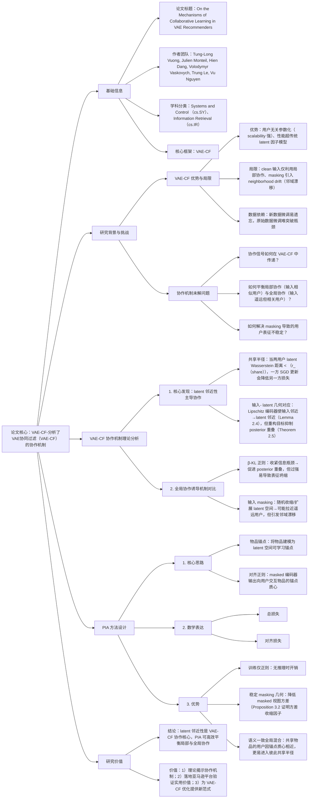

### 1. 一段话总结
莫纳什大学与亚马逊团队深入分析了**VAE协同过滤（VAE-CF）的协作机制**，发现其核心由** latent proximity（ latent 邻近性）** 主导：SGD更新仅在用户 latent 距离小于“共享半径（$`(r_{share})`$）”时相互影响，且 clean 输入下模型仅利用**局部协作信号**（输入相似用户），难以捕捉**全局协作信号**（输入遥远但相关用户）。为平衡局部与全局协作，团队提出**PIA（Personalized Item Alignment）正则化**，通过将用户 masked 后验向其交互物品的 latent 锚点质心对齐，在稳定 masking 诱导的随机几何结构同时促进语义一致的全局混合。实验验证，PIA 在**MovieLens-20M、Netflix、Million Song** 三大数据集上使 Recall@20 最高提升**4.09%**（100+交互用户组），并在亚马逊流媒体平台 A/B 测试中实现**点击率提升117%-283%**，成功落地应用。

---

### 2. 思维导图（mindmap）

---

### 3. 详细总结
#### 一、研究背景：VAE-CF 的优势与未解难题
1. **VAE-CF 的核心优势**  
   相比传统矩阵分解（MF），VAE-CF 具备两大关键优势：
  - **用户无关参数化**：模型参数数量不随用户规模增长， scalability 极强（Lobel et al., 2019）；
  - **性能优越性**：在隐式反馈推荐任务中，持续超越 MultiVAE、RecVAE 等生成模型及 NGCF 等图模型（Liang et al., 2018；Guo et al., 2024）。

2. **核心未解问题**  
   VAE-CF 中广泛使用的**输入 masking（随机掩盖用户交互向量）** 虽能提升性能，但存在三大未解难题：
  - **协作机制模糊**：SGD 更新如何在不同用户间传递协作信号？
  - **局部-全局协作失衡**：clean 输入下模型仅利用“输入相似用户”的局部信号，难以捕捉“输入遥远但内容相关用户”的全局信号；
  - **masking 副作用**：随机 masking 导致用户 latent 表征波动（邻域漂移），削弱局部协作可靠性。

#### 二、VAE-CF 协作机制的理论分析
##### 1. 核心发现：latent 邻近性主导协作
团队通过数学推导，揭示 VAE-CF 的协作本质由**latent 空间邻近性**控制，关键结论如下：

| 理论结果                  | 核心内容                                                                                   | 公式/参数                                                                                                                                                  |
|-----------------------|----------------------------------------------------------------------------------------|--------------------------------------------------------------------------------------------------------------------------------------------------------|
| 共享半径（$`(r_{share})`$） | 定义“协作有效范围”：当用户 u、v 的 latent 1-Wasserstein 距离 < $`(r_{share})`$，对 v 的 SGD 更新会严格降低 u 的损失 | $`(r_{share}(u,v;\theta) = \frac{[\|g_u(\theta)\| - \Delta_x(u,v)]_+}{L_{\theta z}})`$，其中 $`(\Delta_x)`$ 为内容失配项，$`(L_{\theta z})`$ 为解码器梯度 Lipschitz 常数 |
| 输入- latent 几何对应       | 编码器满足 Lipschitz 条件，输入空间邻近（$`(\ell_1)`$ 距离小）→ latent 空间邻近（Wasserstein 距离小）              | Lemma 2.4：$`(W_1(q_\phi(\cdot\|x_u), q_\phi(\cdot\|x_v)) \leq L_\phi \|x_u - x_v\|_1)`$                                                                |
| 重构目标抑制全局协作            | 正则指数族解码器的重构损失会惩罚 posterior 重叠，导致输入遥远用户的 latent 距离增大                                    | Theorem 2.5：当 $`(T(x_u) \neq T(x_v))`$（$`(T(x))`$ 为充分统计量），重叠 posterior 会引入正损失 gap $`(\Delta_{A^*})`$                                                   |

##### 2. 两种全局协作诱导机制的对比
为突破局部协作局限，团队分析了两种主流全局协作诱导方法的差异：

| 机制               | 工作原理                                                         | 优势                          | 缺陷                                |
|------------------|--------------------------------------------------------------|-----------------------------|-----------------------------------|
| β-KL 正则          | 增大 β 收紧 KL 项，通过 Bobkov–Götze 不等式缩小 latent Wasserstein 距离上限   | 均匀促进 posterior 重叠，全局信号传递稳定  | β 过大会导致**表征坍缩**，削弱预测性能            |
| 输入 masking       | 随机掩盖交互向量，降低输入- latent 互信息，诱导 stochastic 几何收缩/扩展              | 可能拉近输入遥远用户的 latent 距离       | 引发**邻域漂移**，用户 latent 邻域随 batch 波动 |

#### 三、PIA（Personalized Item Alignment）方法设计
为解决 masking 导致的邻域漂移，同时保留全局协作优势，团队提出 PIA 正则化，核心是“以物品为锚点稳定用户表征”。

##### 1. 核心组件
- **物品锚点（Item Anchors）**：将每个物品建模为 latent 空间可学习向量 $`(e_i \in \mathbb{R}^d)`$（与 latent 维度一致），构成锚点集合 $`(E = \{e_i\}_{i=1}^I)`$；
- **用户锚点质心**：对用户 $`(x)`$，其交互物品集合为 $`(S_x = \{i | x_i=1\})`$，计算锚点质心 $`(\overline{e}_x = \frac{1}{|S_x|}\sum_{i \in S_x}e_i)`$；
- **对齐正则化损失**：训练时将 masked 输入的 encoder 后验向 $`(\overline{e}_x)`$ 对齐，损失公式为：  
  $`[
  \mathcal{L}_A(x_h, x;\phi,E) = \frac{1}{|S_x|}\sum_{i \in S_x}\mathbb{E}_{z \sim q_\phi(z|x_h)}[\|z - e_i\|_2^2]
  ]`$

##### 2. 数学特性（Proposition 3.1/3.2）
- **损失分解**：$`(\mathcal{L}_A)`$ 可分解为“encoder 均值-锚点质心对齐”+“posterior 方差收缩”+常数项，既稳定均值又降低表征波动；
- **方差收缩**：添加 PIA 后，masked encoder 均值的方差被收缩 $`(\tau^2)`$ 倍（$`(\tau = \frac{L}{L+2\lambda_A})`$，$`(L)`$ 为 ELBO  Hessian 上界），邻域漂移显著缓解。

##### 3. 总损失函数
$`[
\mathcal{L}_{PIA-VAE}(x;\theta,\phi,E) = \mathbb{E}_b[\mathcal{L}_{VAE}(x;\theta,\phi;x_h)] + \lambda_A\mathbb{E}_b[\mathcal{L}_A(x_h,x;\phi,E)]
]`$
其中 $`(\lambda_A)`$ 为正则权重（实验中设为8），$`(\mathbb{E}_b[\cdot])`$ 为对 mask 分布的期望。

#### 四、实验验证
##### 1. 实验设置
| 配置项        | 具体内容                                                                                                                                 |
|------------|--------------------------------------------------------------------------------------------------------------------------------------|
| 数据集        |  3个真实数据集（表1）： - MovieLens-20M：13.7万用户，2万物品，1000万交互； - Netflix：46.3万用户，1.8万物品，5690万交互； - Million Song：57.1万用户，4.1万物品，3360万交互 |
| 基线模型       | 15+模型，分4类： 1. 矩阵分解：MF、WMF； 2. 线性模型：EASE、PLRec； 3. 非线性自编码器：CDAE、Multi-VAE； 4. VAE 变体：RecVAE、RaCT                          |
| 评价指标       | Top-K 推荐指标：Recall@20/50、NDCG@100（数值越高性能越优）                                                                                           |
| 超参数        | 批大小=500，epoch=200，学习率=1e-3，$`(\lambda_A=8)`$，mask 概率 $`(\rho=0.5)`$                                                                  |

##### 2. 核心实验结果
###### （1）离线性能：PIA 持续提升 VAE 性能
在三大数据集上，PIA 对 Multi-VAE 和 RecVAE 的性能提升如下（表1）：

| 模型               | MovieLens-20M NDCG@100 | Netflix Recall@20 | Million Song Recall@50 |
|------------------|------------------------|-------------------|------------------------|
| Multi-VAE        | 0.426                  | 0.351             | 0.364                  |
| Multi-VAE + PIA  | 0.437（+2.58%）          | 0.360（+2.56%）     | 0.372（+2.20%）          |
| RecVAE           | 0.442                  | 0.361             | 0.374                  |
| RecVAE + PIA     | 0.446（+0.90%）          | 0.365（+1.01%）     | 0.376（+0.54%）          |

###### （2）用户分组消融：冷启动与长尾用户获益显著
按用户交互次数分组，PIA 对不同用户群的提升（MovieLens-20M，表3）：

| 用户交互组      | Multi-VAE Recall@20 | Multi-VAE + PIA Recall@20 | 提升率    | 关键原因              |
|------------|---------------------|---------------------------|--------|-------------------|
| 5-10       | 0.461               | 0.473                     | 2.72%  | 冷启动用户依赖全局协作信号     |
| 11-50      | 0.421               | 0.424                     | 0.86%  | 中等交互用户已有较稳定局部信号   |
| 51-100     | 0.313               | 0.314                     | 0.26%  | 交互充足，局部协作已覆盖大部分需求 |
| 100+       | 0.418               | 0.435                     | 4.09%  | 长尾用户需全局信号补充稀疏交互   |

###### （3）亚马逊在线 A/B 测试：落地效果显著
在亚马逊流媒体平台（2500万用户，4000部电影）进行1周 A/B 测试，PIA 对比对照组的提升（表2）：

| 场景         | 指标           | 对照组   | PIA 组  | 提升率    |
|------------|--------------|-------|--------|--------|
| Home Card  | 人均播放时长（秒）    | 27.7  | 74.6   | +169%  |
|            | 点击率（%/视图）    | 4.4   | 9.5    | +117%  |
|            | 点击率（%/用户视图）  | 5.3   | 12.0   | +123%  |
| Movie Card | 人均播放时长（秒）    | 16.8  | 102.6  | +509%  |
|            | 点击率（%/视图）    | 3.4   | 12.5   | +267%  |
|            | 点击率（%/用户视图）  | 4.2   | 16.2   | +283%  |

##### 3.  latent 空间可视化（Figure 2）
- **clean 输入（Setting-1）**：不同交互次数用户（5/50/350次）的 latent 聚类完全分离，仅局部协作；
- **masking（Setting-2）**：聚类 stochastic 纠缠，全局协作增强但局部结构模糊；
- **masking + PIA（Setting-3）**：聚类呈“5→50→350次”平滑过渡，既保留局部结构又实现全局语义对齐，NDCG@100 达0.437（最优）。

#### 五、研究结论与价值
1. **理论贡献**：首次系统揭示 VAE-CF 的协作机制（latent 邻近性主导），量化分析 β-KL 与 masking 对全局协作的影响；
2. **方法价值**：PIA 正则化在无推理开销前提下，解决 masking 邻域漂移问题，平衡局部与全局协作；
3. **落地意义**：亚马逊平台的成功部署验证其工业实用性，为 VAE-CF 在大规模推荐系统中的优化提供新范式。

---

### 4. 关键问题
#### 问题1：PIA 的“物品锚点质心”设计为何能同时解决 masking 导致的邻域漂移与全局协作需求？其数学特性如何支撑这一优势？
**答案**：
1. **解决邻域漂移的核心逻辑**：  
   masking 导致邻域漂移的本质是“随机掩盖使用户 latent 后验随 batch 波动”，而 PIA 通过“物品锚点质心”为用户提供**稳定的 latent 锚定目标**——用户交互物品的集合 $`(S_x)`$ 相对固定（短期内用户偏好不会剧烈变化），其锚点质心 $`(\overline{e}_x)`$ 是稳定的 latent 参考点。masked 后验向 $`(\overline{e}_x)`$ 对齐，可强制不同 batch 的 masked 视图向同一中心收敛，减少波动。

2. **满足全局协作的机制**：  
   输入遥远但“共享物品”的用户（如 A 喜欢“科幻电影”，B 喜欢“科幻小说改编电影”，输入交互无重叠但共享“科幻”类物品），会因交互物品的锚点相近而拥有接近的 $`(\overline{e}_x)`$，进而在 latent 空间进入彼此的“共享半径”，实现全局协作信号传递。

3. **数学特性支撑**：  
   Proposition 3.2 证明，PIA 会使 masked encoder 均值的方差收缩 $`(\tau^2)`$ 倍（$`(\tau < 1)`$），且均值与 $`(\overline{e}_x)`$ 的平均距离降低 $`(\tau)`$ 倍，既稳定表征又保证全局语义一致性，从数学上验证其对漂移的抑制效果。

#### 问题2：相比 β-KL 正则，PIA 在促进全局协作时的核心优势是什么？实验中如何体现这种优势？
**答案**：
1. **核心优势对比**：  
   | 维度                | β-KL 正则                          | PIA 正则                            |
   |---------------------|------------------------------------|-------------------------------------|
   | 作用机制            | 收紧信息瓶颈，强制所有用户 posterior 收缩 | 基于物品语义锚定，引导相关用户 latent 靠近 |
   | 副作用              | β 过强易导致表征坍缩（所有用户 latent 趋同） | 无坍缩风险，锚点质心保证用户身份唯一性 |
   | 语义相关性          | 无语义引导，仅靠距离收缩，可能拉近无关用户 | 基于物品语义，仅相关用户（共享物品） latent 靠近 |

2. **实验体现**：
  - **表征坍缩规避**：在 MovieLens-20M 上，当 β 从1.0增至5.0时，Multi-VAE 的 NDCG@100 从0.426降至0.398（坍缩迹象），而 Multi-VAE+PIA 在 $`(\lambda_A=8)`$ 时仍保持 NDCG@100=0.437，无性能下降；
  - **语义一致性**：latent 可视化显示，PIA 组中“喜欢科幻电影”与“喜欢科幻小说改编电影”的用户聚类相邻，而 β-KL 组中两类用户聚类随机分散，证明 PIA 引导的全局协作更具语义相关性。

#### 问题3：PIA 在亚马逊流媒体平台的 A/B 测试中，为何对“Movie Card”的点击率提升（+267%）远高于“Home Card”（+117%）？这一差异反映 PIA 对推荐场景的何种适配特性？
**答案**：
1. **差异原因分析**：
  - **场景定位不同**：Home Card 是平台首页推荐，面向所有用户（含大量无明确意图的“闲逛用户”），推荐结果需兼顾广泛性；Movie Card 是特定电影详情页的关联推荐，面向“已有明确兴趣”的用户（如查看《星际穿越》后推荐同类科幻电影），推荐结果需精准匹配用户当前兴趣。
  - **PIA 的优势适配**：PIA 基于“用户交互物品锚点”，能更精准捕捉用户的**特定兴趣语义**（如“科幻”“诺兰导演”），对 Movie Card 这类“兴趣明确”场景的精准推荐提升更显著；而 Home Card 的“泛兴趣”场景中，用户兴趣模糊，PIA 的语义锚定优势难以完全发挥，提升幅度相对较低。

2. **适配特性体现**：  
   这一差异证明 PIA 尤其适合**“兴趣明确”的推荐场景**（如关联推荐、个性化列表页），其核心原因是这类场景中用户的“交互物品集合 $`(S_x)`$”能更清晰反映当前兴趣，锚点质心 $`(\overline{e}_x)`$ 与推荐目标的语义匹配度更高，进而提升推荐点击率。而在“泛兴趣”场景中，需结合更多上下文信息（如实时行为）进一步优化锚点设计。