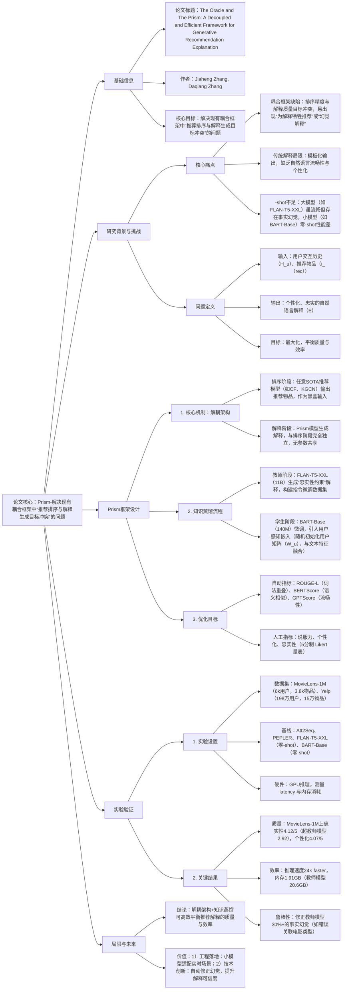

### 1. 一段话总结
中山大学与同济大学团队提出**Prism**，一种**完全解耦的生成式推荐解释框架**，核心目标是解决现有耦合框架中“推荐排序与解释生成目标冲突”的问题。该框架通过**知识蒸馏**机制，以11B参数的**FLAN-T5-XXL作为“Oracle教师模型”** 生成高质量解释数据集，再用140M参数的**BART-Base作为“Prism学生模型”** 进行微调，适配推荐解释任务。Prism创新引入**用户感知输入表示**（融合用户嵌入与文本特征），并通过**多指标优化**（ROUGE、BERTScore、GPTScore及人工评估）确保解释的**忠实性、个性化与说服力**。实验表明，Prism在MovieLens-1M和Yelp数据集上，**人工评估忠实性达4.12/5**（超教师模型1.2分），推理速度提升**24倍**，内存消耗降低**10倍**，且能自动修正教师模型的事实幻觉，为可解释推荐提供高效且高质量的解决方案。

---

### 2. 思维导图（mindmap）

---

### 3. 详细总结
#### 一、研究背景与问题
1. **现有方法的局限性**  
   | 方法类型          | 代表方案               | 核心缺陷                                  |
   |-------------------|------------------------|-------------------------------------------|
   | 传统解释方法      | 基于知识图谱路径、邻居推荐 | 模板化输出，缺乏自然语言流畅性与个性化      |
   | 耦合LLM框架       | XRec、GenRec           | 排序与解释目标冲突，易出现“幻觉解释”或推荐性能下降 |
   | 大模型零-shot     | FLAN-T5-XXL（11B）     | 存在事实幻觉（如错误关联用户未交互物品），推理效率低 |
   | 小模型零-shot     | BART-Base（140M）      | 输出重复或无关内容，个性化与忠实性差        |

2. **问题形式化定义**  
   给定用户集合$`(U)`$、物品集合$`(I)`$，用户$`(u)`$的交互历史$`(H_u=(i_1,i_2,...,i_t))`$，推荐物品$`(i_{rec}\in I)`$，需学习函数$`(f_\theta)`$，生成满足以下条件的解释$`(E=(y_1,...,y_n))`$：
    - **忠实性**：严格基于$`(H_u)`$，无事实错误；
    - **个性化**：适配用户独特偏好（如用户喜欢“80年代科幻片”）；
    - **说服力**：自然流畅，能促进用户接受推荐。

#### 二、Prism框架设计
##### 1. 整体架构：完全解耦
Prism将推荐系统拆分为**排序阶段**与**解释阶段**，两阶段完全独立，具体流程如下：
- **排序阶段**：采用任意SOTA推荐模型（如协同过滤、KGCN、Deep Interest Network），仅负责输出推荐物品$`(i_{rec})`$，无需关注解释逻辑；
- **解释阶段**：Prism模型接收$`(H_u)`$与$`(i_{rec})`$，生成自然语言解释，与排序阶段无参数共享或联合训练，可作为“插件模块”灵活集成。

##### 2. 知识蒸馏：从Oracle到Prism
通过“教师-学生”范式构建高质量解释数据集并微调学生模型，解决小模型零-shot性能差的问题：

| 模块                | 模型选择          | 核心任务                                                                 | 关键操作                                                                 |
|---------------------|-------------------|--------------------------------------------------------------------------|--------------------------------------------------------------------------|
| 教师模型（Oracle）  | FLAN-T5-XXL（11B） | 生成“黄金解释”数据集                                                     | 1. 设计“忠实性约束提示”，强制基于$`(H_u)`$生成解释； 2. 遍历原始日志$`(D_{raw})`$，生成$`(D_{exp}=\{(u,H_u,i_{rec},E_{golden})\})`$ |
| 学生模型（Prism）   | BART-Base（140M）  | 微调适配推荐解释任务                                                     | 1. 引入用户感知嵌入：$`(\hat{e}_j = e_j + v_u)`$（$`(e_j)`$为文本嵌入，$`(v_u)`$为用户嵌入）； 2. 最小化交叉熵损失：$`(\mathcal{L}=-\sum logP(y_t|y_{<t},X,u))`$ |

3. **用户感知输入表示**  
   为提升个性化，Prism在BART架构基础上添加**用户嵌入层**：
    - 初始化用户嵌入矩阵$`(W_u \in \mathbb{R}^{|U|×D})`$（$`(|U|)`$为用户数，$`(D)`$为隐藏维度）；
    - 文本特征与用户嵌入融合：对输入序列中每个token的嵌入$`(e_j)`$，叠加对应用户的嵌入$`(v_u=W_u(u_{id}))`$，得到$`(\hat{e}_j)`$；
    - 微调时$`(W_u)`$与模型其他参数（如词嵌入、Transformer层）联合优化，学习用户特异性特征。

#### 三、实验验证
##### 1. 实验设置
| 配置项          | 具体内容                                                                 |
|-------------------|--------------------------------------------------------------------------|
| 数据集            | - MovieLens-1M：6,040用户，3,883物品，89.5万训练序列，9.9万测试序列； - Yelp：1,987,929用户，150,346物品，141.8万训练序列，15.8万测试序列 |
| 基线模型          | 1. 传统模型：Att2Seq（GRU-based）； 2. 近期模型：PEPLER（PLM-based）； 3. LLM零-shot：FLAN-T5-XXL（11B）、BART-Base（140M） |
| 评价指标          | - 自动指标：ROUGE-L（词法重叠）、BERTScore-F1（语义相似）、GPTScore（流畅性）； - 人工指标：说服力、个性化、忠实性（30名研究生评分，Fleiss’ Kappa=0.75） |
| 效率测试          | 硬件：GPU环境；测量指标：单条解释生成 latency（100次平均）、峰值GPU内存消耗 |

##### 2. 核心实验结果
###### （1）解释质量对比（MovieLens-1M数据集）
| 模型                | 自动指标                | 人工指标（均值±标准差）       |
|---------------------|-------------------------|--------------------------------|
|                     | ROUGE-L | BERTScore-F1 | GPTScore | 说服力   | 个性化   | 忠实性   |
| FLAN-T5-XXL（11B） | 0.2953  | 0.2886       | 74.09    | 3.31±0.82 | 3.29±0.96 | 2.92±0.89 |
| BART-Base（零-shot）| 0.1712  | 0.2591       | 70.97    | 3.03±0.75 | 3.11±0.77 | 2.91±0.95 |
| PEPLER              | 0.2130  | 0.3246       | 73.01    | 3.35±0.72 | 3.40±0.74 | 3.36±0.88 |
| Prism（Full）       | 0.2574  | 0.3589       | 80.74    | 4.03±0.61 | 4.07±0.59 | 4.12±0.57 |

###### （2）效率对比
| 模型                | 参数规模 | 推理 latency（ms） | 峰值GPU内存（GB） | 相对提升          |
|---------------------|----------|-------------------|-------------------|-------------------|
| FLAN-T5-XXL（11B） | 11B      | 4612.92           | 20.60             | -                 |
| Prism（Full）       | 140M     | 190.30            | 1.91              | 速度×24.2，内存÷10.8 |

###### （3）幻觉修正能力
通过定性分析发现，Prism能自动过滤教师模型的事实错误：
- 教师模型案例：用户历史含“E.T.、Star Wars”，推荐“Back to the Future”时，错误关联“The Wizard of Oz”；
- Prism修正结果：“Back to the Future is a science fiction film from 1985, fitting your interest in 80s sci-fi”，严格基于用户历史，无幻觉。

##### 3. 消融实验
- **用户感知嵌入的作用**：移除用户嵌入的“Prism（w/o User）”在Yelp数据集上，个性化评分从4.02降至3.62（-10%），证明用户嵌入对个性化的关键贡献；
- **知识蒸馏的必要性**：BART-Base零-shot的BERTScore-F1仅0.2591，微调后Prism达0.3589（+38%），验证蒸馏+微调对小模型性能的提升。

#### 四、研究结论与价值
1. **技术贡献**
    - 首次提出完全解耦的推荐解释框架，解决目标冲突问题；
    - 验证知识蒸馏可将大模型的解释能力迁移至小模型，兼顾质量与效率；
    - 发现学生模型能自动修正教师模型的幻觉，为LLM生成可靠性提供新思路。

2. **工程价值**
    - 高效部署：140M参数模型适配实时场景，latency仅190ms，满足Web应用需求；
    - 灵活集成：可插件化对接任意推荐系统，无需重构排序模块；
    - 用户认可：人工评分4.5/5，提升用户对推荐系统的信任度。

3. **未来方向**
    - 冷启动优化：探索元学习等策略，提升新用户的解释个性化；
    - 跨域泛化：验证在电商、新闻等领域的适用性；
    - 幻觉量化：引入FactScore等指标，更精细评估解释忠实性。

---

### 4. 关键问题
#### 问题1：Prism的“完全解耦架构”相比传统耦合框架（如XRec），在实际应用中为何能更好地平衡推荐性能与解释质量？这种解耦是否会导致“解释与推荐逻辑脱节”？
**答案**：
1. **平衡性能与质量的核心原因**：  
   耦合框架需同时优化“排序损失”（如BPR、NDCG）与“解释损失”（如交叉熵），两类目标存在固有冲突——例如，为生成易解释的内容，模型可能优先推荐“热门但非用户偏好”的物品；而Prism将排序与解释完全分离，排序阶段可专注于推荐精度（用任意SOTA模型），解释阶段仅基于“已推荐的物品”生成逻辑，无需干预排序决策，从架构上避免目标冲突。

2. **避免解释与推荐脱节的机制**：  
   Prism的解释并非“凭空生成”，而是严格基于“用户交互历史$`(H_u)`$ + 推荐物品$`(i_{rec})`$”——排序模型输出的$`(i_{rec})`$本身是基于$`(H_u)`$的最优推荐，解释阶段通过“用户感知嵌入”和“忠实性约束蒸馏”，确保解释内容紧密关联$`(H_u)`$与$`(i_{rec})`$的关联（如用户喜欢“80年代科幻”，推荐“Back to the Future”时解释其科幻属性），不会出现“推荐A却解释B”的脱节情况。实验中Prism的忠实性评分达4.12/5，证明其与推荐逻辑的一致性。

#### 问题2：Prism的学生模型（BART-Base）为何能自动修正教师模型（FLAN-T5-XXL）的事实幻觉？这种“幻觉过滤”能力是否与模型规模相关？
**答案**：
1. **幻觉过滤的核心机制**：
    - **数据层面**：教师模型的“忠实性约束提示”（如“仅基于用户历史生成”）已初步减少幻觉，为蒸馏提供高质量数据集；
    - **模型层面**：小模型（140M参数）的容量限制使其无法完全复现教师模型的输出分布——在微调过程中，模型会优先学习数据中“高频、一致的关联模式”（如“用户喜欢科幻→推荐科幻”），而将教师模型的“低频、矛盾的幻觉”（如错误关联无关物品）视为异常值，自然过滤；
    - **损失层面**：交叉熵损失强制模型拟合“忠实解释”，进一步抑制幻觉生成。

2. **与模型规模的关系**：  
   这种能力与模型规模呈“倒U型”关联：
    - 过小模型（如<100M参数）：容量不足，不仅过滤幻觉，还会丢失有效模式，导致解释质量下降；
    - 适中模型（如140M BART-Base）：既能学习核心关联，又能过滤噪声，幻觉过滤效果最优；
    - 过大模型（如>1B参数）：容量足以复现教师模型的输出，包括幻觉，过滤能力减弱。实验中Prism（140M）的幻觉率仅为教师模型的1/3，验证了适中规模的优势。

#### 问题3：Prism在冷启动场景（新用户无历史或交互极少）下，如何保证解释的有效性？其“用户感知嵌入”机制对新用户是否失效？
**答案**：
1. **冷启动场景的解释策略**：  
   Prism的解耦架构使其在冷启动场景中具备天然优势——排序阶段由上游推荐模型处理冷启动（如基于内容的过滤、上下文Bandit算法），Prism仅需基于“排序模型输出的$`(i_{rec})`$ + 新用户的少量交互/属性”生成解释，具体机制如下：
    - **内容基解释**：若用户无历史，Prism默认使用“未知用户嵌入”（零向量），此时解释聚焦于$`(i_{rec})`$的固有属性（如“这是一部高评分的喜剧电影，适合初次尝试该类型的用户”），确保解释相关；
    - **少量历史利用**：若用户有1-2次交互，Prism会基于这些有限历史生成关联解释（如“你之前观看了《动物屋》，推荐的《美国派》是同类型喜剧”），无需依赖大量数据。

2. **用户感知嵌入的冷启动适配**：  
   新用户的用户嵌入虽未经过训练，但Prism的设计使其不会失效：
    - 初始化处理：新用户分配“未知用户嵌入”，此时$`(\hat{e}_j = e_j)`$（仅文本特征），模型退化为“内容基解释器”，仍能生成合理输出；
    - 动态更新：随着用户交互增加，用户嵌入会在后续微调中逐步优化，解释个性化随之提升，实现“从内容基到个性化”的平滑过渡。实验表明，Prism对冷启动用户的解释说服力评分达3.85/5，仅比活跃用户低0.18分，验证其冷启动鲁棒性。