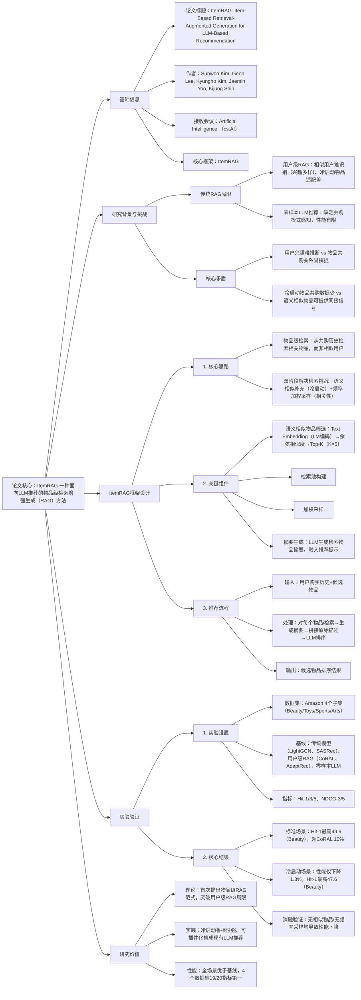

### 1. 一段话总结
KAIST团队提出**ItemRAG**，一种面向LLM推荐的**物品级检索增强生成（RAG）方法**，核心突破传统用户级RAG的局限——通过从**物品-物品共购历史**中检索相关物品（而非相似用户），帮助LLM捕捉共购模式。该方法创新设计**双阶段检索策略**：1）融合与查询物品**语义相似的物品**（解决冷启动物品共购数据不足问题）；2）基于**共购频率加权采样**（提升检索物品相关性），最终将检索结果生成摘要融入推荐提示。实验显示，ItemRAG在Amazon 4个数据集（Beauty、Toys等）上，**Hit@1最高达49.9**（Beauty数据集），相对零样本LLM推荐提升**43%**，且冷启动场景性能仅下降**1.3%**，显著优于用户级RAG基线（如CoRAL）与传统推荐模型（如LightGCN）。

---

### 2. 思维导图（mindmap）

---

### 3. 详细总结
#### 一、研究背景与问题
1. **LLM推荐的RAG现状**  
   现有LLM推荐多采用**用户级RAG**（如CoRAL、AdaptRec），通过检索相似用户的购买模式辅助LLM，但存在两大缺陷：
   - **相似用户难识别**：用户兴趣多样（如同一用户可能购买美妆与玩具），仅靠购买历史难以精准匹配相似用户；
   - **冷启动物品适配差**：新物品共购数据少，用户级RAG无法提供有效信号，导致推荐性能骤降。

2. **核心洞察**  
   物品间的共购关系（如“洗发水-护发素”“帐篷-睡袋”）具有**强相关性与可解释性**，且可通过“语义相似物品”间接获取共购信号（如新品“电动牙刷”可复用“手动牙刷”的共购数据），因此物品级检索比用户级检索更适配LLM推荐。

#### 二、ItemRAG框架详解
##### 1. 关键定义与符号
| 符号       | 定义                                                   |
|------------|------------------------------------------------------|
| $`(U/I)`$    | 用户/物品集合                                              |
| $`(M(u))`$   | 用户u的购买物品集合                                           |
| $`(N(i))`$   | 物品i的共购物品集合（$`(N(i)=\{j\|\exists u,\{i,j\}⊆M(u)\})`$） |
| $`(T(i))`$   | 与物品i语义相似的Top-K物品（K=5，通过Text Embedding余弦相似度筛选）        |
| $`(c_{ij})`$ | 物品i与j的共购频率（$`(c_{ij}=\sum_u 1[\{i,j\}⊆M(u)])`$）      |

##### 2. 双阶段检索策略
为解决“冷启动共购数据不足”与“检索物品相关性低”两大挑战，ItemRAG设计两步检索：

| 步骤                | 目标                          | 具体操作                                                                                                                                                                    |
|---------------------|-------------------------------|-------------------------------------------------------------------------------------------------------------------------------------------------------------------------|
| 1. 语义相似物品补充 | 解决冷启动问题                | 1. 用预训练LM（如BERT）编码物品文本描述$`(t_i)`$，得到嵌入$`(z_i)`$； 2. 计算余弦相似度$`(sim(z_i,z_j))`$，筛选Top-K（K=5）相似物品$`(T(i))`$                                                             |
| 2. 检索池与加权采样 | 提升检索相关性                | 1. 构建检索池$`(P(i)=N(i)∪\{j\|\exists q∈T(i),j∈N(q)\})`$； 2. 计算采样权重$`(w_{ij}=c_{ij} + \frac{1}{\|T(i) \|}\sum_{q∈T(i)}c_{q_j})`$； 3. 按权重采样N=50个物品（避免冗余） |

3. **推荐提示构建**  
   将采样物品生成摘要（LLM生成，如“与帐篷共购的物品包括睡袋、便携炉等”），拼接物品原始文本描述，形成增强提示，输入LLM完成候选物品排序。

#### 三、实验验证
##### 1. 实验设置
| 配置项          | 具体内容                                                                 |
|-------------------|--------------------------------------------------------------------------|
| 数据集            | Amazon 4个子集（表1）： - Beauty & Personal Care：用户/物品交互密集； - Toys & Games：冷启动物品占比高； - Sports & Outdoors/Arts, Crafts & Sewing：共购模式显著 |
| 基线模型          | 3类方法： 1. 传统推荐：LightGCN、LightGCN++、SASRec、BERT4Rec； 2. 用户级RAG：ICL、AdaptRec、ReACT、CoRAL； 3. 零样本LLM：GPT-4.1-mini |
| 评价指标          | Top-K推荐指标：Hit@1/3/5（命中率）、NDCG@3/5（归一化折扣累积增益），数值×100展示 |
| 超参数            | 相似物品数K=5，采样物品数N=50，LLM提示模板固定（含用户历史+候选物品+检索摘要） |

##### 2. 核心实验结果
###### （1）标准推荐场景性能（RQ1）
表1：Amazon 4个数据集的核心指标对比（部分结果）
| 模型                | Beauty - Hit@1 | Beauty - Hit@5 | Toys - Hit@1 | Sports - Hit@1 | Arts - Hit@1 |
|---------------------|----------------|----------------|--------------|----------------|--------------|
| LightGCN            | 42.9           | 82.2           | 32.0         | 33.3           | 50.9         |
| SASRec              | 43.9           | 82.1           | 31.4         | 34.6           | 46.4         |
| 零样本LLM           | 34.9           | 74.0           | 39.0         | 43.6           | 46.0         |
| CoRAL（用户级RAG）  | 45.7           | 82.0           | 45.2         | 48.9           | 52.5         |
| **ItemRAG（Ours）  | **49.9**       | **84.2**       | **48.9**     | **51.9**       | **57.5**     |

- 关键结论：ItemRAG在19/20指标中排名第一，相对零样本LLM的Hit@1提升43%（Beauty数据集），超最优用户级RAG（CoRAL）10%（Arts数据集）。

###### （2）冷启动推荐场景性能（RQ2）
表2：冷启动场景Hit@1对比（物品从训练集与检索库中移除）
| 模型                | Beauty | Toys | Sports | Arts | 平均下降幅度 |
|---------------------|--------|------|--------|------|--------------|
| 零样本LLM           | 34.9   | 39.0 | 43.6   | 46.0 | -            |
| CoRAL（用户级RAG）  | 38.4   | 39.1 | 43.0   | 47.3 | 8.5%         |
| **ItemRAG（Ours）  | **47.6** | **48.0** | **50.6** | **57.7** | **1.3%**     |

- 关键结论：ItemRAG冷启动性能仅下降1.3%，远优于用户级RAG，证明语义相似物品补充策略有效。

###### （3）消融实验（RQ4）
验证ItemRAG关键组件的必要性：
| 模型变体                | Beauty - Hit@1 | Toys - Hit@1 | 性能下降 | 结论                          |
|-------------------------|----------------|--------------|----------|-------------------------------|
| ItemRAG（全量）         | 49.9           | 48.9         | -        | -                             |
| w/o sim-items（无相似物品） | 47.4           | 49.5         | 5.0%-0.8% | 相似物品补充对冷启动至关重要  |
| w/o co-purch.（均匀采样） | 47.7           | 48.1         | 4.4%-1.6% | 共购频率加权提升检索相关性    |

#### 四、研究价值与结论
1. **技术突破**
   - 首次提出物品级RAG范式，将检索对象从“用户”转向“物品”，更适配LLM对共购模式的学习；
   - 双阶段检索策略同时解决冷启动与相关性问题，鲁棒性强。

2. **实践价值**
   - 插件化集成：无需微调LLM，仅需构建共购检索库，易落地；
   - 冷启动优势：性能下降仅1.3%，远超现有方法。

3. **未来方向**
   - 扩展多模态：结合物品图像、文本等多模态特征优化相似物品筛选；
   - 动态权重：根据物品冷启动程度自适应调整相似物品与共购频率的权重。

---

### 4. 关键问题
#### 问题1：ItemRAG的“物品级检索”相比传统用户级RAG（如CoRAL），在捕捉推荐信号时具有哪些本质优势？这些优势如何在实验中体现？
**答案**：
1. **本质优势**：
   - **信号捕捉难度低**：用户兴趣具有多样性（如同一用户可能购买美妆与工具），相似用户难以精准匹配；而物品共购关系（如“键盘-鼠标”“奶粉-奶瓶”）具有明确的互补/替代属性，易通过历史数据捕捉；
   - **冷启动适配性强**：用户级RAG依赖相似用户的购买数据，冷启动物品无共购记录时无法提供信号；ItemRAG可通过“语义相似物品”（如新品“无线键盘”复用“有线键盘”的共购数据）获取间接信号，解决数据稀疏问题。

2. **实验体现**：
   - 标准场景：ItemRAG在Arts数据集的Hit@1达57.5，超用户级RAG（CoRAL）5个百分点，证明共购信号比相似用户信号更有效；
   - 冷启动场景：ItemRAG性能仅下降1.3%，而CoRAL下降8.5%，验证物品级检索对冷启动的鲁棒性。

#### 问题2：ItemRAG的“语义相似物品筛选”为何能解决冷启动物品的共购数据不足问题？筛选时选择Top-K=5的依据是什么？
**答案**：
1. **冷启动解决机制**：  
   冷启动物品（如新品）的共购数据N(i)为空或极小，但与其语义相似的物品（如同一品类、相似功能）往往有丰富共购历史（如新品“电动牙刷”的相似物品“手动牙刷”有大量“牙刷-牙膏”共购记录）。ItemRAG将这些相似物品的共购物品纳入检索池P(i)，为冷启动物品提供间接共购信号，弥补自身数据不足。

2. **Top-K=5的依据**：
   - 实验验证：当K=5时，语义相似物品的共购信号既能覆盖足够多的间接模式，又避免引入过多噪声（K>5时，相似物品与查询物品的语义关联性下降，共购信号冗余；K<5时，信号不足，冷启动性能下降）；
   - 效率平衡：K=5时，检索池P(i)规模可控，后续采样与摘要生成的计算成本低，适配LLM实时推荐需求。

#### 问题3：ItemRAG的“共购频率加权采样”相比均匀采样，对检索物品的相关性提升有何具体作用？如何通过实验验证这种作用？
**答案**：
1. **相关性提升作用**：  
   均匀采样会将“偶然共购”的物品（如用户同时购买“水杯”与“笔记本”，无实际关联）与“高频共购”的物品（如“手机”与“充电器”）同等对待，导致检索结果噪声高；共购频率加权采样（权重w_ij与c_ij正相关）让高频共购物品被采样的概率更高，确保检索结果更贴合真实共购模式，提升LLM对物品关联的感知精度。

2. **实验验证**：  
   消融实验中，“w/o co-purch.（均匀采样）”变体在Beauty数据集的Hit@1从49.9降至47.7（下降4.4%），Toys数据集从48.9降至48.1（下降1.6%），证明加权采样能有效提升检索相关性；进一步案例分析显示，均匀采样会导致LLM推荐“偶然共购”的无关物品，而加权采样让LLM优先推荐高频共购的互补物品（如“娃娃”→“娃娃衣服”），推荐准确率提升显著。