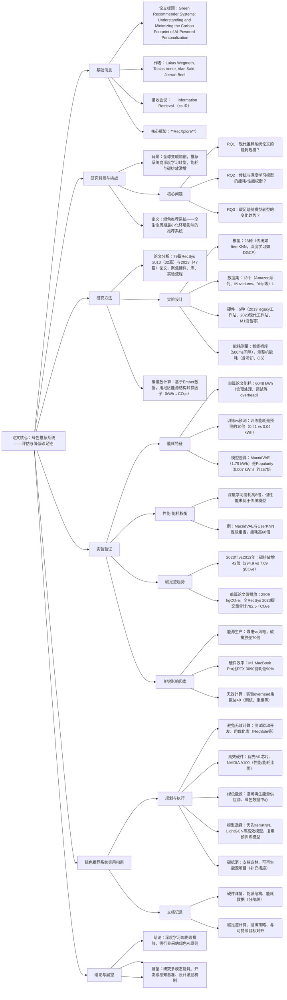

### 1. 一段话总结
为评估AI驱动个性化推荐系统的环境影响，研究通过分析2013与2023年ACM RecSys会议的**79篇论文**，复现代表性实验 pipeline 并借助硬件能量计测量能耗，发现：深度学习推荐模型的碳排放是传统模型的**42倍**，单篇深度学习论文平均产生**2909 kilograms of CO₂ equivalents**（超过纽约至墨尔本的航班碳排放或单棵树260年的固碳量）；训练阶段能耗是预测阶段的10倍，且硬件效率、能源结构、无效计算是核心影响因素。基于此，研究提出**绿色推荐系统（Green Recommender Systems）** 实用指南，涵盖高效硬件选择、绿色能源优先、能耗测量报告等策略，为平衡算法进步与环境责任提供解决方案。

---

### 2. 思维导图

---

### 3. 详细总结
#### 1. 研究背景与核心目标
1.1 时代背景  
全球变暖倒逼碳排放削减（UNFCCC目标控温1.5℃），而推荐系统向深度学习转型导致计算量激增，能耗与碳排放问题被学界忽视，仅少数研究提及“绿色推荐系统”概念。

1.2 核心定义  
**绿色推荐系统（Green Recommender Systems）**：全生命周期（研发、部署、运行）中以最小化能源消耗与碳足迹为目标设计的系统，可在性能与可持续性间权衡。

1.3 研究目标  
回答三大问题：①现代推荐系统论文的能耗规模；②传统与深度学习模型的能耗-性能权衡；③碳足迹随模型转型的变化趋势，并提出减排指南。

#### 2. 研究方法
2.1 论文分析  
选取2013（32篇）与2023（47篇）ACM RecSys主会场论文，对比关键特征：
| 统计维度 | 2013年 | 2023年 |
|----------|--------|--------|
| 披露硬件比例 | 19%（仅Intel Xeon CPU） | 32%（以NVIDIA V100为主） |
| 主流库 | 自定义实现为主（84%） | PyTorch/TensorFlow（53%） |
| 代码公开比例 | 3% | 62% |
| 核心任务 | 评分预测（56%） | Top-N排序（94%） |
| 平均数据集数量 | 2.19个 | 2.85个 |

2.2 实验设计
- **模型与数据集**：23种模型（传统如ItemKNN、SVD；深度学习如DGCF、MacridVAE），13个代表性数据集（含Amazon 2018系列、MovieLens、Yelp等）。
- **硬件配置**：5种跨年代设备，覆盖不同能效：
  | 设备 | 发布年份 | 核心配置 |  idle功耗 | 最大功耗 |
  |------|----------|----------|-----------|----------|
  | Legacy工作站 | 2013 | Intel i7-6700K + GTX 980 Ti | 67W | 139W |
  | 现代工作站I | 2023 | Intel Xeon W-2255 + RTX 3090 | 116W | 547W |
  | MacBook Pro | 2020 | M1芯片 | 1W | 21W |
- **能耗测量**：采用智能插座（Shelly Plus Plug S），500ms间隔采集整机能耗（含CPU、GPU、冷却等），同步实验日志计算净能耗。
- **碳排放计算**：基于Ember数据集的地区能源转换因子（如全球平均481 gCO₂e/kWh，瑞典45 gCO₂e/kWh，亚洲535 gCO₂e/kWh）。

2.3 评估指标
- 能耗：千瓦时（kWh）
- 碳排放：二氧化碳当量（CO₂e）
- 性能：nDCG@10（排序任务）、RMSE（评分任务）

#### 3. 核心实验结果
3.1 能耗特征
- **单篇论文能耗**：代表性实验 pipeline 能耗151.2 kWh，叠加预处理、调试等overhead（乘数40）后，单篇论文平均能耗达**6048 kWh**。
- **阶段差异**：训练阶段能耗（平均0.41 kWh）是预测阶段（0.04 kWh）的**10倍**；深度学习模型（如DGCF）训练能耗是预测的73倍。
- **模型与数据集影响**：
   - 模型差异：MacridVAE（1.79 kWh）能耗是Popularity（0.007 kWh）的**257倍**。
   - 数据集差异：同一模型在Yelp-2018（330万交互）的能耗是Hetrec-LastFM（5.3万交互）的**1360倍**。

3.2 性能与能耗的权衡  
深度学习模型能耗平均比传统模型高**8倍**（0.68 vs 0.09 kWh），但默认超参下性能无优势：
- 例：UserKNN（传统）与MacridVAE（深度学习）的nDCG@10均约1.7，但后者能耗高**60倍**。
- 超参优化加剧差距：若对两者进行16组网格搜索+5次重复，MacridVAE能耗（143.2 kWh）是UserKNN（2.4 kWh）的**60倍**。

3.3 碳足迹趋势
- **十年增幅**：2023年推荐系统实验的碳足迹是2013年的**42倍**（294.9 vs 7.09 gCO₂e/模型-数据集对）。
- **单篇论文碳排放**：平均**2909 kgCO₂e**，相当于1人纽约→墨尔本航班碳排放，或1棵树260年的固碳量。
- **会议级碳排放**：2023年RecSys 269份提交的实验合计排放**782.5 TCO₂e**，相当于338次纽约→墨尔本航班。

3.4 碳排放关键影响因素
1. **能源生产方式**：煤电（820 gCO₂e/kWh）与风电（11 gCO₂e/kWh）的生命周期排放差**70倍**；瑞典（可再生能源为主）的实验碳排放比亚洲低**90%**。
2. **硬件效率**：M1 MacBook Pro比现代工作站（RTX 3090）能耗低**90%**，相同实验碳排放差**10倍**（14.4 vs 163.5 gCO₂e）。
3. **无效计算**：调试、重跑、超参盲目搜索等overhead使能耗乘数达40，占总能耗的主要部分。

#### 4. 绿色推荐系统实用指南
4.1 规划与执行策略  
| 策略方向 | 具体措施 | 效果/依据 |
|----------|----------|-----------|
| 避免无效计算 | 测试驱动开发、用RecBole等优化库、复用预训练模型 | 减少重跑率，降低overhead |
| 高效硬件选择 | 优先M1芯片、NVIDIA A100（2.5倍性能/30%能耗增） | 能耗降低最高90% |
| 绿色能源优先 | 选可再生能源供应商、AWS等绿色数据中心 | 碳排放降低70倍 |
| 模型选型 | 优先ItemKNN、LightGCN等高效模型 | 能耗低且性能相当 |
| 碳抵消 | 支持造林、可再生能源项目（如One Tree Planted） | 抵消不可避免的排放 |

4.2 文档记录规范  
需公开：①硬件详情（CPU/GPU型号）；②能源结构（可再生能源占比）；③分阶段能耗（训练/预测）；④碳足迹计算与抵消措施；⑤减排策略与可持续目标对齐（如UN SDG 12/13）。

#### 5. 结论与局限
5.1 核心结论
- 深度学习转型使推荐系统碳足迹十年增42倍，单篇论文碳排放达2909 kgCO₂e；
- 能耗与性能无正相关，传统模型可在低能耗下实现相当性能；
- 能源结构、硬件效率、无效计算是减排关键，可通过技术优化与实践规范降低影响。

5.2 研究局限
- 未覆盖多模态、强化学习等新兴模型；
- 未计入硬件生产、数据中心冷却等全生命周期碳排放；
- 未探索减排激励机制（如学术认证、工业标准）。

---

### 4. 关键问题
#### 问题1：推荐系统的碳足迹在2013-2023年间激增42倍的核心驱动因素是什么？现有技术进步为何未能抵消这一增长？
**答案**：核心驱动因素有三：①**模型转型**：从传统模型（ItemKNN、SVD）转向深度学习模型（DGCF、MacridVAE），后者单模型能耗平均是传统的8倍，最高达257倍；②**数据集扩张**：2023年主流数据集（如Yelp-2018，330万交互）规模远大于2013年（如Hetrec-LastFM，5.3万交互），同一模型在大数据集上能耗增1360倍；③**实验复杂度提升**：2023年72%的论文进行超参优化（多为网格搜索），且平均使用2.85个数据集，实验量显著增加。  
现有技术进步（硬件能效提升、可再生能源占比增加）未能抵消的原因：硬件能效提升（如M1芯片比2013年CPU高效10倍）被深度学习模型的高能耗抵消，而全球平均可再生能源占比仍较低，无法覆盖计算量激增带来的排放增量。

#### 问题2：深度学习模型与传统推荐模型在能耗、性能及碳足迹上的关键权衡是什么？这对实际推荐系统部署有何启示？
**答案**：关键权衡在于：①**能耗与碳足迹**：深度学习模型平均能耗是传统模型的8倍，碳足迹相应高8倍以上（如MacridVAE碳排放294.9 gCO₂e，UserKNN仅7.09 gCO₂e）；②**性能**：默认超参下，深度学习模型的nDCG@10等指标与传统模型相当（如两者均约1.7），未体现性能优势；③**长期成本**：部分深度学习模型（如MacridVAE）预测阶段能耗低，7次预测后总能耗可低于传统模型（如SVD），但需足够的预测频次支撑。  
启示：①非关键场景（如音乐推荐）优先选择ItemKNN等传统模型，平衡成本与性能；②高精准需求场景（如电商推荐）可采用深度学习，但需优化训练流程（如早停、预训练）；③部署时优先选择绿色数据中心与高效硬件，降低碳排放。

#### 问题3：从技术优化与实践规范两个层面，减少推荐系统碳足迹的核心策略有哪些？请结合具体数据说明其有效性。
**答案**：
1. **技术优化层面**：
   - ①**硬件选择**：采用M1芯片等高效硬件，能耗比RTX 3090降低90%，相同实验碳排放从163.5 gCO₂e降至14.4 gCO₂e；
   - ②**模型选型**：用LightGCN（0.12 kWh）替代DGCF（1.45 kWh），能耗降低92%，且性能相当；
   - ③**能源结构优化**：选择瑞典等可再生能源为主的地区运行实验，碳排放比亚洲低90%（74 TCO₂e vs 875.6 TCO₂e）。

2. **实践规范层面**：
   - ①**避免无效计算**：采用测试驱动开发与优化库，减少实验overhead（乘数从40降至5），单篇论文能耗从6048 kWh降至1890 kWh；
   - ②**能耗透明化**：分阶段报告能耗（训练/预测），可定位高耗环节（如训练占比90%），针对性优化；
   - ③**碳抵消补充**：通过植树等项目抵消排放，如种植42棵树可抵消446.5 kgCO₂e（实验总排放）。

这些策略可使推荐系统碳足迹降低50%-90%，兼顾技术可行性与环境责任。