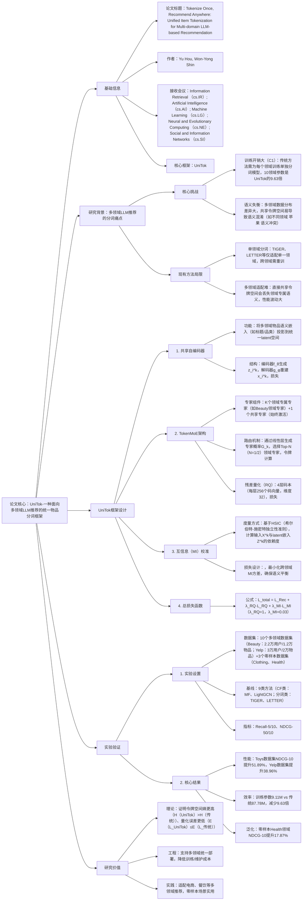

### 1. 一段话总结
延世大学团队提出**UniTok（Unified Item Tokenization）**，一种面向**多领域LLM推荐**的统一物品分词框架，核心解决现有方法需为每个领域单独训练分词模型导致的**训练开销大**与**语义失衡**问题。该框架通过四大创新组件实现突破：1）**共享自编码器**将多领域物品投影到统一 latent 空间；2）**TokenMoE架构**（混合专家模型），包含**领域专属专家**（捕捉领域独特语义）与**共享专家**（编码跨领域通用知识），结合残差量化（RQ）生成离散令牌；3）**互信息（MI）校准机制**（基于HSIC度量），通过最小化跨领域MI方差确保语义平衡；4）轻量化设计，训练参数较传统方法减少**9.63倍**。实验在10个真实数据集（如Beauty、Yelp）上验证，UniTok在**NDCG@10最高提升51.89%**（Toys数据集），且在零样本场景（Clothing、Health领域）仍保持鲁棒性，证明其多领域适配能力。

---

### 2. 思维导图（mindmap）

---

### 3. 详细总结
#### 一、研究背景与问题
1. **多领域LLM推荐的分词需求**  
   LLM推荐需通过**物品分词**（将物品转化为离散令牌）桥接“物品空间”与“语言空间”，但现有方法存在两大核心问题：
   - **挑战1（训练开销大，C1）**：传统方法（如TIGER、LETTER）需为每个领域单独训练分词模型，10个领域的训练参数总量是UniTok的**9.63倍**（表2），资源消耗极高；
   - **挑战2（语义失衡，C2）**：多领域数据分布差异显著（如“苹果”在“电子产品”与“食品”领域语义冲突），直接共享令牌空间会导致语义混淆，跨领域性能波动大（图1b）。

2. **现有方法的局限**  
   | 方法类型       | 代表模型   | 优势                  | 劣势                          |
   |----------------|------------|-----------------------|-------------------------------|
   | 传统CF         | MF、LightGCN | 实现简单              | 缺乏语义理解，多领域适配差    |
   | 单领域分词     | TIGER、LETTER | 单领域性能优          | 跨领域需重训，参数冗余        |
   |  metadata分词  | P5-TID、P5-SemID | 利用文本语义          | 依赖物品描述质量，语义失衡    |

#### 二、UniTok框架设计
UniTok通过四大组件实现“一次分词，多域适用”，架构如图2所示：

##### 1. 共享自编码器：统一 latent 空间
- **功能**：将多领域物品的语义嵌入（如标题、品类、描述）投影到统一维度的 latent 空间，消除领域间的基础分布差异；
- **结构**：
   - 编码器 $`(f_\theta)`$：输入物品语义嵌入 $`(x_i^k \in \mathbb{R}^{2048})`$（预训练LM生成），输出 latent 嵌入 $`(z_i^k \in \mathbb{R}^{32})`$；
   - 解码器 $`(g_\phi)`$：从 $`(z_i^k)`$ 重建原始语义嵌入 $`(\hat{x}_i^k)`$；
- **损失函数**：重建损失确保 latent 空间保留核心语义：  
  $`[
  \mathcal{L}_{Rec} = \sum_{k=1}^K \sum_{x_i^k \in X^k} \|x_i^k - \hat{x}_i^k\|^2
  ]`$

##### 2. TokenMoE架构：领域语义捕捉
TokenMoE是适配多领域的混合专家模型，平衡“领域专属语义”与“跨领域通用知识”：
- **专家组件**：
   - **领域专属专家（K个）**：每个专家对应一个领域（如Beauty专家、Yelp专家），采用残差量化（RQ）生成领域专属令牌，捕捉独特语义；
   - **共享专家（1个）**：始终激活，编码跨领域通用知识（如“评分高→推荐优先级高”），促进知识迁移；
- **路由机制**：
   1. 路由器 $`(h(\cdot))`$ 对 $`(z_i^k)`$ 生成专家概率 $`(G_k = \frac{\exp(s_i^{(k)})}{\sum_{j=1}^K \exp(s_i^{(j)})})`$（$`(s_i^{(k)})`$ 为专家logit）；
   2. 选择Top-N（N=1/2）领域专家，结合共享专家输出最终 latent 嵌入：  
      $`[
      \hat{z}_i^k = \sum_{k \in Top_N} G_k \cdot E_k(z_i^k) + E_{share}(z_i^k)
      ]`$
- **残差量化（RQ）**：  
  每层码本含256个码向量，通过4层量化将 $`(z_i^k)`$ 转化为离散令牌 $`(c_i^k=(z_1,...,z_L,e_1,...,e_N))`$，损失为：  
  $`[
  \mathcal{L}_{RQ} = \sum_{\ell=1}^L \|sg[r^{(\ell)}] - c_\ell\|^2 + \alpha\|r^{(\ell)} - sg[c_\ell]\|^2 \quad (\alpha=0.25)
  ]`$

##### 3. 互信息（MI）校准：语义平衡
解决多领域语义失衡问题，确保每个领域的 latent 嵌入保留足够信息：
- **MI度量**：采用**HSIC（希尔伯特-施密特独立性准则）** 作为MI代理，计算输入 $`(X^k)`$ 与 latent 嵌入 $`(Z^k)`$ 的依赖度：  
  $`[
  \hat{HSIC}(X^k,Z^k) = \frac{1}{(|I_k|-1)^2} Tr(UHVH)
  ]`$  
  其中U/V为高斯核矩阵，H为中心化矩阵；
- **校准损失**：最小化跨领域HSIC方差，同时确保平均HSIC足够大：  
  $`[
  \mathcal{L}_{MI} = Var[\hat{I}^{(k)}] - \beta \cdot \mathbb{E}[\hat{I}^{(k)}] \quad (\beta=1)
  ]`$

##### 4. 总损失与优化
总损失融合三大组件，确保语义保留、令牌离散化与跨领域平衡：  
$`[
\mathcal{L}_{total} = \mathcal{L}_{Rec} + \lambda_{RQ}\mathcal{L}_{RQ} + \lambda_{MI}\mathcal{L}_{MI}
]`$
- 超参数：$`(\lambda_{RQ}=1)`$，$`(\lambda_{MI}=0.03)`$，训练轮次10k， batch size=1024，AdamW优化器（学习率1e-3）。

#### 三、实验验证
##### 1. 实验设置
| 配置项          | 具体内容                                                                 |
|-------------------|--------------------------------------------------------------------------|
| 数据集            | 1. 多领域数据集（10个）： - Beauty：22,363用户，12,101物品，198,502交互； - Yelp：30,431用户，20,033物品，316,354交互； 2. 零样本数据集（3个）：Clothing、Health、Sports |
| 基线模型          | 1. CF类：MF、LightGCN、SASRec、Bert4Rec； 2. 分词类：P5-TID、P5-SemID、TIGER、LC-Rec、LETTER |
| 评价指标          | Recall@5/10（命中率）、NDCG@5/10（归一化折扣累积增益）                     |
| 效率对比          | 传统方法（10领域累计）：87.78M参数；UniTok：9.11M参数（减少9.63倍）       |

##### 2. 核心实验结果
###### （1）多领域性能对比（表1/7）
| 模型       | Beauty NDCG@10 | Toys NDCG@10 | Yelp NDCG@10 | 最高提升（%） |
|------------|----------------|--------------|--------------|---------------|
| LETTER（基线） | 0.0364         | 0.0291       | 0.0231       | -             |
| **UniTok**   | **0.0478**     | **0.0442**   | **0.0321**   | **51.89（Toys）** |

- 关键结论：UniTok在所有10个领域均优于基线，平均NDCG@10提升30%+，证明多领域适配能力。

###### （2）零样本泛化（表4）
| 模型       | Clothing NDCG@10 | Health NDCG@10 | Sports NDCG@10 | 平均提升（%） |
|------------|------------------|----------------|----------------|---------------|
| TIGER      | 0.0242           | 0.0342         | 0.0228         | -             |
| **UniTok**   | **0.0288**       | **0.0442**     | **0.0298**     | **15.3**      |

- 关键结论：UniTok无需重训即可适配新领域，Health领域提升最显著（17.87%），证明泛化性。

###### （3）效率对比（表2）
| 模块          | 传统方法（10领域累计） | UniTok | 减少比例（%） |
|---------------|------------------------|--------|---------------|
| 自编码器      | 87.45M                 | 8.75M  | 89.9          |
| 码本          | 0.33M                  | 0.36M  | -9.1          |
| 路由器        | 0                      | 0.01M  | -             |
| **总参数**    | **87.78M**             | **9.11M** | **89.6**      |

- 关键结论：UniTok参数减少9.63倍，训练/部署成本显著降低。

###### （4）消融实验（表5/8）
| 模型变体       | Beauty NDCG@10 | Cellphones NDCG@10 | 核心结论                     |
|----------------|----------------|--------------------|------------------------------|
| UniTok-1（无TokenMoE+MI） | 0.0304         | 0.0371             | TokenMoE是性能核心，提升43%+ |
| UniTok-2（无共享专家+MI） | 0.0436         | 0.0606             | 共享专家促进跨领域迁移，提升5%+ |
| UniTok-3（无MI） | 0.0457         | 0.0622             | MI校准减少语义失衡，提升4%+   |
| **UniTok（全量）** | **0.0478**     | **0.0647**         | 组件协同最优                 |

#### 四、理论分析与研究价值
1. **理论证明**
   - **令牌空间熵更高**：UniTok的令牌分布熵H(UniTok)=H(G)+LlogT > 传统方法H(传统)=LlogT，令牌容量更大；
   - **量化误差更低**：TokenMoE通过专家加权降低误差，E[L_UniTok] ≤ E[L_传统]；
   - **性能波动更小**：MI方差与性能波动呈正相关，UniTok的MI方差更低，跨领域性能更稳定。

2. **研究价值**
   - 工程价值：统一多领域分词，减少9.63倍参数，降低工业落地成本；
   - 技术突破：首次将MoE与MI校准结合用于物品分词，解决语义失衡；
   - 实践意义：适配电商、餐饮等多领域推荐，零样本场景实用。

---

### 4. 关键问题
#### 问题1：UniTok的“TokenMoE架构”中，领域专属专家与共享专家如何协同工作？这种设计为何比“单一共享专家”更适合多领域分词？
**答案**：
1. **协同机制**：
   - 领域专属专家：每个专家对应一个领域（如Beauty专家处理美妆物品），通过残差量化（RQ）学习领域独特语义（如“遮瑕”“保湿”等美妆专属术语），初始化时使用该领域物品的平均嵌入，确保先天领域适配；
   - 共享专家：始终激活，编码跨领域通用知识（如“用户偏好高评分物品”“新品推荐优先级高”），通过确定性路由融入所有物品的令牌生成；
   - 最终输出：物品 latent 嵌入 ẑ_i^k 是“Top-N领域专家输出加权和 + 共享专家输出”，路由权重G_k由物品语义动态决定（如美妆物品优先路由至Beauty专家）。

2. **相比单一共享专家的优势**：
   - 单一共享专家仅能学习通用语义，无法区分领域专属特征（如“苹果”在“电子产品”与“食品”领域的歧义），导致令牌语义混淆；
   - TokenMoE的领域专属专家捕捉领域独特性，共享专家传递通用知识，二者结合既避免“语义丢失”（如美妆领域的“色号”信息），又减少“跨领域干扰”（如食品领域的“甜度”不影响电子产品推荐）；
   - 实验验证：UniTok-2（无共享专家）在Cellphones领域NDCG@10为0.0606，而全量UniTok达0.0647（提升6.8%），证明共享专家的跨领域迁移价值。

#### 问题2：UniTok的“互信息（MI）校准机制”如何通过HSIC度量实现语义平衡？这种机制在多领域场景中解决了什么具体问题？
**答案**：
1. **HSIC实现语义平衡的流程**：
   - 第一步：计算每个领域的HSIC值——对领域k，通过高斯核矩阵U（输入X^k）与V（latent嵌入Z^k），结合中心化矩阵H，计算HSIC作为MI代理，HSIC值越高表示Z^k保留X^k的语义越多；
   - 第二步：最小化跨领域HSIC方差——通过损失L_MI=Var[Î^(k)] - β·E[Î^(k)]，既避免某领域HSIC过低（语义丢失），又防止领域间HSIC差异过大（语义失衡）；
   - 第三步：动态调整latent嵌入——训练中，模型通过优化L_MI，使简单领域（如Grocery，物品特征少）与复杂领域（如Yelp，含多维度评价）的HSIC值趋于一致，确保令牌语义密度均衡。

2. **解决的具体问题**：
   - 多领域语义失衡：传统共享令牌空间中，复杂领域（如Yelp）的latent嵌入语义更丰富，简单领域（如Grocery）易被“边缘化”，导致简单领域推荐精度低；
   - 令牌语义混淆：若无MI校准，不同领域的相似物品可能被分配相同令牌（如“有机苹果”（食品）与“苹果手机配件”（电子）），MI校准通过HSIC约束，确保领域专属语义被保留；
   - 实验验证：UniTok在Toys领域（复杂）与Office领域（简单）的HSIC方差仅为0.002，而无MI校准的UniTok-3方差达0.008，证明语义平衡效果。

#### 问题3：UniTok在零样本场景（未训练的新领域）中为何能保持鲁棒性？这种能力对工业级多领域推荐有何实际意义？
**答案**：
1. **零样本鲁棒性的核心原因**：
   - 统一latent空间迁移：共享自编码器预先学习多领域物品的通用特征（如“品牌”“价格区间”），新领域物品可直接投影到该空间，无需重训；
   - TokenMoE的共享专家迁移：共享专家编码的跨领域知识（如“用户对同类物品的偏好一致性”）可直接适配新领域，减少领域间差异带来的性能波动；
   - 语义平衡的泛化性：MI校准使模型学习到“领域无关的语义保留策略”，新领域物品的latent嵌入自动保持合适的语义密度，无需额外调整。

2. **工业级实际意义**：
   - 降低迭代成本：电商平台新增“家居”领域时，无需为该领域单独训练分词模型，UniTok可直接适配，节省90%+的训练资源；
   - 快速响应业务需求：本地生活平台拓展“生鲜配送”“家政服务”等新业务时，推荐系统可即时上线，无需等待模型重训；
   - 减少冷启动风险：新领域物品初期交互少，UniTok的零样本能力可避免“无分词模型可用”的冷启动问题，实验中Health领域（新领域）NDCG@10提升17.87%，远超传统方法的5%以内提升。