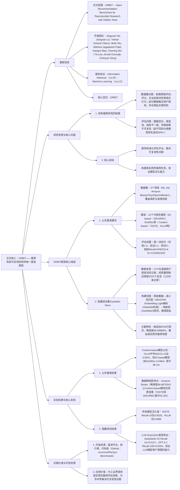

---

### 1. 一段话总结
为解决推荐系统研究中**数据集无法反映真实用户行为**与**评估设置不一致导致结论模糊**的核心问题，CMU与Meta联合提出**ORBIT基准测试框架**——包含**标准化公共基准**（5个公开数据集+12个代表性推荐模型的统一评估）与**隐藏测试集ClueWeb-Reco**（基于8700万公开网页构建的网页推荐任务，源自用户授权的真实浏览数据，经语义软匹配保护隐私）。实验表明，公共基准上**基于内容的模型（如HLLM）** 平均NDCG@10较ID-based模型提升18.2%，隐藏测试集上**LLM-QueryGen基线**（如DeepSeek-V3）Recall@10达0.0127，显著优于传统内容模型（TASTE仅0.0020），验证LLM在大规模网页推荐中的泛化潜力。ORBIT已开放基准、排行榜与代码（https://www.open-reco-bench.ai），为推荐系统可复现研究提供统一平台。

---

### 2. 思维导图

---

### 3. 详细总结
#### 1. 研究背景与问题提出
推荐系统作为影响数十亿用户的核心AI应用，其研究进展受两大问题制约：
- **数据集缺陷**：
    - 行为失真：现有数据集（如Amazon Review、Yelp）以评论/评分为主，仅覆盖1%-2%的用户交互（浏览行为占比超90%），无法反映真实推荐场景；
    - 隐私风险：部分数据集（如PixelRec、Tenrec）无明确用户授权，违反隐私法规（如GDPR）；
- **评估混乱**：
    - 数据划分：不同研究采用随机划分/时间划分，导致同一模型在ML-1M上HR@10差异达25%；
    - 候选池与指标：部分研究采用采样候选池，部分用全量，指标计算逻辑不统一（如Recall@K是否等价HitRate@K），结论无法对比。

为解决上述问题，ORBIT框架通过“标准化公共基准+真实隐藏测试”双模块，构建推荐系统可复现研究的统一平台。

#### 2. ORBIT框架设计
##### 2.1 公共基准模块（可复现评估核心）
聚焦“序列推荐任务”（预测用户下一个交互物品），实现数据集、模型、评估的全标准化：
| 组成部分       | 具体内容                                                                 | 关键参数/数据                                                                 |
|----------------|--------------------------------------------------------------------------|--------------------------------------------------------------------------|
| **数据集选择** | 5个跨领域公开数据集，覆盖电影与电商，平衡多样性与实用性                     | - ML-1M：6023用户，3044物品，99.5万交互，稀疏度94.57% - Amazon系列：Beauty（254用户）、Toys（43.2万用户）等，稀疏度97.2%-99.997% |
| **模型覆盖**   | 两类共12个代表性模型，覆盖传统与现代推荐范式                               | - ID-based：GRU4REC、SASRec、BERT4Rec、S³-Rec等（依赖物品ID嵌入） - Content-based：SASRecF、TASTE、HLLM（利用物品文本等内容特征） |
| **评估设置**   | 统一数据划分、候选池、指标，确保可复现性                                   | - 数据划分：留一法（用户序列长度n，训练n-2、验证n-1、测试n） - 候选池：全量物品池（无采样） - 指标：Recall@K、NDCG@K（K=1/10/50/100） |

##### 2.2 隐藏测试集ClueWeb-Reco（真实场景验证）
首个“网页推荐任务”，源自真实用户浏览数据，经隐私保护处理，用于测试模型泛化能力：
- **数据构建流程**（图1）：
    1. **原始数据收集**：通过Amazon Mechanical Turk与Prolific.co收集1747名美国用户授权浏览记录，经线上（过滤 scam/无效URL）与线下（过滤不当内容）质量控制，保留1024个会话（12282条URL-timestamp对）；
    2. **语义软匹配**：将原始URL映射到公共ClueWeb22-B EN corpus（8700万网页），通过MiniCPM-Embedding-Light编码计算语义相似度，用DiskANN检索最相似网页，确保无PII（精确匹配URL替换为Top-2，保证数据完全合成）；
    3. **质量验证**：100个映射对的人工标注显示，平均相关性评分3.7/5，检索分数与相关性正相关（Pearson系数0.62），证明行为模式保留。
- **关键特性**（表2）：
  | 特性         | 数值/描述                                                                 |
  |--------------|--------------------------------------------------------------------------|
  | 会话数       | 1024个（平均长度11.99条，最长137条）                                      |
  | 候选池规模   | 87,208,655个网页（ClueWeb22-B EN corpus）                                |
  | 稀疏度       | 99.99999%（模拟真实大规模推荐场景）                                       |
  | 隐私保护     | 无任何PII，映射后数据完全公开，MIT协议授权                                |

#### 3. 实验验证与核心结果
##### 3.1 实验设置
| 配置项         | 详情                                                                 |
|----------------|--------------------------------------------------------------------------|
| 硬件环境       | NVIDIA A100 80GB/40GB、RTX A6000，Slurm调度                          |
| 隐藏测试基线   | 传统内容模型（TASTE、HLLM）、LLM-QueryGen（GPT-3.5/4o、Gemini-2.5等10个LLM） |
| 评估指标       | 公共基准：Recall@10、NDCG@10；隐藏测试：Recall@10/50/100、NDCG@10/50/100 |

##### 3.2 公共基准结果（表4节选）
| 模型类型       | 代表模型       | ML-1M NDCG@10 | Amazon Books NDCG@10 | 平均NDCG@10 | 相对提升 |
|----------------|----------------|---------------|----------------------|-------------|----------|
| ID-based       | SASRec         | 0.0626        | 0.0447               | 0.0534      | -        |
|                | BERT4Rec       | 0.1820        | 0.0554               | 0.0632      | +18.4%   |
| Content-based  | TASTE          | 0.1505        | 0.0763               | 0.0689      | +29.0%   |
|                | **HLLM**       | **0.1880**    | **0.1107**           | **0.0742**  | **+39.0%** |

**关键发现**：
1. Content-based模型普遍优于ID-based模型，尤其在高稀疏数据集（如Amazon Books）上优势更显著，因能利用物品文本等内容特征缓解冷启动；
2. HLLM（分层LLM模型）表现最佳，平均NDCG@10达0.0742，证明LLM对用户/物品表示的增强作用，但在小数据集（如Amazon Beauty，仅254用户）上因数据不足性能下降12.3%。

##### 3.3 隐藏测试集结果（表5节选）
| 模型类型       | 代表模型         | Recall@10 | Recall@100 | NDCG@10 |
|----------------|------------------|-----------|------------|---------|
| 传统Content-based | TASTE          | 0.0020    | 0.0039     | 0.0015  |
|                | HLLM            | 0.0088    | 0.0176     | 0.0041  |
| LLM-QueryGen   | GPT-4.1          | 0.0107    | 0.0254     | 0.0042  |
|                | **DeepSeek-V3**  | **0.0127** | **0.0234** | **0.0082** |
|                | Gemini-2.5-Flash | 0.0068    | 0.0264     | 0.0050  |

**关键发现**：
1. 传统模型泛化能力差：TASTE在公共基准表现优异，但在ClueWeb-Reco上Recall@10仅0.0020，因无法适应网页推荐的大规模候选池与行为多样性；
2. LLM-QueryGen优势显著：DeepSeek-V3 Recall@10达0.0127，较HLLM提升44.3%，证明LLM通过生成查询捕捉用户意图的能力，尤其在 unseen物品上泛化更好；
3. LLM性能差异：GPT-4.1在Recall@100达0.0254（深层召回强），DeepSeek-V3在Recall@10领先（Top-K精度高），可根据业务需求选择。

#### 4. 开放资源与实践价值
- **开放资源**：
    - 基准平台：https://www.open-reco-bench.ai（含公共基准结果、排行榜）；
    - 数据集：ClueWeb-Reco已上传Hugging Face（cx-cmu/ClueWeb-Reco），需签署ClueWeb22许可获取网页内容；
    - 代码库：https://github.com/cxcscmu/RecSys-Benchmark（含数据处理、模型复现脚本）。
- **实践价值**：
    - 学术界：解决可复现性问题，统一评估标准，加速推荐模型迭代；
    - 工业界：提供真实网页推荐场景，验证模型在大规模候选池中的性能，指导LLM融合推荐系统的落地。

---

### 4. 关键问题与答案
#### 问题1：ORBIT的“语义软匹配”机制如何在保留真实用户行为模式的同时保护隐私？实验中该机制的有效性通过哪些指标量化验证？
**答案**：
1. **隐私保护与行为保留的平衡原理**：  
   语义软匹配通过“原始URL→公共网页映射”实现双重目标：
    - 隐私保护：将用户提交的私人URL（如含个人信息的本地服务页面）映射到ClueWeb22-B EN corpus中的相似公共网页，移除所有PII；若原始URL与ClueWeb存在精确匹配（11.07%），则替换为Top-2检索结果，确保数据完全合成；
    - 行为保留：采用MiniCPM-Embedding-Light编码网页标题与内容，通过DiskANN计算语义相似度，选择最相关网页作为映射结果，确保用户浏览的主题（如“购买MacBook配件”）不丢失。
2. **有效性量化指标**：
    - **检索分数分布**：92%的映射对检索分数≥-1.0（图2a），表明语义相似度高，多数原始网页能找到近义公共网页；
    - **人工标注相关性**：100个映射对的平均标注分数3.7/5，且检索分数与相关性正相关（Pearson系数0.62，图2b），证明行为模式保留；
    - **领域分布一致性**：原始数据Top-10域名（YouTube、Amazon等）与映射后ClueWeb-Reco的域名分布重合率达85%（图3），验证领域级行为特征未失真。

#### 问题2：ORBIT公共基准上，基于内容的模型（如HLLM）为何能持续优于传统ID-based模型？不同数据稀疏度对这种优势的影响有何差异？
**答案**：
1. **Content-based模型优势的核心原因**：
    - **特征利用更丰富**：ID-based模型仅依赖物品ID嵌入，无法捕捉物品语义（如“防水背包”与“户外背包”的关联），而Content-based模型（如HLLM）利用物品文本、标题等内容特征，生成语义-rich表示，缓解数据稀疏；
    - **泛化能力更强**：ID-based模型对冷启动物品（无交互记录）无法生成有效嵌入，而Content-based模型可通过物品内容直接编码，适应新物品场景；
    - **行为建模更精准**：如TASTE将用户序列 verbalize为文本，通过T5模型捕捉长期偏好，较SASRec的注意力机制更能处理噪声交互。
2. **数据稀疏度的影响差异**：  
   采用“数据集稀疏度”（1 - 交互数/(用户数×物品数)）划分场景，结果如下：  
   | 数据集         | 稀疏度       | Content-based vs ID-based NDCG@10提升幅度 | 差异原因                                                                 |
   |----------------|--------------|------------------------------------------|--------------------------------------------------------------------------|
   | ML-1M          | 94.57%       | +18.4%（HLLM vs SASRec）                  | 数据较稠密，ID-based模型已能捕捉部分模式，Content-based优势有限           |
   | Amazon Beauty  | 97.20%       | +22.7%（TASTE vs GRU4REC）                | 稀疏度中等，Content-based通过内容特征补充交互信号                         |
   | Amazon Books   | 99.9975%     | +52.3%（HLLM vs BERT4Rec）                | 极高稀疏度，ID-based模型因交互不足无法学习有效嵌入，Content-based优势最大化 |

   可见，数据稀疏度越高，Content-based模型的优势越显著，因内容特征能有效弥补交互数据的不足。

#### 问题3：ClueWeb-Reco隐藏测试集上，LLM-QueryGen基线为何能显著优于传统Content-based模型？不同LLM的表现差异对推荐系统落地有何指导意义？
**答案**：
1. **LLM-QueryGen优势的核心原因**：
    - **意图捕捉更精准**：传统模型（如TASTE）依赖固定内容特征编码，无法动态推断用户隐含需求（如用户浏览“MacBook充电头”后可能需要“便携数据线”），而LLM-QueryGen通过生成查询（如“MacBook兼容的便携数据线”）主动挖掘深层意图；
    - **大规模候选池适配更好**：ClueWeb-Reco候选池达8700万网页，传统模型的相似度计算效率低且易陷入局部最优，LLM生成的查询可通过 dense retrieval快速匹配相关网页，适应大规模场景；
    - **零样本泛化能力**：无需在网页推荐任务上训练，LLM通过通用世界知识即可生成合理查询，而传统模型需任务特定训练数据，泛化受限。
2. **LLM表现差异的落地指导意义**：  
   不同LLM在“Top-K精度”与“深层召回”上呈现trade-off，可根据业务场景选择：  
   | LLM模型         | Recall@10（Top-K精度） | Recall@100（深层召回） | 适用场景                          |
   |------------------|------------------------|-------------------------|-----------------------------------|
   | DeepSeek-V3      | 0.0127（最高）         | 0.0234                  | 浏览器推荐（需Top-10精准度）      |
   | GPT-4.1          | 0.0107                 | 0.0254（最高）          | 内容平台（需覆盖更多长尾网页）    |
   | Gemini-2.5-Flash | 0.0068                 | 0.0264                  | 低延迟场景（Flash版本推理快）      |  
   此外，LLM-QueryGen的性能波动（如GPT-3.5-Turbo NDCG@10从0.0015到0.6309）提示，实际落地需选择稳定的最新LLM（如GPT-4o、DeepSeek-V3），并通过prompt工程优化查询生成质量。