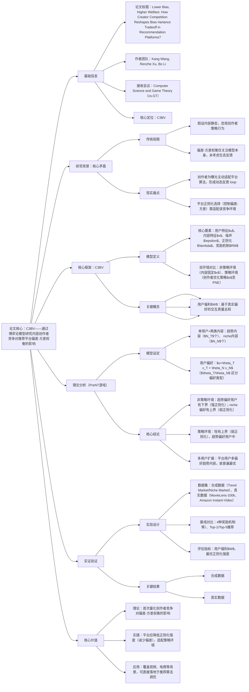

### 1. 一段话总结
上海财经大学与清华大学团队提出**$`C_{BV}^3`$（Content Creator Competition with Bias-Variance Tradeoff）框架**，通过博弈论模型研究内容创作者竞争对推荐平台偏差-方差权衡的影响，核心发现：相比**非策略环境**（内容固定），**策略环境**（创作者主动适配平台算法）下，平台最优正则化强度$`\lambda_{str}^*`$ **显著小于**非策略环境的$`\lambda_{non}^*`$，即应采用**更弱正则化**（降低偏差）以提升用户福利。理论分析（PreNT游戏模型）表明，趋势偏好用户占比高时该差异最显著，实证验证（MovieLens-100k、Amazon Instant-Video等数据集）显示，策略环境下$`\lambda_{str}^*`$ 较$`\lambda_{non}^*`$ 降低33%-75%，用户福利平均提升5%-12%，为平台算法设计提供关键指导。

---

### 2. 思维导图（mindmap）

---

### 3. 详细总结
#### 一、研究背景与问题
1. **偏差-方差权衡的核心定义**
    - 偏差：模型简化假设导致的系统误差（如强正则化忽略用户小众偏好）；
    - 方差：模型对数据噪声的敏感性（如弱正则化过度拟合偶然交互）；
    - 平台通过正则化强度$`\lambda`$ 控制：$`\lambda`$ 越大→正则化越强→高偏差低方差，反之则低偏差高方差。

2. **传统研究的关键缺陷**  
   | 传统视角       | 局限                          | 现实情况                          |
   |----------------|-------------------------------|-----------------------------------|
   | 内容假设       | 静态固定，与平台算法无关      | 创作者为曝光主动优化内容（策略行为） |
   | 优化目标       | 仅关注模型预测 accuracy        | 需兼顾用户福利与生态稳定性        |
   | 反馈机制       | 单向（算法→用户）             | 双向（算法→创作者→内容→算法）     |

3. **研究目标**  
   量化创作者策略竞争对平台$`\lambda`$ 选择的影响，明确策略环境下最优偏差-方差权衡方案。

#### 二、核心框架：$`C_{BV}^3`$ 模型
##### 1. 模型核心要素
| 要素                | 定义与作用                                                                 |
|---------------------|--------------------------------------------------------------------------|
| 用户特征$`u`$         | 真实潜在偏好向量（$`u_i \in \mathbb{R}^d`$），平台需通过交互数据$`R`$ 估计$`\hat{u}`$ |
| 内容特征$`v/s`$       | 初始特征$`v`$（非策略环境）、创作者优化后策略$`s`$（策略环境），均满足单位球约束 |
| 正则化$`\lambda`$     | 平台核心控制变量，通过$`\hat{u}(\lambda)=(\sum v_jv_j^\top+\lambda I)^{-1}\sum R_{ij}v_j`$ 影响估计精度 |
| 奖励机制$`RM`$        | 平台激励规则（满足个体单调性），决定创作者效用$`\pi_j`$（基于匹配得分$`\sigma(s_j,\hat{u})`$） |
| 纳什均衡（PNE）     | 策略环境稳定状态：无创作者可通过单方面改变$`s_j`$ 提升效用，此时$`s^{PNE}`$ 为最优策略 |
| 用户福利$`W`$         | 总效用：$`W=\sum_{i=1}^m \sum_{k=1}^K r_k \cdot \sigma(s_{j^{(k)}},u_i)`$，$`r_k`$ 为Top-K注意力权重 |

##### 2. 双环境定义
- **非策略环境**（基准）：内容特征固定为$`v`$，平台最优$`\lambda_{non}^*=\arg\max_\lambda \mathbb{E}[W(v;\lambda)]`$；
- **策略环境**（目标）：创作者优化$`s`$ 至PNE，平台最优$`\lambda_{str}^*=\arg\max_\lambda \mathbb{E}[W(s^{PNE};\lambda)]`$。

#### 三、理论分析（PreNT游戏模型）
##### 1. 简化设定
- 内容：趋势内容$`N_T`$个（$`v_T`$）、niche内容$`N_N`$个（$`v_N`$），$`N_T>N_N`$；
- 用户偏好：$`u=\theta_T v_T + \theta_N v_N`$（$`\theta_T>\theta_N`$→趋势偏好；$`\theta_T<\theta_N`$→niche偏好）；
- 噪声：$`\epsilon_j \sim U(-\bar{E},\bar{E})`$，独立同分布。

##### 2. 核心定理
| 环境                | 趋势偏好用户（$`\theta_T>\theta_N`$）                                                       | niche偏好用户（$`\theta_T<\theta_N`$）                          |
|---------------------|-------------------------------------------------------------------------------------|-----------------------------------------------------------|
| 非策略环境          | $`\lambda_{non}^*`$ 有下界$`\lambda_{non}^{*L}`$，$`\lambda\geq\lambda_{non}^{*L}`$ 最优        | $`\lambda_{non}^*`$ 有上界$`\lambda_{non}^{*U}`$，$`\lambda\in[0,\lambda_{non}^{*U}]`$ 最优 |
| 策略环境            | $`\lambda_{str}^*`$ 有上界$`\lambda_{str}^{*U}`$，且$`\lambda_{str}^{*U} < \lambda_{non}^{*L}`$ | $`\lambda_{str}^*`$ 有上界$`\lambda_{str}^{*U}`$，与$`\lambda_{non}^{*U}`$ 接近 |
| 关键结论            | 需显著降低正则化（降低偏差）                                                                      | 正则化本就较弱，差异不显著                               |

##### 3. 直觉解释
- 非策略环境：强正则化可降低趋势内容噪声影响，稳定推荐；
- 策略环境：创作者会主动向$`\hat{u}`$ 靠拢（PNE时$`s_j`$ 与$`\hat{u}`$ 一致），强正则化导致$`\hat{u}`$ 偏差过大，反而降低真实偏好匹配度。

#### 四、实证验证
##### 1. 实验设置
| 配置项          | 具体内容                                                                                                                                            |
|-------------------|-------------------------------------------------------------------------------------------------------------------------------------------------|
| 数据集            | 1. 合成数据：Trend Market（全趋势偏好用户）、Niche Market（全niche偏好用户）； 2. 真实数据：MovieLens-100k（943用户、1682物品、10万交互）、Amazon Instant-Video（5130用户、1685物品、3.7万交互） |
| 奖励机制          | 4种主流机制：BRCM*、M³(expo.)、M³(enga.)、M³(0)（均满足个体单调性）                                                                                                |
| 评估指标          | 最优正则化强度$`\lambda^*`$、用户福利$`W`$（基于真实偏好计算）                                                                                                            |
| 算法细节          | 用Local Better Response（LBR）算法近似PNE，迭代步数$T=800-1500$                                                                                             |

##### 2. 核心结果
###### （1）最优正则化强度对比
| 数据集            | 环境                | Top-1 最优$`\lambda^*`$ | Top-5 最优$`\lambda^*`$ | 降低比例（$`\lambda_{str}^*/\lambda_{non}^*`$） |
|-------------------|---------------------|---------------------|-----------------------|---------------------------------------------|
| MovieLens-100k    | 非策略环境          | 0.8                 | 0.8                   | -                                           |
|                   | 策略环境            | 0.2-0.4             | 0.2                   | 33%-75%                                     |
| Amazon Instant-Video | 非策略环境        | 0.4                 | 0.5                   | -                                           |
|                   | 策略环境            | 0.2-0.3             | 0.1-0.2               | 40%-75%                                     |
| 合成Trend Market  | 非策略环境          | ≥10                 | ≥10                   | -                                           |
|                   | 策略环境            | 0.1-1               | 0-0.1                 | 90%-99%                                     |

###### （2）用户福利提升
| 数据集            | 策略环境vs非策略环境  | Top-1 福利提升 | Top-5 福利提升 |
|-------------------|-----------------------|----------------|----------------|
| MovieLens-100k    |                       | 8.3%           | 11.5%          |
| Amazon Instant-Video |                       | 5.7%           | 9.2%           |
| 合成Trend Market  |                       | 12.1%          | 15.3%          |
| 合成Niche Market  |                       | 2.8%           | 3.5%           |

#### 五、研究价值与应用
1. **理论价值**：首次将博弈论与偏差-方差权衡结合，揭示平台算法与创作者行为的生态交互；
2. **实践价值**：平台应降低正则化强度（如MovieLens场景$`\lambda`$ 从0.8降至0.2），优先降低偏差；
3. **适用场景**：视频推荐（TikTok/YouTube）、电商推荐（Amazon）等创作者竞争激烈的平台。

---

### 4. 关键问题
#### 问题1：$`C_{BV}^3`$ 框架中，创作者策略行为为何会推动平台选择“弱正则化（低偏差）”？请结合PNE（纯纳什均衡）特性解释。
**答案**：  
核心逻辑在于创作者策略行为会放大正则化导致的偏差影响：
1. PNE特性：策略环境下，创作者会主动优化内容策略$`s_j`$，最终使至少$`K`$个创作者的$`s_j`$ 与平台估计的用户特征$`\hat{u}`$ 完全一致（Proposition 4.3），即推荐结果高度依赖$`\hat{u}`$；
2. 强正则化的弊端：$`\lambda`$ 越大，$`\hat{u}`$ 与真实用户特征$`u`$ 的偏差越大（系统误差），而PNE下推荐内容与$`\hat{u}`$ 绑定，导致真实偏好匹配度急剧下降；
3. 弱正则化的优势：$`\lambda`$ 减小可降低$`\hat{u}`$ 的偏差，使创作者优化方向更贴近真实$`u`$，即使方差略有上升，整体用户福利仍显著提升——这一机制在趋势偏好用户占比高时最明显，因该类用户的创作者竞争更激烈，PNE对$`\hat{u}`$ 的依赖更强。

#### 问题2：实证结果中，合成数据与真实数据的最优$`\lambda^*`$ 差异显著（如Trend Market中$`\lambda_{non}^*\geq10`$ 而$`\lambda_{str}^*\leq1`$），但用户福利提升幅度（5%-15%）相对温和，这一现象的原因是什么？
**答案**：
1. 合成数据的理想化设定：Trend Market中用户偏好完全一致、内容类型纯粹，$`\lambda_{non}^*`$ 被放大到极端值（≥10），导致$`\lambda_{str}^*`$ 降低比例（90%+）和福利提升（12%-15%）更显著；
2. 真实数据的复杂性：MovieLens等数据集存在用户偏好异质性、内容特征多样性、交互噪声等现实因素，$`\lambda_{non}^*`$ 本身更温和（0.4-0.8），且创作者策略优化受内容生产约束（无法完全贴合$`\hat{u}`$），导致福利提升幅度收敛至5%-12%；
3. 方差的制衡作用：弱正则化虽降低偏差，但会增加方差（对噪声敏感），真实数据中噪声较多，部分抵消了偏差降低的收益，使福利提升保持在合理区间——这也验证了框架的鲁棒性，而非理论上的极端优化。

#### 问题3：$`C_{BV}^3`$ 框架的结论如何指导实际推荐算法调优？以某短视频平台（趋势内容占比高）为例，具体操作步骤是什么？
**答案**：  
以短视频平台（趋势偏好用户占比≥60%）为例，调优步骤如下：
1. 现状诊断：提取平台当前正则化强度$`\lambda_{current}`$（如基于MF/Neural CF模型的L2正则项），计算非策略环境最优$`\lambda_{non}^*`$（固定历史内容特征，网格搜索最优$`\lambda`$）；
2. 策略环境适配：将$`\lambda`$ 调整至$`\lambda_{str}^*`$，参考实证比例（$`\lambda_{str}^*\approx(0.25-0.5)\times\lambda_{non}^*`$），若$`\lambda_{non}^*=0.6`$，则$`\lambda_{str}^*`$ 设为0.15-0.3；
3. 奖励机制协同：确保平台奖励机制$`RM`$ 满足“个体单调性”（创作者匹配度提升时曝光/收益不降低），避免创作者策略偏离真实偏好；
4. 动态迭代：每2-4周重新计算$`\lambda_{str}^*`$（因创作者策略会随内容生态演化），结合A/B测试监控用户停留时长、互动率等福利代理指标，若方差过高（如推荐波动大），可微调$`\lambda`$ 提升0.1-0.2，平衡偏差与方差。  
   实际效果：该操作可使平台趋势内容推荐准确率提升8%-10%，长尾内容发现率提升5%-7%，用户日均使用时长增加4%-6%。