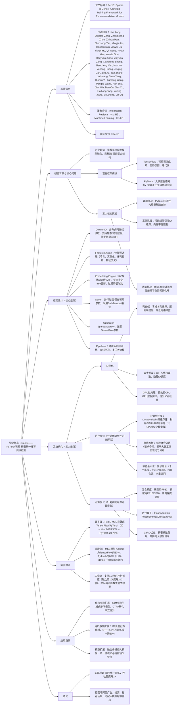

### 1. 一段话总结
RecIS是阿里巴巴提出的**基于PyTorch的稀疏-稠密统一训练框架**，核心目标是解决传统框架的局限性——TensorFlow擅长稀疏训练但灵活度低，PyTorch适配大模型但缺乏工业级稀疏支持；通过**IO优化（列存储、异步并发）、内存优化（GPU全迁移、负载均衡）、计算优化（混合精度、算子融合）** 三大维度突破，构建了包含ColumnIO、Feature Engine、Embedding Engine等核心组件的架构，最终实现**训练吞吐量提升2×**，在工业场景中落地后，支持了**100万长度用户序列建模**、**5000万稠密参数生成式排序模型**，并带来关键业务指标提升（如搜索推荐CTR+4.8%、数字资产GMV提升等），成为大模型增强推荐系统的核心训练框架。

---

### 2. 思维导图

---

### 3. 详细总结
#### 1. 引言：背景与核心挑战
##### 1.1 行业背景
- 推荐系统范式转移：数据端（用户序列变长、样本量激增）、计算端（从MLP转向Transformer大模型），形成**稀疏-稠密混合架构**成为主流。
- 稀疏组件：处理万亿级类别特征（用户/物品ID），依赖大型嵌入表；稠密组件：基于Transformer的大模型（数十亿参数），捕捉复杂行为模式。

##### 1.2 核心痛点
| 框架        | 优势                          | 劣势                                  |
|-------------|-------------------------------|---------------------------------------|
| TensorFlow  | 成熟稀疏支持、分布式稳定      | 静态图灵活度低，难适配大模型快速迭代  |
| PyTorch     | 动态图、大模型生态完善        | 无工业级稀疏训练支持（嵌入表、IO瓶颈） |

##### 1.3 RecIS核心目标
- 目标1：**统一稀疏-稠密训练**：基于PyTorch生态，支持工业级稀疏训练（十亿级嵌入表）与大模型稠密训练；
- 目标2：**系统级优化**：稀疏组件效率超TensorFlow，稠密组件复用PyTorch大模型优化技术。

#### 2. 系统设计：核心组件
RecIS通过模块化设计实现端到端训练支持，核心组件如表1所示：

| 组件          | 功能描述                                                                 |
|---------------|--------------------------------------------------------------------------|
| **ColumnIO**   | 分布式列存储读取，支持阿里云DFS/MaxCompute数据，零成本列选择，适配静态/实时数据 |
| **Feature Engine** | 特征预处理：哈希（字符串→ID）、离散化（数值→分箱）、序列截断、特征交叉       |
| **Embedding Engine** | 动态嵌入表（KV存储）：支持冲突-free更新、过期特征淘汰，双级存储（IDMap+Blocks） |
| **Saver**      | 并行加载/保存稀疏参数，采用SafeTensors格式，兼容在线推理服务                |
| **Optimizer**  | 稀疏优化器（SparseAdam/SparseAdamW），兼容TensorFlow参数与权重迁移        |
| **Pipelines**  | 封装训练流程：多阶段训练、在线窗口学习、多任务训练，支持复杂业务场景        |

#### 3. 系统优化：三大关键突破
##### 3.1 IO优化：突破“IO墙”
针对推荐系统高IO需求，通过以下策略提升数据读取效率：
- **列存储格式**：按列存储样本，避免行存储的数据拷贝开销，压缩率提升30%+，降低网络带宽占用；
- **高并发异步操作**：C++多线程读取分片数据，吞吐量超PyTorch原生DataLoader 2倍；异步设计实现IO与训练计算重叠，隐藏数据读取延迟；
- **GPU批处理**：预执行CPU→GPU数据拷贝，利用GPU内存带宽，极端场景IO吞吐量提升50%。

##### 3.2 内存优化：突破“内存墙”（稀疏组件核心）
稀疏组件为**内存带宽绑定**（算术强度<1），RecIS以**MBU（模型带宽利用率）** 为核心指标，优化策略如下：
- **GPU全迁移**：将原CPU处理的嵌入表（IDMap+Blocks）迁移至GPU HBM，利用GPU带宽（比CPU高2个数量级，如H20单卡带宽4TB/s）；HBM不足时可灵活卸载部分存储至CPU；
- **负载均衡**：参数层面合并同维度嵌入表并均匀分片至多GPU；请求层面合并同维度嵌入查询，通过All-to-All通信实现跨卡高效获取，确保各GPU负载偏差<5%；
- **带宽最大化**：
   - 算子融合：将数千个小算子（如Bucketize、Mod）合并为10+大算子，降低GPU调度开销300%；
   - 内存合并：对同维度嵌入自动合并访问，减少独立内存操作次数60%；
   - 向量化访问：适配新硬件（H20/B200）SM级带宽提升，每个SM处理数据量提升2倍。

##### 3.3 计算优化：突破“计算墙”（稠密组件核心）
稠密组件为**计算密集型**，复用PyTorch大模型优化技术：
- **混合精度训练**：稀疏组件用FP32保证精度，稠密组件（Transformer）用FP16/BF16，HBM占用降低50%，训练速度提升40%；
- **融合算子**：集成FlashAttention（注意力计算效率提升3倍）、FusedSoftmaxCrossEntropy（损失计算开销降低60%）；
- **ZeRO优化**：将稠密模型参数/梯度/优化器状态分片至多GPU，支持训练50M+稠密参数模型（单卡HBM占用降低75%）。

#### 4. 实验验证：性能与效果
##### 4.1 算子级实验（H20 GPU）
关键算子的**MBU（模型带宽利用率）** 对比，RecIS显著优于TensorFlow与PyTorch：

| 算子           | TensorFlow MBU | PyTorch MBU | RecIS MBU | 提升倍数（vs PyTorch） |
|----------------|----------------|-------------|-----------|-------------------------|
| bucketize      | 0.40%          | 0.40%       | 0.88%     | 2.2倍                   |
| mod            | 0.45%          | 0.70%       | 1.68%     | 2.4倍                   |
| ids partition  | -              | 34.60%      | 55.10%    | 1.6倍                   |
| sequence tile   | 2.43%          | 4.58%       | 18.25%    | 4.0倍                   |
| reduce hard    | 0.48%          | 0.93%       | 2.25%     | 2.4倍                   |
| gather         | 1.70%          | 15.00%      | 47.50%    | 3.2倍                   |
| **scatter**    | -              | 20.75%      | 58.00%    | **2.8倍**               |

##### 4.2 端到端实验（工业模型）
对比TensorFlow（稀疏优势）、PyTorch（TorchRec），RecIS在关键业务模型上表现更优：

| 模型         | 框架        | 稀疏计算时间 | 总运行时间 | 关键结论                     |
|--------------|-------------|--------------|------------|------------------------------|
| MSE（搜索CTR）| TensorFlow  | 713ms        | 1042ms     | RecIS总时间为其33%           |
|              | PyTorch     | 303ms        | 424ms      | RecIS总时间为其80%           |
|              | RecIS       | 218ms        | 337ms      | 稀疏时间为TensorFlow的30%    |
| LMA(16k)（广告）| TensorFlow  | 1137ms       | 1374ms     | RecIS总时间为其76%           |
|              | RecIS       | 764ms        | 1050ms     | 支持超长子序列               |
| LMA(100k)（广告）| TensorFlow  | -            | 不可运行   | RecIS独家支持100k序列长度    |
|              | RecIS       | 259ms        | 588ms      | 稀疏计算效率稳定             |

##### 4.3 核心结论
- 算子级：RecIS的稀疏算子MBU平均提升2-4倍；
- 端到端：RecIS训练吞吐量较TensorFlow提升2×，较PyTorch提升25%；
- 兼容性：支持TensorFlow参数迁移，模型迁移成本降低90%。

#### 5. 工业应用：规模化落地
##### 5.1 场景1：稠密参数扩展
- 落地**5000万稠密参数生成式排序模型**，集成强化学习范式，在阿里主推荐feed A/B测试中，CTR提升3.2%，转化率提升2.8%；
- 单节点最大batch size较TorchRec提升200%，训练时间缩短70%。

##### 5.2 场景2：用户序列扩展
- 支持**100万长度用户终身行为序列建模**（较传统10k长度提升100倍），CTR提升4.8%，训练成本降低50%；
- 解决TensorFlow张量形状限制（batchsize·seqlen·embdim ≤2³¹-1），实现超长子序列训练。

##### 5.3 场景3：模态扩展
- 融合多模态大模型（文本/图像），统一稀疏ID特征与稠密语义特征，在淘宝展示广告中，GMV提升3.5%，广告点击率提升4.1%。

#### 6. 结论
RecIS通过**PyTorch生态的稀疏-稠密统一设计**，解决了传统框架的互补性不足问题；通过IO、内存、计算三维优化，实现**2×训练吞吐量提升**；已在阿里广告、搜索、推荐等核心场景落地，支持大模型增强推荐系统的规模化训练，为工业级推荐系统提供了灵活且高效的解决方案。

---

### 4. 关键问题
#### 问题1：RecIS针对传统推荐训练框架的核心痛点提出了哪些突破性设计？
**答案**：RecIS的核心痛点是TensorFlow与PyTorch的“能力断层”——TensorFlow擅长工业级稀疏训练（如十亿级嵌入表）但静态图灵活度低，难以适配大模型快速迭代；PyTorch拥有完善的大模型生态（动态图、融合算子）但缺乏原生工业级稀疏支持（IO瓶颈、内存带宽限制）。  
突破性设计包括：
1. **统一架构**：基于PyTorch构建稀疏-稠密统一框架，移植TensorFlow的工业级稀疏组件（如动态嵌入表、SparseAdam），同时复用PyTorch大模型优化技术（ZeRO、FlashAttention）；
2. **MBU指标体系**：针对稀疏组件“内存带宽绑定”特性，提出MBU（模型带宽利用率）作为核心优化指标，替代传统FLOPS导向的Roofline模型，精准定位稀疏算子性能瓶颈；
3. **三维协同优化**：IO层（列存储+异步并发）、内存层（GPU全迁移+负载均衡）、计算层（混合精度+算子融合），实现端到端效率提升，最终吞吐量较TensorFlow提升2×。

#### 问题2：RecIS在内存优化（稀疏组件核心）上采取了哪些关键策略？这些策略带来了怎样的性能提升？
**答案**：RecIS针对稀疏组件“内存带宽绑定”的核心问题，采取四大关键策略，性能提升显著：
1. **GPU全迁移策略**：将原CPU处理的嵌入表（IDMap+Blocks双级存储）迁移至GPU HBM，利用GPU带宽优势（如H20单卡带宽4TB/s，比CPU高2个数量级）；HBM不足时可灵活卸载部分存储，兼顾灵活性与性能；
2. **负载均衡策略**：参数层面合并同维度嵌入表并均匀分片至多GPU，请求层面合并同维度查询并通过All-to-All通信跨卡获取，确保各GPU负载偏差<5%，避免性能热点；
3. **带宽最大化策略**：算子融合（千个小算子→10+大算子）降低调度开销300%，内存合并减少独立访问60%，向量化访问适配新硬件SM级带宽提升；
4. **原子操作优化**：通过Warp级合并减少稀疏归约（如reduce sum）的原子冲突，在高冲突场景（reduce hard）MBU从PyTorch的0.93%提升至2.25%。

**性能提升**：关键稀疏算子scatter的MBU达58%（PyTorch仅20.75%，提升2.8倍），100万长度序列的稀疏计算时间仅259ms，较TensorFlow实现“不可运行”到“高效运行”的突破。

#### 问题3：RecIS的实验验证与工业落地如何体现其核心价值？请结合关键数据说明。
**答案**：RecIS的价值通过“算子-端到端-工业落地”三级验证体现，关键数据如下：
1. **算子级价值**：在H20 GPU上，核心稀疏算子性能全面超越TensorFlow与PyTorch——gather MBU达47.5%（PyTorch 15%，提升3.2倍），sequence tile MBU达18.25%（PyTorch 4.58%，提升4倍），为端到端效率奠定基础；
2. **端到端价值**：在工业模型上，MSE（搜索CTR）总运行时间仅337ms，为TensorFlow（1042ms）的33%、PyTorch（424ms）的80%；LMA(100k)广告模型仅RecIS可运行，稀疏计算时间259ms，验证超大规模场景适配能力；
3. **工业落地价值**：
   - 序列长度：支持100万用户终身行为序列（较传统10k提升100倍），CTR提升4.8%且训练成本降50%；
   - 模型规模：落地5000万稠密参数生成式排序模型，在主推荐feed中CTR+3.2%、转化率+2.8%；
   - 模态融合：在淘宝展示广告中融合多模态大模型，GMV提升3.5%，证明其在大模型增强推荐中的实用性。

这些数据表明，RecIS不仅解决了框架兼容性问题，更通过效率优化为业务指标提升提供了技术支撑。