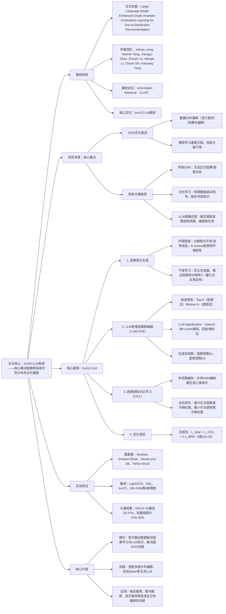

### 1. 一段话总结
华南理工大学等团队提出**InvGCLLM框架**，核心解决图推荐系统中的**分布外（OOD）泛化**难题——传统模型易学习虚假关联而非稳定因果关系，该框架通过**数据驱动的因果得分生成**（环境提取+不变学习，量化交互稳定性）、**LLM校准的因果图编辑**（Qwen3-8B剪枝虚假边/增补因果边）、**因果感知对比学习**（区分因果/虚假视图优化表示）三大模块，在Douban、MovieLens-1M等4个数据集上实现显著性能提升，**NDCG@10最高达25.47%**，较最优基线提升10%-35%，为分布偏移场景（流行度偏移、时间偏移等）提供了鲁棒的推荐解决方案。

---

### 2. 思维导图（mindmap）

---

### 3. 详细总结
#### 一、研究背景与核心问题
1. **OOD推荐的定义与挑战**  
   OOD推荐指训练与测试数据分布不一致（如用户偏好随年龄变化、物品流行度波动）时，模型仍需准确预测用户偏好。核心痛点是传统模型易学习**虚假关联**（如“青少年偏好浪漫电影”），而非**稳定因果关系**（如“偏好引人入胜的叙事”），导致分布偏移时性能暴跌。

2. **三大核心挑战**  
   | 挑战类型               | 具体表现                                                                 |
   |------------------------|--------------------------------------------------------------------------|
   | 因果与虚假关系混淆     | 模型无法区分稳定因果交互与环境依赖的虚假交互                               |
   | 缺乏外部知识引导       | 纯数据驱动方法难以突破训练数据局限，无法识别深层虚假关联                   |
   | LLM与图结构适配不足    | LLM缺乏细粒度图结构洞察，直接编辑易导致图失真                             |

#### 二、InvGCLLM框架核心设计
##### 1. 因果得分生成（数据驱动基础）
- **环境提取**：
  1. 可学习生成器Φ分解用户-物品图为**不变信息M_I**（稳定交互）和**变体信息M_V**（环境敏感交互）；
  2. 对M_V的交互嵌入做K-means聚类，得到**环境标签E_infer**（量化分布差异）。
- **不变学习**：
  1. 优化生成器Φ，最小化跨环境风险差异，输出**因果得分矩阵S**；
  2. 得分S_u,i越高，代表用户u与物品i的交互越稳定（因果性越强）。

##### 2. LLM校准的因果图编辑（LLMC2GE）
- **候选边筛选**：
  - 因果候选集E_c⁺：S中Top-K高分边（潜在因果关系）；
  - 虚假候选集E_c⁻：S中Bottom-K低分边（潜在虚假关系）。
- **LLM adjudication**：
  1. 构建结构化提示（含用户历史、物品属性、因果得分），调用**Qwen3-8B**（LoRA微调适配推荐场景）；
  2. LLM输出决策（KEEP/REMOVE/ADD），剪枝虚假边、增补缺失因果边。
- **双视图生成**：
  - 因果视图G_c：原始图移除虚假边+增补因果边；
  - 虚假视图G_s：仅包含确认的虚假边。

##### 3. 因果感知对比学习（CICL）
- **多视图编码**：
  共享GNN编码器（LightGCN为骨干），生成三类节点表示：
  - 主表示h_v（来自原始图G）；
  - 因果表示h_v,c（来自G_c）；
  - 虚假表示h_v,s（来自G_s）。
- **对比损失设计**：
  $`[
  L_{CICL} = -\frac{1}{|B|}\sum_{u \in B} log\left( \frac{sim(h_u, h_{u,c})}{\sum_{v \neq u} sim(h_u, h_v) + sim(h_u, h_{u,s})} \right)
  ]`$
  核心逻辑：最大化主表示与因果表示的相似度，最小化与虚假表示及批次负样本的相似度。

##### 4. 整体优化目标
$`[ L_{total} = L_{CICL} + \lambda \cdot L_{BPR} ]`$
- λ为平衡系数（默认0.05），L_BPR为标准推荐排序损失；
- 端到端训练，最终输出经因果净化的用户/物品嵌入用于推荐。

#### 三、实验验证
##### 1. 实验设置
| 配置项          | 具体内容                                                                 |
|-------------------|--------------------------------------------------------------------------|
| 数据集            | 4个数据集，覆盖3类分布偏移： - Douban（流行度偏移）：用户-电影交互 - Amazon-Book（流行度偏移）：用户-图书交互 - MovieLens-1M（时间偏移）：100万条电影评分 - Yahoo Music（曝光偏移）：音乐评分数据 |
| 基线模型          | 9种主流模型： - 传统GNN：LightGCN、LightGCL - 对比学习：SGL、SimGCL - 鲁棒方法：InvCF、BOD、DR-GNN - 重构方法：APDA、GraphDA |
| 评估指标          | NDCG@10、Precision@10、Recall@10（越高性能越好）                           |
| 关键参数          | 批量大小=256，学习率=1e-4，GNN层数=3，λ=0.05，LLM=Qwen3-8B（LoRA微调）   |

##### 2. 核心实验结果
###### （1）整体性能对比（最优结果）
| 数据集         | 指标       | 最优基线（DR-GNN） | InvGCLLM | 相对提升（%） |
|----------------|------------|--------------------|----------|---------------|
| Douban         | NDCG@10    | 0.0913             | 0.1269   | 39.0         |
| Amazon-Book    | NDCG@10    | 0.0339             | 0.0432   | 27.4         |
| MovieLens-1M   | NDCG@10    | 0.2362             | 0.2547   | 7.8          |
| Yahoo Music    | NDCG@10    | 0.0789             | 0.0948   | 20.2         |

###### （2）消融实验（MovieLens-1M数据集）
| 模型变体                | NDCG@10 | Precision@10 | Recall@10 | 核心结论                     |
|-------------------------|---------|--------------|-----------|------------------------------|
| InvGCLLM（全量）         | 0.2547  | 0.2139       | 0.1578    | 完整框架效果最优             |
| 无LLM编辑（InvGCN）      | 0.2215  | 0.1892       | 0.1403    | LLM编辑提升关键              |
| 无不变学习（GCLLM）      | 0.2036  | 0.1754       | 0.1327    | 不变学习为因果得分提供基础    |
| 传统对比学习（InvGCL）   | 0.2189  | 0.1905       | 0.1386    | 因果感知对比学习更适配OOD场景 |

###### （3）可视化分析
- t-SNE嵌入显示：InvGCLLM的物品表示在时间偏移场景下分布最均匀，无明显聚类分离；
- 传统模型（如LightGCN）的近期/早期物品表示呈明显两簇，验证OOD泛化劣势。

#### 四、研究价值与应用
1. **理论价值**：首次融合数据驱动因果学习与LLM世界知识，提出“得分生成-图编辑-对比学习”的OOD推荐范式；
2. **实践价值**：适配多类分布偏移，支持主流LLM，推理开销可控，已通过4个数据集验证鲁棒性；
3. **应用场景**：电影推荐、图书推荐、音乐推荐等易受流行度、时间、曝光偏差影响的场景。

---

### 4. 关键问题
#### 问题1：InvGCLLM如何区分“因果关系”与“虚假关联”？核心机制是什么？
**答案**：
1. 双阶段区分逻辑：① 数据驱动阶段：通过“环境提取+不变学习”，将图分解为不变（因果）和变体（环境敏感）信息，生成因果得分矩阵S，量化交互稳定性；② LLM校准阶段：Qwen3-8B结合世界知识（如“用户喜欢叙事类电影”）与得分S， adjudication候选边，剪枝虚假关联（如“短期流行但与用户偏好无关”）、增补因果边；
2. 核心机制：以“跨环境稳定性”定义因果关系（稳定交互为因果），借助LLM弥补纯数据驱动的知识局限，确保因果判断的准确性。

#### 问题2：LLMC2GE模块中LLM的作用是什么？为何需要LoRA微调？
**答案**：
1. LLM的核心作用：① 验证数据驱动的因果得分（确认Top-K/Bottom-K边的真实性）；② 基于世界知识增补缺失因果边（如用户喜欢《肖申克的救赎》，增补《阿甘正传》关联）；③ 剪枝数据驱动难以识别的深层虚假边（如“爆款电影与用户历史偏好无因果关联”）；
2. LoRA微调必要性：原始LLM缺乏推荐场景的细粒度洞察（如用户-物品交互的语义匹配），LoRA通过少量参数微调，使LLM适配“因果边 adjudication”任务，提升决策准确性，避免编辑失真。

#### 问题3：InvGCLLM在不同分布偏移场景中的表现如何？其泛化优势源于哪些组件？
**答案**：
1. 跨场景表现：在流行度偏移（Douban，NDCG@10 12.69%）、时间偏移（MovieLens-1M，25.47%）、曝光偏移（Yahoo Music，9.48%）场景中均显著优于基线，相对提升7.8%-39.0%；
2. 泛化优势来源：① 不变学习模块：提取跨环境稳定的因果信号，减少对虚假关联的依赖；② LLM编辑模块：引入外部知识，修正数据驱动的偏差；③ 因果感知对比学习：优化表示空间，使嵌入对分布偏移不敏感，三者协同确保OOD场景下的鲁棒性。