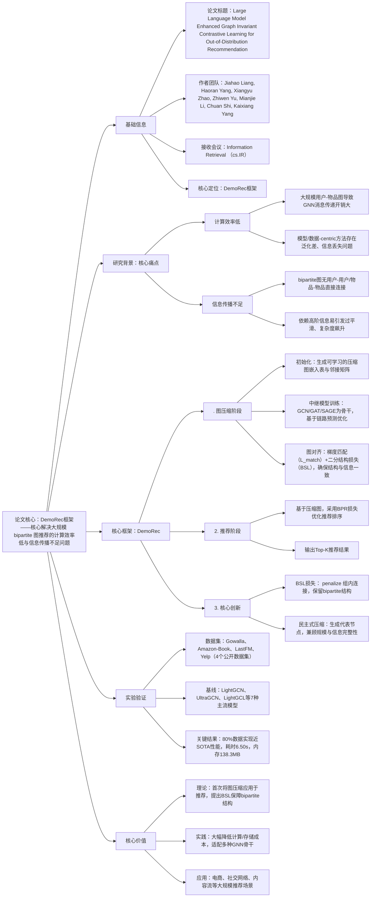

### 1. 一段话总结
华南理工大学等团队提出**DemoRec框架**，受民主选举理念启发，基于**图压缩技术**生成用户和物品代表节点，核心解决大规模 bipartite 图推荐的**计算效率低**与**信息传播不足**问题，通过**图压缩阶段**（初始化→中继模型训练→图对齐）和**推荐阶段**（基于压缩图优化推荐）两大核心阶段，创新引入**二分结构损失（BSL）** 确保压缩图保留 bipartite 特性，在Gowalla、Amazon-Book等4个数据集上，仅用80%数据就实现与SOTA模型（LightGCL）接近的推荐性能，**训练耗时最低6.50s**（较LightGCN快7.3%），**GPU内存占用最低138.3MB**，显著提升了大规模图推荐的效率与鲁棒性。

---

### 2. 思维导图（mindmap）

---

### 3. 详细总结
#### 一、研究背景与核心问题
1. **大规模图推荐的两大核心挑战**  
   | 挑战类型               | 具体表现                                                                 | 现有方案局限                          |
   |------------------------|--------------------------------------------------------------------------|---------------------------------------|
   | 计算效率低             | 百万级用户-物品交互导致GNN消息传递耗时高，实时部署困难                     | 模型-centric（采样/聚合）泛化差；数据-centric（稀疏化/粗化）信息丢失严重 |
   | 信息传播不足           | bipartite图仅存在用户-物品连接，无组内直接连接，依赖高阶信息易过平滑       | 深层GNN加剧复杂度，简单模型难以捕捉复杂依赖关系                          |

2. **核心创新思路**  
   借鉴民主选举“选代表”逻辑，通过图压缩生成少量用户/物品代表节点，构建紧凑的压缩图，在保留核心信息的同时降低规模，避免对高阶信息的过度依赖。

#### 二、DemoRec框架核心设计
##### 1. 框架整体架构
DemoRec分为两大阶段，流程为“图压缩→推荐”，两阶段迭代优化，确保压缩图质量与推荐性能平衡：
- 图压缩阶段：生成保留核心特性的紧凑 bipartite 图；
- 推荐阶段：基于压缩图训练推荐模型，输出个性化推荐。

##### 2. 图压缩阶段（核心环节）
| 模块名称   | 核心逻辑                        | 关键操作                                                                                                                                                                                                                                   |
|--------|-----------------------------|----------------------------------------------------------------------------------------------------------------------------------------------------------------------------------------------------------------------------------------|
| 压缩图初始化 | 生成小规模压缩图，奠定优化基础             | 1. 初始化用户/物品嵌入表（$`E_U \in \mathbb{R}^{ \|U'\|×d}$、$E_I \in \mathbb{R}^{\|I'\|×d}`$）； 2. 通过参数化交互函数生成邻接矩阵 $`A'`$，$`A'_{ij}=\mathbb{I}(\sigma(e_i^T W e_j)≥\tau)`$（$`\tau=0.5`$）                                                              |
| 中继模型训练 | 提供优化信号，确保压缩图保留结构信息          | 1. 采用GCN/GAT/SAGE为骨干； 2. 基于链路预测损失 $`L_{relay}`$ 训练，最大化连接节点相似度、最小化非连接节点相似度                                                                                                                                                           |
| 图对齐优化  | 对齐原始图与压缩图，同时保留 bipartite 结构 | 1. 梯度匹配损失 $`L_{match}`$：最小化中继模型在两图上的梯度差异； 2. 二分结构损失（BSL）：$`L_{bip}=\lambda(\sum_{i,j\in U'}\|A'_{ij} \|_2^2 + \sum_{i,j\in I'} \|A'_{ij} \|_2^2)`$，$`\lambda=0.3`$； 3. 总压缩损失 $`L_{cond}=L_{bip}+\beta L_{match}`$（$`\beta=0.6`$） |

##### 3. 推荐阶段
- 核心损失：采用**BPR损失**优化用户-物品排序，公式为 $`L_{rec}=-\sum_{u'\in U'}\sum_{i_{pos}',i_{neg}'\in I'}ln\sigma(\hat{y}_{u',i_{pos}'}-\hat{y}_{u',i_{neg}'})`$；
- 偏好计算：$`\hat{y}_{u',i'}=e_{u'}^\top e_{i'}`$（$`e_{u'}`$、$`e_{i'}`$ 为压缩图中用户/物品嵌入）；
- 输出：对每个用户计算候选物品偏好得分，生成Top-K推荐列表。

##### 4. 复杂度分析
| 复杂度类型 | 原始图（GNN模型） | DemoRec（压缩图） | 核心优势                     |
|------------|-------------------|------------------|------------------------------|
| 空间复杂度 | $`O(E+(N+M)d)`$     | $`O(E'+(N'+M')d)`$  | $`N'≪N`$、$`M'≪M`$，内存占用骤降 |
| 时间复杂度 | $`O(K·E·d)`$        | $`O(K·E'·d)`$      | $`E'≪E`$，训练耗时大幅减少     |

#### 三、实验验证
##### 1. 实验设置
| 配置项          | 具体内容                                                                 |
|-------------------|--------------------------------------------------------------------------|
| 数据集            | 4个公开数据集，覆盖不同稀疏度： - Gowalla：29,858用户、40,981物品、1,027,370交互（密度0.084%）； - Amazon-Book：52,643用户、91,599物品、2,984,108交互（密度0.062%）； - LastFM：23,466用户、48,123物品、8,057,269交互（密度0.710%）； - Yelp：31,668用户、38,048物品、1,561,406交互（密度0.130%） |
| 基线模型          | 7种主流模型： - 传统CF：NGCF、GF-CF； - GNN-based：LightGCN、UltraGCN、LightGCL； - 压缩类：UnKD、GASD |
| 评估指标          | Precision@20、Recall@20、NDCG@20；效率指标：训练耗时（s）、GPU内存占用（MB） |
| 关键参数          | 压缩率80%，嵌入维度256，GNN层数3，学习率0.001，训练轮次100，$`\lambda=0.3`$，$`\beta=0.6`$ |

##### 2. 核心实验结果
###### （1）整体推荐性能（80%数据 vs SOTA基线100%数据）
| 数据集         | 模型       | Precision@20 | Recall@20 | NDCG@20 | 性能差距（较LightGCL） |
|----------------|------------|--------------|-----------|----------|------------------------|
| Gowalla        | LightGCL   | 0.0448       | 0.1525    | 0.1299   | -                      |
| Gowalla        | DemoRec    | 0.0410       | 0.1385    | 0.1190   | 约-8.5%                |
| Amazon-Book    | LightGCL   | 0.0223       | 0.0432    | 0.0385   | -                      |
| Amazon-Book    | DemoRec    | 0.0205       | 0.0390    | 0.0350   | 约-9.1%                |
| LastFM         | LightGCL   | 0.0718       | 0.2608    | 0.1945   | -                      |
| LastFM         | DemoRec    | 0.0680       | 0.2450    | 0.1840   | 约-5.4%                |

###### （2）效率对比（Gowalla数据集）
| 模型         | 训练耗时（s/epoch） | GPU内存占用（MB） | 核心优势                     |
|--------------|---------------------|------------------|------------------------------|
| LightGCN     | 7.01                | 142.5            | 传统高效GNN基线              |
| LightGCL     | 21.30               | 190.8            | SOTA但耗时高                  |
| UnKD         | 35.82               | 220.4            | 压缩类基线，效率低            |
| DemoRec（SAGE） | 6.50               | 165.1            | 耗时最低，较LightGCN快7.3%    |
| DemoRec（GCN）  | 7.32               | 138.3            | 内存最低，较LightGCN省2.9%    |

###### （3）消融实验（Gowalla数据集）
| 模型变体                | Precision@20 | Recall@20 | NDCG@20 | 核心结论                     |
|-------------------------|--------------|-----------|----------|------------------------------|
| DemoRec（全量）         | 0.0410       | 0.1385    | 0.1190   | 完整框架效果最优             |
| DemoRec（无BSL）        | 0.0372       | 0.1260    | 0.1085   | BSL可避免组内冗余连接，提升性能 |

###### （4）组件分析
- 中继模型：GAT表现最优（性能下降斜率最低），GCN表现最弱，GraphSAGE居中；
- 匹配策略：轨迹匹配（D.Traj.）性能最优，梯度匹配（D.Grad.）平衡性能与效率，分布匹配（D.Dist.）最差。

#### 四、研究价值与应用
1. **理论价值**：首次将图压缩技术应用于推荐系统，提出BSL损失解决bipartite图压缩的结构失真问题，为大规模图推荐提供新范式；
2. **实践价值**：仅用80%数据就实现近SOTA推荐性能，训练耗时与内存占用显著低于现有模型，适配实时部署需求；
3. **应用场景**：电商商品推荐、社交网络内容推荐、音乐/影视流媒体推荐等大规模用户-物品交互场景。

---

### 4. 关键问题
#### 问题1：DemoRec的“民主式图压缩”核心逻辑是什么？与传统图压缩方法（如稀疏化）相比，优势在哪里？
**答案**：
1. 核心逻辑：借鉴民主选举“选代表”理念，通过图压缩生成少量用户/物品代表节点，构建紧凑的压缩图——将原始大规模 bipartite 图的核心信息（结构+交互模式）浓缩到小规模图中，既降低计算复杂度，又避免高阶信息依赖；
2. 与传统方法的优势：① 传统稀疏化/粗化依赖启发式规则，易丢失关键信息；DemoRec通过梯度匹配+BSL损失，在压缩的同时保留结构完整性与核心交互模式；② 传统方法未针对 bipartite 图优化，易产生组内冗余连接；DemoRec的BSL损失明确 penalize 用户-用户/物品-物品连接，确保压缩图仍为 bipartite 结构；③ 传统压缩类方法（如UnKD）需在原始图上大量计算，DemoRec压缩后仅在小规模图上训练，效率提升显著（耗时从35.82s降至6.50s）。

#### 问题2：二分结构损失（BSL）在DemoRec中起到什么作用？其数学原理与实际效果如何？
**答案**：
1. 核心作用：解决图压缩过程中可能出现的“结构失真”问题，确保压缩图保留原始 bipartite 图的核心特性（仅用户-物品连接，无组内连接）；
2. 数学原理：通过 Frobenius 范数 penalize 组内连接，公式为 $`L_{bip}=\lambda(\sum_{i,j\in U'}|A'_{ij}|_2^2 + \sum_{i,j\in I'}|A'_{ij}|_2^2)`$，$`\lambda=0.3`$——梯度推导显示，更新方向与组内边强度成正比，会持续削弱组内连接；
3. 实际效果：消融实验表明，移除BSL后，DemoRec的Precision@20从0.0410降至0.0372（-9.3%），Recall@20从0.1385降至0.1260（-9.0%），证明BSL能有效避免冗余连接导致的性能下降，尤其在高压缩率场景下效果更显著。

#### 问题3：DemoRec在不同GNN骨干模型上的适配性如何？其效率优势在大规模场景下的实际意义是什么？
**答案**：
1. 适配性表现：DemoRec可兼容GCN、GAT、GraphSAGE三种主流GNN骨干，其中：① GAT表现最优（性能下降最少），因其注意力机制能选择性聚焦关键连接，适配压缩图的精简结构；② GraphSAGE次之，依赖邻域采样机制保持效率；③ GCN表现最弱，简单聚合机制难以在压缩图中捕捉复杂依赖；
2. 大规模场景意义：① 时间效率：DemoRec（SAGE）训练耗时6.50s/epoch，较LightGCN快7.3%，较SOTA的LightGCL快69.5%，支持百万级交互图的实时更新；② 空间效率：DemoRec（GCN）GPU内存占用138.3MB，较LightGCL省27.5%，降低大规模部署的硬件成本；③ 数据效率：仅用80%数据就实现近SOTA性能，减少数据存储与预处理开销，适配数据量大、更新频繁的工业场景。