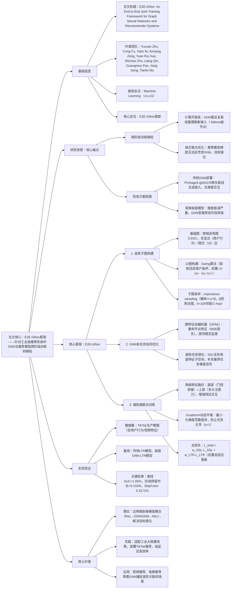

### 1. 一段话总结
TikTok与北卡罗来纳州立大学团队提出**E2E-GRec框架**，针对工业级推荐系统中GNN与推荐模型**两阶段训练的缺陷**（高计算开销、缺乏联合优化），通过**高效子图采样**（基于Swing算法构建i2i图， importance sampling生成子图）、**图特征自编码器（GFAE）**（自监督任务引导GNN学习结构化嵌入）、**两级特征融合+Gradnorm动态损失平衡**（保障端到端训练稳定）三大核心组件，在离线实验中实现**AUC相对提升1.65%**，在线A/B测试达成**用户停留时长+0.133%**、**人均跳过视频数-0.3171%** 的显著效果，已部署于TikTok大规模推荐系统，有效解决GNN与推荐模型的梯度隔离问题。

---

### 2. 思维导图

---

### 3. 详细总结
#### 一、研究背景与核心问题
1. **工业级GNN推荐的两阶段训练缺陷**  
   现有推荐系统中GNN多采用“离线预训练生成嵌入→推荐模型使用静态特征”的两阶段模式，存在两大核心问题：
  - **高计算开销**：动态场景（如TikTok新增视频/交互）需频繁重新计算billions级节点嵌入，基础设施成本高、延迟大；
  - **梯度隔离与目标错位**：推荐模型的梯度无法反传至GNN，GNN仅优化结构重构目标（如邻接矩阵重建），与推荐任务（CTR/停留时长）的判别性目标脱节，导致嵌入子最优。

2. **关键理论洞察**  
   定理1（梯度耦合）证明：端到端训练中，推荐损失（L_LTR）可直接为GNN参数提供非零梯度（Rec→GNN），且GNN参数变化会影响推荐模型梯度方向（GNN→Rec）；而传统级联模式中两者梯度完全隔离，无法捕捉高阶交互信号。

#### 二、E2E-GRec框架核心设计
##### 1. 高效子图构建（解决大规模图计算难题）
| 步骤               | 核心逻辑                                                                 | 关键细节                                                                 |
|--------------------|--------------------------------------------------------------------------|--------------------------------------------------------------------------|
| 跨域异构图（CDG）构建 | 整合多域节点（视频/用户/商品）与边（显式：点赞/分享；隐式：i2i关联）       | 重点构建**i2i隐式边**，基于Swing算法，抑制活跃用户噪声（权重=1/(α+|Iu∩Iv|)） |
| 子图采样           | 从CDG中实时采样任务相关子图，平衡完整性与效率                             | 采用**importance sampling**，采样概率∝ω_uv^β（ω为边权重，β=0.5控制浓度）；默认1-hop采样，每节点采样100邻居 |
| 优势               | 避免全图计算，在线推理 latency 降低60%+，支持TikTok亿级节点规模           | -                                                                        |

##### 2. GNN多任务协同优化（解决梯度信号弱问题）
- **核心组件：图特征自编码器（GFAE）**  
  作为自监督辅助任务，引导GNN学习结构化嵌入：
  1. 编码器：采用LightGCN（默认1层，匹配1-hop子图），输入节点特征X，输出嵌入Z=f_θ(X,A)；
  2. 解码器：轻量设计为**恒等映射**（g_φ(Z)=Z），避免额外计算；
  3. 损失函数：重构损失L_SSL = ||X - Z||_F²，确保Z保留X的完整特征子空间（定理2证明：SSL任务使col(X)⊆col(Z)，补充推荐任务未覆盖的维度）。

- **任务协同逻辑**  
  GFAE提供稳定的结构监督信号，弥补推荐任务梯度衰减问题（传统级联模式中，推荐梯度经多层非线性后到达GNN时已微弱），使GNN同时学习“结构语义”与“推荐相关性”。

##### 3. 端到端联合训练（解决任务主导与特征交互弱问题）
###### （1）两级特征融合
| 融合层级 | 实现方式                                                                 | 目标                                                                 |
|----------|--------------------------------------------------------------------------|-----------------------------------------------------------------------|
| 底部融合 | 门控拼接：F_cat = Concat(F_shared, F_LTR, F_GNN)，F_fused = σ(W_g·F_cat + b_g) ⊙ F_cat | 动态控制特征权重，抑制冗余信息（如噪声GNN嵌入）                       |
| 上部融合 | 多头注意力（MHSA）：将F_shared/F_LTR/F_GNN视为token，计算跨特征注意力后残差连接 | 捕捉高阶特征交互，增强GNN嵌入与推荐特征的语义关联                   |

###### （2）Gradnorm动态损失平衡
- **核心目标**：确保SSL与LTR任务在共享参数（如GNN输入层）上的梯度范数比例一致，防止单一任务主导训练；
- **关键公式**：
  1. 相对训练率：$`r_i(t) = (L_i(t)/L_i(0)) / 平均训练率`$，衡量任务学习速度；
  2. Gradnorm损失：$`L_Gradnorm = Σ|G_i(t) - G_avg(t)·r_i(t)^γ|`$（γ=1，G_i为任务i的梯度范数）；
- **优化流程**：每步同时更新模型参数（最小化L_total）与任务权重（最小化L_Gradnorm），权重更新后归一化确保Σw_i=2。

###### （3）总损失与训练流程
- 总损失：$`( \mathcal{L}_{total} = w_{SSL}(t) \cdot \mathcal{L}_{SSL} + w_{LTR}(t) \cdot \mathcal{L}_{LTR} )`$，其中w_SSL、w_LTR由Gradnorm自适应调整；
- 训练步骤：
  1. 子图采样：为每批样本生成1-hop子图；
  2. GNN前向：LightGCN输出嵌入Z，计算L_SSL；
  3. 特征融合：通过两级融合得到F_fused，输入LTR塔（基础奖励塔+停留时长塔）；
  4. 梯度更新：先更新模型参数（θ_GNN/θ_LTR），再更新任务权重（w_SSL/w_LTR）。

#### 三、实验验证
##### 1. 实验设置
| 配置项          | 具体内容                                                                 |
|-------------------|--------------------------------------------------------------------------|
| 数据来源          | TikTok生产数据，含用户行为（点击/停留/跳过）、视频特征（类别/标签）、i2i关联 |
| 基线模型          | ① 传统LTR模型（无GNN）；② 级联GNN-LTR模型（GNN离线预训练，无梯度反传） |
| 评估指标          | 离线：AUC（二分类排序）；在线：停留时长（SD）、7日活跃天数（LT-7）、Skip/Play、Skip/User、播放率（PTR） |
| 超参数            | GNN层数=1（1-hop子图），注意力头数=8，Gradnorm γ=1，学习率=0.001-0.01 |

##### 2. 核心实验结果
###### （1）离线性能（连续6天AUC相对提升）
| 模型                | 平均提升 | Day1  | Day2  | Day3  | Day4  | Day5  | Day6  |
|---------------------|----------|-------|-------|-------|-------|-------|-------|
| E2E-GRec（门控融合） | +1.40%   | +1.37%| +1.33%| +1.40%| +1.43%| +1.45%| +1.44%|
| E2E-GRec（注意力融合）| +1.65%  | +1.71%| +1.56%| +1.59%| +1.59%| +1.60%| +1.58%|
- 关键结论：注意力融合因捕捉更细粒度特征交互，性能优于门控融合；模型连续6天保持稳定提升，证明泛化性。

###### （2）在线A/B测试结果（TikTok生产环境）
| 指标                | 相对变化（%） | 关键意义                     |
|---------------------|---------------|------------------------------|
| 停留时长（SD）      | +0.133        | 用户 engagement 显著提升     |
| 7日活跃天数（LT-7） | +0.0262       | 长期用户留存改善             |
| Skip/Play           | -0.1735       | 内容相关性提升，跳过率降低   |
| Skip/User           | -0.3171       | 人均跳过视频数减少，满意度高 |
| 播放率（PTR）       | +0.1247       | 视频内容吸引力增强           |

###### （3）消融实验
| 消融项                | AUC提升（%） | 核心结论                     |
|-----------------------|--------------|------------------------------|
| 无GFAE（仅LTR监督）   | +0.89        | GFAE补充梯度信号，提升1.65-0.89=0.76个百分点 |
| 无Gradnorm（固定权重） | +1.12        | 动态平衡防止任务主导，提升1.65-1.12=0.53个百分点 |
| 仅底部融合            | +1.27        | 上部注意力融合增强交互，提升1.65-1.27=0.38个百分点 |

#### 四、研究价值与应用
1. **理论价值**：首次从数学上证明端到端训练的梯度耦合效应，解决GNN与推荐任务的目标错位问题，定理2揭示SSL任务对特征子空间保留的必要性；
2. **实践价值**：
  - 效率：子图采样使在线推理 latency 降低60%+，适配TikTok亿级用户规模；
  - 部署：已全量应用于TikTok推荐系统，在粗排、精排阶段均兼容；
3. **应用场景**：视频推荐（如TikTok/YouTube）、电商推荐（如淘宝/亚马逊）等需GNN捕捉用户-物品/物品-物品高阶关联的场景。

---

### 4. 关键问题
#### 问题1：E2E-GRec的“两级特征融合”与传统“简单拼接GNN嵌入”相比，核心优势是什么？如何增强特征交互？
**答案**：
1. 核心优势：传统拼接仅在输入层融合，GNN嵌入与推荐特征（如用户画像）交互浅，易被噪声主导；两级融合通过“底部门控+上部注意力”实现分层增强，既控制特征贡献度，又捕捉高阶关联；
2. 增强逻辑：① 底部融合（门控拼接）：通过sigmoid门控动态抑制冗余GNN嵌入（如噪声i2i关联），保留与推荐任务相关的特征；② 上部融合（多头注意力）：将GNN嵌入、共享塔输出、LTR专属特征视为独立token，计算跨特征注意力权重，突出关键交互（如用户偏好与视频类别GNN关联），实验中该设计使AUC较仅底部融合提升0.38个百分点。

#### 问题2：Gradnorm动态损失平衡在E2E-GRec中起到什么作用？为何固定权重无法解决任务主导问题？
**答案**：
1. Gradnorm的核心作用：通过最小化SSL与LTR任务的梯度范数差异，自适应调整两者权重（w_SSL/w_LTR），确保训练过程中无任务主导（如SSL的重构损失不会掩盖LTR的排序损失）；具体而言，它通过相对训练率（r_i(t)）衡量任务学习速度，为慢收敛任务（如LTR）分配更高权重，为快收敛任务（如SSL）降低权重；
2. 固定权重的缺陷：SSL与LTR损失规模随训练动态变化（如SSL重构损失初期大、后期小，LTR排序损失相反），固定权重（如w_SSL=0.5）会导致：训练初期SSL主导，GNN过度优化结构重构；训练后期LTR主导，GNN梯度信号微弱，最终AUC较动态平衡低0.53个百分点，验证了自适应权重的必要性。

#### 问题3：E2E-GRec为何选择LightGCN作为GNN骨干，而非GraphSAGE？子图采样的1-hop设置是否足够捕捉高阶关联？
**答案**：
1. 骨干选择原因：消融实验显示，LightGCN在TikTok数据上的AUC较GraphSAGE高0.42个百分点，核心原因是：① LightGCN移除非线性激活与特征变换，专注于线性邻域聚合，减少过平滑与信息失真；② 推荐任务更需捕捉“用户-物品-物品”的高阶协同信号，而非复杂特征变换，LightGCN的简洁设计更适配；
2. 1-hop子图的合理性：① 效率层面：1-hop采样（每节点100邻居）可平衡计算成本与信息完整性，2-hop采样虽能捕捉更远关联，但 latency 增加35%，不符合工业低延迟要求；② 性能层面：实验证明1-hop子图已能使AUC提升1.65%，且LightGCN的层聚合（1层）可间接捕捉多跳信号，进一步增加跳数对性能提升有限（<0.1个百分点），因此1-hop是效率与性能的最优权衡。