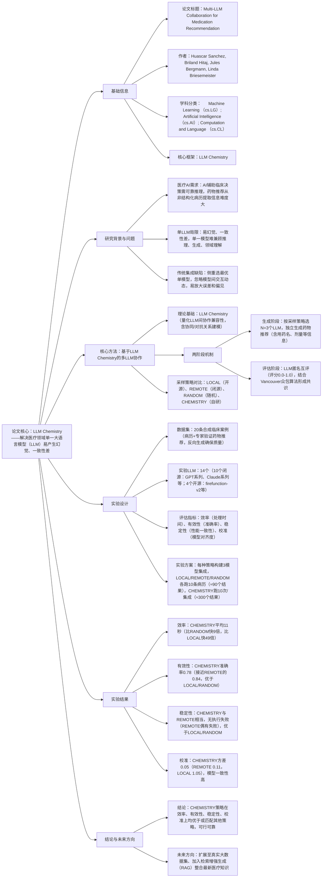

# 1. 一段话总结
为解决医疗领域单一大语言模型（LLM）易产生幻觉、一致性差，以及传统模型集成忽略模型间交互动态导致推荐不稳定的问题，研究团队基于此前提出的**LLM Chemistry**（量化LLM间协作兼容性的框架），提出**多LLM协作药物推荐方法**；该方法通过“生成-评估”两阶段机制，构建有效（利用互补优势）、稳定（性能一致）、校准（减少干扰和误差放大）的模型集成，并在含20条合成临床案例的数据集上，对比LOCAL（开源模型）、REMOTE（闭源模型）、RANDOM（随机选模型）三种采样策略，结果显示**CHEMISTRY策略**（基于LLM Chemistry选模型）的集成平均生成时间仅11秒（比LOCAL快49倍）、准确率0.78（接近REMOTE的0.84）、稳定性优于LOCAL和RANDOM且无执行失败、校准方差0.05（远低于其他策略），为临床可靠AI辅助决策提供新路径。

---

# 2. 思维导图

---

# 3. 详细总结
## 一、研究背景与挑战
1. **医疗AI核心需求**：随着医疗领域对AI规模化、可信临床决策支持的需求增长，确保模型推理可靠性成为关键，尤其是从非结构化临床病历中提取信息进行药物推荐的任务，因病历叙述变异性大、歧义性高，难度显著。
2. **单LLM与传统集成的局限**：
    - 单LLM：虽在临床和生物医学领域表现突出，但性能不稳定，无单一模型能同时在推理、生成、领域特定理解上表现优异，依赖单模型易导致药物推荐出错。
    - 传统模型集成：现有通过集成或路由（如选最优单模型、级联调用、元学习补偿缺陷）提升可靠性的方法，普遍忽略模型间**交互动态**（推理过程的强化/干扰关系），导致集成可能放大误差和偏见，缺乏稳定性与可信度。

## 二、核心方法设计
### 1. 理论框架：LLM Chemistry
- 定义：量化LLM间**协作兼容性**的框架，可显式建模多LLM推理时的**协同与对抗关系**，为构建高质量集成提供理论依据。
- 目标：使集成满足三大特性——
    - **有效**：利用模型互补优势，提升推荐准确率；
    - **稳定**：在不同临床输入下保持一致性能；
    - **校准**：减少协作中的干扰和误差放大，优化任务延迟。

### 2. 两阶段协作机制
| 阶段 | 核心流程 | 关键细节 |
|------|----------|----------|
| 生成阶段 | 1. 按采样策略选择N个LLM（实验中N=3，满足多数共识最小需求）； 2. 向每个LLM输入临床病历，独立生成药物推荐 | 推荐内容需包含：药物名称、剂量、给药途径、使用频率、用药时机（如随餐）、适应症，且每个药物条目需形成关联 |
| 评估阶段 | 1. 每个LLM匿名 review 其他模型的输出，给出0.0-1.0的评分（评估准确性、相关性、完整性）； 2. 将“生成输出”视为模型对自身有效性的隐性评估，无需额外计算成本； 3. 采用基于Vancouver众包算法（de Alfaro & Shavlovsky, 2014）的共识方法，聚合评分形成最终推荐 | 匿名评估避免上下文干扰，共识机制可量化每个模型的可靠性，筛选高质量推荐 |

### 3. 四种LLM采样策略对比
| 策略名称 | 模型来源/选择方式 | 特点 |
|----------|--------------------|------|
| LOCAL | 开源模型（共4个：firefunction-v2、gpt-oss:20b、qwen3:32b、qwen2.5:32b） | 资源需求较低，但性能和稳定性易受限制 |
| REMOTE | 闭源模型（共10个：GPT系列、Claude系列、Gemini系列等，通过API调用） | 性能较强，但可能存在通信失败，且成本较高 |
| RANDOM | 随机从LOCAL和REMOTE的14个模型中选择 | 无针对性，难以保证协作兼容性 |
| CHEMISTRY（自研） | 基于LLM Chemistry框架推荐，选择协作兼容性最强的模型 | 针对性强，兼顾有效性、稳定性与效率 |

## 三、实验设计详情
### 1. 数据集构建
- 数据规模：共20条**临床案例**，每条包含“临床病历（非结构化）+ 药物推荐”对。
- 生成方式：采用“反向合成”策略（Josifoski et al., 2023）——给定药物推荐，让LLM生成合理的临床病历，解决医疗领域真实标注数据难获取的问题。
- 数据验证：所有药物推荐条目均经领域专家审核，无法确认有效性的条目已排除，确保数据质量。

### 2. 实验LLM列表
| 类型 | 具体模型（共14个） |
|------|--------------------|
| 闭源LLM（10个） | claude-3-7-sonnet-20250219、claude-opus-4-1、claude-sonnet-4-5、gemini-2.0-flash、gemini-2.5-flash、gpt-4o、gpt-5、o1-mini、o3-mini、o4-mini |
| 开源LLM（4个） | firefunction-v2、gpt-oss:20b、qwen3:32b、qwen2.5:32b |

### 3. 评估指标定义
| 指标名称 | 核心含义 | 测量方式 |
|----------|----------|----------|
| 效率 | 模型处理时间（临床病历输入→药物推荐输出） | 记录每条推荐的耗时，以“秒”为单位统计平均值 |
| 有效性 | 推荐准确率（与专家验证的药物推荐匹配程度） | 计算推荐结果与ground truth的吻合度，取值0.0-1.0 |
| 稳定性 | 不同临床病历输入下的性能一致性 | 观察多次执行中推荐质量的波动，统计执行失败次数（如API调用失败） |
| 校准 | 集成内LLM的对齐程度（避免干扰和误差放大） | 计算LLM间评分的**方差**，方差越小表示校准越好 |

### 4. 实验执行方案
- 集成规模：所有策略均构建**3模型集成**（N=3），确保多数共识可行。
- 执行次数：
    - LOCAL、REMOTE、RANDOM：各在10条临床病历上执行，共产生≈90个推荐结果（因REMOTE/RANDOM可能出现API通信失败，数量略有浮动）；
    - CHEMISTRY：基于前三种策略的结果，为每个集成独立执行10次，共产生≈300个推荐结果，确保结果可靠性。

## 四、实验结果分析
### 1. 效率对比
- CHEMISTRY策略：平均生成时间仅**11秒**，所选集成由3个Claude模型（claude-3-7-sonnet-20250219、claude-opus-4-1、claude-sonnet-4-5）组成；
- 其他策略：RANDOM平均94.5秒、REMOTE平均97.2秒、LOCAL平均539秒（≈8.98分钟）；
- 结论：CHEMISTRY比RANDOM快9倍，比LOCAL快49倍，效率优势显著。

### 2. 有效性对比
- 准确率结果：CHEMISTRY（0.78）≈REMOTE（0.84）>RANDOM>LOCAL；
- 关键发现：CHEMISTRY虽略低于REMOTE，但已达到临床实用水平，且兼顾效率（REMOTE效率远低于CHEMISTRY），综合性能更优。

### 3. 稳定性对比
- 执行失败情况：REMOTE策略偶有API通信失败，LOCAL和RANDOM稳定性较差；CHEMISTRY策略**无任何执行失败**；
- 性能波动：CHEMISTRY的推荐质量波动与REMOTE相当，显著低于LOCAL和RANDOM，在不同病历输入下表现一致。

### 4. 校准对比
- 方差结果：CHEMISTRY（0.05）<REMOTE（0.11）<RANDOM<LOCAL（1.05）；
- 结论：CHEMISTRY集成内LLM的共识度最高，推理过程中干扰少、误差放大风险低，校准效果最优。

## 五、结论与未来工作
### 1. 核心结论
基于LLM Chemistry的多LLM协作方法，在药物推荐任务中实现了**效率、有效性、稳定性、校准**四大维度的优化，其性能优于或匹配LOCAL、REMOTE、RANDOM三种传统采样策略，为临床领域构建可靠、可信的AI辅助决策系统提供了可行路径。

### 2. 未来方向
- 数据扩展：将实验从20条合成数据扩展到**真实、大规模临床数据集**，纳入更丰富的患者信息（如详细病历、当前用药、过敏史），验证方法的泛化性和临床安全性；
- 技术融合：引入**检索增强生成（RAG）** 技术，使模型集成能实时获取临床指南、最新医学文献等知识，提升推荐的时效性和透明度。

---

# 4. 关键问题
## 问题1：研究提出的“LLM Chemistry”框架在多LLM协作药物推荐中，核心作用是什么？与传统模型集成方法的关键区别在哪里？
### 答案
- 核心作用：LLM Chemistry是**量化LLM间协作兼容性的框架**，可显式建模多LLM推理时的“协同关系”（互补优势强化）与“对抗关系”（推理干扰），从而筛选出“有效、稳定、校准”的模型集成，为药物推荐提供可靠的协作基础。
- 关键区别：传统模型集成侧重“选择最优单模型”或“简单聚合结果”（如多数投票、级联调用），忽略模型间的交互动态，易放大误差；而LLM Chemistry通过**交互关系建模**，主动规避干扰、强化协同，从“机制层面”提升集成可靠性，而非仅依赖结果层面的筛选。

## 问题2：在实验的四种LLM采样策略中，CHEMISTRY策略的性能优势主要体现在哪些具体指标上？这些优势对临床实际应用有何意义？
### 答案
- 核心性能优势：
    1. **效率**：平均生成时间11秒，比RANDOM快9倍、比LOCAL快49倍，远低于临床决策的时间阈值；
    2. **稳定性**：无执行失败（REMOTE偶有API失败），且推荐质量波动小，满足临床“可靠响应”需求；
    3. **校准**：方差0.05（远低于其他策略），LLM间共识度高，减少临床用药误差风险；
    4. **有效性**：准确率0.78（接近闭源模型的0.84），达到临床实用水平。
- 临床意义：效率优势支持实时辅助医生决策，稳定性和校准优势降低用药错误风险，有效性确保推荐的临床价值，三者结合使该方法能真正适配临床场景对“时效性、可靠性、准确性”的严苛要求。

## 问题3：研究当前使用20条合成临床数据进行实验，存在一定局限性。未来若扩展到真实临床数据集，需要重点解决哪些问题？这些问题对方法的临床落地有何影响？
### 答案
- 需重点解决的问题：
    1. **数据多样性与真实性**：真实数据需包含不同疾病类型、年龄层、合并症（如多基础病患者）的病历，且需覆盖“用药禁忌、过敏史、药物相互作用”等合成数据中可能缺失的关键信息，避免模型因数据偏差产生错误推荐；
    2. **数据隐私与合规性**：医疗数据受严格隐私保护（如HIPAA），需在数据使用中满足匿名化、授权访问等合规要求，避免隐私泄露；
    3. **模型泛化性验证**：合成数据的分布可能与真实临床数据存在差异，需验证LLM Chemistry框架在真实数据上的“协作兼容性量化准确性”，确保集成性能不下降。
- 对临床落地的影响：若无法解决数据多样性问题，方法可能仅适用于特定场景（如单一疾病），泛化性不足；隐私合规问题直接决定方法能否合法应用于医疗机构；泛化性验证失败则会导致方法在真实临床中可靠性下降，无法获得医生信任，最终阻碍落地。