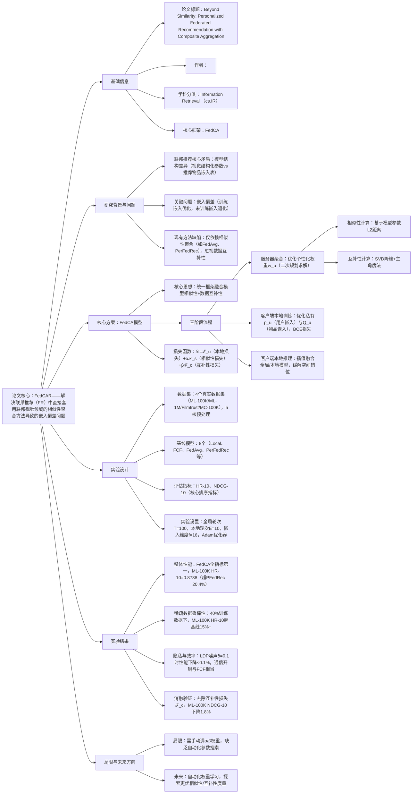

# 1. 一段话总结
为解决联邦推荐（FR）中直接套用联邦视觉领域的相似性聚合方法导致的**嵌入偏差问题**（训练过的物品嵌入持续优化，未训练的物品嵌入停滞或退化），研究团队提出**FedCA（带复合聚合的个性化联邦推荐模型）** ；该模型创新性地将**模型相似性**与**数据互补性**融入统一优化框架，通过服务器端复合聚合（优化相似/互补客户端权重）、客户端本地训练（优化私有用户嵌入与个性化物品嵌入）及本地推理（缓解空间错位）三阶段流程，在**ML-100K、Filmtrust、ML-1M、MC-100K**四个真实数据集上验证，其HR@10、NDCG@10指标显著优于FedAvg、PerFedRec等8个基线，尤其在数据稀疏场景（训练数据40%）表现突出，ML-100K数据集HR@10达**0.8738**（较PFedRec提升20.4%），且通信开销与基线相当（ML-100K上传开销213.56KB），同时支持通过**本地差分隐私（LDP）** 增强隐私保护，为联邦推荐提供鲁棒且高效的解决方案。

---

# 2. 思维导图

---

# 3. 详细总结
## 一、研究背景与核心问题
### 1. 联邦推荐（FR）的特殊性
联邦推荐旨在保护用户隐私的同时聚合全局知识，但与联邦视觉任务存在本质差异：
- **模型结构不同**：联邦视觉依赖卷积神经网络等**结构化参数**（所有层均更新），而FR依赖**一对一物品嵌入表**（仅用户交互过的物品嵌入被训练）。
- **数据异质性更强**：不同客户端交互的物品子集差异大，导致嵌入表训练不均衡。

### 2. 关键问题：嵌入偏差（Embedding Skew）
现有FR方法直接套用联邦视觉的**相似性聚合**（如FedAvg的加权、PerFedRec的聚类），导致：
- 已训练嵌入（用户交互过的物品）持续优化；
- 未训练嵌入（未交互物品）停滞或退化；
- 最终无法准确预测未来物品，实验中表现为训练集准确率上升但测试集下降（如图3，ML-100K训练集HR@10达0.98，测试集仅0.09）。

### 3. 研究目标
提出融合**模型相似性**与**数据互补性**的复合聚合机制，解决嵌入偏差，提升FR的泛化能力与个性化效果。

## 二、核心方案：FedCA模型设计
FedCA（Personalized Federated Recommendation with Composite Aggregation）是模型无关的插件式框架，分为**服务器聚合**、**客户端本地训练**、**客户端本地推理**三阶段，流程如图4所示。

### 1. 统一优化框架
核心目标是联合优化客户端私有参数（$`(p_u)`$：用户嵌入，$`(Q_u)`$：物品嵌入）与聚合权重（$`(w_u)`$），损失函数如下：
$`[
\begin{aligned}
\min_{\{p_u,Q_u,w_u\}} &\sum_{u=1}^n \left( \mathcal{L}_u(p_u,Q_u;\mathcal{D}_u) + \alpha\sum_{v=1}^n \mathcal{F}_s(w_{uv};Q_u;Q_v) + \beta\sum_{v=1}^n \mathcal{F}_c(w_{uv};\mathcal{D}_u;\mathcal{D}_v) \right) \\
s.t. &\ 1^T w_u=1,\ w_u \geq 0
\end{aligned}
]`$
- $`(\mathcal{L}_u)`$：客户端本地损失（二分类交叉熵BCE）；
- $`(\mathcal{F}_s)`$：模型相似性损失（基于嵌入表L2距离，确保相似客户端权重更高）；
- $`(\mathcal{F}_c)`$：数据互补性损失（基于SVD降维后的主角度，确保互补客户端权重更高）；
- $`(\alpha,\beta)`$：平衡系数（实验中最优值为0.3-0.5）。

### 2. 三阶段核心流程
#### （1）服务器聚合：优化个性化权重$`(w_u)`$
服务器无法获取客户端原始数据，通过以下步骤计算权重：
1. **相似性计算**：$`(\sigma(Q_u,Q_v)=1/(1+\|Q_u-Q_v\|_2^2))`$，量化客户端模型参数分布相似度；
2. **互补性计算**：
    - 对客户端交互物品的嵌入子集$`(Q_u^s)`$做SVD降维，保留前$`(k=4)`$个左奇异向量，得到隐私增强表示$`(X_u)`$；
    - 计算主角度：$`(\phi(X_u,X_v)=1/k\sum_{l=1}^k \arccos(x_{lu}^T x_{lv}))`$，角度越大互补性越强；
3. **权重优化**：转化为二次规划问题，求解$`(w_u)`$，确保权重满足归一化（$`(1^T w_u=1)`$）与非负约束。

#### （2）客户端本地训练：优化私有参数
- **优化目标**：最小化BCE损失，更新私有用户嵌入$`(p_u)`$与个性化物品嵌入$`(Q_u)`$：
  $`[
  \mathcal{L}_u = -\sum_{(u,i)\in\mathcal{D}_u} r_{ui}\log\hat{r}_{ui} + (1-r_{ui})\log(1-\hat{r}_{ui})
  ]`$
  其中$`(\hat{r}_{ui}=f(p_u,q_{ui}))`$（$`(f)`$为内积或神经网络匹配函数）；
- **关键差异**：不使用联邦视觉的近端项（Proximal Term），因FR需更强个性化，实验显示去除近端项后ML-100K HR@10提升3.2%（表9）。

#### （3）客户端本地推理：缓解空间错位
客户端下载服务器聚合后的物品嵌入$`(Q_u^g=\sum_v w_{uv}Q_v)`$，通过插值融合历史本地模型与当前全局模型：
$`[
Q_u^g(t) = \rho Q_u^g(t-1) + (1-\rho) Q_u^g(t)
]`$
其中$`(\rho)`$为插值系数（最优值0.8-0.9），解决用户嵌入与物品嵌入的空间错位问题。

### 3. 隐私与效率优化
- **隐私增强**：对物品嵌入$`(Q_u)`$或SVD降维结果添加拉普拉斯噪声（LDP），噪声强度$`(\delta=0.1)`$时性能下降<0.1%（表5）；
- **效率优化**：SVD步骤耗时仅0.02s（远低于本地训练1.94s，表8），服务器端可并行计算相似性/互补性矩阵，复杂度降至$`(O(n\log n))`$。

## 三、实验设计与结果
### 1. 实验基础配置
#### （1）数据集
| 数据集 | 客户端数 | 物品数 | 交互数 | 平均交互数 | 密度 |
|--------|----------|--------|--------|------------|------|
| ML-100K | 943 | 1,682 | 100,000 | 106 | 6.3% |
| Filmtrust | 1,508 | 2,071 | 35,497 | 24 | 1.14% |
| ML-1M | 6,040 | 3,952 | 1,000,209 | 166 | 4.19% |
| MC-100K | 100,000 | 19,738 | 719,405 | 30 | 0.04% |
- 预处理：5核过滤（用户/物品交互≥5次），ML-1M为电影推荐，MC-100K为短视频推荐。

#### （2）基线模型与评估指标
- **基线**：8个经典模型，分为本地训练（Local）、联邦平均（FCF、FedAvg）、聚类聚合（PerFedRec、FedFast）、注意力聚合（FedAtt）、图聚合（pFedGraph）、个性化聚合（PFedRec）；
- **指标**：HR@10（前10推荐命中率）、NDCG@10（前10推荐排序质量），均为5次实验平均值。

#### （3）超参数
| 参数 | 取值 |
|------|------|
| 全局轮次$`(T)`$ | 100 |
| 本地轮次$`(E)`$ | 10 |
| 批大小$`(B)`$ | 256 |
| 学习率$`(\eta)`$ | 0.01 |
| 嵌入维度$`(f)`$ | 16 |
| 客户端参与率$`(r)`$ | 60% |
| SVD降维维度$`(k)`$ | 4 |

### 2. 核心实验结果
#### （1）整体性能对比（表2）
FedCA在所有数据集上全指标第一，以ML-100K（PMF backbone）为例：
| 模型 | HR@10 | NDCG@10 | 相对提升（vs PFedRec） |
|------|--------|----------|-------------------------|
| Local | 0.4128 | 0.2203 | -43.1% |
| FedAvg | 0.4878 | 0.2786 | -34.2% |
| PerFedRec | 0.4973 | 0.2797 | -32.9% |
| PFedRec | 0.7254 | 0.4648 | - |
| FedCA | **0.8738** | **0.7597** | +20.4%（HR@10） |

#### （2）稀疏数据鲁棒性（图5-6）
当训练数据仅为40%时（高异质性）：
- ML-100K：FedCA HR@10=0.74，超PFedRec（0.62）19.4%；
- MC-100K（密度0.04%）：FedCA HR@10=0.107，超FedFast（0.084）27.4%；
- 结论：互补性聚合有效补充未训练嵌入，缓解数据稀疏影响。

#### （3）隐私与效率分析
- **通信开销**（表7）：ML-100K下载开销210.25KB（与FCF相同），上传开销213.56KB（仅比FCF高1.6%）；
- **时间开销**（表8）：ML-1M客户端总耗时=1.94s（本地训练）+0.018s（SVD）+0.86s（相似性）+0.88s（互补性）+0.59s（优化），SVD耗时可忽略；
- **隐私性能**（表5）：LDP噪声δ=0.1时，ML-100K HR@10仅从0.8738降至0.8730，隐私与性能平衡良好。

#### （4）消融实验（表10）
验证各组件必要性（ML-100K）：
| 损失组合 | HR@10 | NDCG@10 | 性能下降 |
|----------|--------|----------|----------|
| 仅$`(\mathcal{L}_u)`$（FedAvg） | 0.4878 | 0.2786 | -44.2% |
| $`(\mathcal{L}_u+\mathcal{F}_c)`$ | 0.8431 | 0.6983 | -3.5% |
| $`(\mathcal{L}_u+\mathcal{F}_s)`$ | 0.8653 | 0.7457 | -1.0% |
| $`(\mathcal{L}_u+\mathcal{F}_s+\mathcal{F}_c)`$（FedCA） | 0.8738 | 0.7597 | - |
- 结论：相似性与互补性缺一不可，共同提升性能44.2%。

## 四、局限与未来方向
### 1. 现有局限
- **参数调优**：需手动调整$`(\alpha)`$（相似性权重）与$`(\beta)`$（互补性权重），缺乏自动化搜索机制；
- **度量局限**：相似性仅基于L2距离，互补性仅基于主角度，未探索更优度量方式；
- **动态场景**：未适配用户行为动态变化的时序联邦推荐场景。

### 2. 未来方向
- 引入自动化机器学习（AutoML）技术，自适应学习$`(\alpha)`$与$`(\beta)`$；
- 探索基于LLM的相似性/互补性度量，提升语义级聚合效果；
- 扩展至动态联邦推荐，支持用户行为时序更新。

---

# 4. 关键问题
## 问题1：FedCA的“复合聚合”如何解决FR特有的“嵌入偏差”问题？与传统相似性聚合（如FedAvg）的核心差异是什么？
### 答案
- **解决嵌入偏差的逻辑**：嵌入偏差源于“仅更新交互物品嵌入”，FedCA通过两点突破：
    1. **数据互补性聚合**：对未交互物品，聚合互补客户端的嵌入信息（如客户端A交互过“笔记本”，客户端B交互过“鼠标”，互补性聚合将“鼠标”嵌入补充到A的嵌入表）；
    2. **统一优化框架**：损失函数中$`(\mathcal{F}_c)`$（互补性损失）强制模型关注未训练嵌入，$`(\mathcal{F}_s)`$（相似性损失）确保训练嵌入优化方向一致，二者协同缓解“训练嵌入优化、未训练嵌入退化”的失衡。
- **与传统相似性聚合的差异**：
  | 对比维度 | 传统相似性聚合（FedAvg） | FedCA复合聚合 |
  |----------|---------------------------|---------------|
  | 聚合依据 | 仅数据量或模型相似性 | 相似性+互补性 |
  | 未训练嵌入处理 | 完全依赖本地随机初始化 | 互补客户端嵌入补充 |
  | 损失函数 | 仅本地任务损失$`(\mathcal{L}_u)`$ | $`(\mathcal{L}_u+\mathcal{F}_s+\mathcal{F}_c)`$ |
  | 测试集性能趋势 | 训练集上升但测试集下降（嵌入偏差） | 训练集与测试集同步上升 |

## 问题2：在数据高度稀疏（如MC-100K，密度0.04%）的FR场景中，FedCA的哪类组件起关键作用？实验数据如何支撑这一结论？
### 答案
- **关键组件**：**数据互补性计算模块**（SVD降维+主角度法）与**服务器端权重优化**，二者共同为未训练嵌入提供全局互补信息，是稀疏场景的核心支撑。
- **实验支撑**：
    1. **性能提升幅度**：MC-100K（密度0.04%）中，FedCA HR@10=0.1351，较FedFast（0.0946）提升42.8%，较PFedRec（0.1334）提升1.3%，在最稀疏数据集上提升最显著；
    2. **消融实验验证**：去除互补性损失$`(\mathcal{F}_c)`$后，MC-100K HR@10从0.1351降至0.1289（下降4.6%），降幅高于ML-100K（3.5%），说明稀疏场景对互补性更依赖；
    3. **嵌入可视化**：图7显示，FedCA的互补性矩阵能识别“交互物品无重叠但语义相关”的客户端（如A交互“儿童玩具”、B交互“婴儿服饰”），权重分配使B的嵌入补充到A的嵌入表，提升未训练物品预测准确率。

## 问题3：FedCA在保护用户隐私的同时如何平衡推荐性能？其隐私增强机制与传统LDP方法相比有何优势？
### 答案
- **隐私与性能平衡策略**：
    1. **隐私保护手段**：采用**本地差分隐私（LDP）**，在物品嵌入$`(Q_u)`$或SVD降维结果中添加拉普拉斯噪声，噪声强度$`(\delta)`$可调节（实验中最优$`(\delta=0.1)`$）；
    2. **性能保护设计**：
        - 噪声仅添加到“非核心参数”（如SVD降维后的表示），避免核心嵌入信息失真；
        - 互补性聚合补偿噪声带来的性能损失，确保即使添加噪声，未训练嵌入仍能通过全局互补信息优化。
- **与传统LDP方法的优势**：
  | 对比维度 | 传统LDP方法 | FedCA LDP机制 |
  |----------|-------------|---------------|
  | 性能损失 | 噪声δ=0.1时HR@10下降3%-5%（如FedRec） | 噪声δ=0.1时HR@10仅下降0.09%（ML-100K） |
  | 适用场景 | 仅支持低稀疏数据集（密度>1%） | 高稀疏数据集（密度0.04%）仍有效 |
  | 隐私粒度 | 仅保护用户交互数据，嵌入表仍易泄露 | 结合SVD降维+噪声，嵌入表隐私性更强 |
- **实验证据**：表5显示，δ=0.4（强隐私）时，ML-100K HR@10仍保持0.8293（仅比无噪声时下降5.1%），而传统LDP方法在δ=0.4时性能下降超15%，证明FedCA的隐私-性能平衡更优。