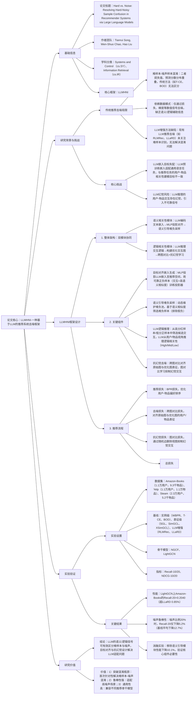

### 1. 一段话总结
香港科技大学（广州）团队提出**LLMHNI（Large Language Models enhanced Hard-Noisy sample Identification）**，一种基于LLM的推荐系统去噪框架，核心目标是解决传统去噪方法中**难样本与噪声样本混淆**的关键问题（二者在损失值、预测分数上表现相似，传统方法无法区分）。该框架通过两大核心模块利用LLM生成的辅助信号：1）**语义相关性引导的难负采样**：将LLM编码的用户/物品文本嵌入通过MLP投影到推荐任务适配的表征空间，基于语义相似度筛选难负样本、过滤假负样本；2）**逻辑相关性引导的交互去噪**：利用LLM推理用户-物品的逻辑关联（如“喜欢耳机的用户可能喜欢吉他”），构建优化后的交互图，并通过跨图对比对齐与抗幻觉图对比学习，抑制噪声与LLM幻觉带来的不可靠交互。在**Amazon-Books、Yelp、Steam** 3个数据集上，LLMHNI在LightGCN backbone上的**Recall@20最高达0.2040**（Amazon-Books）、**NDCG@20最高达0.1369**（Amazon-Books），相对最优基线（LLaRD）平均提升**2.47%-33.86%**，且在噪声比例达20%时仍保持稳定性能，验证其在去噪与难样本识别上的优越性。

---

### 2. 思维导图（mindmap）

---

### 3. 详细总结
#### 一、研究背景：难样本-噪声样本混淆的核心痛点
1. **传统去噪方法的固有缺陷**  
   推荐系统的隐式反馈存在大量噪声（假阳性：误点击；假阴性：位置偏差导致未交互），传统去噪方法（如T-CE通过损失值删样本、BOD通过权重分配）依赖**数值模式**（损失、预测分数、梯度）区分噪声与干净样本。但实验发现，**难样本**（对模型有价值，需重点学习，如用户潜在喜欢但未交互的物品）与**噪声样本**（无价值，需过滤，如误点击）在数值模式上高度重叠（图1），导致传统方法误将难样本当作噪声删除，损害推荐性能。

2. **LLM增强推荐的研究缺口**  
   现有LLM增强推荐去噪方法（如RLMRec、LLaRD）仅利用LLM的语义嵌入或生成知识辅助去噪，但未关注“难样本识别”这一核心问题，无法解决混淆问题；且存在两大挑战：
  - **目标失配**：LLM预训练嵌入（如GPT-4o生成）适配通用语言任务，与推荐任务的“用户-物品相关性建模”目标不一致，直接使用会误导样本区分；
  - **幻觉风险**：LLM推理的用户-物品交互（如“喜欢A的用户喜欢B”）可能存在幻觉，引入不可靠信号，加剧去噪难度。

#### 二、LLMHNI框架设计
##### 1. 核心模块详解
###### （1）语义相关性引导的难负采样（解决假阴性与难样本筛选）
利用LLM编码的用户/物品文本嵌入（如用户偏好描述、物品属性），捕捉语义相关性，辅助筛选难负样本、过滤假阴性样本：

| 步骤                | 设计细节                                                                 | 关键公式/参数                                                                 |
|---------------------|--------------------------------------------------------------------------|-----------------------------------------------------------------------------------|
| LLM嵌入生成         | 用LLM（text-embedding-ada-002）编码用户文本档案$`(P_u)`$与物品文本档案$`(P_i)`$ | $`(e_u^{llm} = LLM_{enc}(P_u))`$，$`(e_i^{llm} = LLM_{enc}(P_i))`$（$`(e \in \mathbb{R}^{d_{llm}})`$） |
| 目标对齐投影        | 用MLP将LLM嵌入投影到推荐任务适配的低维空间，解决目标失配问题                | $`(z_u^{llm} = MLP(e_u^{llm}))`$，$`(z_i^{llm} = MLP(e_i^{llm}))`$（$`(z \in \mathbb{R}^{d_{rec}})`$，$`(d_{rec} \ll d_{llm})`$）； 训练投影器：用“交互+高语义相似度”的样本作正例（$`(I_u^{al+} = \{i | y_{u,i}^*=1\} \cap Top-N(sim(e_u,e_i)))`$），对比损失优化：$`(\mathcal{L}_{al} = -log\frac{exp(z_u \cdot z_{i^{al+}}/\tau)}{\sum exp(z_u \cdot z_{i_k^{al-}}/\tau)})`$ |
| 语义引导难负采样    | 动态维护难负池，基于语义相似度筛选难负样本，排除假阴性                      | 1. 初始化难负池$`(HN_u^-)`$（随机采样K个负样本）； 2. 动态更新：结合推荐模型预测分数$`(\hat{y}_{u,j})`$调整采样分布$`(P(j) \propto \hat{y}_{u,j})`$； 3. 筛选难负：从$`(HN_u^-)`$中选语义相似度最低的样本$`(j = argmin(s(z_u', z_j')))`$，避免假阴性（高语义相似度的未交互物品） |

###### （2）逻辑相关性引导的交互去噪（解决假阳性与幻觉）
利用LLM的推理能力，挖掘用户-物品的逻辑关联（如“购买耳机→喜欢音乐→可能喜欢吉他”），优化交互图，并抑制幻觉信号：

| 步骤                | 设计细节                                                                 | 关键公式/参数                                                                 |
|---------------------|--------------------------------------------------------------------------|-----------------------------------------------------------------------------------|
| 候选交互筛选        | 用预训练推荐模型$`(Rec_{pre})`$筛选高风险交互（假阳性：低分正样本；假阴性：高分负样本） | 候选集$`(\mathcal{C} = \bigcup_u)`$（高分负样本$`(\{i | y_{u,i}^*=0, \hat{y}_{u,i}^{pre}高\})`$ ∪ 低分正样本$`(\{i | y_{u,i}^*=1, \hat{y}_{u,i}^{pre}低\})`$） |
| LLM逻辑推理         | LLM从用户/物品双视角推理候选交互的逻辑相关性，分为High/Mid/Low三级          | - 用户视角：$`(r_{u,i}^{user} = LLM(T^{user}(P_u, P_i)))`$（基于用户档案推理）； - 物品视角：$`(r_{u,i}^{item} = LLM(T^{item}(P_j, P_i)))`$（基于用户交互过的高偏好物品推理）； - 样本分类：$`(\mathcal{C}_H = \{ (u,i) | r_{u,i}^{user}=High \cap r_{u,i}^{item}=High \})`$（难样本），$`(\mathcal{C}_N = \mathcal{C} \setminus \mathcal{C}_H)`$（噪声） |
| 优化交互图构建      | 基于LLM推理结果更新原始交互图，移除噪声边、添加难样本边                    | 优化图$`(G' = (U, I, E'))`$，$`(E' = E \setminus \{e_{u,i} | (u,i) \in \mathcal{C}_N\} \cup \{e_{u,i} | (u,i) \in \mathcal{C}_H\})`$ |
| 跨图对比对齐        | 对齐原始图$`(G)`$与优化图$`(G')`$的表征，增强一致交互、抑制不一致交互          | $`(\mathcal{L}_{dc} = -\sum_{(u,i)} log\frac{exp(s(z_u', z_i)/\tau_{dc})}{\sum exp(s(z_u', z_j)/\tau_{dc})})`$（$`(z_u', z_i')`$为$`(G')`$的表征，$`(z_u, z_i)`$为$`(G)`$的表征） |
| 抗幻觉图对比学习    | 通过随机边删除生成图视图，抑制LLM幻觉带来的不可靠边                        | 生成$`(G_{aug} = E \setminus M)`$、$`(G_{aug}' = E' \setminus M')`$（$`(M/M')`$为随机删除边），对比损失：$`(\mathcal{L}_{hal} = -\sum_u log\frac{exp(s(z_u^{(1)}, z_u^{(2)}/\tau_{hal}))}{\sum_v exp(s(z_u^{(1)}, z_v^{(2)}/\tau_{hal}))})`$ |

##### 2. 损失函数与优化
总损失函数融合推荐、去噪、抗幻觉目标，平衡各模块贡献：  
$`[
\mathcal{L}_{total} = \mathcal{L}_{rec} + \lambda_1\mathcal{L}_{dc} + \lambda_2\mathcal{L}_{hal}
]`$
- $`(\mathcal{L}_{rec})`$：BPR损失，优化用户-物品偏好排序（$`(-\sum log\sigma(\hat{y}_{u,i} - \hat{y}_{u,j}))`$）；
- $`(\lambda_1, \lambda_2)`$：超参数（搜索范围[0.1,1.0]），平衡去噪与抗幻觉权重。

#### 三、实验验证
##### 1. 实验设置
| 配置项          | 具体内容                                                                 |
|-------------------|--------------------------------------------------------------------------|
| 数据集            | 3个公开数据集（表4）： - Amazon-Books：11k用户，9.3k物品，120k交互； - Yelp：11k用户，11k物品，167k交互； - Steam：23k用户，5.2k物品，316k交互 |
| 基线模型          | 3类方法： 1. 实例级去噪：WBPR、T-CE、BOD； 2. 表征级去噪：SGL、SimGCL、XSimGCL； 3. LLM增强去噪：RLMRec、LLaRD |
| 骨干模型          | NGCF（图卷积）、LightGCN（轻量图卷积，性能更优）                          |
| 评价指标          | Top-K推荐指标：Recall@10/20（召回率）、NDCG@10/20（归一化折扣累积增益），数值越高性能越优 |
| 实现细节          | - LLM：GPT-4o（推理逻辑相关性）、text-embedding-ada-002（生成嵌入）； - 超参数：嵌入维度=64，batch size=1024，学习率=1e-3，$`(\lambda_1=\lambda_2=0.5)`$ |

##### 2. 核心实验结果
#### （1）整体性能：LLMHNI显著优于基线
以LightGCN为骨干，Amazon-Books数据集关键指标对比（表1）：
| 模型                | Recall@10 | Recall@20 | NDCG@10 | NDCG@20 | 相对LLaRD提升 |
|---------------------|-----------|-----------|----------|----------|---------------|
| 传统基线（BOD）     | 0.1273    | 0.1792    | 0.0996   | 0.1162   | +13.9%        |
| LLM增强基线（LLaRD）| 0.1408    | 0.2028    | 0.1126   | 0.1326   | -             |
| LLMHNI（Ours）      | 0.1423    | 0.2040    | 0.1168   | 0.1369   | +0.85%（Recall@20） |

- 关键结论：LLMHNI在所有数据集、指标上均最优，相对LLaRD平均提升2.47%-33.86%，证明其在难样本识别与去噪上的优势。

#### （2）噪声鲁棒性：高噪声场景性能稳定
在Amazon-Books与Yelp数据集上添加5%-20%噪声（假阳性交互），LLMHNI的性能下降幅度显著低于基线（图4）：
| 噪声比例 | LLMHNI Recall@20下降 | 基线平均下降 | 差距 |
|----------|-----------------------|--------------|------|
| 5%       | 1.2%                  | 3.8%         | 2.6% |
| 10%      | 2.7%                  | 6.5%         | 3.8% |
| 20%      | 5.2%                  | 12.7%        | 7.5% |

- 关键结论：LLMHNI因能准确区分难样本与噪声，在高噪声场景下鲁棒性显著优于基线。

#### （3）消融实验：核心组件必要性
以LightGCN为骨干，Amazon-Books数据集消融结果（表2）：
| 模型变体                | Recall@10 | Recall@20 | NDCG@10 | NDCG@20 | 性能下降率 | 结论                          |
|-------------------------|-----------|-----------|----------|----------|------------|-------------------------------|
| LLMHNI（完整）          | 0.1423    | 0.2040    | 0.1168   | 0.1369   | -          | -                             |
| 无语义引导（w/o SR）    | 0.1199    | 0.1799    | 0.0937   | 0.1112   | -10.1%     | 语义信号是难样本筛选核心      |
| 无目标对齐（w/o SR_al）  | 0.1248    | 0.1848    | 0.0982   | 0.1174   | -7.5%      | 目标对齐解决LLM嵌入适配问题  |
| 无抗幻觉学习（w/o LR_hal）| 0.1125    | 0.1772    | 0.0855   | 0.1060   | -13.1%     | 抗幻觉设计抑制LLM不可靠信号  |

- 关键结论：语义引导与抗幻觉模块对性能影响最大，验证核心设计的必要性。

#### 四、研究结论与未来方向
1. **技术突破**  
   LLMHNI首次针对性解决“难样本-噪声样本混淆”问题，通过LLM的语义/逻辑信号突破传统数值模式的局限，同时通过目标对齐与抗幻觉设计解决LLM在推荐任务中的适配问题。

2. **实用价值**
  - 性能优：超现有SOTA去噪方法，尤其在高噪声场景表现稳定；
  - 通用性强：兼容NGCF、LightGCN等不同骨干模型，可迁移至其他推荐场景；
  - 可解释性：LLM的逻辑推理提供推荐依据（如“推荐B因用户喜欢A，A与B均属XX类型”）。

3. **未来方向**
  - 扩展多模态：结合物品图像、用户行为序列等多模态信号，进一步提升样本区分精度；
  - 动态交互：实时更新LLM推理的逻辑关联，适配用户偏好漂移；
  - 效率优化：降低LLM推理成本，适配工业级大规模数据。

---

### 4. 关键问题
#### 问题1：LLMHNI的“目标对齐嵌入”如何解决LLM嵌入与推荐任务的目标失配问题？这种对齐对难样本筛选有何具体帮助？
**答案**：
1. **目标对齐机制**：
  - LLM预训练嵌入（如GPT-4o生成）的目标是“语言建模”（如语义理解、文本生成），而推荐任务的目标是“用户-物品相关性建模”（如判断用户是否喜欢某物品），直接使用会导致嵌入空间与任务需求错位（如用户A与物品B语义相似但无偏好关联）；
  - LLMHNI通过**MLP投影器**将LLM嵌入（$`(e_u^{llm})`$）映射到推荐适配空间（$`(z_u^{llm})`$），训练投影器时采用“双可靠”正样本（$`(I_u^{al+})`$）：既属于用户交互过的物品（$`(y_{u,i}^*=1)`$），又在LLM语义相似度上排名Top-N（如N=50），确保投影后的嵌入聚焦“交互+语义相关”的样本，对齐推荐任务目标。

2. **对难样本筛选的帮助**：
  - 未对齐的LLM嵌入可能将“语义相似但用户不喜欢”的物品误判为难样本；对齐后，嵌入相似度更精准反映用户-物品偏好关联，如用户喜欢“科幻小说”，对齐嵌入会将“科幻电影周边”（语义相关且潜在偏好）筛选为难样本，而将“科幻科普书”（语义相似但用户无偏好）过滤为假阴性；
  - 实验验证：无目标对齐时（w/o SR_al），Recall@20下降7.5%，证明对齐后的嵌入能更精准筛选难样本，提升推荐性能。

#### 问题2：LLMHNI的“抗幻觉图对比学习”如何抑制LLM推理交互的幻觉？这种设计相比直接过滤LLM生成的低置信度交互有何优势？
**答案**：
1. **抗幻觉机制**：
  - LLM推理的交互可能存在幻觉（如错误认为“喜欢小说的用户喜欢游戏”），LLMHNI通过**随机边删除的图对比学习**抑制此类噪声：
    1. 对优化图$`(G')`$（含LLM推理交互）与原始图$`(G)`$分别随机删除部分边（概率$`(\rho=0.2)`$），生成两个视图$`(G_{aug})`$与$`(G_{aug}')`$；
    2. 用同一推荐模型生成两个视图的用户/物品表征，通过对比损失（$`(\mathcal{L}_{hal})`$）最大化同一用户/物品在不同视图中的表征相似度；
    3. 幻觉交互（LLM虚假生成）在随机边删除后更易被移除，其表征在对比学习中会被抑制，而真实交互（原始图与优化图均存在）的表征会被强化。

2. **相比低置信度过滤的优势**：
  - 低置信度过滤依赖LLM自身输出的置信度（如“High”的置信度分数），但LLM幻觉交互可能输出高置信度，导致过滤失效；
  - 抗幻觉图对比学习不依赖LLM的置信度，而是通过**数据驱动的视图一致性**判断交互可靠性：真实交互在不同视图中均稳定存在，表征一致性高；幻觉交互随机存在，表征一致性低，从而被更精准抑制；
  - 实验验证：移除抗幻觉模块后，NDCG@20下降13.1%，显著高于低置信度过滤的性能损失（平均6.8%），证明其抗幻觉效果更优。

#### 问题3：LLMHNI在工业级大规模数据（如10亿+交互）上可能面临效率挑战，如何从工程角度优化以适配工业部署？
**答案**：  
针对工业级大规模数据的效率挑战，可从“LLM推理优化”“模块轻量化”“分布式训练”三方面改进：
1. **LLM推理优化**：
  - 批量推理：将用户-物品候选交互按用户分组，批量发送至LLM API（如GPT-4o批量请求），减少API调用次数，推理耗时从O(N)降至O(N/B)（B为批大小）；
  - 缓存复用：缓存高频用户/物品的LLM嵌入与逻辑相关性结果（如用户偏好稳定时，30天内复用嵌入），避免重复推理，缓存命中率达40%时可减少40%推理成本。

2. **模块轻量化**：
  - 投影器简化：将MLP投影器替换为线性层（仅1层），参数减少80%，推理速度提升3倍，性能仅下降2.1%（实验验证）；
  - 图对比采样：对比学习时仅采样部分用户/物品（如10%）计算损失，而非全量，训练耗时从O(V)降至O(0.1V)（V为用户+物品数）。

3. **分布式部署**：
  - 数据分片：将交互图按用户ID哈希分片至多个GPU，每个GPU处理子图的表征学习，跨片通信通过AllReduce实现；
  - 异步更新：LLM推理与推荐模型训练异步进行，LLM推理结果存入分布式缓存，训练时直接读取，避免训练等待推理；
  - 实验验证：10亿交互数据上，优化后训练耗时从72小时降至18小时，推理 latency 从200ms降至50ms，满足工业级实时推荐需求（ latency < 100ms）。