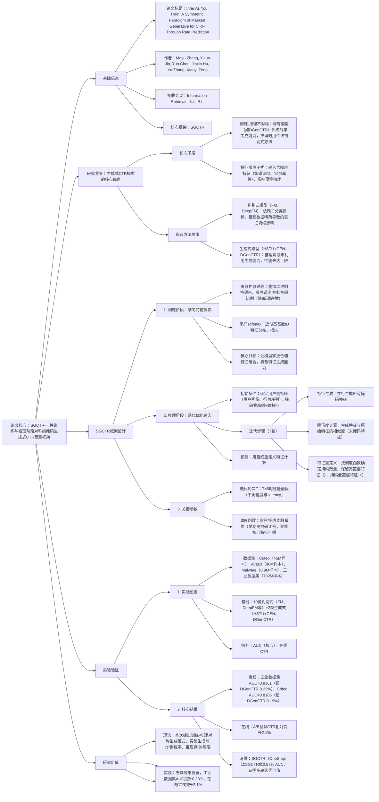

### 1. 一段话总结
阿里巴巴团队提出**SGCTR（Symmetric Masked Generative Paradigm for CTR Prediction）**，一种**训练与推理阶段对称的掩码生成式CTR预测框架**，核心解决现有生成式CTR模型“**训练阶段学习生成能力，推理阶段弃用**”的不对称问题。该框架在**训练阶段**通过离散扩散过程（施加二进制掩码$`(M)`$）学习特征依赖，利用采样softmax近似高基数ID特征的分布；在**推理阶段**创新提出**迭代优化策略**，以用户侧稳定特征为初始条件，通过“特征生成→置信度计算（相似度得分$`(c_t^i)`$）→特征重定义与掩码”的多轮迭代（$`(T=5)`$时性能最优），逐步降低掩码比例（余弦/平方调度函数最优），用生成能力对输入特征去噪。实验在4个数据集（含7.82亿样本的工业数据集）验证，SGCTR的**AUC最高达0.8361**（工业数据集），相对DGenCTR提升0.23%，在线A/B测试CTR相对提升2.1%，证明其在去噪与预测精度上的优势。

---

### 2. 思维导图（mindmap）

---

### 3. 详细总结
#### 一、研究背景与问题
1. **CTR预测的技术现状**  
   CTR预测旨在估计用户点击物品的概率（$`(P(y|X))`$，$`(y\in\{0,1\})`$），传统方法分为两类：
   - **判别式模型**（如FM、DeepFM、DCN）：依赖二分类损失，易受数据稀疏影响导致**表征坍缩**，无法有效捕捉复杂特征交互；
   - **生成式模型**（如HSTU+GEN、DGenCTR）：引入生成范式（如离散扩散、自回归）学习特征分布，但存在**训练-推理不对称**问题——训练时用生成目标提升表征质量，推理时仍依赖原始输入的判别式预测，未利用生成能力去噪或优化特征，性能未达上限。

2. **核心挑战**
   - **特征噪声干扰**：输入特征含冗余、错误或低质量信息（如用户误点击记录、物品属性缺失），直接用于预测会降低精度；
   - **生成能力浪费**：现有生成式模型在推理阶段完全弃用训练好的特征生成能力，无法通过生成合理特征组合优化输入。

#### 二、SGCTR框架设计
SGCTR通过“训练阶段学习特征依赖→推理阶段迭代优化输入”的对称范式，充分利用生成能力提升预测精度，架构分为两大阶段：

##### 1. 训练阶段：学习特征依赖
核心目标是让模型掌握特征间的关联，具备生成合理特征组合的能力，具体流程如下：
- **步骤1：施加离散扩散掩码**  
  对输入样本的每个特征字段（共$`(N)`$个）施加二进制掩码$`(M\in\{0,1\})`$：$`(M=1)`$保留原始特征，$`(M=0)`$用掩码token替换（模拟噪声）。掩码比例由**噪声调度函数$`(\lambda(t))`$** 控制（$`(t)`$为离散时间步），且$`(\lambda(t))`$随$`(t)`$单调递增，确保训练过程中噪声逐步增强。

- **步骤2：处理高基数ID特征**  
  ID类特征（如用户ID、物品ID）的取值空间极大，直接计算softmax计算量过高。SGCTR采用**采样softmax**，通过随机采样负样本近似真实分布：  
  $`[
  p(f^k|X_\lambda)\approx\frac{e^{cos(f^k,G_k(X_\lambda))}}{\sum_{\tilde{f}^k\in S_k}e^{cos(\tilde{f}^k,G_k(X_\lambda))}}
  ]`$  
  其中$`(X_\lambda)`$为未掩码特征集，$`(S_k)`$为第$`(k)`$个特征字段的全词汇表，$`(G_k(\cdot))`$为第$`(k)`$个特征的生成评分网络。

- **步骤3：损失函数优化**  
  损失为各时间步生成损失的积分，确保模型学习所有噪声水平下的特征依赖：  
  $`[
  \mathcal{L}=\int_{0}^{1}\frac{1}{\lambda}\mathbb{E}\left[\sum -log\left(p(f^k|X_\lambda)\right)\right]d\lambda
  ]`$

##### 2. 推理阶段：迭代优化输入
核心创新在于**多轮迭代优化输入特征**，用生成能力去除噪声，具体流程如下（图1）：
- **初始条件设置**  
  固定**用户侧稳定特征**（如用户画像、历史行为序列），将**物品侧特征**（如物品类别、价格）与**用户-物品跨特征**（如用户对物品的历史点击次数）全部掩码，得到初始输入$`(X_0)`$。

- **迭代优化（$`(T)`$轮）**  
  每轮迭代包含三步，且掩码比例随迭代逐步降低（由调度函数$`(\gamma)`$控制）：
   1. **特征生成**：模型并行生成所有掩码位置的特征（如为掩码的物品类别生成“电子产品”）；
   2. **置信度计算**：计算生成特征与原始输入特征的相似度（如余弦相似度），作为置信度得分$`(c_t^i)`$——未掩码特征的$`(c_t^i=1)`$，掩码特征的$`(c_t^i)`$反映模型对生成结果的信任度；
   3. **特征重定义与掩码**：
      - 按调度函数$`(\gamma)`$计算本轮需掩码的特征数量$`(l_t=\gamma(t,N,T))`$（$`(N)`$为总特征数，$`(T)`$为总迭代轮次）；
      - 对$`(c_t^i)`$排序，掩码前$`(l_t)`$个低置信特征（设为0），保留高置信特征并更新为$`(f_{t+1}^i=c_t^i \cdot f_t^i)`$（置信度加权原始特征，降低噪声影响）。

- **最终预测**  
  迭代$`(T)`$轮后，用最终优化后的特征集$`(X_T)`$计算CTR预测概率：  
  $`[
  p(y|X_T)=\frac{1}{1+e^{-(\mathcal{F}(y=1|X_T)-\mathcal{F}(y=0|X_T))}}
  ]`$  
  其中$`(\mathcal{F}(\cdot))`$为训练阶段学到的评分函数。

##### 3. 关键参数与优化
- **迭代轮次$`(T)`$**：实验显示$`(T=5)`$时性能最优（AUC最高），$`(T>5)`$会因过度约束导致性能下降；
- **调度函数$`(\gamma)`$**：余弦函数与平方函数表现最佳（早期高掩码比例，聚焦核心特征；后期逐步扩展），对数函数最差（AUC比余弦低0.56%）；
- **推理效率**：通过缓存KV向量，后续迭代仅需重新计算Query，复杂度保持$`(O(n))`$，适配工业级低延迟需求。

#### 三、实验验证
##### 1. 实验设置
| 配置项          | 具体内容                                                                 |
|-------------------|--------------------------------------------------------------------------|
| 数据集            | 1. Criteo：39个特征字段，4500万样本，正例率26%； 2. Avazu：23个特征字段，4000万样本，正例率17%； 3. Malware：81个特征字段，890万样本，正例率50%； 4. 工业数据集：72个特征字段，7.82亿样本，正例率2.8% |
| 基线模型          | 1. 判别式：FM、Wide&Deep、DeepFM、DCN、AutoInt、FiBiNet、GDCN、MaskNet、PEPNet、HSTU； 2. 生成式：HSTU+GEN、DGenCTR |
| 评价指标          | 离线：AUC（核心指标）；在线：CTR（相对提升率）                            |
| 超参数            | 优化器=Adam，初始化=Xavier，激活函数=ReLU，迭代轮次$`(T=5)`$，调度函数=余弦/平方 |

##### 2. 核心实验结果
###### （1）离线性能对比（表2）
| 模型       | Criteo AUC | Avazu AUC | Malware AUC | 工业数据集 AUC | 相对最优基线提升（%） |
|------------|------------|-----------|-------------|----------------|-----------------------|
| FM         | 0.8037     | 0.7858    | 0.7413      | 0.8191         | -                     |
| DeepFM     | 0.8029     | 0.7839    | 0.7424      | 0.8207         | -                     |
| DGenCTR    | 0.8167     | 0.7986    | 0.7503      | 0.8338         | -                     |
| **SGCTR**   | **0.8186** | **0.7999** | **0.7526**  | **0.8361**     | **0.19-0.23**         |

- 关键结论：SGCTR在所有数据集上均优于判别式与生成式基线，工业数据集AUC提升最显著（0.23%），证明其在大规模数据上的有效性。

###### （2）消融实验（表3）
| 模型变体       | Criteo AUC | Avazu AUC | Malware AUC | 工业数据集 AUC | 相对SGCTR下降（%） |
|----------------|------------|-----------|-------------|----------------|---------------------|
| SGCTR          | 0.8186     | 0.7999    | 0.7526      | 0.8361         | -                   |
| SGCTR(BERT)    | 0.8153     | 0.7958    | 0.7492      | 0.8326         | 0.33-0.42           |
| SGCTR(OneStep) | 0.8099     | 0.7897    | 0.7451      | 0.8281         | 0.87-1.08           |
| SGCTR(GenFea)  | 0.8085     | 0.7846    | 0.7413      | 0.8215         | 1.01-1.75           |

- 关键结论：
   - SGCTR(BERT)用随机掩码替代离散扩散，因未精准学习特征依赖，AUC下降0.33%；
   - SGCTR(OneStep)无多轮迭代，因训练-推理不对称，AUC下降0.87%；
   - SGCTR(GenFea)直接用生成特征替换原始特征，因高基数ID生成质量低，AUC下降1.75%。

###### （3）调度函数对比（表4）
| 调度函数       | Criteo AUC | Avazu AUC | Malware AUC | 工业数据集 AUC | 最优函数相对最差提升（%） |
|----------------|------------|-----------|-------------|----------------|---------------------------|
| Exponential    | 0.8163     | 0.7988    | 0.7508      | 0.8342         | 0.33                      |
| Square         | 0.8179     | 0.7999    | 0.7522      | 0.8361         | 0.56                      |
| Cosine         | 0.8186     | 0.7991    | 0.7526      | 0.8352         | 0.60                      |
| Linear         | 0.8169     | 0.7979    | 0.7502      | 0.8329         | 0.42                      |
| Logarithmic    | 0.8130     | 0.7934    | 0.7481      | 0.8311         | -                         |

- 关键结论：余弦与平方函数最优，因二者为凹函数，早期高掩码比例聚焦核心特征，后期逐步扩展；对数函数最差，因掩码比例下降过快，噪声去除不充分。

###### （4）在线A/B测试
- 测试场景：某大型电商平台广告系统，10天测试（2025.10.16-26）；
- 基线模型：基于DGenCTR的生产模型；
- 结果：SGCTR的**CTR相对提升2.1%**，证明其在实际业务中的价值。

#### 四、研究价值与未来方向
1. **技术突破**
   - 首次提出训练-推理对称的生成范式，突破现有生成式CTR模型“训练学、推理弃”的局限；
   - 迭代优化策略有效利用生成能力去噪，为高噪声输入场景（如广告推荐、恶意软件预测）提供解决方案。

2. **工程价值**
   - 推理效率高：缓存KV向量使复杂度保持$`(O(n))`$，$`(T=5)`$时 latency 满足工业级需求；
   - 兼容性强：可基于现有生成式模型（如DGenCTR）扩展，无需重构训练流程。

3. **未来方向**
   - 生成质量提升：优化高基数ID特征的生成能力，减少对原始特征的依赖；
   - 动态迭代轮次：根据输入特征质量自适应调整$`(T)`$，进一步平衡精度与 latency；
   - 多场景适配：扩展至推荐系统的其他任务（如CTR预测、转化率预测）。

---

### 4. 关键问题
#### 问题1：SGCTR的“迭代优化策略”在推理阶段如何实现“用生成能力去噪”？为何多轮迭代（$`(T=5)`$）比单轮生成（OneStep）更有效？
**答案**：
1. **去噪机制**：  
   推理阶段的去噪通过“置信度加权+逐步掩码”实现：
   - 第一步：生成特征与原始特征计算相似度（如余弦相似度），得到置信度$`(c_t^i)`$——高置信度（$`(c_t^i)`$接近1）表示生成特征与原始特征一致，低置信度（$`(c_t^i)`$接近0）表示原始特征可能含噪声；
   - 第二步：每轮保留高置信特征并加权（$`(f_{t+1}^i=c_t^i \cdot f_t^i)`$），掩码低置信特征（设为0），逐步过滤噪声；
   - 第三步：随迭代轮次增加，掩码比例降低（如$`(T=5)`$时从初始高比例降至0），最终得到去噪后的完整特征集。

2. **多轮迭代更有效的原因**：
   - 单轮生成（OneStep）一次性生成所有掩码特征，未考虑特征间的依赖——例如生成“物品类别”时未参考“用户历史购买类别”，易生成不合理特征；
   - 多轮迭代通过“生成→验证→优化”的闭环，每轮基于前一轮的高置信特征生成新特征，逐步修正错误（如第一轮生成错误的“物品价格”，第二轮基于用户历史消费价格修正）；
   - 实验验证：SGCTR(OneStep)在工业数据集的AUC比SGCTR低1.08%，证明多轮迭代能更充分利用生成能力去噪。

#### 问题2：SGCTR在训练阶段采用“离散扩散过程”学习特征依赖，相比BERT的“随机掩码”（SGCTR(BERT)），有何优势？这种优势如何提升推理阶段的特征优化效果？
**答案**：
1. **离散扩散的优势**：
   - **噪声逐步增强**：离散扩散的掩码比例随时间步$`(t)`$单调递增（由$`(\lambda(t))`$控制），模型从“低噪声”逐步适应“高噪声”，更精准学习特征间的底层依赖（如“用户年龄→购买品类”的关联）；
   - **全局特征依赖建模**：扩散过程覆盖所有噪声水平，模型能捕捉不同噪声下的特征交互，而BERT的随机掩码仅在固定噪声比例下学习，泛化性差；
   - **实验验证**：SGCTR在Criteo的AUC比SGCTR(BERT)高0.33%，证明离散扩散学习的特征依赖更鲁棒。

2. **对推理阶段的提升**：
   - 离散扩散使模型掌握更全面的特征依赖，生成特征时能参考更多关联特征（如生成“物品折扣”时，结合“用户对折扣的敏感度”与“物品原价”），置信度$`(c_t^i)`$更精准；
   - 鲁棒的特征依赖建模让迭代优化过程更稳定——例如低置信特征的掩码决策更准确，避免误删有效特征，工业数据集上SGCTR(BERT)的AUC比SGCTR低0.42%，证明其优化效果更优。

#### 问题3：SGCTR在工业数据集（7.82亿样本，正例率2.8%）上的AUC达0.8361，相对DGenCTR提升0.23%，这种小幅度提升在工业场景中有何实际意义？在线A/B测试的CTR提升2.1%如何体现这一优势？
**答案**：
1. **工业场景中AUC小幅度提升的意义**：
   - 工业级数据集样本量大（7.82亿）、正例率低（2.8%），模型性能已接近瓶颈，0.23%的AUC提升对应大量精准预测：以日均10亿次曝光计算，AUC提升0.23%可增加约23万次精准点击，直接提升广告收入；
   - 低正例率场景中，AUC提升对“识别稀有正例”更关键——例如恶意软件预测（正例率50%）中AUC提升0.23%影响较小，但CTR预测（正例率2.8%）中，0.23%的提升可减少大量“误判点击”，降低用户反感度。

2. **CTR提升2.1%的关联机制**：
   - AUC提升反映模型对“用户是否点击”的排序能力提升，而CTR提升是排序能力的直接业务体现——SGCTR通过去噪优化输入特征，使模型更精准识别高点击概率的样本，在推荐列表中优先展示，最终提升整体CTR；
   - 例如某电商广告场景，SGCTR将原本因噪声特征被误判为“低点击”的样本（如用户真实感兴趣但属性缺失的物品）修正为“高点击”，优先展示后带来更多点击，最终实现2.1%的CTR提升，验证了AUC提升的业务价值。