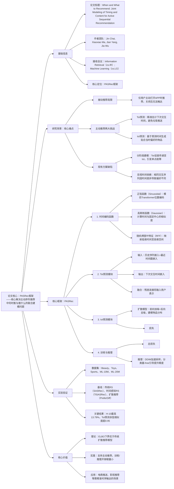

### 1. 一段话总结
澳大利亚麦考瑞大学等团队提出**PASRec框架**，核心解决主动序列推荐中“何时推（ToI）”与“推什么（IoI）”的联合建模问题，通过**时间编码函数**（将真实交互时间转化为高维嵌入）、**ToI预测模块**（基于用户历史与最近时间戳预测下次交互时间嵌入）、**IoI预测模块**（扩散模型结合BPR损失生成目标物品嵌入）三大组件，在5个公开数据集（Beauty、ML-20M等）上实现**H@10最高13.79%**、**N@10最高9.21%**，较最优基线提升显著，且理论上证明其证据下界（ELBO）优于传统扩散推荐模型，为主动推荐提供精准的时序与内容联合优化方案。

---

### 2. 思维导图

---

### 3. 详细总结
#### 一、研究背景与核心问题
1. **主动序列推荐的核心诉求**  
   主动推荐需同时解决“何时推（Time of Interest, ToI）”与“推什么（Item of Interest, IoI）”，但现有方案存在两大缺陷：
   - 分阶段建模：先预测ToI再生成IoI，ToI误差会传递至IoI，引发单点故障；
   - 时间信息浪费：传统模型仅用绝对位置或相对间隔，忽视真实交互时间蕴含的偏好差异（如图1中，相同物品序列因交互时长不同，推荐偏好分别为键盘和摄像头）。

2. **关键定义**
   - 联合分布：$`p(e, \tau | s_u) = p(\tau | s_u) \cdot p(e | \tau, s_u)`$（$`s_u`$为用户历史序列，$`\tau`$为ToI，$`e`$为IoI）；
   - 时间编码：将原始时间戳转化为高维嵌入，捕捉时间依赖；
   - 扩散模型：通过前向加噪、反向去噪，建模物品分布的复杂特性。

#### 二、PASRec框架核心设计
##### 1. 时间编码函数（TE）
将真实交互时间戳转化为高维嵌入，支持3种编码方式：  
| 编码方式       | 核心逻辑                                                                 | 公式要点                                                                 |
|----------------|--------------------------------------------------------------------------|--------------------------------------------------------------------------|
| 正弦函数       | 模仿Transformer位置编码，用正弦/余弦函数映射时间                          | $`TE(t, 2i)=sin(t/freq^{2i/d})`$，$`TE(t, 2i+1)=cos(t/freq^{2i/d})`$          |
| 高斯核函数     | 计算时间与固定中心的相似度，构建d维嵌入                                  | $`TE(t)=[\psi_0(t,c_0), ..., \psi_{d-1}(t,c_{d-1})]`$（$`\psi`$为高斯核）     |
| 随机傅里叶特征 | 采样高斯分布频率，将时间映射至高维空间                                    | $`TE(t)=[cos(2\pi b_k t), sin(2\pi b_k t)]`$（$`b_k \sim N(0, \sigma^2)`$）    |
- 序列增强：物品嵌入与对应时间嵌入相加，得到增强序列$`\tilde{s}_u = [e_1+\tau_1, ..., e_{n-1}+\tau_{n-1}]`$。

##### 2. ToI预测模块
- 用户表示提取：Transformer编码器处理$`\tilde{s}_u`$，得到$`g_u = TR(\tilde{s}_u)`$；
- 时间预测：MLP模块结合$`g_u`$与最近时间戳嵌入$`\tau_{n-1}`$，输出预测ToI嵌入$`\hat{\tau}_n = M_\varphi(g_u, \tau_{n-1})`$；
- 表示融合：残差连接平衡原始用户表示与时间信息：$`g_u' = (1-\gamma)g_u + \gamma \cdot MLP(g_u, \hat{\tau}_n)`$（$`\gamma`$为权重，默认0.3-0.8）。

##### 3. IoI预测模块（扩散模型）
- 前向加噪：对目标物品嵌入$`e_n^0`$逐步添加高斯噪声，得到$`e_n^t = \sqrt{\overline{\alpha}_t}e_n^0 + \sqrt{1-\overline{\alpha}_t}\epsilon`$（$`\overline{\alpha}_t`$为累积方差）；
- 反向去噪：基于增强用户表示$`g_u'`$，训练去噪网络$`p_\theta`$重构$`e_n^0`$；
- 损失设计：
   - 重建损失$`\mathcal{L}_{Normal}`$：最小化预测嵌入与真实嵌入的L2距离；
   - BPR损失$`\mathcal{L}_{BPR}`$：最大化正样本与负样本中心的相似度差异；
   - 总IoI损失：$`\mathcal{L}_{IoI} = \lambda\mathcal{L}_{Normal} + (1-\lambda)\mathcal{L}_{BPR}`$（$`\lambda`$默认0.4-0.8）。

##### 4. 整体训练与推理
- 总损失：$`\mathcal{L}_{PASRec} = \eta\mathcal{L}_{IoI} + (1-\eta)\mathcal{L}_{ToI}`$（$`\eta`$平衡IoI与ToI优化，默认0.2-0.9）；
- 推理加速：采用DDIM采样（非马尔可夫过程），减少采样步数，公式为$`\hat{e}_n^0 = (1+w)p_\theta(e_n^t, t, g_u') - wp_\theta(e_n^t, t, \Phi)`$（$`w`$为引导权重，默认2-8）。

#### 三、实验验证
##### 1. 实验设置
| 配置项          | 具体内容                                                                 |
|-------------------|--------------------------------------------------------------------------|
| 数据集            | 5个公开数据集： - Beauty：22,363用户、12,101物品、162,150交互； - ML-20M：138,493用户、17,177物品、6,013,602交互（平均序列长43.42） |
| 基线模型          | 8种主流模型： - 传统RS：GRU4Rec、SASRec、BERT4Rec； - 时间感知：TiSASRec、MEANTIME； - 扩散推荐：DiffuRec、DreamRec、PreferDiff |
| 评估指标          | H@5/10（命中率）、N@5/10（排序质量），数据划分采用LOO（留一法）和8:1:1时间划分 |
| 关键超参数        | 嵌入维度d=64，扩散步数T=1000，批量大小=256，学习率=3e-4                  |

##### 2. 核心实验结果
###### （1）整体性能对比（时间划分下最优结果）
| 数据集       | 指标   | 最优基线（PreferDiff） | PASRec | 相对提升（%） |
|--------------|--------|------------------------|---------|---------------|
| Beauty       | H@10   | 4.74%                  | 5.63%   | 18.78        |
| ML-10M       | H@10   | 11.55%                 | 13.79%  | 19.40        |
| ML-20M       | N@10   | 6.87%                  | 8.74%   | 27.22        |
| Sports       | N@5    | 1.47%                  | 1.65%   | 12.24        |

###### （2）ToI预测精度
- 在Beauty和ML-20M数据集上，ToI预测嵌入与真实嵌入的**余弦相似度超95%** 占比分别达82%和78%，验证时间预测的精准性。

###### （3）消融实验（Beauty数据集LOO划分）
| 模型变体                | H@5    | H@10   | N@5    | 核心结论                     |
|-------------------------|--------|---------|---------|------------------------------|
| PASRec（全量）         | 3.43%  | 4.31%   | 2.48%   | 完整框架效果最优             |
| 无时间编码（Base）      | 3.00%  | 3.81%   | 2.23%   | 真实时间信息提升关键         |
| 有时间编码无ToI预测（+TE） | 3.32% | 4.15% | 2.47% | ToI预测进一步增强偏好建模   |

###### （4）计算效率
| 模型       | 训练耗时（Beauty/epoch） | 推理耗时（单样本） |
|------------|--------------------------|--------------------|
| PreferDiff | 13.66s                   | 0.0044s            |
| PASRec     | 15.13s                   | 0.0011s            |
- 仅增加10.7%训练耗时，推理耗时降低75%，适配工业低延迟需求。

#### 四、研究价值与应用
1. **理论价值**：首次证明联合ToI与IoI建模的扩散推荐模型，其ELBO下界高于传统扩散推荐，为时序-内容联合优化提供理论支撑；
2. **实践价值**：支持主动推荐场景，可在用户关闭APP后精准推送，已通过5个数据集验证，训练/推理开销增量小；
3. **应用场景**：电商商品推送、影视推荐、短视频主动推送等需精准时序触达的场景。

---

### 4. 关键问题
#### 问题1：PASRec如何实现ToI与IoI的联合建模？与分阶段建模相比，核心优势是什么？
**答案**：
1. 联合建模逻辑：① 时间编码将真实交互时间转化为嵌入，融入用户历史序列；② ToI预测模块基于历史序列与最近时间戳，输出下次交互时间嵌入，并通过残差连接融入用户表示；③ IoI预测模块以增强后的用户表示为引导，通过扩散模型生成贴合该时间偏好的物品嵌入；④ 总损失同时优化IoI生成与ToI预测，最大化两者互信息；
2. 核心优势：分阶段建模存在“ToI误差传递”的单点故障，而PASRec通过联合优化与互信息最大化，使ToI与IoI相互校正，实验中ML-10M数据集H@10提升19.4%，且ToI预测相似度超95%，有效避免垃圾推送。

#### 问题2：PASRec的扩散模型与传统推荐模型（如SASRec）相比，在IoI预测上有何优势？BPR损失在其中起到什么作用？
**答案**：
1. 扩散模型优势：传统模型（如SASRec）用单一嵌入表示用户偏好，难以捕捉复杂多峰分布；扩散模型通过前向加噪、反向去噪，能建模物品的复杂分布，生成更具多样性和准确性的IoI嵌入，在稀疏数据集（如Sports）上N@5较SASRec提升101.6%；
2. BPR损失作用：扩散模型默认的重建损失（$`\mathcal{L}_{Normal}`$）侧重嵌入生成精度，BPR损失通过对比正样本与负样本中心的相似度，强化用户偏好区分度，使IoI预测更贴合用户真实偏好，实验中$`\lambda=0.4`$时，Beauty数据集H@5较纯重建损失提升14.3%。

#### 问题3：PASRec支持3种时间编码函数，实际应用中如何选择？不同编码方式对性能的影响有何差异？
**答案**：
1. 选择逻辑：需根据数据集的时间分布特性选择，无统一最优方案：① 时间分布均匀的数据集（如ML-10M）适合正弦函数，能捕捉线性时间趋势；② 时间聚类明显的数据集（如Beauty）适合高斯核函数，通过固定中心捕捉聚类特征；③ 时间跨度大且无明显规律的数据集（如Toys）适合RFF，通过随机频率映射增强泛化；
2. 性能差异：在Beauty数据集上，高斯核函数H@5达3.28%，正弦函数3.00%，RFF3.36%；在ML-20M上，正弦函数H@10达11.95%，高斯核11.19%，RFF11.06%；但所有时间编码方式均优于传统绝对位置编码（提升10%-15%），证明真实时间信息的核心价值。