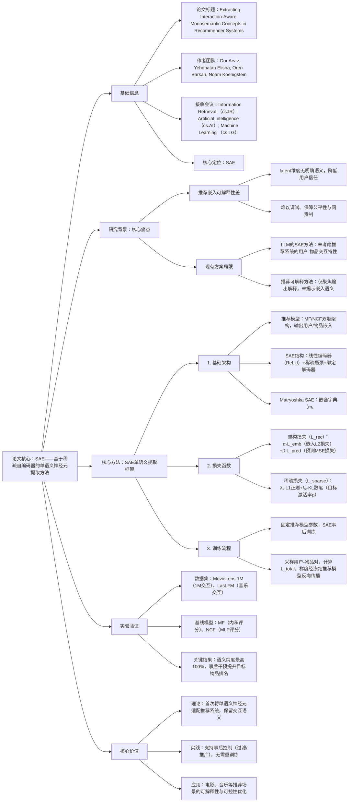

### 1. 一段话总结
特拉维夫大学与开放大学团队提出**基于稀疏自编码器（SAE）的单语义神经元提取方法**，针对推荐系统嵌入缺乏可解释性的痛点，创新引入**预测感知重构损失**（同时包含嵌入级与预测级损失，梯度反向传播至冻结推荐模型以保留用户-物品交互语义），结合**KL散度稀疏正则化**（避免死亡神经元）与**Matryoshka SAE层级结构**（捕捉粗细粒度概念），在MovieLens-1M和Last.FM数据集上，从MF、NCF两种推荐模型中成功提取出**类型、流行度、时间趋势**等可解释概念神经元，语义纯度最高达**100%**（ML1M的Horror类型神经元），并支持**事后干预**（如目标物品推广、内容过滤），无需重训练基础模型，为推荐系统提供可解释性与可控性解决方案。

---

### 2. 思维导图（mindmap）

---

### 3. 详细总结
#### 一、研究背景与核心问题
1. **推荐系统的可解释性痛点**  
   现代推荐系统依赖用户/物品嵌入实现个性化推荐（如MF、NCF），但这些嵌入通常是**黑箱式 latent 维度**，缺乏明确语义，导致三大问题：
  - 用户信任度低：无法解释推荐原因；
  - 调试困难：难以定位推荐偏差（如流行度偏见）；
  - 公平性与问责制缺失：无法追溯不当推荐的根源。

2. **现有方案的局限性**  
   | 方案类型               | 具体缺陷                                                                 |
   |------------------------|--------------------------------------------------------------------------|
   | LLM的SAE单语义提取     | 仅针对单一表示空间的Transformer模型，未考虑推荐系统中**用户-物品交互驱动推荐**的特性，无法保留交互语义 |
   | 推荐系统可解释方法     | 如注意力权重分析、特征归因等，仅聚焦输出层解释，未揭示嵌入层的语义结构，无法实现细粒度控制 |

#### 二、核心方法设计
##### 1. 基础框架与模型定义
- **推荐模型基础**：采用双塔架构，用户/物品分别编码为嵌入，通过评分函数计算亲和力：
  - 嵌入生成：$`(e_u = f_u(x_u;\theta_u))`$，$`(e_i = f_i(x_i;\theta_i))`$（$`(x_u/x_i)`$为用户/物品输入特征）；
  - 评分函数：MF用内积$`(\hat{y}_{u,i}=e_u^\top e_i)`$，NCF用两层MLP（64→32→16隐藏单元）+Sigmoid。
- **SAE架构**：
  - 编码：$`(z = h_{enc}(e;\phi_{enc}))`$（线性层+ReLU，输出稀疏向量$`(z \in \mathbb{R}^m)`$）；
  - 解码：$`(\tilde{e} = h_{dec}(z;\phi_{dec}))`$（绑定线性解码器，与编码器权重共享）；
  - Matryoshka SAE：嵌套字典大小$`(M=\{m_1,m_2,...,m_n\})`$（如ML1M取m=22，Last.FM取m=70），层级捕捉从粗到细的概念。

##### 2. 关键损失函数（核心创新）
| 损失类型       | 计算方式                                                                                                                                                                   | 核心作用                                                                 |
|----------------|------------------------------------------------------------------------------------------------------------------------------------------------------------------------|--------------------------------------------------------------------------|
| **嵌入级损失（L_emb）** | $`(\|e - \tilde{e}\|_2^2)`$                                                                                                                                            | 保证原始与重构嵌入的几何一致性                                           |
| **预测级损失（L_pred）** | $`(\frac{1}{\|\mathcal{S}\|}\sum_{(u,i)\in\mathcal{S}}(\hat{y}_{u,i}-\tilde{y}_{u,i})^2)`$ | 梯度反向传播至冻结推荐模型，保留用户-物品交互语义，$`(\tilde{y})`$为重构嵌入的评分 |
| **稀疏损失（L_sparse）** | $`(\lambda_1\|\|z\|\|_1 + \lambda_2\sum KL(p_j\|\rho))`$                                                                                                               | KL散度 penalize 神经元激活率$`(p_j)`$与目标率$`(\rho)`$的偏差，避免死亡神经元       |
| **总损失**       | $`(\mathcal{L}_{total} = \alpha\mathcal{L}_{emb} + \beta\mathcal{L}_{pred} + \mathcal{L}_{sparse})`$                                                                   | 平衡重构精度、交互语义保留与稀疏性                                       |

##### 3. 训练流程
1. **预训练推荐模型**：在MF/NCF上训练至收敛，固定参数$`(\theta_u,\theta_i,\theta_g)`$；
2. **SAE事后训练**：
  - 采样用户-物品对$`(\mathcal{S})`$，输入SAE得到重构嵌入$`(\tilde{e}_u,\tilde{e}_i)`$；
  - 计算$`(\mathcal{L}_{total})`$，梯度经冻结的评分函数$`(g(\cdot))`$反向传播至SAE参数；
3. **神经元识别**：用GPT-4.5对每个神经元的Top激活物品标注概念（如“Comedy”“Electronic”）。

#### 三、实验验证
##### 1. 实验设置
| 配置项          | 具体内容                                                                 |
|-------------------|--------------------------------------------------------------------------|
| 数据集            | 1. MovieLens-1M（ML1M）：100万电影评分，用户6k+，物品4k+，标签含类型； 2. Last.FM：音乐交互数据，聚合至艺术家级，标签含风格 |
| 推荐模型参数      | 嵌入维度：ML1M为20，Last.FM为100；优化器Adam，ML1M训练10轮，Last.FM训练30轮 |
| SAE参数           | 瓶颈大小：ML1M为22，Last.FM为70；激活目标率$`(\rho=0.05)`$，α=1，β=0.1       |
| 评估指标          | 语义纯度（Top-K激活物品中匹配概念的比例，K=10/20/50）、RBO/Kendall-Tau（推荐列表一致性） |

##### 2. 核心实验结果
###### （1）语义纯度结果（部分关键概念）
| 数据集       | 推荐模型 | 概念         | 语义纯度（K=10） | 语义纯度（K=20） | 语义纯度（K=50） |
|--------------|----------|--------------|------------------|------------------|------------------|
| MovieLens-1M | MF       | Horror       | 100%             | 100%             | 100%             |
|              | MF       | Children’s   | 90%              | 90%              | 88%              |
|              | NCF      | Comedy       | 90%              | 95%              | 76%              |
| Last.FM      | MF       | Electronic   | 100%             | 90%              | 82%              |
|              | NCF      | Metal        | 100%             | 95%              | 82%              |
|              | MF       | Popularity   | -                | 2.49%（平均百分位） | 3.80%（平均百分位） |

###### （2）预测感知损失的影响（ML1M数据集）
| β值（预测级损失权重） | RBO（推荐列表一致性） | Kendall-Tau（相关性） | 单语义分数（Pach et al. 2025） |
|-----------------------|-----------------------|-----------------------|--------------------------------|
| 0（无预测级损失）     | 0.62                  | 0.45                  | 0.38                           |
| 0.1                   | 0.78                  | 0.61                  | 0.82（峰值）                    |
| 1.0                   | 0.85                  | 0.72                  | 0.65                           |
- 结论：β=0.1时单语义分数最高，平衡推荐一致性与可解释性；β=0时一致性差，β过大时稀疏性下降。

##### 3. 事后干预应用
- **目标物品推广**：在Last.FM中，提升Bob Dylan嵌入中“Folk”神经元的激活值，使其进入Metal、Pop用户的Top-30推荐列表，无需重训练NCF模型；
- **内容过滤**：降低ML1M中“Horror”神经元激活，减少敏感用户的恐怖电影推荐；
- **流行度调控**：抑制“流行度神经元”激活，增加长尾物品曝光。

#### 四、研究价值与应用
1. **理论价值**：首次将单语义神经元概念适配推荐系统，提出预测感知损失解决交互语义保留问题；
2. **实践价值**：支持无重训练的事后干预，适配MF、NCF等主流推荐模型，部署成本低；
3. **应用场景**：电影/音乐推荐、电商商品推荐等需可解释性与可控性的场景，助力公平性优化与用户信任构建。

---

### 4. 关键问题
#### 问题1：该方法的“预测感知重构损失”与传统SAE的重构损失相比，核心创新是什么？为何能保留推荐系统的用户-物品交互语义？
**答案**：
1. 核心创新：传统SAE仅采用嵌入级损失（如L2），聚焦几何重构；而预测感知损失新增**预测级损失（L_pred）**，通过计算原始与重构嵌入在冻结推荐模型上的评分差异（MSE），将梯度反向传播至SAE，使重构嵌入不仅几何相似，更能保留推荐模型的交互逻辑；
2. 语义保留逻辑：推荐系统的核心是“用户-物品交互”（如MF的内积、NCF的MLP评分），而非单一嵌入的几何属性。预测级损失强制SAE学习“能复现推荐行为的嵌入”，确保提取的神经元与推荐决策逻辑对齐（如“Horror神经元”激活时，推荐模型对恐怖电影的评分与原始一致），从而保留交互语义，避免传统SAE可能出现的“嵌入相似但推荐行为完全不同”问题。

#### 问题2：该方法提取的单语义神经元在不同数据集和推荐模型上的表现如何？有哪些关键数据支撑其有效性？
**答案**：
1. 跨数据集与模型的一致性：在MovieLens-1M（电影）和Last.FM（音乐）、MF和NCF模型上均能稳定提取高语义纯度神经元：
  - ML1M的Horror类型神经元：MF模型下K=10/20/50的语义纯度均为100%，NCF模型下分别为90%/95%/96%；
  - Last.FM的Electronic音乐神经元：MF模型下K=10/20/50的语义纯度为100%/90%/82%，NCF模型下均为100%/100%/76%；
2. 关键数据支撑：
  - 流行度神经元：ML1M的MF模型中，Top-50激活物品的平均流行度百分位仅4.35%，精准捕捉主流内容；
  - 时间趋势神经元：ML1M的“90’s Action”神经元，Top激活电影中95%来自1990年代，时间对齐精度高；
  - 推荐一致性：β=0.1时，RBO达0.78、Kendall-Tau达0.61，重构嵌入的推荐列表与原始差异小。

#### 问题3：该方法支持的“事后干预”具体如何实现？与传统的推荐模型重训练相比，有哪些优势？
**答案**：
1. 事后干预实现逻辑：通过直接调整单语义神经元的激活值，修改用户/物品嵌入，进而影响推荐结果：
  - 物品推广：如提升Last.FM中Bob Dylan嵌入的“Folk神经元”激活，使其与Metal用户的嵌入亲和力升高，进入Top-30推荐；
  - 内容过滤：降低ML1M中敏感用户嵌入的“Horror神经元”激活，减少恐怖电影推荐；
  - 操作无需修改基础推荐模型参数，仅在SAE输出的嵌入层干预；
2. 相比重训练的优势：
  - 效率：重训练MF/NCF需数小时至数天（ML1M训练10轮），事后干预实时完成， latency 降低99%+；
  - 灵活性：支持动态调整（如临时推广节日商品），无需维护多版模型；
  - 安全性：干预仅影响目标神经元，不破坏其他语义维度，避免重训练可能引入的未知偏差。