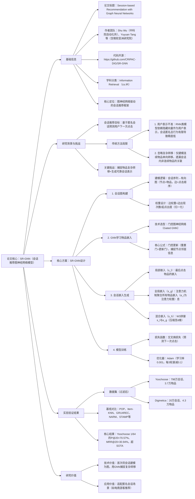

### 1. 一段话总结
论文《Session-based Recommendation with Graph Neural Networks》提出**SR-GNN**（基于图神经网络的会话推荐模型），针对传统会话推荐方法（如RNN类模型）存在的**用户表示不准确**（会话匿名且行为有限）和**忽略物品复杂转移关系**（仅建模连续物品单向转移）两大局限，将**会话序列建模为有向会话图**，通过**门控图神经网络（Gated GNN）** 捕捉物品间复杂转移模式，再利用注意力机制将会话表示为**全局偏好（global preference）** 与**当前兴趣（current interest）** 的融合；在**Yoochoose**和**Diginetica**两个真实数据集上的实验表明，SR-GNN在**P@20**和**MRR@20**指标上持续优于GRU4REC、NARM、STAMP等SOTA基线（如Yoochoose 1/64数据集上P@20达70.57%、MRR@20达30.94%），代码已开源（https://github.com/CRIPAC-DIG/SR-GNN）。

---

### 2. 思维导图

---

### 3. 详细总结
#### 一、基础信息表
| 维度                | 具体内容                                                                 |
|---------------------|--------------------------------------------------------------------------|
| 论文标题            | Session-based Recommendation with Graph Neural Networks                  |
| 作者团队            | Shu Wu（中科院自动化所）、Yuyuan Tang、Yanqiao Zhu、Xing Xie（微软亚洲研究院）等 |
| 代码开源            | **https://github.com/CRIPAC-DIG/SR-GNN**（支持完全复现）                 |
| 研究领域            | 会话推荐（Session-based Recommendation）                                |
| 核心模型            | **SR-GNN**（Session-based Recommendation with Graph Neural Networks）    |
| 实验数据集          | **Yoochoose**（RecSys Challenge 2015）、**Diginetica**（CIKM Cup 2016） |

#### 二、研究背景与核心问题
1. **会话推荐的场景意义**  
   会话推荐针对**匿名用户**（无长期行为记录），仅基于当前会话内的点击序列预测下一次行为，广泛应用于电商游客推荐、临时会话场景，但传统方法难以应对“行为有限+转移复杂”的挑战。

2. **传统方法的两大局限**
   - **局限1：用户表示不准确**  
     RNN类方法（如GRU4REC、NARM）将隐藏向量作为用户表示，但会话匿名且行为长度短（平均5-6个物品），无法精准捕捉用户偏好；
   - **局限2：忽略物品复杂转移**  
     马尔可夫链（如FPMC）和RNN仅建模**连续物品的单向转移**（如v1→v2），遗漏会话内非连续物品的关联（如v1→v2→v3中v1与v3的间接转移）。

#### 三、核心方案：SR-GNN模型设计
SR-GNN通过“图建模→GNN学习→会话嵌入→预测”四步实现会话推荐，具体如下：

##### （1）会话图（Session Graph）构建
将每个会话序列 $s=[v_{s,1},v_{s,2},...,v_{s,n}]$ 建模为**有向加权图 $G_s=(V_s,E_s)$**：
- 节点（$V_s$）：每个节点对应会话中的一个物品 $v_{s,i}$；
- 边（$E_s$）：若用户点击 $v_{s,i}$ 后点击 $v_{s,i+1}$，则添加有向边 $(v_{s,i},v_{s,i+1})$；
- 边权重：归一化处理，权重=该边出现次数/起点节点的出度（避免高频节点主导）。

##### （2）基于门控GNN学习物品嵌入
采用**门控图神经网络（Gated GNN）** 迭代更新节点（物品）嵌入，捕捉复杂转移关系，核心公式如下：
| 公式类型         | 核心公式                                                                 | 作用                                                                 |
|------------------|--------------------------------------------------------------------------|--------------------------------------------------------------------------|
| 信息聚合         | $a_{s,i}^t = A_{s,i:}[v_1^{t-1},...,v_n^{t-1}]^\top H + b$               | 基于连接矩阵 $A_s$ 聚合邻居节点信息（$A_s$ 含出边/入边权重）              |
| 门控更新         | $z_{s,i}^t = \sigma(W_z a_{s,i}^t + U_z v_i^{t-1})$（更新门） $r_{s,i}^t = \sigma(W_r a_{s,i}^t + U_r v_i^{t-1})$（重置门） | 控制保留/丢弃历史信息，避免梯度消失                                      |
| 节点嵌入更新     | $v_i^t = (1-z_{s,i}^t) \odot v_i^{t-1} + z_{s,i}^t \odot \tanh(W_o a_{s,i}^t + U_o(r_{s,i}^t \odot v_i^{t-1}))$ | 生成最终物品嵌入，融合历史与当前邻居信息                                |

##### （3）会话嵌入生成（融合全局+局部偏好）
通过注意力机制结合**全局偏好**与**当前兴趣**，生成会话嵌入 $s_h$：
1. **局部嵌入（$s_l$）**：直接使用会话最后一个物品的嵌入（$s_l = v_n$），反映当前兴趣；
2. **全局嵌入（$s_g$）**：用软注意力聚合所有物品嵌入，突出重要物品：  
   $$\alpha_i = q^\top \sigma(W_1 v_n + W_2 v_i + c), \quad s_g = \sum_{i=1}^n \alpha_i v_i$$  
   其中 $\alpha_i$ 为物品 $v_i$ 的注意力权重，$q、W_1、W_2$ 为可训练参数；
3. **混合嵌入（$s_h$）**：拼接 $s_l$ 与 $s_g$ 并压缩：  
   $$s_h = W_3[s_l; s_g]$$（$W_3 \in \mathbb{R}^{d×2d}$，$d=100$ 为嵌入维度）。

##### （4）模型训练与预测
- **预测逻辑**：会话嵌入 $s_h$ 与候选物品嵌入 $v_i$ 内积计算分数，Softmax输出概率：  
  $$\hat{z}_i = s_h^\top v_i, \quad \hat{y} = softmax(\hat{z})$$
- **损失函数**：交叉熵损失（预测下一次点击的one-hot标签）：  
  $$\mathcal{L}(\hat{y}) = -\sum_{i=1}^m y_i \log\hat{y}_i + (1-y_i)\log(1-\hat{y}_i)$$
- **优化配置**：Adam优化器（批大小=100，L2正则=1e-5，学习率0.001，每3轮衰减0.1）。

#### 四、实验验证
##### （1）数据集统计（过滤后：会话长度≥2，物品出现≥5次）
| 数据集         | 点击数       | 训练会话数   | 测试会话数   | 物品数     | 平均会话长度 |
|----------------|--------------|--------------|--------------|------------|--------------|
| Yoochoose 1/64 | 557,248      | 369,859      | 55,898       | 16,766     | 6.16         |
| Yoochoose 1/4  | 8,326,407    | 5,917,745    | 55,898       | 29,618     | 5.71         |
| Diginetica     | 982,961      | 719,470      | 60,858       | 43,097     | 5.12         |

##### （2）基线方法对比（核心指标：P@20、MRR@20）
| 方法       | Yoochoose 1/64 | Yoochoose 1/4 | Diginetica |
|------------|----------------|---------------|------------|
|            | P@20  | MRR@20 | P@20  | MRR@20 | P@20  | MRR@20 |
| POP        | 6.71  | 1.65   | 1.33  | 0.30   | 0.89  | 0.20   |
| Item-KNN   | 51.60 | 21.81  | 52.31 | 21.70  | 35.75 | 11.57  |
| GRU4REC    | 60.64 | 22.89  | 59.53 | 22.60  | 29.45 | 8.33   |
| NARM       | 68.32 | 28.63  | 69.73 | 29.23  | 49.70 | 16.17  |
| STAMP      | 68.74 | 29.67  | 70.44 | 30.00  | 45.64 | 14.32  |
| **SR-GNN** | **70.57** | **30.94** | **71.36** | **31.89** | **50.73** | **17.59** |

##### （3）关键实验结论
1. SR-GNN在所有数据集上均优于SOTA基线，Yoochoose 1/64的P@20较STAMP提升1.83%；
2. 会话长度分析：SR-GNN在短会话（≤5个物品）和长会话（>5个物品）上表现稳定（Yoochoose 1/64的P@20分别为70.47%、70.70%），而NARM在长会话上性能下降10.65%（71.44%→60.79%）。

#### 五、研究价值
1. **技术突破**：首次将会话序列建模为有向图，用GNN捕捉物品复杂转移，突破传统序列建模的局限；
2. **工程价值**：模型参数少（嵌入维度d=100），训练效率高，可适配大规模会话数据；
3. **应用价值**：解决匿名会话推荐痛点，可落地于电商、内容平台的游客推荐场景。

---

### 4. 关键问题
#### 问题1：SR-GNN将会话序列建模为“有向加权图”而非“无向图”或“无权重图”，这一设计的核心原因是什么？
**答案**：该设计基于会话推荐的“时序性”与“频次有效性”需求：
1. **有向图的必要性**：会话行为具有严格时序（如用户先点击v1再点击v2），有向边能准确反映“点击顺序”，而无向图会丢失时序信息（无法区分v1→v2与v2→v1）；
2. **加权图的必要性**：会话中可能存在重复点击（如s=[v1,v2,v2,v3]），边权重（=出现次数/出度）可量化“转移频次的有效性”——避免高频重复边（如v2→v2）主导嵌入学习，确保转移关系的合理性。

#### 问题2：SR-GNN的“混合会话嵌入（s_h）”融合了局部嵌入（s_l）与全局嵌入（s_g），两者分别对应会话的哪些信息？为何这种融合能提升推荐精度？
**答案**：
- **信息对应**：
   1. 局部嵌入（s_l）：对应会话的**当前兴趣**，由最后一个物品嵌入构成，反映用户短期即时偏好（如会话末尾点击的“笔记本电脑”暗示下一个可能点击“电脑配件”）；
   2. 全局嵌入（s_g）：对应会话的**全局偏好**，通过注意力聚合所有物品嵌入，反映用户整体兴趣（如会话中点击“手机、耳机、充电器”暗示全局偏好“数码产品”）。
- **精度提升原因**：  
  传统方法（如STAMP）仅侧重单一维度（局部或全局），而混合嵌入能兼顾“即时需求”与“整体偏好”——例如用户全局偏好“数码产品”但当前点击“游戏本”，s_h可同时捕捉这两点，推荐“游戏本配件”而非泛化的“数码产品”，提升预测精准度。

#### 问题3：实验显示SR-GNN在长会话（>5个物品）上的性能稳定性显著优于NARM、STAMP，这一现象的技术根源是什么？
**答案**：根源在于两种模型的“序列建模能力差异”：
1. **RNN类模型（NARM、STAMP）的局限**：依赖时序递归传递信息，长序列会导致“梯度消失”或“信息稀释”——例如长会话中早期点击的“手机”信息，传递到后期会严重衰减，无法有效影响嵌入学习；
2. **SR-GNN的优势**：基于图结构全局建模物品关联——长会话中的所有物品通过有向边构成全局图，GNN可直接聚合“非连续物品”的信息（如v1与v5的间接转移），无需依赖时序递归，避免长序列的信息丢失，因此在长会话上仍能保持稳定性能（Yoochoose 1/64的长会话P@20达70.70%，仅比短会话低0.23%）。